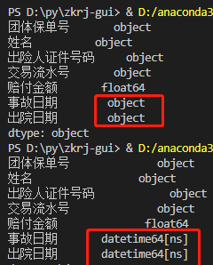

PythonPandas<br />在Python处理数据的时候，都免不了用pandas做数据处理。在数据处理时，都免不了用数据筛选来提取自己想要的数据，来看看pandas的条件筛选。
<a name="ay5Ah"></a>
### 安装库
```python
pip install pandas
```
安装完成后就是引用：
```python
import pandas as pd
```
<a name="Q72lN"></a>
### 数据准备
下面是原始数据：
```python
df=pd.DataFrame({
                '团体保单号': ['BJG11202003263', 'BJG11202003263', 'BJG11202003263', 'BJG11202003263', 'BJG11202210443', 'BJG11202210443', 'BJG11202210443', 'BJG11202210443', 'BJG11202210443', 'BJG11202210443', 'BJG11202210443', 'BJG11202003263', 'BJG11202003263', 'BJG11202003263', 'BJG11202003263', 'BJG11202210443', 'BJG11202210443', 'BJG11202003263', 'BJG11202003263', 'BJG11202003263', 'BJG11202003263', 'BJG11202003263', 'BJG11202003263'],

                '姓名': ['刘玲', '刘玲', '刘玲', '刘玲', '刘玲', '刘玲', '刘玲', '刘玲', '刘玲', '刘玲', '刘玲', '卜琳琳', '齐静', '齐静', '齐静', '刘洋', '刘洋', '刘洋', '刘洋', '杨海舰', '杨海舰', '范晶晶', '范晶晶'],

                '出险人证件号码': ['04211972071536', '04211972071536', '04211972071536', '04211972071536', '04211972071536', '04211972071536', '04211972071536', '04211972071536', '04211972071536', '04211972071536', '04211972071536', '01061975060836', '01021973072519', '01021973072519', '01021973072519', '02831982063006', '02831982063006', '02831982063006', '02831982063006', '02221987062064', '02221987062064', '01041980070720', '01041980070720'],

                '交易流水号': ['220102000542', '220102000565', '011100030X220102000671', '011100030X220102000671', '011100030X220102000671', '011100030X220102000671', '011100030X220102000671', '011100030X220104016042', '021100020A220111013035', '081100030A220105005676', '081100030A220105006493', '011100020A220117005278', '011100020A220117005278', '011100020A220117005278', '011100020A220117005278', '011100050Y220104008654', '011100050Y220104008655', '011100050Y220106008912', '011100050Y220106008914', '011100050Y220107000858', '011100050Y220107001477', '011100050Y220107012903', '011100050Y220107013093'],

                '赔付金额': [0, 260.18, 57.67, 57.67, 57.67, 57.67, 57.67, 166.63, 0, 0, 231.09, 396.32, 396.32, 396.32, 396.32, 0, 35, 0, 35, 0, 272.9, 0, 188],

                '事故日期': ['2022-01-02', '2022-01-02', '2021-01-02', '2022-01-02', '2021-01-02', '2021-01-02', '2022-01-02', '2020-01-04', '2022-01-11', '2022-01-05', '2020-01-05', '2022-01-17', '2022-01-17', '2022-01-17', '2022-01-17', '2022-01-04', '2022-01-04', '2022-01-06', '2022-01-06', '2022-01-07', '2022-01-07', '2022-01-07', '2022-01-07']

                '出院日期': ['2022-01-02', '', '2022-01-02', '', '2021-01-02', '', '', '2021-01-04', '', '', '', '', '', '', '', '', '', '', '', '', '', '', '2022-01-07']
                })
```
输出如下：
```python
    团体保单号        姓名  出险人证件号码   交易流水号              赔付金额 事故日期    出院日期
0   BJG11202003263   刘玲  04211972071536            220102000542    0.00 2022-01-02 2022-01-02
1   BJG11202003263   刘玲  04211972071536            220102000565  260.18 2022-01-02        NaT
2   BJG11202003263   刘玲  04211972071536  011100030X220102000671   57.67 2021-01-02 2022-01-02
3   BJG11202003263   刘玲  04211972071536  011100030X220102000671   57.67 2022-01-02        NaT
4   BJG11202210443   刘玲  04211972071536  011100030X220102000671   57.67 2021-01-02 2021-01-02
5   BJG11202210443   刘玲  04211972071536  011100030X220102000671   57.67 2021-01-02        NaT
6   BJG11202210443   刘玲  04211972071536  011100030X220102000671   57.67 2022-01-02        NaT
7   BJG11202210443   刘玲  04211972071536  011100030X220104016042  166.63 2020-01-04 2021-01-04
8   BJG11202210443   刘玲  04211972071536  021100020A220111013035    0.00 2022-01-11        NaT
9   BJG11202210443   刘玲  04211972071536  081100030A220105005676    0.00 2022-01-05        NaT
10  BJG11202210443   刘玲  04211972071536  081100030A220105006493  231.09 2020-01-05        NaT
11  BJG11202003263  卜琳琳  01061975060836  011100020A220117005278  396.32 2022-01-17        NaT
12  BJG11202003263   齐静  01021973072519  011100020A220117005278  396.32 2022-01-17        NaT
13  BJG11202003263   齐静  01021973072519  011100020A220117005278  396.32 2022-01-17        NaT
14  BJG11202003263   齐静  01021973072519  011100020A220117005278  396.32 2022-01-17        NaT
15  BJG11202210443   刘洋  02831982063006  011100050Y220104008654    0.00 2022-01-04        NaT
16  BJG11202210443   刘洋  02831982063006  011100050Y220104008655   35.00 2022-01-04        NaT
17  BJG11202003263   刘洋  02831982063006  011100050Y220106008912    0.00 2022-01-06        NaT
18  BJG11202003263   刘洋  02831982063006  011100050Y220106008914   35.00 2022-01-06        NaT
19  BJG11202003263  杨海舰  02221987062064  011100050Y220107000858    0.00 2022-01-07        NaT
20  BJG11202003263  杨海舰  02221987062064  011100050Y220107001477  272.90 2022-01-07        NaT
21  BJG11202003263  范晶晶  01041980070720  011100050Y220107012903    0.00 2022-01-07        NaT
22  BJG11202003263  范晶晶  01041980070720  011100050Y220107013093  188.00 2022-01-07 2022-01-07
```
<a name="t0fMr"></a>
### 单条件筛选
比如只是筛选2021年的数据，可以这样：
```python
# “事故日期”列转换成时间类型
df['事故日期'] = pd.to_datetime(df['事故日期'])
df['出院日期'] = pd.to_datetime(df['出院日期'])

# 提取2021年的数据
df = df[df['事故日期'].dt.year == 2021]
```
日期列不转换的话会报错，必须要转换成时间类型才行，可以用`df.dtpes`来查看各字段的数据类型，转换前后对比：<br /><br />`.dt.year`是用来提取日期的年份的，不提取年份不会报错，只是提取不出数据，因为事故日期不止有年份，还有日期<br />输出：
```python
   团体保单号       姓名  出险人证件号码   交易流水号             赔付金额 事故日期    出院日期
2  BJG11202003263  刘玲  04211972071536  011100030X220102000671  57.67 2021-01-02 2022-01-02
4  BJG11202210443  刘玲  04211972071536  011100030X220102000671  57.67 2021-01-02 2021-01-02
5  BJG11202210443  刘玲  04211972071536  011100030X220102000671  57.67 2021-01-02        NaT
```
<a name="UmygV"></a>
### 多条件筛选
首先用出险人证件号码和事故日期来筛选数据。<br />比如证件号为04211972071536的和年份为2022年的筛选，因为上面已经把日期转换成时间类型了，后面就不重复转换了
```python
# 提取身份证为04211972071536和年份为2022年的数据
df = df[(df['出险人证件号码']=='04211972071536')&(df['事故日期'].dt.year == 2022)]
```
输出：
```python
   团体保单号       姓名  出险人证件号码    交易流水号             赔付金额 事故日期    出院日期
0  BJG11202003263  刘玲  04211972071536            220102000542    0.00 2022-01-02 2022-01-02
1  BJG11202003263  刘玲  04211972071536            220102000565  260.18 2022-01-02        NaT
3  BJG11202003263  刘玲  04211972071536  011100030X220102000671   57.67 2022-01-02        NaT
6  BJG11202210443  刘玲  04211972071536  011100030X220102000671   57.67 2022-01-02        NaT
8  BJG11202210443  刘玲  04211972071536  021100020A220111013035    0.00 2022-01-11        NaT
9  BJG11202210443  刘玲  04211972071536  081100030A220105005676    0.00 2022-01-05        NaT
```
注意看，坑来了：<br />在单条件筛选的时候，筛选条件直接列出来就行了`df[df['事故日期'].dt.year == 2021]`<br />而在多条件筛选的时候，就需要加入小括号把列出的条件括起来才行`df[(df['出险人证件号码']=='04211972071536')&(df['事故日期'].dt.year == 2022)]`<br />接下来，提取身份证为04211972071536，事故日期为2022年的数据，如果有出院日期按出险日期为准。
```python
# 提取身份证为04211972071536，事故日期为2022年的数据，如果有出院日期按出险日期为准
df = df[((df['出险人证件号码']=='04211972071536')&(df['出院日期'].dt.year == 2022))|((df['出险人证件号码']=='04211972071536')&(df['事故日期'].dt.year == 2022))]
```
输出：
```python
团体保单号       姓名  出险人证件号码    交易流水号             赔付金额 事故日期    出院日期
0  BJG11202003263  刘玲  04211972071536            220102000542    0.00 2022-01-02 2022-01-02
1  BJG11202003263  刘玲  04211972071536            220102000565  260.18 2022-01-02        NaT
2  BJG11202003263  刘玲  04211972071536  011100030X220102000671   57.67 2021-01-02 2022-01-02
3  BJG11202003263  刘玲  04211972071536  011100030X220102000671   57.67 2022-01-02        NaT
6  BJG11202210443  刘玲  04211972071536  011100030X220102000671   57.67 2022-01-02        NaT
8  BJG11202210443  刘玲  04211972071536  021100020A220111013035    0.00 2022-01-11        NaT
9  BJG11202210443  刘玲  04211972071536  081100030A220105005676    0.00 2022-01-05        NaT
```
注意，每个单独的条件要括起来，组合的条件还要再括起来才行。<br />怎么样，只要理解了筛选条件的设置规则，就可以用多个条件来筛选自己想要的数据。
