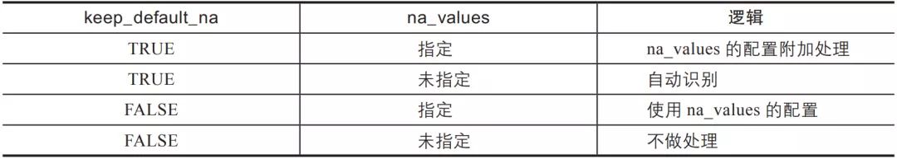

Python Pandas
<a name="bdiaL"></a>
## 1、语法
基本语法如下，`pd`为导入`Pandas`模块的别名：
```python
pd.read_csv(filepath_or_buffer: Union[str, pathlib.Path, IO[~AnyStr]],
            sep=',', delimiter=None, header='infer', names=None, index_col=None,
            usecols=None, squeeze=False, prefix=None, mangle_dupe_cols=True,
            dtype=None, engine=None, converters=None, true_values=None,
            false_values=None, skipinitialspace=False, skiprows=None,
            skipfooter=0, nrows=None, na_values=None, keep_default_na=True,
            na_filter=True, verbose=False, skip_blank_lines=True,
            parse_dates=False, infer_datetime_format=False,
            keep_date_col=False, date_parser=None, dayfirst=False,
            cache_dates=True, iterator=False, chunksize=None,
            compression='infer', thousands=None, decimal: str = '.',
            lineterminator=None, quotechar='"', quoting=0,
            doublequote=True, escapechar=None, comment=None,
            encoding=None, dialect=None, error_bad_lines=True,
            warn_bad_lines=True, delim_whitespace=False,
            low_memory=True, memory_map=False, float_precision=None)
```
一般情况下，会将读取到的数据返回一个`DataFrame`，当然按照参数的要求会返回指定的类型。
<a name="m8RWd"></a>
## 2、数据内容
`filepath_or_buffer`为第一个参数，没有默认值，也不能为空，根据Python的语法，第一个参数传参时可以不写参数名。可以传文件路径：
```python
# 支持文件路径或者文件缓冲对象
# 本地相对路径
pd.read_csv('data/data.csv') # 注意目录层级
pd.read_csv('data.csv') # 如果文件与代码文件在同一目录下
pd.read_csv('data/my/my.data') # CSV文件的扩展名不一定是.csv
# 本地绝对路径
pd.read_csv('/user/gairuo/data/data.csv')
# 使用URL
pd.read_csv('https://www.gairuo.com/file/data/dataset/GDP-China.csv')
```
需要注意的是，Mac中和Windows中路径的写法不一样，上例是Mac中的写法，Windows中的相对路径和绝对路径需要分别换成类似'data\data.csv'和'E: \data\data.csv'的形式。另外，路径尽量不要使用中文，否则程序容易报错，这意味着存放数据文件的目录要尽量用英文命名。<br />可以传数据字符串，即CSV中的数据字符以字符串形式直接传入：
```python
from io import StringIO
data = ('col1,col2,col3\n'
        'a,b,1\n'
        'a,b,2\n'
        'c,d,3')

pd.read_csv(StringIO(data))
pd.read_csv(StringIO(data), dtype=object)
```
也可以传入字节数据：
```python
from io import BytesIO
data = (b'word,length\n'
        b'Tr\xc3\xa4umen,7\n'
        b'Gr\xc3\xbc\xc3\x9fe,5')

pd.read_csv(BytesIO(data))
```
<a name="gOp2V"></a>
## 3、分隔符
`sep`参数是字符型的，代表每行数据内容的分隔符号，默认是逗号，另外常见的还有制表符（`\t`）、空格等，根据数据的实际情况传值。
```python
# 数据分隔符默认是逗号，可以指定为其他符号
pd.read_csv(data, sep='\t') # 制表符分隔tab
pd.read_table(data) # read_table 默认是制表符分隔tab
pd.read_csv(data, sep='|') # 制表符分隔tab
pd.read_csv(data,sep="(?<!a)\|(?!1)", engine='python') # 使用正则表达式
```
`pd.read_csv`还提供了一个参数名为`delimiter`的定界符，这是一个备选分隔符，是`sep`的别名，效果和`sep`一样。如果指定该参数，则`sep`参数失效。
<a name="NBuAG"></a>
## 4、表头
`header`参数支持整型和由整型组成的列表，指定第几行是表头，默认会自动推断把第一行作为表头。
```python
pd.read_csv(data, header=0) # 第一行
pd.read_csv(data, header=None) # 没有表头
pd.read_csv(data, header=[0,1,3]) # 多层索引MultiIndex
```

- 注意：如果`skip_blank_lines=True`，`header`参数将忽略空行和注释行, 因此`header=0`表示第一行数据而非文件的第一行。
<a name="VMZ73"></a>
## 5、列名
`names`用来指定列的名称，它是一个类似列表的序列，与数据一一对应。如果文件不包含列名，那么应该设置`header=None`，列名列表中不允许有重复值。
```python
pd.read_csv(data, names=['列1', '列2']) # 指定列名列表
pd.read_csv(data, names=['列1', '列2'], header=None)
```
<a name="g2FUU"></a>
## 6、索引
`index_col`用来指定索引列，可以是行索引的列编号或者列名，如果给定一个序列，则有多个行索引。Pandas不会自动将第一列作为索引，不指定时会自动使用以0开始的自然索引。
```python
# 支持int、str、int序列、str序列、False，默认为None
pd.read_csv(data, index_col=False) # 不再使用首列作为索引
pd.read_csv(data, index_col=0) # 第几列是索引
pd.read_csv(data, index_col='年份') # 指定列名
pd.read_csv(data, index_col=['a','b']) # 多个索引
pd.read_csv(data, index_col=[0, 3]) # 按列索引指定多个索引
```
<a name="vOTTb"></a>
## 7、使用部分列
如果只使用数据的部分列，可以用`usecols`来指定，这样可以加快加载速度并降低内存消耗。
```python
# 支持类似列表的序列和可调用对象
# 读取部分列
pd.read_csv(data, usecols=[0,4,3]) # 按索引只读取指定列，与顺序无关
pd.read_csv(data, usecols=['列1', '列5']) # 按列名，列名必须存在
# 指定列顺序，其实是df的筛选功能
pd.read_csv(data, usecols=['列1', '列5'])[['列5', '列1']]
# 以下用callable方式可以巧妙指定顺序，in后面的是我们要的顺序
pd.read_csv(data, usecols=lambda x: x.upper() in ['COL3', 'COL1'])
```
<a name="bJKC9"></a>
## 8、返回序列
将`squeeze`设置为`True`，如果文件只包含一列，则返回一个`Series`，如果有多列，则还是返回`DataFrame`。
```python
# 布尔型，默认为False
# 下例只取一列，会返回一个Series
pd.read_csv(data, usecols=[0], squeeze=True)
# 有两列则还是df
pd.read_csv(data, usecols=[0, 2], squeeze=True)
```
<a name="ay8Gv"></a>
## 9、表头前缀
如果原始数据没有列名，可以指定一个前缀加序数的名称，如n0、n1，通过`prefix`参数指定前缀。
```python
# 格式为字符型str
# 表头为c_0、c_2
pd.read_csv(data, prefix='c_', header=None)
```
<a name="CrvGA"></a>
## 10、处理重复列名
如果该参数为`True`，当列名有重复时，解析列名将变为X, X.1, …, X.N，而不是X, …, X。如果该参数为`False`，那么当列名中有重复时，前列将会被后列覆盖。
```python
# 布尔型，默认为True
data = 'a,b,a\n0,1,2\n3,4,5'
pd.read_csv(StringIO(data), mangle_dupe_cols=True)
# 表头为a b a.1
# False会报ValueError错误
```
<a name="EWu4w"></a>
## 11、数据类型
`dtype`可以指定各数据列的数据类型。
```python
# 传入类型名称，或者以列名为键、以指定类型为值的字典
pd.read_csv(data, dtype=np.float64) # 所有数据均为此数据类型
pd.read_csv(data, dtype={'c1':np.float64, 'c2': str}) # 指定字段的类型
pd.read_csv(data, dtype=[datetime, datetime, str, float]) # 依次指定
```
<a name="uw3sw"></a>
## 12、引擎
使用的分析引擎可以选择C或Python。C语言的速度最快，Python语言的功能最为完善，一般情况下，不需要另行指定。
```python
# 格式为engine=None，其中可选值有{'c', 'python'}
pd.read_csv(data, engine='c')
```
<a name="N85wE"></a>
## 13、列数据处理
使用`converters`参数对列的数据进行转换，参数中指定列名与针对此列的处理函数，最终以字典的形式传入，字典的键可以是列名或者列的序号。
```python
# 字典格式，默认为None
data = 'x,y\na,1\nb,2'
def foo(p):
    return p+'s'
# x应用函数，y使用lambda
pd.read_csv(StringIO(data), converters={'x': foo,
                                        'y': lambda x: x*3})
# 使用列索引
pd.read_csv(StringIO(data),
            converters={0: foo, 1: lambda x: x*3})
```
<a name="ExDhR"></a>
## 14、真假值转换
使用`true_values`和`false_values`将指定的文本内容转换为`True`或`False`，可以用列表指定多个值。
```python
# 列表，默认为None
data = ('a,b,c\n1,Yes,2\n3,No,4')
pd.read_csv(StringIO(data),
            true_values=['Yes'], false_values=['No'])
```
<a name="ITFIr"></a>
## 15、跳过指定行
如下跳过需要忽略的行数（从文件开始处算起）或需要忽略的行号列表（从0开始）：
```python
# 类似列表的序列或者可调用对象
# 跳过前三行
pd.read_csv(data, skiprows=2)
# 跳过前三行
pd.read_csv(data, skiprows=range(2))
# 跳过指定行
pd.read_csv(data, skiprows=[24,234,141])
# 跳过指定行
pd.read_csv(data, skiprows=np.array([2, 6, 11]))
# 隔行跳过
pd.read_csv(data, skiprows=lambda x: x % 2 != 0)
```
尾部跳过，从文件尾部开始忽略，C引擎不支持。
```python
# int类型, 默认为0
pd.read_csv(filename, skipfooter=1) # 最后一行不加载
```
`skip_blank_lines`指定是否跳过空行，如果为True，则跳过空行，否则数据记为NaN。
```python
# 布尔型，默认为True
# 不跳过空行
pd.read_csv(data, skip_blank_lines=False)
```
如果`skip_blank_lines=True`，`header`参数将忽略空行和注释行, 因此header=0表示第一行数据而非文件的第一行。
<a name="iI1h5"></a>
## 16、读取指定行
`nrows`参数用于指定需要读取的行数，从文件第一行算起，经常用于较大的数据，先取部分进行代码编写。
```python
# int类型，默认为None
pd.read_csv(data, nrows=1000)
```
<a name="ihQxl"></a>
## 17、空值替换
`na_values`参数的值是一组用于替换NA/NaN的值。如果传参，需要指定特定列的空值。以下值默认会被认定为空值：
```python
['-1.#IND', '1.#QNAN', '1.#IND', '-1.#QNAN',
 '#N/A N/A', '#N/A', 'N/A', 'n/a', 'NA',
 '#NA', 'NULL', 'null', 'NaN', '-NaN',
 'nan', '-nan', '']
```
使用`na_values`时需要关注下面`keep_default_na`的配合使用和影响：
```python
# 可传入标量、字符串、类似列表序列和字典，默认为None
# 5和5.0会被认为是NaN
pd.read_csv(data, na_values=[5])
# ?会被认为是NaN
pd.read_csv(data, na_values='?')
# 空值为NaN
pd.read_csv(data, keep_default_na=False, na_values=[""])
# 字符NA和字符0会被认为是NaN
pd.read_csv(data, keep_default_na=False, na_values=["NA", "0"])
# Nope会被认为是NaN
pd.read_csv(data, na_values=["Nope"])
# a、b、c均被认为是NaN，等于na_values=['a','b','c']
pd.read_csv(data, na_values='abc')
# 指定列的指定值会被认为是NaN
pd.read_csv(data, na_values={'c':3, 1:[2,5]})
```
<a name="ZvkBD"></a>
## 18、保留默认空值
分析数据时是否包含默认的NaN值，是否自动识别。如果指定`na_values`参数，并且 `keep_default_na=False`，那么默认的NaN将被覆盖，否则添加。`keep_default_na`和`na_values`的关系见表3-2。<br />▼表3-2 `keep_default_na`和`na_values`的取值逻辑关系<br />

- 说明：如果`na_filter`为`False`（默认为`True`），那么`keep_default_na`和`na_values`参数均无效。
```python
# 布尔型，默认为True
# 不自动识别空值
pd.read_csv(data, keep_default_na=False)
```
`na_filter`为是否检查丢失值（空字符串或空值）。对于大文件来说，数据集中没有空值，设定`na_filter=False`可以提升读取速度。
```python
# 布尔型，默认为True
pd.read_csv(data, na_filter=False) # 不检查
```
<a name="FiHV2"></a>
## 19、日期时间解析
日期时间解析器参数`date_parser`用于解析日期的函数，默认使用`dateutil.parser.parser`来做转换。<br />如果为某些或所有列启用了`parse_dates`，并且`datetime`字符串的格式都相同，则通过设置`infer_datetime_format=True`，可以大大提高解析速度，`pandas`将尝试推断`datetime`字符串的格式，然后使用更快的方法解析字符串，从而将解析速度提高5～10倍。如果无法对整列做出正确的推断解析，Pandas将返回到正常的解析模式。<br />下面是一些可自动推断的日期时间字符串示例，它们都表示2020年12月30日00:00:00：

- "20201230"
- "2020/12/30"
- "20201230 00:00:00"
- "12/30/2020 00:00:00"
- "30/Dec/2020 00:00:00"
- "30/December/2020 00:00:00"
```python
# 解析时间的函数名，默认为None
# 指定时间解析库，默认是dateutil.parser.parser
date_parser = pd.io.date_converters.parse_date_time
date_parser = lambda x: pd.to_datetime(x, utc=True, format='%d%b%Y')
date_parser = lambda d: pd.datetime.strptime(d, '%d%b%Y')
# 使用
pd.read_csv(data, parse_dates=['年份'], date_parser=date_parser)
```
`parse_dates`参数用于对时间日期进行解析。
```python
# 布尔型、整型组成的列表、列表组成的列表或者字典，默认为False
pd.read_csv(data, parse_dates=True) # 自动解析日期时间格式
pd.read_csv(data, parse_dates=['年份']) # 指定日期时间字段进行解析
# 将第1、4列合并解析成名为“时间”的时间类型列
pd.read_csv(data, parse_dates={'时间':[1,4]})
```
如果`infer_datetime_format`被设定为`True`并且`parse_dates`可用，那么Pandas将尝试转换为日期类型。
```python
# 布尔型，默认为False
pd.read_csv(data, parse_dates=True, infer_datetime_format=True)
```
如果用上文中的`parse_dates`参数将多列合并并解析成一个时间列，设置`keep_date_col`的值为`True`时，会保留这些原有的时间组成列；如果设置为`False`，则不保留这些列。
```python
# 布尔型，默认为False
pd.read_csv(data, parse_dates=[[1, 2], [1, 3]], keep_date_col=True)
```
对于DD/MM格式的日期类型，如日期2020-01-06，如果`dayfirst=True`，则会转换成2020-06-01。
```python
# 布尔型，默认为False
pd.read_csv(data, dayfirst=True, parse_dates=[0])
```
`cache_dates`如果为True，则使用唯一的转换日期缓存来应用`datetime`转换。解析重复的日期字符串，尤其是带有时区偏移的日期字符串时，可能会大大提高速度。
```python
# 布尔型，默认为True
pd.read_csv(data, cache_dates=False)
```
<a name="SGWPU"></a>
## 20、文件处理
以下是一些对读取文件对象的处理方法。`iterator`参数如果设置为`True`，则返回一个`TextFileReader`对象，并可以对它进行迭代，以便逐块处理文件。
```python
# 布尔型，默认为False
pd.read_csv(data, iterator=True)
```
`chunksize`指定文件块的大小，分块处理大型CSV文件。
```python
# 整型，默认为None
pd.read_csv(data, chunksize=100000)

# 分块处理大文件
df_iterator = pd.read_csv(file, chunksize=50000)
def process_dataframe(df):
    pass
    return processed_df

for index,df_tmp in enumerate(df_iterator):
    df_processed = process_dataframe(df_tmp)
    if index > 0:
       df_processed.to_csv(path)
    else:
       df_processed.to_csv(path, mode='a', header=False)
```
`compression`（压缩格式）用于对磁盘数据进行即时解压缩。如果为“infer”，且`filepath_or_buffer`是以.gz、.bz2、.zip或.xz结尾的字符串，则使用gzip、bz2、zip或xz，否则不进行解压缩。如果使用zip，则ZIP文件必须仅包含一个要读取的数据文件。设置为`None`将不进行解压缩。
```python
# 可选值有'infer'、'gzip'、'bz2'、'zip'、'xz'和None，默认为'infer'
pd.read_csv('sample.tar.gz', compression='gzip')
```
`encoding`（编码）指定字符集类型，通常指定为'utf-8'。
```python
# 字符型，默认为None
pd.read_csv('gairuo.csv', encoding='utf8')
pd.read_csv("gairuo.csv",encoding="gb2312") # 常见中文
```
<a name="TJge5"></a>
## 21、符号
以下是对文件中的一些数据符号进行的特殊识别处理。如下设置千分位分隔符`thousands`：
```python
# 字符型，默认为None
pd.read_csv('test.csv', thousands=',') # 逗号分隔
```
小数点`decimal`，识别为小数点的字符。
```python
# 字符串，默认为'.'
pd.read_csv(data, decimal=",")
```
行结束符`lineterminator`，将文件分成几行的字符，仅对C解析器有效。
```python
# 长度为1的字符串，默认为None
data = 'a,b,c~1,2,3~4,5,6'
pd.read_csv(StringIO(data), lineterminator='~')
```
引号`quotechar`，用于表示引用数据的开始和结束的字符。引用的项目可以包含定界符，它将被忽略。
```python
# 长度为1的字符串
pd.read_csv(file, quotechar='"')
```
在`csv`模块中，数据可能会用引号等字符包裹起来，`quoting`参数用来控制识别字段的引号模式，它可以是Python csv模块中的`csv.QUOTE_*`常量，也可以传入对应的数字。各个传入值的意义如下。

- 0或`csv.QUOTE_MINIMAL`：仅特殊字段有引号。
- 1或`csv.QUOTE_ALL`：所有字段都有引号。
- 2或`csv.QUOTE_NONNUMERIC`：所有非数字字段都有引号。
- 3或`csv.QUOTE_NONE`：所有字段都没有引号。

如果使用csv模块，则需要事先引入csv模块。
```python
# 整型或者csv.QUOTE_*实例, 默认为0
import csv
pd.read_csv('input_file.csv', quoting=csv.QUOTE_NONE)
```
双引号`doublequote`，当单引号已经被定义，并且`quoting`参数不是`QUOTE_NONE`的时候，使用双引号表示将引号内的元素作为一个元素使用。
```python
# 布尔型，默认为True
import csv
pd.read_csv('data.csv', quotechar='"', doublequote=True, quoting=csv.QUOTE_NONNUMERIC)
```
`escapechar`可以传入一个转义符，用于过滤数据中的该转入符。比如，如果一行用双引号包裹着的数据中有换行符，用以下代码可以过滤其中的换行符。
```python
# 长度为1的转义字符串，默认为None
pd.read_csv(StringIO(data), escapechar='\n', encoding='utf-8')
```
注释标识`comment`，指示不应分析行的部分。如果在一行的开头找到该标识，则将完全忽略该行。此参数必须是单个字符。像空行一样（只要`skip_blank_lines = True`），注释的行将被参数header忽略，而不是被`skiprows`忽略。例如，如果`comment ='＃'`，则解析`header=0`的`'#empty \ na，b，c \ n1,2,3'`会将`'a，b，c'`视为`header`。
```python
# 字符串，默认为None
s = '# notes\na,b,c\n# more notes\n1,2,3'
pd.read_csv(StringIO(s), sep=',', comment='#', skiprows=1)
```
空格分隔符`delim_whitespace`，指定是否将空格（例如''或`'\t'`）用作分隔符，等效于设置`sep ='\s+'`。如果此选项设置为`True`，则不应该为`delimiter`参数传递任何内容。
```python
# 布尔型，默认为False
pd.read_csv(StringIO(data), delim_whitespace=False)
```
