Python pandas
<a name="Rq9gB"></a>
### 1、从剪切板中创建DataFrame
pandas中的`read_clipboard()`方法非常神奇，可以把剪切板中的数据变成dataframe格式，也就是说直接在excel中复制表格，可以快速转化为dataframe。<br />以下面这个excel数据表为例，全部选中，按ctrl+c复制：<br />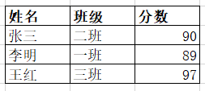<br />然后在python中执行`pd.read_clipboard()`，就能得到一模一样的dataframe数据表：
```python
pd.read_clipboard()
```
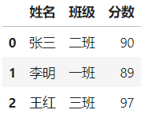<br />这功能对经常在excel和python中切换的分析师来说简直是福音，excel中的数据能一键转化为pandas可读格式。
<a name="pQijp"></a>
### 2、通过数据类型选择columns
数据分析过程可能会需要筛选数据列，比如只需要数值列，以经典的泰坦尼克数据集为例：
```python
import seaborn as sns
# 导出泰坦尼克数据集
df = sns.load_dataset('titanic')
df.head()
```
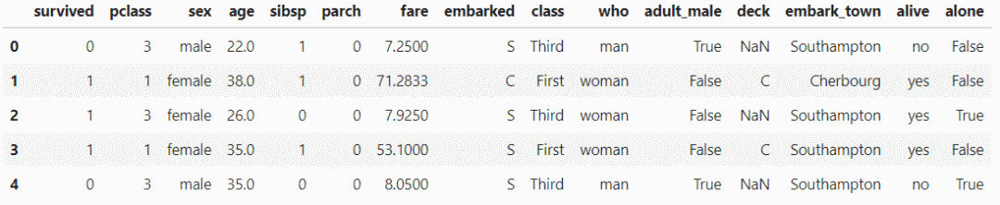<br />查看该数据集各列的数据类型：
```python
df.dtypes
```
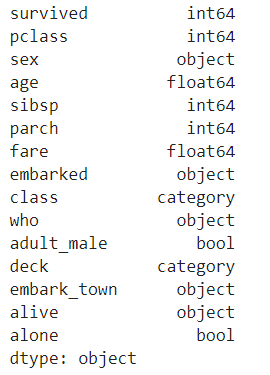<br />可以看到各列的数据类型不太一样，有int、object、float、bool等。<br />如果只要需要数值列，也就是数据类型为int、float的列，可以通过`select_dtypes`方法实现：
```python
df.select_dtypes(include='number').head()
```
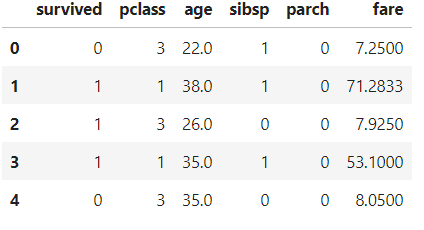<br />选择除数据类型为int外其他的列，注意这里的参数是`exclude`：
```python
df.select_dtypes(exclude='int').head()
```
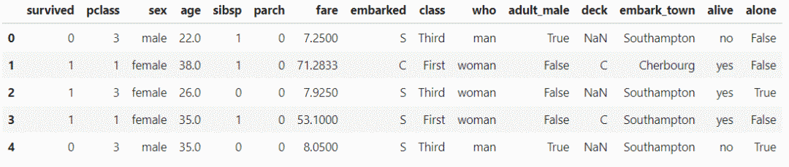<br />也可以选择多种数据类型：
```python
df.select_dtypes(include=['int', 'datetime', 'object']).head()
```
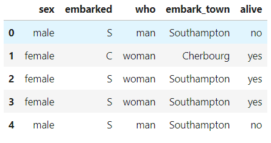
<a name="2EtI4"></a>
### 3、将`strings`改为`numbers`
在`pandas`中，有两种方法可以将字符串改为数值：

- `astype()`方法
- `to_numeric()`方法

先创建一个样本dataframe，看看这两种方法有什么不同。
```python
import pandas as pd
df = pd.DataFrame({ 'product': ['A','B','C','D'], 
                   'price': ['10','20','30','40'],
                   'sales': ['20','-','60','-']
                  })
df
```
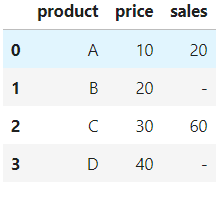<br />product列是字符串类型，price、sales列虽然内容有数字，但它们的数据类型也是字符串。<br />值得注意的是，price列都是数字，sales列有数字，但空值用-代替了。
```python
df.dtypes
```
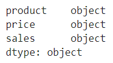<br />下面用`astype()`方法将price列的数据类型改为int:
```python
df['price'] = df['price'].astype(int)
# 或者用另一种方式
df = df.astype({'price': 'int'})
```
但如果同样用`astype()`方法更改sales列的话就会出现报错：
```python
df['sales'] = df['sales'].astype(int)
```
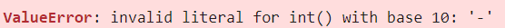<br />原因是sales列里面的内容除了数字外还有-，它是字符串，没办法转化为int。<br />而`to_numeric()`方法却可以解决这一问题，只需要设置参数errors='coerce'。
```python
df['sales'] = pd.to_numeric(df['sales'], errors='coerce')
df
```
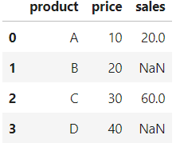<br />现在sale列中的-已经被替换成了NaN，它的数据类型也变成了float。
```python
df.dtypes
```
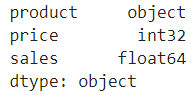
<a name="VfxLA"></a>
### 4、检测并处理缺失值
有一种比较通用的检测缺失值的方法是`info()`，它可以统计每列非缺失值的数量。<br />还是用泰坦尼克数据集：
```python
import seaborn as sns
# 导出泰坦尼克数据集
df = sns.load_dataset('titanic')
df.info()
```
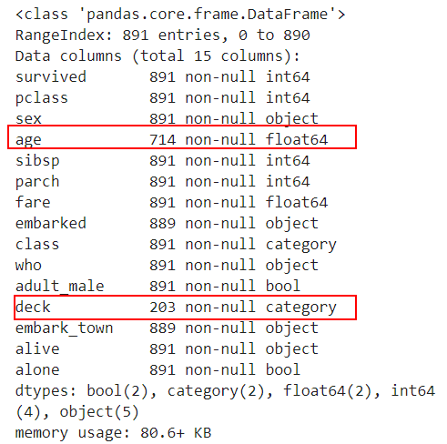<br />标红色地方是有缺失值的列，并且给出了非缺失值的数量，可以计算出该列有多少缺失值。<br />这样看可能不够直观，那可以用`df.isnull().sum()`方法很清楚地得到每列有多少缺失值：
```python
df.isnull().sum()
```
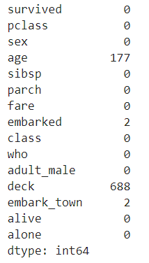<br />`df.isnull().sum().sum()`则能够返回该数据集总共有多少缺失值：
```python
df.isnull().sum().sum()
```
<br />还可以看缺失值在该列的占比是多少，用`df.isna().mean()`方法：
```python
df.isna().mean()
```
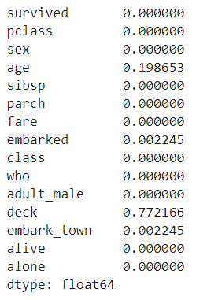<br />注意：这里`isnull()`和`isna()`使用效果一样。<br />那如何处理缺失值呢？<br />两种方式：删除和替换。

- 删除包含缺失值的行：
```python
df.dropna(axis = 0)
```

- 删除包含缺失值的列：
```python
df.dropna(axis = 1)
```

- 如果一列里缺失值超过10%，则删除该列：
```python
df.dropna(thresh=len(df)*0.9, axis=1)
```

- 用一个标量替换缺失值：
```python
df.fillna(value=10)
```

- 用上一行对应位置的值替换缺失值：
```python
df.fillna(axis=0, method='ffill')
```

- 用前一列对应位置的值替换缺失值：
```python
df.fillna(axis=1, method='ffill')
```

- 用下一行对应位置的值替换缺失值：
```python
df.fillna(axis=0, method='bfill')
```

- 用后一列对应位置的值替换缺失值：
```python
df.fillna(axis=1, method='bfill')
```

- 使用某一列的平均值替换缺失值：
```python
df['Age'].fillna(value=df['Age'].mean(), inplace=True)
```
当然还可以用最大最小值、分位数值等来替换缺失值。
<a name="TUuvu"></a>
### 5、对连续数据进行离散化处理
在数据准备过程中，常常会组合或者转换现有特征以创建一个新的特征，其中将连续数据离散化是非常重要的特征转化方式，也就是将数值变成类别特征。<br />同样以泰坦尼克数据集为例，里面有一列是年龄特征age:
```python
import seaborn as sns
# 导出泰坦尼克数据集
df = sns.load_dataset('titanic')
df['age'].head()
```
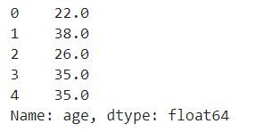<br />年龄是一段连续值，如果想对它进行分组变成分类特征，比如（<=12，儿童）、（<=18，青少年）、（<=60，成人）、（>60，老人），可以用cut方法实现：
```python
import sys
df['ageGroup']=pd.cut(
                    df['age'], 
                    bins=[0, 13, 19, 61, sys.maxsize], 
                    labels=['儿童', '青少年', '成人', '老人']
                      )
df.head()
```
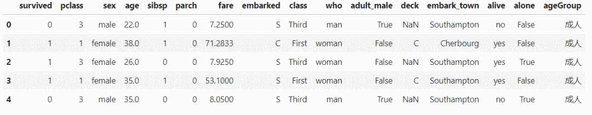<br />注意：这里的`sys.maxsize`是指可以存储的最大值。<br />可以看到新增了一列ageGroup，用以展示年龄分组：
```python
df['ageGroup'].head()
```
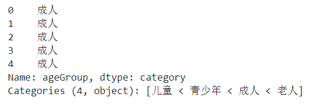
<a name="55Krc"></a>
### 6、从多个文件中构建一个DataFrame
有时候数据集可能分布在多个excel或者csv文件中，但需要把它读取到一个DataFrame中，这样的需求该如何实现？<br />做法是分别读取这些文件，然后将多个dataframe组合到一起，变成一个dataframe。<br />这里使用内置的glob模块，来获取文件路径，简洁且更有效率。<br />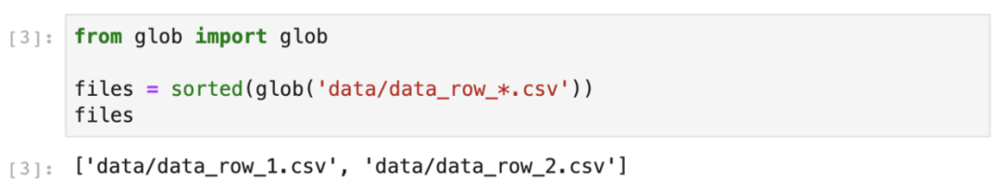<br />在上图中，`glob()`在指定目录中查找所有以“ data_row_”开头的CSV文件。<br />`glob()`以任意顺序返回文件名，这就是为什么使用`sort()`函数对列表进行排序的原因。<br />「行合并」<br />假设数据集按行分布在2个文件中，分别是data_row_1.csv和data_row_2.csv<br />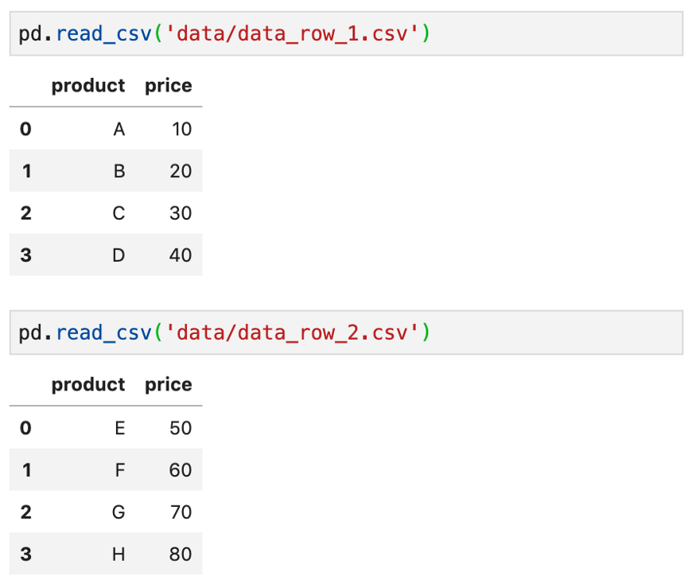<br />用以下方法可以逐行合并：
```python
files = sorted(glob('data/data_row_*.csv'))
pd.concat((pd.read_csv(file) for file in files), ignore_index=True)
```
`sorted(glob('data/data_row_*.csv'))`返回文件名，然后逐个读取，并且使用`concat()`方法进行合并，得到结果：<br />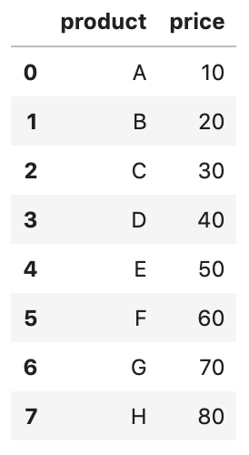<br />「列合并」<br />假设数据集按列分布在2个文件中，分别是data_row_1.csv和data_row_2.csv<br />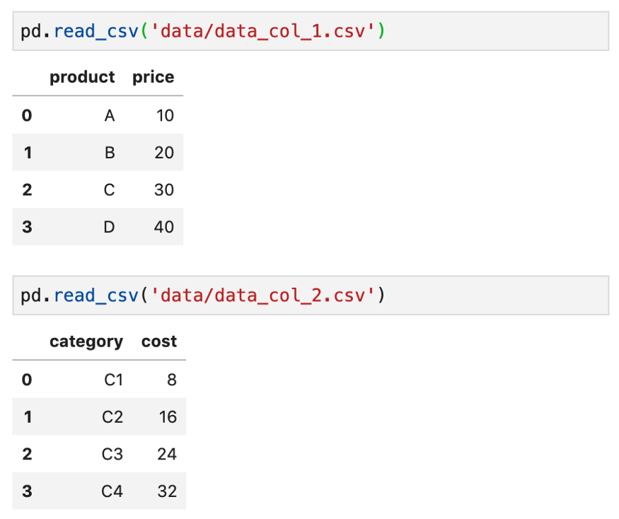<br />用以下方法可以逐列合并：
```python
files = sorted(glob('data/data_col_*.csv'))
pd.concat((pd.read_csv(file) for file in files), axis=1)
```
`sorted(glob('data/data_row_*.csv'))`返回文件名，然后逐个读取，并且使用`concat()`方法进行列合并（注意这里axis=1），得到结果：<br />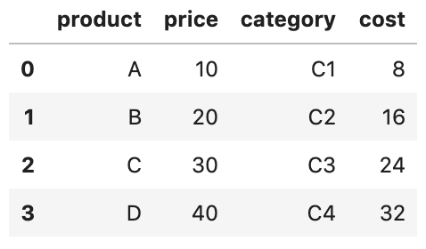
<a name="61aada07"></a>
### 7、Series与DataFrame的互转
很多时候计算过程中产生的结果是`Series`格式的，而接下来的很多操作尤其是使用**「链式」**语法时，需要衔接着传入`DataFrame`格式的变量，这种时候就可以使用到`pandas`中`Series`向`DataFrame`转换的方法：
<a name="VDp6d"></a>
#### 「利用`to_frame()`实现Series转DataFrame」
```python
s = pd.Series([0, 1, 2])
# Series转为DataFrame，name参数用于指定转换后的字段名
s = s.to_frame(name='列名')
s
```
<br />顺便介绍一下单列数据组成的数据框转为`Series`的方法：
<a name="6a106635"></a>
#### 「利用squeeze()实现单列数据DataFrame转Series」
```python
# 只有单列数据的DataFrame转为Series
s.squeeze()
```
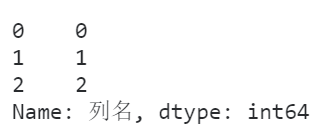
<a name="FAQcG"></a>
### 8、随机打乱DataFrame的记录行顺序
有时候需要对数据框整体的行顺序进行打乱，譬如在训练机器学习模型时，打乱原始数据顺序后取前若干行作为训练集后若干行作为测试集，这在`pandas`中可以利用`sample()`方法快捷实现。<br />`sample()`方法的本质功能是从原始数据中抽样行记录，默认为不放回抽样，其参数`frac`用于控制抽样比例，将其设置为1则等价于打乱顺序：
```python
df = pd.DataFrame({
    'V1': range(5),
    'V2': range(5)
})
df.sample(frac=1)
```

<a name="9q85d"></a>
### 9、利用类别型数据减少内存消耗
当数据框中某些列是由少数几种值大量重复形成时，会消耗大量的内存，就像下面的例子一样：
```python
import numpy as np
pool = ['A', 'B', 'C', 'D']
# V1列由ABCD大量重复形成
df = pd.DataFrame({
    'V1': np.random.choice(pool, 1000000)
})
# 查看内存使用情况
df.memory_usage(deep=True)
```
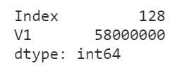<br />这种时候可以使用到`pandas`数据类型中的类别型来极大程度上减小内存消耗：
```python
df['V1'] = df['V1'].astype('category')
df.memory_usage(deep=True)
```
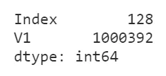<br />可以看到，转换类型之后内存消耗减少了将近98.3%！
<a name="mSYIj"></a>
### 10、pandas中的object类型陷阱
在日常使用`pandas`处理数据的过程中，经常会遇到`object`这种数据类型，很多初学者都会把它视为字符串，事实上`object`在`pandas`中可以代表不确定的数据类型，即类型为`object`的`Series`中可以混杂着多种数据类型：
```python
s = pd.Series(['111100', '111100', 111100, '111100'])
s
```
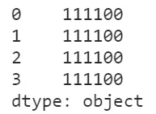<br />查看类型分布：
```python
s.apply(lambda s: type(s))
```
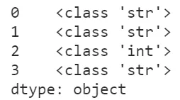<br />这种情况下，如果贸然当作字符串列来处理，对应的无法处理的元素只会变成缺失值而不报错，给分析过程带来隐患：
```python
s.str.replace('00', '11')
```
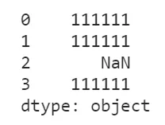<br />这种时候就一定要先转成对应的类型，再执行相应的方法：
```python
s.astype('str').str.replace('00', '11')
```
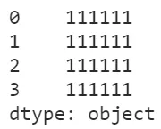
<a name="IKAv3"></a>
### 11、快速判断每一列是否有缺失值
在`pandas`中可以对单个`Series`查看`hanans`属性来了解其是否包含缺失值，而结合`apply()`，就可以快速查看整个数据框中哪些列含有缺失值：
```python
df = pd.DataFrame({
    'V1': [1, 2, None, 4],
    'V2': [1, 2, 3, 4],
    'V3': [None, 1, 2, 3]
})
df.apply(lambda s: s.hasnans)
```
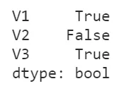
<a name="fa783076"></a>
### 12、使用`rank()`计算排名时的五种策略
在`pandas`中可以利用`rank()`方法计算某一列数据对应的排名信息，但在`rank()`中有参数`method`来控制具体的结果计算策略，有以下5种策略，在具体使用的时候要根据需要灵活选择：
<a name="FR7JI"></a>
#### 「average」
在`average`策略下，相同数值的元素的排名是其内部排名的均值：
```python
s = pd.Series([1, 2, 2, 2, 3, 4, 4, 5, 6])
s.rank(method='average')
```
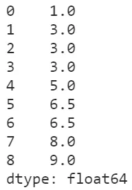
<a name="68ca5b19"></a>
#### 「min」
在`min`策略下，相同元素的排名为其内部排名的最小值：
```python
s.rank(method='min')
```
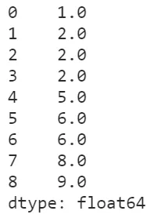
<a name="HITgK"></a>
#### 「max」
`max`策略与`min`正好相反，取的是相同元素内部排名的最大值：
```python
s.rank(method='max')
```
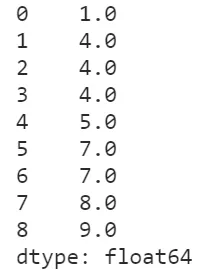
<a name="2GOpH"></a>
#### 「dense」
在`dense`策略下，相当于对序列去重后进行排名，再将每个元素的排名赋给相同的每个元素，这种方式也是比较贴合实际需求的：
```python
s.rank(method='dense')
```
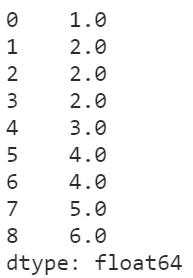
<a name="JGSld"></a>
#### 「first」
在`first`策略下，当多个元素相同时，会根据这些相同元素在实际`Series`中的顺序分配排名：
```python
s = pd.Series([2, 2, 2, 1, 3])
s.rank(method='first')
```
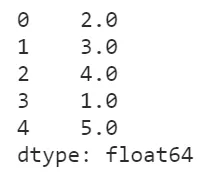
<a name="8c27c127"></a>
### 13、计算变量缺失率
```python
df=pd.read_csv('titanic_train.csv')
def missing_cal(df):
    """
    df :数据集
    
    return：每个变量的缺失率
    """
    missing_series = df.isnull().sum()/df.shape[0]
    missing_df = pd.DataFrame(missing_series).reset_index()
    missing_df = missing_df.rename(columns={'index':'col',
                                            0:'missing_pct'})
    missing_df = missing_df.sort_values('missing_pct',ascending=False).reset_index(drop=True)
    return missing_df
missing_cal(df)
```
如果需要计算样本的缺失率分布，只要加上参数axis=1
<a name="8637ace7"></a>
### 14、获取分组里最大值所在的行方法
分为分组中有重复值和无重复值两种。无重复值的情况。
```python
df = pd.DataFrame({'Sp':['a','b','c','d','e','f'], 'Mt':['s1', 's1', 's2','s2','s2','s3'], 'Value':[1,2,3,4,5,6], 'Count':[3,2,5,10,10,6]})
df
df.iloc[df.groupby(['Mt']).apply(lambda x: x['Count'].idxmax())]
```
先按Mt列进行分组，然后对分组之后的数据框使用`idxmax`函数取出`Count`最大值所在的列，再用`iloc`位置索引将行取出。有重复值的情况
```python
df["rank"] = df.groupby("ID")["score"].rank(method="min", ascending=False).astype(np.int64)
df[df["rank"] == 1][["ID", "class"]]
```
对ID进行分组之后再对分数应用`rank`函数，分数相同的情况会赋予相同的排名，然后取出排名为1的数据。
<a name="cIB0t"></a>
### 15、多列合并为一行
```python
df = pd.DataFrame({'id_part':['a','b','c','d'], 'pred':[0.1,0.2,0.3,0.4], 'pred_class':['women','man','cat','dog'], 'v_id':['d1','d2','d3','d1']})
df.groupby(['v_id']).agg({'pred_class': [', '.join],'pred': lambda x: list(x),
'id_part': 'first'}).reset_index()
```
<a name="Cy1Oa"></a>
### 16、删除包含特定字符串所在的行
```python
df = pd.DataFrame({'a':[1,2,3,4], 'b':['s1', 'exp_s2', 's3','exps4'], 'c':[5,6,7,8], 'd':[3,2,5,10]})
df[df['b'].str.contains('exp')]
```
<a name="qtaFu"></a>
### 17、组内排序
```python
df = pd.DataFrame([['A',1],['A',3],['A',2],['B',5],['B',9]], columns = ['name','score'])
```
介绍两种高效地组内排序的方法。
```python
df.sort_values(['name','score'], ascending = [True,False])
df.groupby('name').apply(lambda x: x.sort_values('score', ascending=False)).reset_index(drop=True)
```
<a name="vxq96"></a>
### 18、选择特定类型的列
```python
drinks = pd.read_csv('data/drinks.csv')
# 选择所有数值型的列
drinks.select_dtypes(include=['number']).head()
# 选择所有字符型的列
drinks.select_dtypes(include=['object']).head()
drinks.select_dtypes(include=['number','object','category','datetime']).head()
# 用 exclude 关键字排除指定的数据类型
drinks.select_dtypes(exclude=['number']).head()
```
<a name="UBHqK"></a>
### 19、字符串转换为数值
```python
df = pd.DataFrame({'列1':['1.1','2.2','3.3'],
                  '列2':['4.4','5.5','6.6'],
                  '列3':['7.7','8.8','-']})
df
df.astype({'列1':'float','列2':'float'}).dtypes
```
用这种方式转换第三列会出错，因为这列里包含一个代表 0 的下划线，pandas 无法自动判断这个下划线。为了解决这个问题，可以使用 `to_numeric()` 函数来处理第三列，让 pandas 把任意无效输入转为 NaN。
```python
df = df.apply(pd.to_numeric, errors='coerce').fillna(0)
```
<a name="jcoKz"></a>
### 20、优化 DataFrame 对内存的占用
方法一：只读取切实所需的列，使用`usecols`参数
```python
cols = ['beer_servings','continent']
small_drinks = pd.read_csv('data/drinks.csv', usecols=cols)
```
方法二：把包含类别型数据的 object 列转换为 Category 数据类型，通过指定 `dtype` 参数实现。
```python
dtypes ={'continent':'category'}
smaller_drinks = pd.read_csv('data/drinks.csv',usecols=cols, dtype=dtypes)
```
<a name="Cq3TO"></a>
### 21、根据最大的类别筛选 DataFrame
```python
movies = pd.read_csv('data/imdb_1000.csv')
counts = movies.genre.value_counts()
movies[movies.genre.isin(counts.nlargest(3).index)].head()
```
<a name="K7OS4"></a>
### 22、把字符串分割为多列
```python
df = pd.DataFrame({'姓名':['张 三','李 四','王 五'],
                   '所在地':['北京-东城区','上海-黄浦区','广州-白云区']})
df
df.姓名.str.split(' ', expand=True)
```
<a name="60fbd13d"></a>
### 23、把 Series 里的列表转换为 DataFrame
```python
df = pd.DataFrame({'列1':['a','b','c'],'列2':[[10,20], [20,30], [30,40]]})
df
df_new = df.列2.apply(pd.Series)
pd.concat([df,df_new], axis='columns')
```
<a name="gafEX"></a>
### 24、用多个函数聚合
```python
orders = pd.read_csv('data/chipotle.tsv', sep='\t')
orders.groupby('order_id').item_price.agg(['sum','count']).head()
```
<a name="Gs186"></a>
### 25、分组聚合
```python
import pandas as pd
df = pd.DataFrame({'key1':['a', 'a', 'b', 'b', 'a'],
    'key2':['one', 'two', 'one', 'two', 'one'],
    'data1':np.random.randn(5),
     'data2':np.random.randn(5)})
df
for name, group in df.groupby('key1'):
    print(name)
    print(group)
dict(list(df.groupby('key1')))
```
通过字典或Series进行分组
```python
people = pd.DataFrame(np.random.randn(5, 5),
     columns=['a', 'b', 'c', 'd', 'e'],
     index=['Joe', 'Steve', 'Wes', 'Jim', 'Travis'])
mapping = {'a':'red', 'b':'red', 'c':'blue',
     'd':'blue', 'e':'red', 'f':'orange'}
by_column = people.groupby(mapping, axis=1)
by_column.sum()
```

