PythonPandas

- > 1 统计一行/一列数据的负数出现的次数
- > 2 让dataframe里面的正数全部变为0
- > 3 统计某列中各元素出现次数
- > 4 修改表头和索引
- > 5 修改列所在位置insert+pop
- > 6 常用查询方法query
- > 7 数据存储时不要索引
- > 8 按指定列排序sort_values
- > 9 apply 函数运用
- > 10 Pandas数据合并
- > 11 Pandas Dataframe拷贝
- > 12 对于列/行的操作
<a name="kNR0p"></a>
## 简单说说
Pandas是一个快速、强大、灵活且易于使用的开源数据分析和操作工具，在Python环境下，可以通过pip直接进行安装。
```bash
pip install pandas
```
在Python代码中使用pandas首先需要导入，：
```python
import pandas as pd
```
创建一个示例数据：
```python
# 统计一行/一列数据的负数出现的次数
df = pd.DataFrame(
    {'a':[1,-3,0,1,3],
     'b':[-1,0,1,5,1],
     'c':[0,-2,0,-9,0]})
df
```
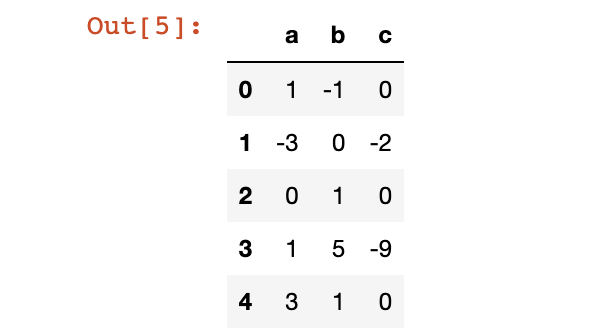
<a name="HW7Rq"></a>
## 总结分享
<a name="pZLy9"></a>
### > 1、统计一行/一列数据的负数出现的次数
```python
# 获取到每一行的复数个数
# 要获取列的话，将axis改成0即可
num_list = (df < 0).astype(int).sum(axis=1)
num_list
```
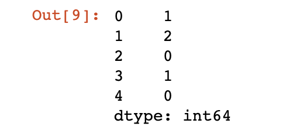
<a name="I4Bwn"></a>
### > 2、让dataframe里面的正数全部变为0
```python
# 直接了当
df[df>0] = 0
df
```
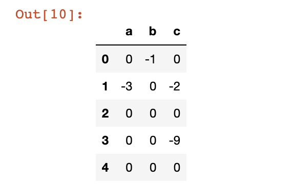
<a name="ceCJL"></a>
### > 3、统计某列中各元素出现次数

- 默认情况，直接统计出指定列各元素值出现的次数。
```python
# 默认情况，统计b列各元素出现次数
df['b'].value_counts()
```
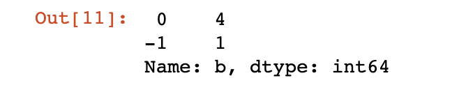

- 最好奇的`bins`参数，按`bins`分割区间，统计落在各区间内元素个数
```python
# 按指定区间个数bin，元素起始值分割区间，统计表格中落在各区间内元素个数
df['b'].value_counts(bins=3)
```
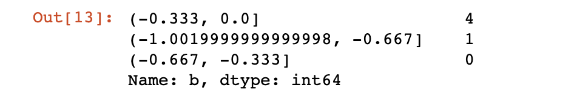

- `normalize`参数，计算各元素出现次数占比
```python
# normalize参数 出现次数/总数据个数 
df['b'].value_counts(normalize=True)
```
<br />还有sort和ascending，可以按指定方式对统计结果进行排序。
<a name="XpAeY"></a>
### > 4、修改表头和索引
<a name="HqRE4"></a>
#### 修改表头名称
```python
# 修改表头名称
columns = {'a': 'A', 'b': 'B'}
df.rename(columns=columns, inplace=True)
df
```
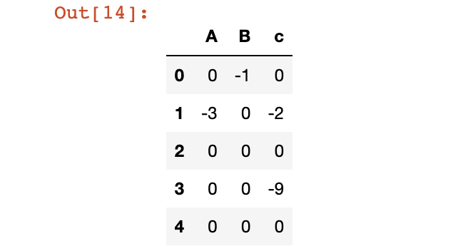
<a name="dfKmu"></a>
#### 设置特殊索引
```python
# 设置特殊索引
df.index = ['a', 'b', 'c', 'd', 'e']
df
```
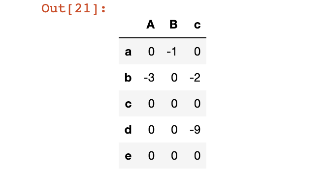
<a name="IsyTl"></a>
#### 删除索引
```python
# 删除索引
df.reset_index(drop=True, inplace=True)
df
```
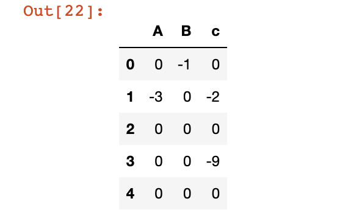
<a name="hNOFV"></a>
### > 5、修改列所在位置`insert`+`pop`
`insert`在指定位置插入某列值；`pop`按列名取出某列（同时会删掉该列）。
```python
# 将A列移到最后
# 新增列位置，新增列名，新增列的数值
df.insert(2,'A',df.pop('A'))
df
```
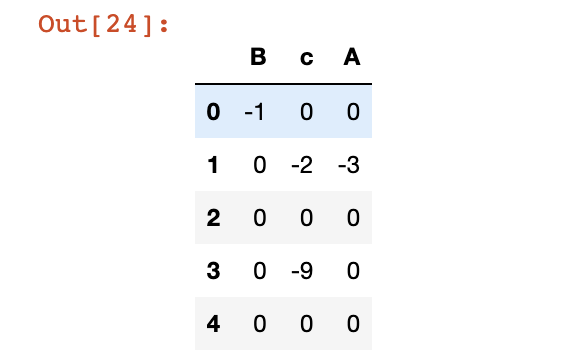
<a name="gTpwz"></a>
### > 6、常用查询方法`query`
<a name="Lbgho"></a>
#### 直接查询
```python
# 找出c所有c值小于0的行
df.query("c<0")
```
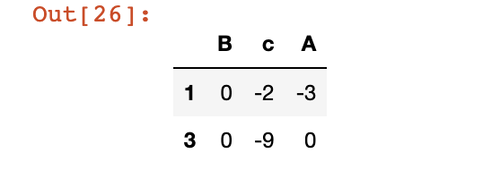
<a name="EBwCt"></a>
#### `query`+`contains`模糊查询
```python
# 插入一列
df.insert(0,'name',['张三', '张华', '李四', '王五', '李逵'])
# 查找名字里包含三、四、五的用户数据
df.query("name.str.contains('三|四|五')", engine='python')
```
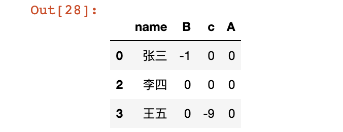
<a name="gcDcq"></a>
### > 7、数据存储时不要索引
设置`index`为None即可。
```python
df.to_csv('测试数据.csv', encoding='utf-8-sig', index=None)
```
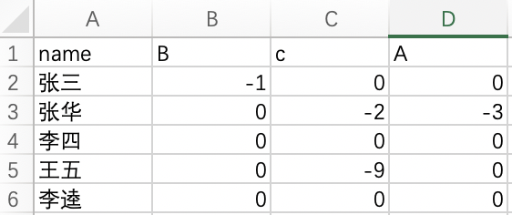
<a name="FATxO"></a>
### > 8、按指定列排序`sort_values`
`sort_values`函数，通过by参数可以指定按哪些列进行排序，还可以设置`ascending`指定排序方式（升序或者降序，默认降序）
```python
# by 指定排序列 na_position nan值放的位置 开头还是尾部
df.sort_values(by=['name'],na_position='first')
```
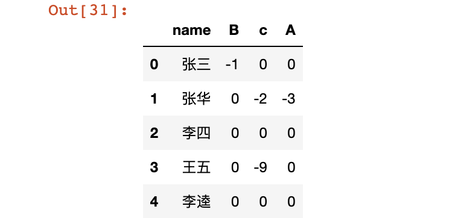
<a name="SV4Wg"></a>
### > 9、`apply` 函数运用
```python
# A B 两列都每个元素值都+1
df[['A', 'B']].apply(lambda x:x+1)
```
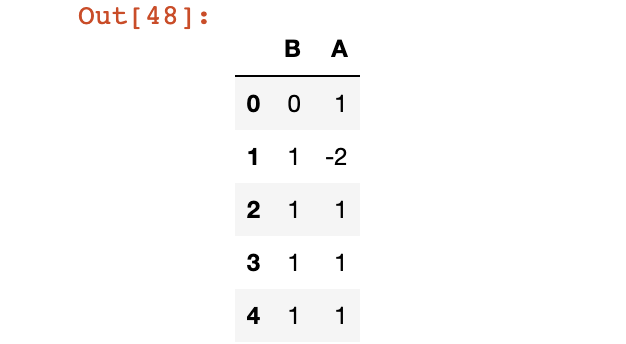<br />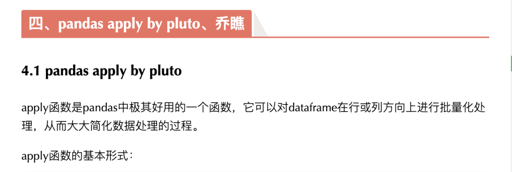
```python
DataFrame.apply(func, 
axis=0, broadcast=False, 
raw=False, reduce=None, args=(), **kwds)
```
<a name="x02yH"></a>
### > 10、Pandas数据合并
进行数据合并前，首先需要确定合并的数据的表头都是一致的，然后将他们依次加入一个列表，最终使用`concat`函数即可进行数据合并。
```python
# 现将表构成list，然后再作为concat的输入
df1 = df[0:1]
df2 = df[2:4]
df3 = df[3:5]
frames = [df1, df2, df3]
df4 = pd.concat(frames)
df4
```
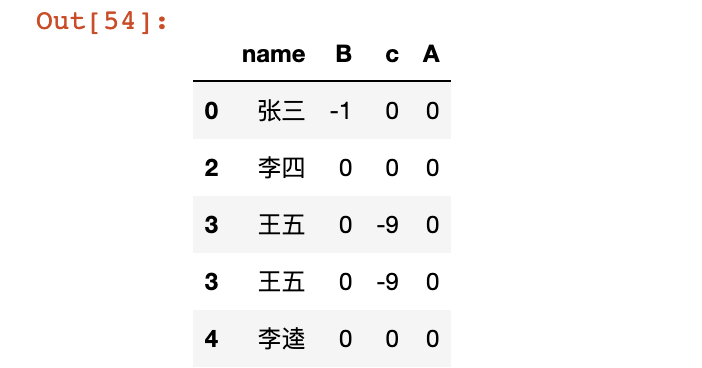
<a name="kapUA"></a>
### > 11、Pandas Dataframe拷贝

- 深拷贝，df1改变，df不会变
```python
# 深拷贝，df1改变，df不会变
df1 = df.copy(deep=True)
print(f"df\n{df}\ndf1\n{df1}")
```
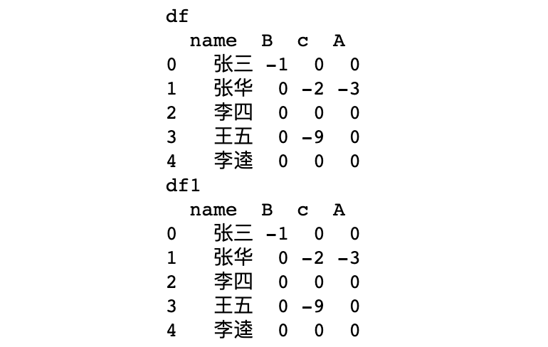

- 将原数据df的name列的第一个元素改为zs，会发现，df改动，不会影响df1。
```python
df['name'][0] = 'zs'
print(f"df\n{df}\ndf1\n{df1}")
```
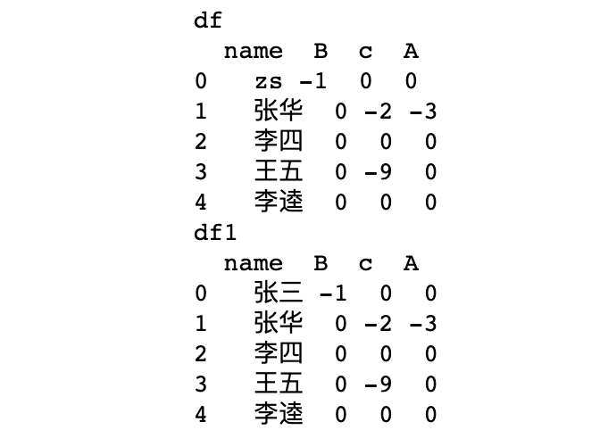

- 浅拷贝，df2改变，df也会变  等同df2 = df
```python
# 浅拷贝，df2改变，df也会变  等同df2 = df
df2 = df.copy(deep=False)
print(f"df\n{df}\ndf2\n{df2}")
```

- 将原数据df的name列的第一个元素改为张三，会发现，df改动，df2也会一起改动。
```python
df['name'][0] = '张三'
print(f"df\n{df}\ndf2\n{df2}")
```
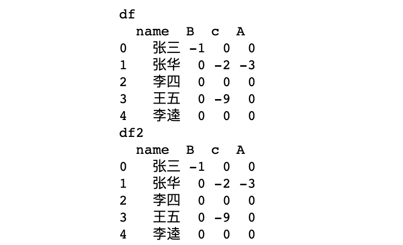
<a name="XOvDe"></a>
### > 12、对于列/行的操作
<a name="bzZfL"></a>
#### 删除指定行/列
```python
# 行索引/列索引 多行/多列可以用列表
# axis=0表示行 axis=1表示列 inplace是否在原列表操作 
# 删除df中的c列
df.drop('c', axis=1, inplace=True)
df
```
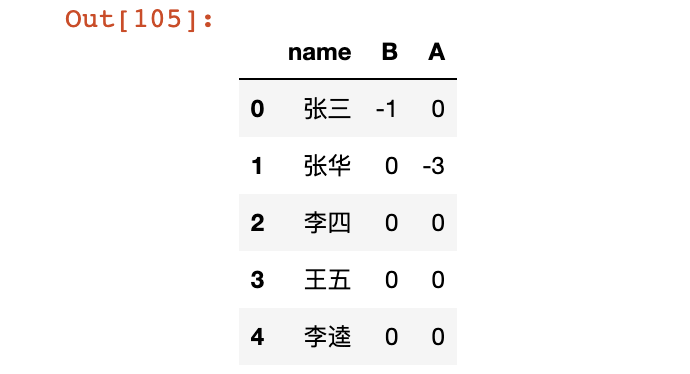
<a name="gVN5c"></a>
#### 取出指定列/行
```python
# 不知道列名，取出表格最后两列
df3 = df.iloc[:, -2:]  
# 知道列名，取出name和A两列
df4 = df.loc[:, ['name', 'A']]  
print(f"df3\n{df3}\ndf4\n{df4}")
```
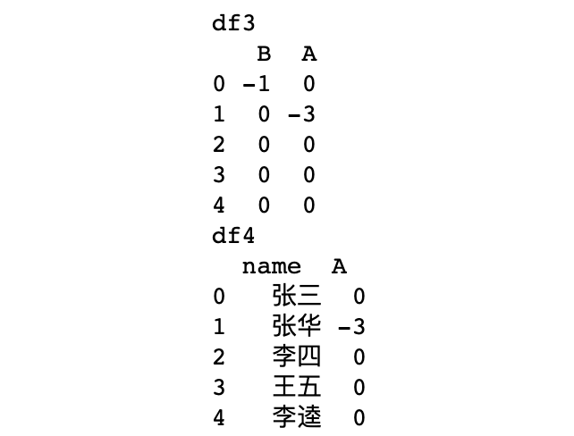
```python
# 重新设置下索引
df.index = ['a1', 'a2', 'a3', 'a4', 'a5']

# 不知道行索引，取出表格前两行
df5 = df.iloc[:2, :]  
# 知道行索引，取出a1和a3两行
df6 = df.loc[['a1', 'a3'], :]  
print(f"df5\n{df5}\ndf6\n{df6}")
```
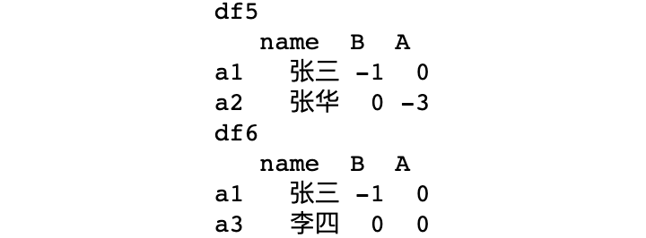
<a name="NjX8H"></a>
#### 交换两列指定值
```python
# 将B列中小于0的元素和A列交换
# 筛选出B列中小于0的行
flag = df['B'].astype(int).map(lambda x: x<0)
# 通过布尔提取交换两列数据
df.loc[flag, 'B'], df.loc[flag, 'A'] = df.loc[flag, 'A'], df.loc[flag, 'B']
df
```
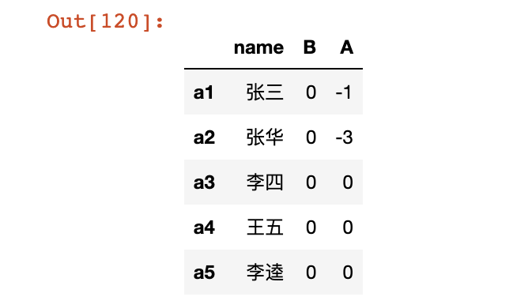
