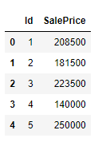
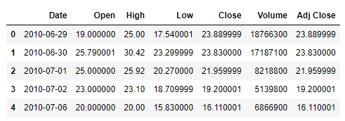
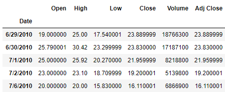
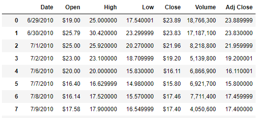
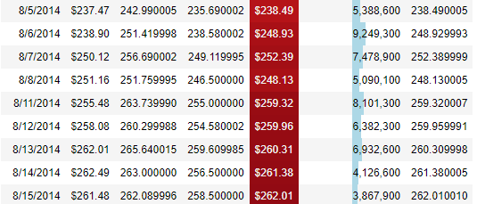

Python Pandas
<a name="OtJwr"></a>
## 读取数据
`read_csv()`用来读取csv格式的数据集，当然这其中还是有不少玄机在其中的
```python
pd.read_csv("data.csv")
```
<a name="ik7Pd"></a>
### 只读取数据集当中的某几列
只是想读取数据集当中的某几列，就可以调用其中的`usecols`参数，代码如下
```python
df = pd.read_csv("house_price.csv", usecols=["Id", "SalePrice"])
df.head()
```
output<br />
<a name="nDYzh"></a>
### 时间类型的数据解析
主要用到的是`parse_dates`参数，代码如下
```python
df = pd.read_csv("Tesla.csv", parse_dates=["Date"])
df.head()
```
output<br />
<a name="DahlP"></a>
### 对于数据类型加以设定
主要调用的是`dtype`这个参数，同时合适的数据类型能够为数据集节省不少的内存空间，代码如下
```python
df = pd.read_csv("data.csv", dtype={"house_type": "category"})
```
<a name="tIR2H"></a>
### 设置索引
用到的是`index_col`这个参数，代码如下
```python
df = pd.read_csv("Tesla.csv", index_col="Date")
df.head()
```
output<br />
<a name="AerJc"></a>
### 只读取部分读取
用到的是`nrows`参数，代码如下
```python
df = pd.read_csv("Tesla.csv", nrows=100)
df.shape
```
output
```python
(100, 7)
```
<a name="tkGhv"></a>
### 跳过某些行
要是数据集当中存在着一些并不想包括在内的内容，可以直接跳过，`skiprows`参数，代码如下
```python
pd.read_csv("data.csv", skiprows=[1, 5])  # 跳过第一和第五行
pd.read_csv("data.csv", skiprows=100)  # 跳过前100行
pd.read_csv("data.csv", skiprows=lambda x: x > 0 and np.random.rand() > 0.1) # 抽取10%的数据
```
<a name="SBqOT"></a>
### 遇到了空值咋办呢？
要是遇到了空值，可以将空值用其他的值来代替，代码如下
```python
df = pd.read_csv("data.csv", na_values=["?"])
```
<a name="Agkoq"></a>
### 那么布尔值呢？
对于布尔值而言，也可以设定换成是其他的值来代替，代码如下
```python
df = pd.read_csv("data.csv", true_values=["yes"], false_values=["no"])
```
<a name="n2aOC"></a>
### 从多个csv文件中读取数据
还可以从多个csv文件当中来读取数据，通过glob模块来实现，代码如下
```python
import glob
import os

files = glob.glob("file_*.csv")

result = pd.concat([pd.read_csv(file) for file in files], ignore_index=True)
```
<a name="FEtSb"></a>
### 要是从PDF文件当中来读取数据
表格数据存在于pdf文件当中，需要从pdf文件当中来读取数据，代码如下
```python
# 安装tabula-py模块
# %pip install tabula-py 

from tabula import read_pdf
df = read_pdf('test.pdf', pages='all')
```
<a name="gusWU"></a>
## 探索性数据分析
<a name="ufkht"></a>
### 三行代码直接生成
通过调用pandas_profilling模块，三行代码直接生成数据分析的报告，代码如下
```python
# 安装pandas-profilling模块
# %pip install pandas-profiling

import pandas_profiling

df = pd.read_csv("data.csv")
profile = df.profile_report(title="Pandas Profiling Report")
profile.to_file(output_file="output.html")
```
<a name="yFMod"></a>
## 基于数据类型的操作
pandas能够表示的数据类型有很多
<a name="taSh6"></a>
### 基于数据类型来筛选数据
希望筛选出来的数据包含或者是不包含想要的数据类型的数据，代码如下
```python
# 筛选数据
df.select_dtypes(include="number")
df.select_dtypes(include=["category", "datetime"])

# 排除数据
df.select_dtypes(exclude="object")
```
<a name="wNNAQ"></a>
### 推断数据类型
主要调用的是`infer_objects()`方法，代码如下
```python
df.infer_objects().dtypes
```
<a name="MxCju"></a>
### 手动进行数据类型的转换
手动地进行数据类型的转换，要是遇到不能转换的情况时，`errors='coerce'`将其换转成NaN，代码如下
```python
# 针对整个数据集都有效
df = df.apply(pd.to_numeric, errors="coerce")

# 将空值用零来填充
pd.to_numeric(df.numeric_column, errors="coerce").fillna(0)
```
<a name="ItIUY"></a>
### 一次性完成数据类型的转换
用到的是`astype`方法，代码如下
```python
df = df.astype(
    {
        "date": "datetime64[ns]",
        "price": "int",
        "is_weekend": "bool",
        "status": "category",
    }
)
```
<a name="kRi9f"></a>
## 列的操作
<a name="ESmZW"></a>
### 重命名
`rename()`方法进行列的重命名，代码如下
```python
df = df.rename({"PRICE": "price", "Date (mm/dd/yyyy)": "date", "STATUS": "status"}, axis=1)
```
<a name="kCOyD"></a>
### 添加前缀或者是后缀
`add_prefix()`方法以及`add_suffix()`方法，代码如下
```python
df.add_prefix("pre_")
df.add_suffix("_suf")
```
<a name="U3lKY"></a>
### 新建一个列
调用的是`assign`方法，当然除此之外还有其他的方法可供尝试，代码如下
```python
# 摄氏度与华氏度之间的数制转换
df.assign(temp_f=lambda x: x.temp_c * 9 / 5 + 32)
```
<a name="bl1Gy"></a>
### 在指定的位置插入新的一列
同样也是用到`insert`方法，代码如下
```python
random_col = np.random.randint(10, size=len(df))
df.insert(3, 'random_col', random_col) # 在第三列的地方插入
```
<a name="lJAm8"></a>
### if-else逻辑判断
```python
df["price_high_low"] = np.where(df["price"] > 5, "high", "low")
```
<a name="LkqMF"></a>
### 去掉某些列
调用的是`drop()`方法，代码如下
```python
df.drop('col1', axis=1, inplace=True)
df = df.drop(['col1','col2'], axis=1)
df.drop(df.columns[0], inplace=True)
```
<a name="KuqnP"></a>
## 字符串的操作
<a name="N80Yh"></a>
### 列名的操作
要是想要对列名做出一些改变，代码如下
```python
# 对于列名的字符串操作
df.columns = df.columns.str.lower()
df.columns = df.columns.str.replace(' ', '_')
```
<a name="LJoU6"></a>
### `Contains()`方法
```python
## 是否包含了某些字符串
df['name'].str.contains("John")
## 里面可以放置正则表达式
df['phone_num'].str.contains('...-...-....', regex=True)  # regex
```
<a name="Ht8GT"></a>
### `findall()`方法
```python
## 正则表达式
pattern = '([A-Z0-9._%+-]+)@([A-Z0-9.-]+)\\.([A-Z]{1,9})'
df['email'].str.findall(pattern, flags=re.IGNORECASE)
```
<a name="Crn7Z"></a>
## 缺失值
<a name="d0trK"></a>
### 查看空值的比例
要是想要查看在数据集当中空值所占的比例，代码如下
```python
def missing_vals(df):
    """空值所占的百分比"""
    missing = [
        (df.columns[idx], perc)
        for idx, perc in enumerate(df.isna().mean() * 100)
        if perc > 0
    ]

    if len(missing) == 0:
        return "没有空值数据的存在"
        
    # 排序
    missing.sort(key=lambda x: x[1], reverse=True)

    print(f"总共有 {len(missing)} 个变量存在空值\n")

    for tup in missing:
        print(str.ljust(f"{tup[0]:<20} => {round(tup[1], 3)}%", 1))
```
output
```python
总共有 19 个变量存在空值

PoolQC               => 99.521%
MiscFeature          => 96.301%
Alley                => 93.767%
Fence                => 80.753%
FireplaceQu          => 47.26%
LotFrontage          => 17.74%
GarageType           => 5.548%
GarageYrBlt          => 5.548%
GarageFinish         => 5.548%
GarageQual           => 5.548%
GarageCond           => 5.548%
BsmtExposure         => 2.603%
BsmtFinType2         => 2.603%
BsmtQual             => 2.534%
BsmtCond             => 2.534%
BsmtFinType1         => 2.534%
MasVnrType           => 0.548%
MasVnrArea           => 0.548%
Electrical           => 0.068%
```
<a name="kSNAY"></a>
### 空值的处理方式
可以选择将空值去除掉，或者用平均值或者其他数值来进行填充，代码如下
```python
# 去除掉空值 
df.dropna(axis=0)
df.dropna(axis=1)

# 换成其他值来填充
df.fillna(0)
df.fillna(method="ffill")
df.fillna(method='bfill')

# 取代为其他的数值
df.replace( -999, np.nan)
df.replace("?", np.nan)

# 推测其空值应该为其他什么数值
ts.interpolate() # time series
df.interpolate() # fill all consecutive values forward
df.interpolate(limit=1) # fill one consecutive value forward
df.interpolate(limit=1, limit_direction="backward")
df.interpolate(limit_direction="both")
```
<a name="LCp1J"></a>
## 日期格式的数据处理
<a name="qDrSk"></a>
### 获取指定时间的数据
```python
# 从今天开始算，之后的N天或者N个礼拜或者N个小时
date.today() + datetime.timedelta(hours=30)
date.today() + datetime.timedelta(days=30)
date.today() + datetime.timedelta(weeks=30)

# 过去的一年
date.today() - datetime.timedelta(days=365)
```
<a name="YyPTI"></a>
### 通过日期时间来获取数据
```python
df[(df["Date"] > "2015-10-01") & (df["Date"] < "2018-01-05")]
```
<a name="IgtZe"></a>
### 通过指定日期来获取数据
```python
# 筛选出某一天的数据
df[df["Date"].dt.strftime("%Y-%m-%d") == "2022-03-05"]

# 筛选出某一个月的数据
df[df["Date"].dt.strftime("%m") == "12"]

# 筛选出每一年的数据
df[df["Date"].dt.strftime("%Y") == "2020"]
```
<a name="fqYVE"></a>
## 将格式化数据集
<a name="DPia5"></a>
### 保留指定位数
对于一些浮点数的数据，希望可以保留小数点后的两位或者是三位，代码如下
```python
format_dict = {
	"Open": "${:.2f}",
	"Close": "${:.2f}",
	"Volume": "{:,}",
}

df.style.format(format_dict)
```
output<br />
<a name="MbIZS"></a>
### 高亮显示数据
对于指定的一些数据，希望是高亮显示，代码如下
```python
(
    df.style.format(format_dict)
    .hide_index()
    .highlight_min(["Open"], color="blue")
    .highlight_max(["Open"], color="red")
    .background_gradient(subset="Close", cmap="Greens")
    .bar('Volume', color='lightblue', align='zero')
    .set_caption('Tesla Stock Prices in 2017')
)
```
output<br />
