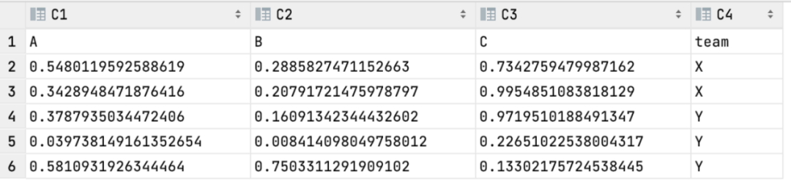

Python Pandas<br />

---

在数据处理时，经常会因为`index`报错而发愁。来看看pandas中处理索引的几种常用方法。
<a name="MP4Wq"></a>
## 1、读取时指定索引列
很多情况下，数据源是 CSV 文件。假设有一个名为的文件data.csv，包含以下数据。
```
date,temperature,humidity
07/01/21,95,50
07/02/21,94,55
07/03/21,94,56
```
默认情况下，pandas将会创建一个从0开始的索引行，如下：
```python
>>> pd.read_csv("data.csv", parse_dates=["date"])
        date  temperature  humidity
0 2021-07-01           95        50
1 2021-07-02           94        55
2 2021-07-03           94        56
```
但是，可以在导入过程中通过将`index_col`参数设置为某一列可以直接指定索引列。
```python
>>> pd.read_csv("data.csv", parse_dates=["date"], index_col="date")
            temperature  humidity
date                             
2021-07-01           95        50
2021-07-02           94        55
2021-07-03           94        56
```
<a name="kuOwR"></a>
## 2、使用现有的 DataFrame 设置索引
当然，如果已经读取数据或做完一些数据处理步骤后，可以通过`set_index`手动设置索引。
```python
>>> df = pd.read_csv("data.csv", parse_dates=["date"])
>>> df.set_index("date")
            temperature  humidity
date                             
2021-07-01           95        50
2021-07-02           94        55
2021-07-03           94        56
```
这里有两点需要注意下。

1. `set_index`方法默认将创建一个新的 DataFrame。如果要就地更改`df`的索引，需要设置`inplace=True`。
```python
df.set_index(“date”, inplace=True)
```

2. 如果要保留将要被设置为索引的列，可以设置`drop=False`。
```python
df.set_index(“date”, drop=False)
```
<a name="d5iav"></a>
## 3、一些操作后重置索引
在处理 DataFrame 时，某些操作（例如删除行、索引选择等）将会生成原始索引的子集，这样默认的数字索引排序就乱了。如要重新生成连续索引，可以使用`reset_index`方法。
```python
>>> df0 = pd.DataFrame(np.random.rand(5, 3), columns=list("ABC"))
>>> df0
          A         B         C
0  0.548012  0.288583  0.734276
1  0.342895  0.207917  0.995485
2  0.378794  0.160913  0.971951
3  0.039738  0.008414  0.226510
4  0.581093  0.750331  0.133022
>>> df1 = df0[df0.index % 2 == 0]
>>> df1
          A         B         C
0  0.548012  0.288583  0.734276
2  0.378794  0.160913  0.971951
4  0.581093  0.750331  0.133022
>>> df1.reset_index(drop=True)
          A         B         C
0  0.548012  0.288583  0.734276
1  0.378794  0.160913  0.971951
2  0.581093  0.750331  0.133022
```
通常是不需要保留旧索引的，因此可将`drop`参数设置为`True`。同样，如果要就地重置索引，可设置`inplace`参数为`True`，否则将创建一个新的 DataFrame。
<a name="QTa1O"></a>
## 4、将索引从 `groupby` 操作转换为列
`groupby`分组方法是经常用的。比如下面通过添加一个分组列team来进行分组。
```python
>>> df0["team"] = ["X", "X", "Y", "Y", "Y"]
>>> df0
          A         B         C team
0  0.548012  0.288583  0.734276    X
1  0.342895  0.207917  0.995485    X
2  0.378794  0.160913  0.971951    Y
3  0.039738  0.008414  0.226510    Y
4  0.581093  0.750331  0.133022    Y
>>> df0.groupby("team").mean()
             A         B         C
team                              
X     0.445453  0.248250  0.864881
Y     0.333208  0.306553  0.443828
```
默认情况下，分组会将分组列编程`index`索引。但是很多情况下，不希望分组列变成索引，因为可能有些计算或者判断逻辑还是需要用到该列的。因此，需要设置一下让分组列不成为索引，同时也能完成分组的功能。<br />有两种方法可以完成所需的操作，第一种是用`reset_index`，第二种是在`groupby`方法里设置`as_index=False`。第二种方法它只涉及两个步骤，更简洁。
```python
>>> df0.groupby("team").mean().reset_index()
  team         A         B         C
0    X  0.445453  0.248250  0.864881
1    Y  0.333208  0.306553  0.443828
>>> df0.groupby("team", as_index=False).mean()
  team         A         B         C
0    X  0.445453  0.248250  0.864881
1    Y  0.333208  0.306553  0.443828
```
<a name="aRfz4"></a>
## 5、排序后重置索引
当用`sort_value`排序方法时也会遇到这个问题，因为默认情况下，索引`index`跟着排序顺序而变动，所以是乱序。如果希望索引不跟着排序变动，同样需要在`sort_values`方法中设置一下参数`ignore_index`即可。
```python
>>> df0.sort_values("A")
          A         B         C team
3  0.039738  0.008414  0.226510    Y
1  0.342895  0.207917  0.995485    X
2  0.378794  0.160913  0.971951    Y
0  0.548012  0.288583  0.734276    X
4  0.581093  0.750331  0.133022    Y
>>> df0.sort_values("A", ignore_index=True)
          A         B         C team
0  0.039738  0.008414  0.226510    Y
1  0.342895  0.207917  0.995485    X
2  0.378794  0.160913  0.971951    Y
3  0.548012  0.288583  0.734276    X
4  0.581093  0.750331  0.133022    Y
```
<a name="Lm10L"></a>
## 6、删除重复后重置索引
删除重复项和排序一样，默认执行后也会打乱排序顺序。同理，可以在`drop_duplicates`方法中设置`ignore_index`参数`True`即可。
```python
>>> df0
          A         B         C team
0  0.548012  0.288583  0.734276    X
1  0.342895  0.207917  0.995485    X
2  0.378794  0.160913  0.971951    Y
3  0.039738  0.008414  0.226510    Y
4  0.581093  0.750331  0.133022    Y
>>> df0.drop_duplicates("team", ignore_index=True)
          A         B         C team
0  0.548012  0.288583  0.734276    X
1  0.378794  0.160913  0.971951    Y
```
<a name="BySam"></a>
## 7、索引的直接赋值
当有了一个 DataFrame 时，想要使用不同的数据源或单独的操作来分配索引。在这种情况下，可以直接将索引分配给现有的 `df.index`。
```python
>>> better_index = ["X1", "X2", "Y1", "Y2", "Y3"]
>>> df0.index = better_index
>>> df0
           A         B         C team
X1  0.548012  0.288583  0.734276    X
X2  0.342895  0.207917  0.995485    X
Y1  0.378794  0.160913  0.971951    Y
Y2  0.039738  0.008414  0.226510    Y
Y3  0.581093  0.750331  0.133022    Y
```
<a name="c0J6T"></a>
## 8、写入CSV文件时忽略索引
数据导出到 CSV 文件时，默认 DataFrame 具有从 0 开始的索引。如果不想在导出的 CSV 文件中包含它，可以在`to_csv`方法中设置`index`参数。
```python
>>> df0.to_csv("exported_file.csv", index=False)
```
如下所示，导出的 CSV 文件中，索引列未包含在文件中。<br /><br />其实，很多方法中都有关于索引的设置，只不过大家一般比较关心数据，而经常忽略了索引，才导致继续运行时可能会报错。以上几个高频的操作都是有索引设置的，建议大家平时用的时候养成设置索引的习惯，这样会节省不少时间。
