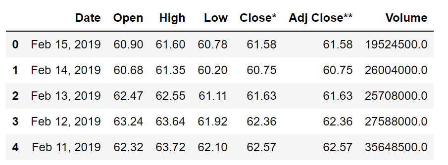
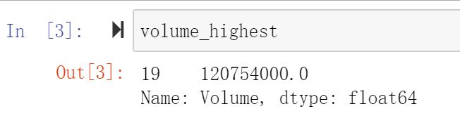
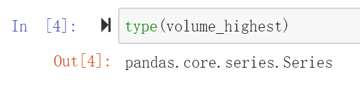
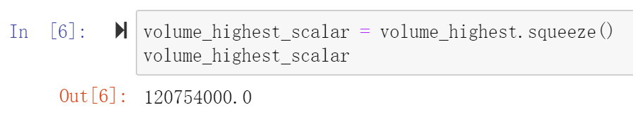
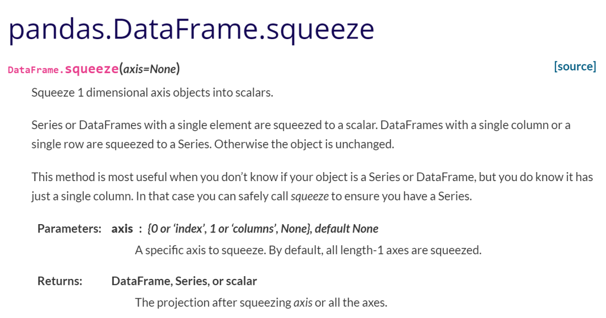

Python Squeeze<br />以这个数据为例。<br /><br />现在要提取`DataFrame`的中`volume`大于100000000的值。
```python
volume = df['Volume']
volume_highest = volume[volume > 100000000]
```
然后，在Jupyter Notebook的代码框里执行`volume_highest`，会看到结果是这样的。<br /><br />这个值前面还是跟着一个序号19，因为此时此刻它是个`Seires`结构，用`type`测试下就可以知道了。<br /><br />但真正的需求是想把这个值赋给一个变量，如果是Seires类型一定会报错的。使用`squeeze`可以非常简单的处理这种情况。像下面这样一下就可以搞定了，可以直接赋给新的变量。
```python
volume_highest_scalar = volume_highest.squeeze()
```
<br />下面是`pandas`官方文档对`squeeze`的介绍。<br /><br />意思就是：

- 具有单个元素的`Series`或`DataFrame`被压缩为标量。
- 具有单列或单行的`DataFrame`被压缩为`Series`。
- 否则，对象不变。

因此，最开始举的例子只是第一种情况。当不知道对象是`Series`还是`DataFrame`，但是知道它只有一列时，`squeeze`方法最有用。在这种情况下，可以安全地调用`squeeze`以确保它变成一个`Series`。
