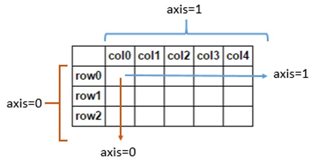
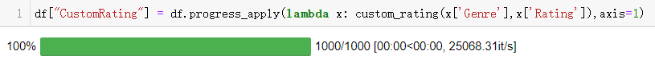

Python Pandas Lambda
<a name="Hbabv"></a>
### 导入模块与读取数据
第一步需要导入模块以及数据集
```python
import pandas as pd

df = pd.read_csv("IMDB-Movie-Data.csv")
df.head()
```
<a name="RJjed"></a>
### 创建新的列
一般是通过在现有两列的基础上进行一些简单的数学运算来创建新的一列，例如
```python
df['AvgRating'] = (df['Rating'] + df['Metascore']/10)/2
```
但是如果要新创建的列是经过相当复杂的计算得来的，那么lambda方法就很多必要被运用到了，先来定义一个函数方法
```python
def custom_rating(genre,rating):
    if 'Thriller' in genre:
        return min(10,rating+1)
    elif 'Comedy' in genre:
        return max(0,rating-1)
    elif 'Drama' in genre:
        return max(5, rating-1)
    else:
        return rating
```
对于不同类别的电影采用了不同方式的评分方法，例如对于“**惊悚片**”，评分的方法则是在“**原来的评分+1**”和10分当中**取一个最小的**，而对于“**喜剧**”类别的电影，则是在0分和“**原来的评分-1**”当中**取一个最大的**，然后通过`apply`方法和`lambda`方法将这个自定义的函数应用在这个`DataFrame`数据集当中
```python
df["CustomRating"] = df.apply(lambda x: custom_rating(x['Genre'], x['Rating']), axis = 1)
```
这里需要说明一下`axis`参数的作用，其中`axis=1`代表跨列而`axis=0`代表跨行，如下图所示<br />
<a name="U0enZ"></a>
### 筛选数据
在pandas当中筛选数据相对来说比较容易，可以用到`&` `|` `~`这些操作符，代码如下
```python
# 单个条件，评分大于5分的
df_gt_5 = df[df['Rating']>5]

# 多个条件: AND - 同时满足评分高于5分并且投票大于100000的
And_df = df[(df['Rating']>5) & (df['Votes']>100000)]

# 多个条件: OR - 满足评分高于5分或者投票大于100000的
Or_df = df[(df['Rating']>5) | (df['Votes']>100000)]

# 多个条件：NOT - 将满足评分高于5分或者投票大于100000的数据排除掉
Not_df = df[~((df['Rating']>5) | (df['Votes']>100000))]
```
这些都是非常简单并且是常见的例子，但是要是想要筛选出电影的影名长度大于5的部分，要是也采用上面的方式就会报错
```python
df[len(df['Title'].split(" "))>=5]
```
output
```python
AttributeError: 'Series' object has no attribute 'split'
```
这里还是采用`apply`和`lambda`相结合，来实现上面的功能
```python
#创建一个新的列来存储每一影片名的长度
df['num_words_title'] = df.apply(lambda x : len(x['Title'].split(" ")),axis=1)

#筛选出影片名长度大于5的部分
new_df = df[df['num_words_title']>=5]
```
当然要是大家觉得上面的方法有点繁琐的话，也可以一步到位
```python
new_df = df[df.apply(lambda x : len(x['Title'].split(" "))>=5,axis=1)]
```
例如想要**筛选出那些影片的票房低于当年平均水平的数据**，可以这么来做。<br />先要对**每年票房的的平均值**做一个归总，代码如下
```python
year_revenue_dict = df.groupby(['Year']).agg({'Revenue(Millions)':np.mean}).to_dict()['Revenue(Millions)']
```
然后定义一个函数来判断**是否存在该影片的票房低于当年平均水平**的情况，返回的是布尔值
```python
def bool_provider(revenue, year):
    return revenue<year_revenue_dict[year]
```
然后通过结合`apply`方法和`lambda`方法应用到数据集当中去
```python
new_df = df[df.apply(lambda x : bool_provider(x['Revenue(Millions)'],
                                              x['Year']),axis=1)]
```
筛选数据的时候，主要是用`.loc`方法，它同时也可以和lambda方法联用，例如想要筛选出**评分在5-8分之间的电影以及它们的票房**，代码如下
```python
df.loc[lambda x: (x["Rating"] > 5) & (x["Rating"] < 8)][["Title", "Revenue (Millions)"]]
```
<a name="YNxtW"></a>
### 转变指定列的数据类型
通常转变指定列的数据类型，都是调用`astype`方法来实现的，例如将“Price”这一列的数据类型**转变成整型**的数据，代码如下
```python
df['Price'].astype('int')
```
会出现如下所示的报错信息
```python
ValueError: invalid literal for int() with base 10: '12,000'
```
因此当出现类似“12,000”的数据的时候，调用`astype`方法实现数据类型转换就会报错，因此还需要将到`apply`和lambda结合进行数据的清洗，代码如下
```python
df['Price'] = df.apply(lambda x: int(x['Price'].replace(',', '')),axis=1)
```
<a name="C6AnD"></a>
### 方法调用过程的可视化
有时候在处理数据集比较大的时候，调用函数方法需要比较长的时间，这个时候就需要有一个要是有一个**进度条**，时时刻刻展示数据处理的进度，就会直观很多了。<br />这里用到的是tqdm模块，将其导入进来
```python
from tqdm import tqdm, tqdm_notebook
tqdm_notebook().pandas()
```
然后将`apply`方法替换成`progress_apply`即可，代码如下
```python
df["CustomRating"] = df.progress_apply(lambda x: custom_rating(x['Genre'],x['Rating']),axis=1)
```
output<br />
<a name="pbJeM"></a>
### 当lambda方法遇到if-else
当然也可以将if-else运用在lambda自定义函数当中，代码如下
```python
Bigger = lambda x, y : x if(x > y) else y
Bigger(2, 10)
```
output
```python
10
```
当然很多时候可能有多组if-else，这样写起来就有点麻烦了，代码如下
```python
df['Rating'].apply(lambda x:"低分电影" if x < 3 else ("中等电影" if x>=3 and x < 5 else("高分电影" if x>=8 else "值得观看")))
```
看上去稍微有点凌乱了，这个时候，这里到还是推荐大家自定义函数，然后通过`apply`和`lambda`方法搭配使用。
