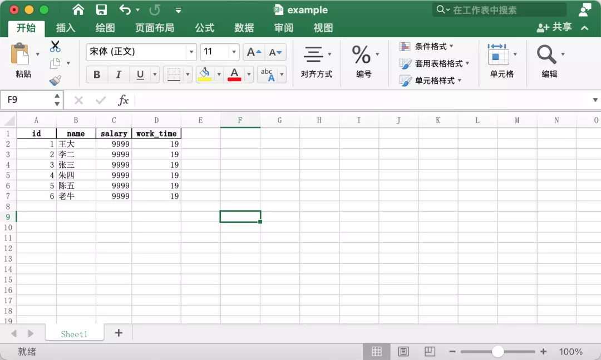
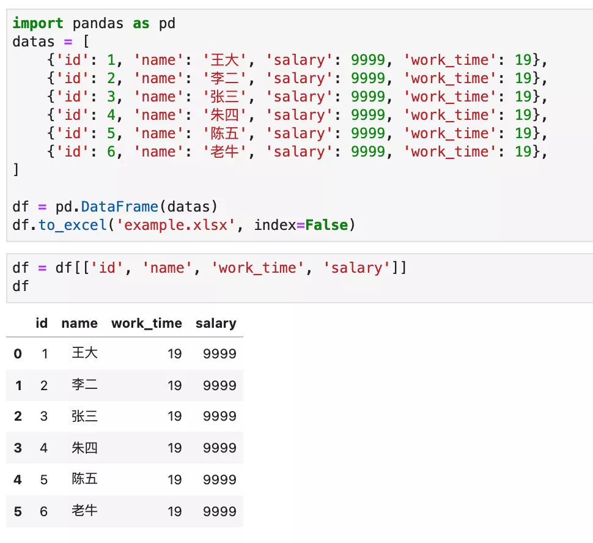
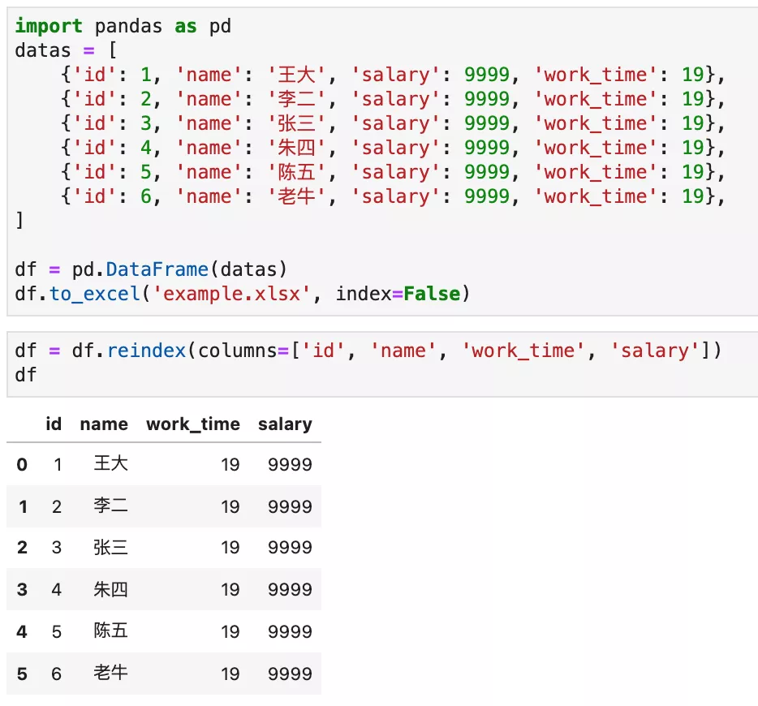

Python Pandas<br />在工作中，经常用到 Excel，有时候会使用 Pandas 生成 Excel。但生成的 Excel 列的顺序可能跟想要的不一样。<br />例如：
```python
import pandas as pd
datas = [
    {'id': 1, 'name': '王大', 'salary': 9999, 'work_time': 19},
    {'id': 2, 'name': '李二', 'salary': 9999, 'work_time': 19},
    {'id': 3, 'name': '张三', 'salary': 9999, 'work_time': 19},
    {'id': 4, 'name': '朱四', 'salary': 9999, 'work_time': 19},
    {'id': 5, 'name': '陈五', 'salary': 9999, 'work_time': 19},
    {'id': 6, 'name': '老牛', 'salary': 9999, 'work_time': 19},
]

df = pd.DataFrame(datas)
df.to_excel('example.xlsx', index=False)
```
运行效果如下图所示：<br /><br />现在在最终生成的 Excel 中，把`work_time`放到`salary`左边。这个时候，有两种方案：<br />方法1，把包含正确列表顺序的列表，传给 DataFrame 对象。
```python
df = df[['id', 'name', 'work_time', 'salary']]
```
运行效果如下图所示：<br /><br />方法2，使用`.reindex()`方法：
```python
df = df.reindex(columns=['id', 'name', 'work_time', 'salary']) 
```
运行效果如下图所示：<br />
