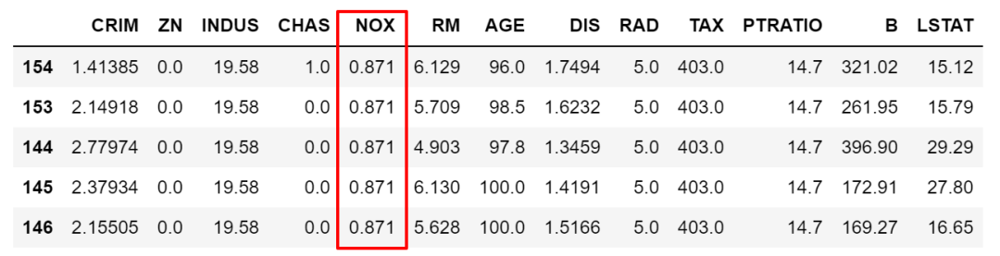

PythonPandas<br />日常用Python做数据分析最常用到的就是查询筛选了，按各种条件、各种维度以及组合挑出想要的数据，以方便分析挖掘。<br />总结了日常查询和筛选常用的种骚操作，供各位学习参考。本文采用sklearn的boston数据举例介绍。
```python
from sklearn import datasets
import pandas as pd

boston = datasets.load_boston()
df = pd.DataFrame(boston.data, columns=boston.feature_names)
```

<a name="IFQ4V"></a>
## 1、`[]`
第一种是最快捷方便的，直接在dataframe的`[]`中写筛选的条件或者组合条件。比如下面，想要筛选出大于`NOX`这变量平均值的所有数据，然后按`NOX`降序排序。
```python
df[df['NOX']>df['NOX'].mean()].sort_values(by='NOX',ascending=False).head()
```
<br />当然，也可以使用组合条件，条件之间使用逻辑符号`&` `|`等。比如下面这个例子除了上面条件外再加上且条件CHAS为1，注意逻辑符号分开的条件要用`()`隔开。
```python
df[(df['NOX']>df['NOX'].mean())& (df['CHAS'] ==1)].sort_values(by='NOX',ascending=False).head()
```

<a name="x5Rdx"></a>
## 2、`loc`/`iloc`
除[]之外，`loc`/`iloc`应该是最常用的两种查询方法了。`loc`按标签值（列名和行索引取值）访问，`iloc`按数字索引访问，均支持单值访问或切片查询。除了可以像[]按条件筛选数据以外，`loc`还可以指定返回的列变量，**从行和列两个维度筛选。**<br />比如下面这个例子，按条件筛选出数据，并筛选出指定变量，然后赋值。
```python
df.loc[(df['NOX']>df['NOX'].mean()),['CHAS']] = 2
```

<a name="x5XnK"></a>
## 3、`isin`
上面筛选条件< > == !=都是个范围，但很多时候是需要锁定某些具体的值的，这时候就需要`isin`了。比如要限定NOX取值只能为0.538,0.713,0.437中时。
```python
df.loc[df['NOX'].isin([0.538,0.713,0.437]),:].sample(5)
```
<br />当然，也可以做取反操作，在筛选条件前加`~`符号即可。
```python
df.loc[~df['NOX'].isin([0.538,0.713,0.437]),:].sample(5)
```

<a name="a46Mt"></a>
## 4、`str.contains`
上面的举例都是**数值大小比较**的筛选条件，除数值以外当然也有**字符串的查询需求**。pandas里实现字符串的模糊筛选，可以用`.str.contains()`来实现，有点像在SQL语句里用的是`like`。<br />下面利用titanic的数据举例，筛选出人名中包含Mrs或者Lily的数据，`|`或逻辑符号在引号内。
```python
train.loc[train['Name'].str.contains('Mrs|Lily'),:].head()
```
<br />`.str.contains()`中还可以设置正则化筛选逻辑。

- `case=True`：使用case指定区分大小写
- `na=True`：就表示把有NAN的转换为布尔值`True`
- `flags=re.IGNORECASE`：标志传递到`re`模块，例如`re.IGNORECASE`
- `regex=True`：`regex` ：如果为`True`，则假定第一个字符串是正则表达式，否则还是字符串
<a name="AwZme"></a>
## 5、`where`/`mask`
在SQL里，`where`的功能是要把满足条件的筛选出来。pandas中`where`也是筛选，但用法稍有不同。<br />`where`接受的条件需要是**布尔类型**的，如果不满足匹配条件，就被赋值为默认的`NaN`或其他指定值。举例如下，将Sex为male当作筛选条件，`cond`就是一列布尔型的Series，非male的值就都被赋值为默认的NaN空值了。
```python
cond = train['Sex'] == 'male'
train['Sex'].where(cond, inplace=True)
train.head()
```
<br />也可以用`other`赋给指定值。
```python
cond = train['Sex'] == 'male'
train['Sex'].where(cond, other='FEMALE', inplace=True)
```
<br />甚至还可以写组合条件。
```python
train['quality'] = ''
traincond1 = train['Sex'] == 'male'
cond2 = train['Age'] > 25

train['quality'].where(cond1 & cond2, other='低质量男性', inplace=True)
```
<br />mask和`where`是一对操作，与`where`正好反过来。
```python
train['quality'].mask(cond1 & cond2, other='低质量男性', inplace=True)
```

<a name="efr2z"></a>
## 6、`query`
这是一种非常优雅的筛选数据方式。所有的筛选操作都在`''`之内完成。
```python
# 常用方式
train[train.Age > 25]
# query方式
train.query('Age > 25')
```
上面的两种方式效果上是一样的。再比如复杂点的，加入上面的`str.contains`用法的组合条件，注意条件里有`''`时，两边要用`""`包住。
```python
train.query("Name.str.contains('William') & Age > 25")
```
<br />在`query`里还可以通过`@`来设定变量。
```python
name = 'William'
train.query("Name.str.contains(@name)")
```
<a name="Y5IWz"></a>
## 7、`filter`
`filter`是另外一个独特的筛选功能。`filter`不筛选具体数据，而是筛选特定的行或列。它支持三种筛选方式：

- `items`：固定列名
- `regex`：正则表达式
- `like`：以及模糊查询
- `axis`：控制是行index或列columns的查询

下面举例介绍下。
```python
train.filter(items=['Age', 'Sex'])
```

```python
train.filter(regex='S', axis=1) # 列名包含S的
```

```python
train.filter(like='2', axis=0) # 索引中有2的
```

```python
train.filter(regex='^2', axis=0).filter(like='S', axis=1)
```

<a name="ZlfJu"></a>
## 8、`any`/`all`
`any`方法意思是，如果至少有一个值为`True`结果便为`True`，`all`需要所有值为`True`结果才为`True`，比如下面这样。
```python
>> train['Cabin'].all()
>> False
>> train['Cabin'].any()
>> True
```
`any`和`all`一般是需要和其它操作配合使用的，比如查看每列的空值情况。
```python
train.isnull().any(axis=0)
```
<br />再比如查看含有空值的行数。
```python
>>> train.isnull().any(axis=1).sum()
>>> 708
```
<a name="nF6nm"></a>
## 参考：
[https://pandas.pydata.org/](https://pandas.pydata.org/)
