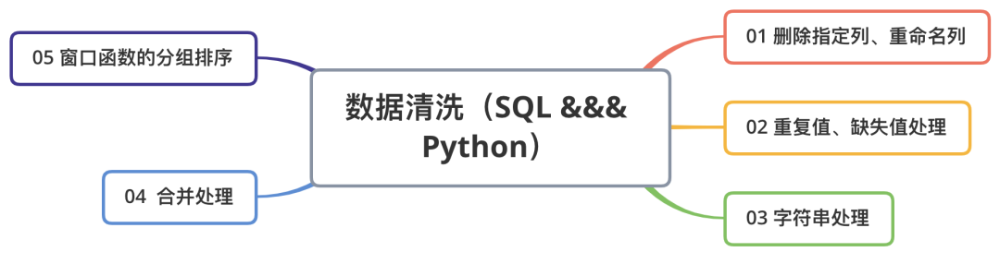
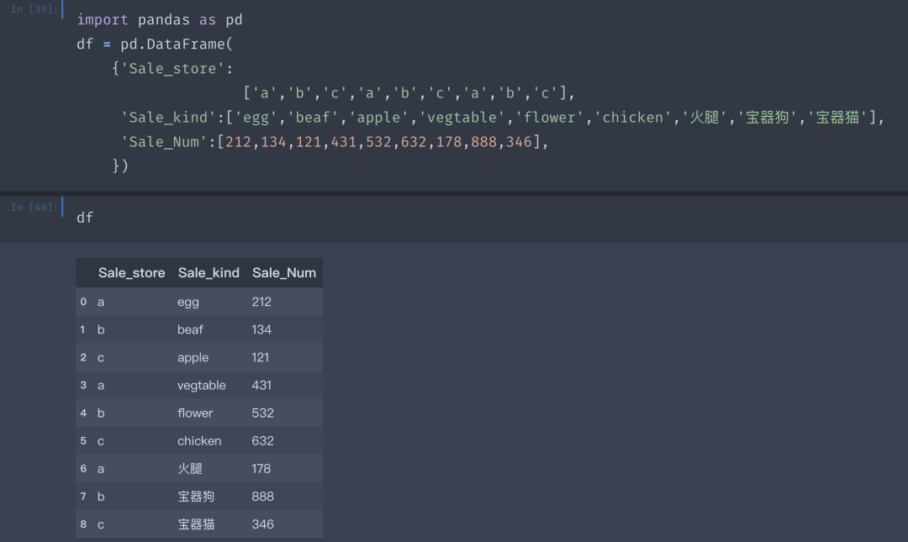
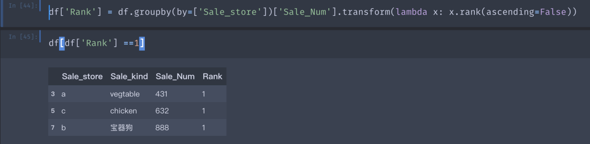

PythonPandas<br />日常工作中，分析师会接到一些专项分析的需求，首先会搜索脑中的分析体悉，根据业务需求构建相应的分析模型（不只是机器学习模型），根据模型填充相应维度表，这些维度特征表能够被使用的前提是假设已经清洗干净了。<br />但真正的原始表是混乱且包含了很多无用的冗余特征，所以能够根据原始数据清洗出相对干净的特征表就很重要。<br />前两天在Towards Data Science上看到一篇文章，讲的是用Pandas做数据清洗，作者将常用的清洗逻辑封装成了一个个的清洗函数。<br />[https://towardsdatascience.com/the-simple-yet-practical-data-cleaning-codes-ad27c4ce0a38](https://towardsdatascience.com/the-simple-yet-practical-data-cleaning-codes-ad27c4ce0a38)<br />而公司的业务数据一般存储在数据仓库里面，数据量很大，这时候用Pandas处理是不大方便的，更多时候用的是HiveSQL和MySql做处理。<br />基于此，拓展了部分内容，写了一个常用数据清洗的SQL对比版，脚本很简单，重点是这些清洗场景和逻辑，大纲如图：<br />
<a name="uAvcx"></a>
## 1、删除指定列、重命名列
**场景**：<br />多数情况并不是底表的所有特征（列）都对分析有用，这个时候就只需要抽取部分列，对于不用的那些列，可以删除。<br />重命名列可以避免有些列的命名过于冗长（比如Case When 语句），且有时候会根据不同的业务指标需求来命名。
<a name="oGQEr"></a>
### 删除列
<a name="N4UUK"></a>
#### 删除列Python版：
```python
df.drop(col_names, axis=1, inplace=True)
```
<a name="Zl6qn"></a>
#### 删除列SQL版：
```sql
select col_names from Table_Name

alter table tableName drop column columnName
```
<a name="VHGNc"></a>
### 重命名列
<a name="HDltI"></a>
#### 重命名列Python版：
```python
df.rename(index={'row1':'A'},columns ={'col1':'B'})
```
<a name="xMbbi"></a>
#### 重命名列SQL版：
```sql
select col_names as col_name_B from Table_Name
```
因为一般情况下是没有删除的权限（可以构建临时表），反向思考，删除的另一个逻辑是选定指定列（Select）。
<a name="ishPC"></a>
## 2、重复值、缺失值处理
**场景**：比如某网站今天来了1000个人访问，但一个人一天中可以访问多次，那数据库中会记录用户访问的多条记录，而这时候如果想要找到今天访问这个网站的1000个人的ID并根据此做用户调研，需要去掉重复值给业务方去回访。<br />缺失值：NULL做运算逻辑时，返回的结果还是NULL，这可能就会出现一些脚本运行正确，但结果不对的BUG，此时需要将NULL值填充为指定值。
<a name="SVfpk"></a>
### 重复值处理
<a name="rEA8w"></a>
#### 重复值处理Python版：
```python
df.drop_duplicates()
```
<a name="h4Wok"></a>
#### 重复值处理SQL版：
```sql
select distinct col_name from Table_Name

select col_name from Table_Name group bycol_name
```
<a name="I3hae"></a>
### 缺失值处理
<a name="scJzr"></a>
#### 缺失值处理Python版：
```python
df.fillna(value = 0)

df1.combine_first(df2)
```
<a name="LMpcT"></a>
#### 缺失值处理SQL版：
```sql
select ifnull(col_name,0) value from Table_Name

select coalesce(col_name,col_name_A,0) as value from Table_Name

select case when col_name is null then 0 else col_name end from Table_Name
```
<a name="sV9IA"></a>
## 3、替换字符串空格、清洗*%@等垃圾字符、字符串拼接、分隔等字符串处理
**场景**：理解用户行为的重要一项是去假设用户的心理，这会用到用户的反馈意见或一些用研的文本数据，这些文本数据一般会以字符串的形式存储在数据库中，但用户反馈的这些文本一般都会很乱，所以需要从这些脏乱的字符串中提取有用信息，就会需要用到文字符串处理函数。
<a name="xOI9x"></a>
### 字符串处理Python版：
```python
## 1、空格处理
df[col_name] = df[col_name].str.lstrip() 

## 2、*%d等垃圾符处理
df[col_name].replace(' &#.*', '', regex=True, inplace=True)

## 3、字符串分割
df[col_name].str.split('分割符')

## 4、字符串拼接
df[col_name].str.cat()
```
<a name="Awrpz"></a>
### 字符串处理SQL版：
```sql
## 1、空格处理
select ltrim(col_name) from Table_name 

## 2、*%d等垃圾符处理
select regexp_replace(col_name,正则表达式) from Table_name 

## 3、字符串分割
select split(col_name,'分割符') from Table_name 

## 4、字符串拼接
select concat_ws(col_name,'拼接符') from Table_name 
```
<a name="uVHJ6"></a>
## 4、合并处理
**场景**：有时候需要的特征存储在不同的表里，为便于清洗理解和操作，需要按照某些字段对这些表的数据进行合并组合成一张新的表，这样就会用到连接等方法。
<a name="IJZHr"></a>
### 合并处理Python版：
<a name="mZaxe"></a>
#### 左右合并
```python
pd.merge(left, right, how='inner', on=None, left_on=None, right_on=None,
           left_index=False, right_index=False, sort=True,
           suffixes=('_x', '_y'), copy=True, indicator=False,
           validate=None)
pd.concat([df1,df2])
```
<a name="fLc0i"></a>
#### 上下合并
```python
df1.append(df2, ignore_index=True, sort=False)
```
<a name="iahcG"></a>
### 合并处理SQL版：
<a name="WcC8q"></a>
#### 左右合并
```sql
select A.*,B.* from Table_a A join Table_b B on A.id = B.id

select A.* from Table_a A left join Table_b B on A.id = B.id
```
<a name="Mh0Bp"></a>
#### 上下合并
```sql
-- Union：对两个结果集进行并集操作，不包括重复行，同时进行默认规则的排序；
-- Union All：对两个结果集进行并集操作，包括重复行，不进行排序；

select A.* from Table_a A 
union
select B.* from Table_b B 

-- Union 因为会将各查询子集的记录做比较，故比起Union All ，通常速度都会慢上许多。一般来说，如果使用Union All能满足要求的话，务必使用Union All。 
```
<a name="VBTxT"></a>
## 5、窗口函数的分组排序
**场景**：假如现在你是某宝的分析师，要分析今年不同店的不同品类销售量情况，需要找到那些销量较好的品类，并在第二年中加大曝光，这个时候你就需要将不同店里不同品类进行分组，并且按销量进行排序，以便查找到每家店销售较好的品类。<br /><br />Demo数据如上，一共a,b,c三家店铺，卖了不同品类商品，销量对应如上，要找到每家店卖的最多的商品。
<a name="UUs1h"></a>
### 窗口分组Python版：
```python
df['Rank'] = df.groupby(by=['Sale_store'])['Sale_Num'].transform(lambda x: x.rank(ascending=False))
```
<a name="NMyz2"></a>
### 窗口分组SQL版：
```sql
select 
* 
from
(
  Select 
  *，
  row_number() over(partition by Sale_store order by Sale_Num desc) rk
  from 
  table_name
) b where b.rk = 1
```
<br />可以很清晰的看到，a店铺卖的最火的是蔬菜，c店铺卖的最火的是鸡肉，b店铺？<br />b店铺很不错，卖了888份宝器狗。<br />总结，上面的内容核心是掌握这些数据清洗的应用场景，这些场景几乎可以涵盖90%的数据分析前数据清洗的内容。而对于分析模型来说，SQL和Python都是工具，如果熟悉SQL，是能够更快速、方便的将特征清洗用SQL实现。
