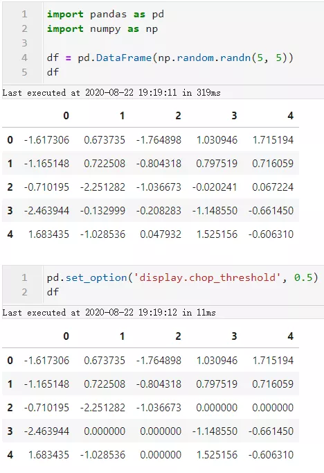

Pandas 在日常使用pandas的过程中，由于所分析的数据表规模、格式上的差异，使得同样的函数或方法作用在不同数据上的效果存在差异。 而pandas有着自己的一套「参数设置系统」，可以在遇到不同的数据时灵活调节从而达到最好的效果。

### 1、设置DataFrame最大显示行数
pandas设置参数中的`display.max_rows`用于控制打印出的数据框的最大显示行数，使用`pd.set_option()`来有针对的设置参数，如下面的例子：  在修改`display.max_rows`的参数值之后，数据框只会显示指定行数的数据，中间的部分都会以省略号的形式显示，当数据框行数较多，可以加大这个参数以显示更多行数据。

### 2、设置DataFrame最大显示列数
类似`display.max_rows`，通过修改`display.max_columns`可以调节最大显示的数据框列数（默认是20列），这在数据框字段较多又想全部查看的时候很有用： 

### 3、设置每列的最大显示宽度
对于一些单元格内容长度较长的数据譬如长文本，在查看数据框时过长的部分会被简化为省略号，而通过修改`display.max_colwidth`参数可以在必要时，使得超长的部分也显示出来： 

### 4、指定小于某个数的元素显示为0
通过`display.chop_threshold`参数在不修改原始数据的情况下，指定数据框中绝对值小于阈值的数显示为0： 

### 5、格式化浮点数
通过`display.float_format`参数可以设置浮点数的显示格式，譬如这里给浮点数加上￥前缀并设定保留两位小数： 

### 6、设置`info()`方法中非缺失值检查的行数上限
针对数据框的`info()`方法可以查看数据框的一些概览信息，譬如每一列对应的非缺失值个数。 但默认情况下当数据框行数大于1690784行时，再查看`info()`信息，会处于计算效率的考虑略去缺失值检查信息。 这时可以通过设置`display.max_info_rows`参数来提高这个上限： 

### 7、控制小数打印的精度
控制数据框中小数的显示精度除了上文提到的方法之外，还可以通过修改`display.precision`参数来控制，默认是6位小数： 

### 8、临时修改参数
有些时候只希望在某张表上进行设置参数的修改，不希望影响到之后的其他表的显示。 这时除了用`pd.reset_option()`对指定的参数进行复原之外，还可以利用`with`关键词配合`pd.option_context`以临时的方式将指定的参数作用在局部范围内： 
