PythonPandas<br />平常在工作学习当中，需要处理的数据集是十分复杂的，数据集当中的索引也是有多个层级的，分享一下DataFrame数据集当中的分层索引问题。
<a name="df3Q7"></a>
## 什么是多重/分层索引
多重/分层索引(MultiIndex)可以理解为堆叠的一种索引结构，它的存在为一些相当复杂的数据分析和操作打开了大门，尤其是在处理高纬度数据的时候就显得十分地便利，首先来创建带有多重索引的DataFrame数据集
<a name="kbb5I"></a>
## 多重索引的创建
首先在“列”方向上创建多重索引，即在调用`columns`参数时传递两个或者更多的数组，代码如下
```python
df1 = pd.DataFrame(np.random.randint(0, 100, size=(2, 4)),
                   index= ['ladies', 'gentlemen'],
                   columns=[['English', 'English', 'French', 'French'],
                            ['like', 'dislike', 'like', 'dislike']])
```
output<br />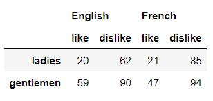<br />那么同理想要在“行”方向上存在多重索引，则是在调用`index`参数的时候传递两个或者更多数组即可，代码如下
```python
df = pd.DataFrame(np.random.randint(0, 100, size=(4, 2)),
                   index= [['English','', 'Chinese',''],
                           ['like','dislike','like','dislike']],
                   columns=['ladies', 'gentlemen'])
```
output<br />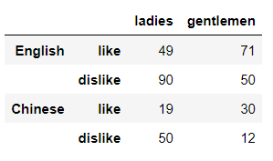<br />除此之外，还有其他几种常见的方式来创建多重索引，分别是

- `pd.MultiIndex.from_arrays`
- `pd.MultiIndex.from_frame`
- `pd.MultiIndex.from_tuples`
- `pd.MultiIndex.from_product`

这里就挑其中的一种来为大家演示如何来创建多重索引，代码如下
```python
df2 = pd.DataFrame(np.random.randint(0, 100, size=(4, 2)), 
                   columns= ['ladies', 'gentlemen'],
                   index=pd.MultiIndex.from_product([['English','French'],
                                                    ['like','dislike']]))
```
output<br />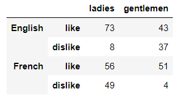
<a name="MLrA0"></a>
## 获取多重索引的值
接下来看一下怎么获取带有多重索引的数据集当中的数据，使用到的数据集是英国三大主要城市伦敦、剑桥和牛津在2019年全天的气候数据，如下所示
```python
import pandas as pd
from pandas import IndexSlice as idx 

df = pd.read_csv('dataset.csv',
    index_col=[0,1],
    header=[0,1]
)
df = df.sort_index()
df
```
output<br />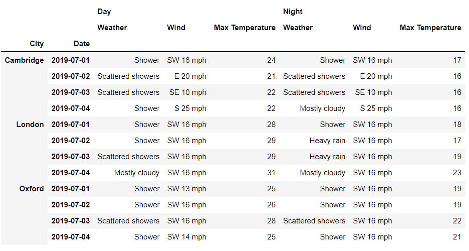<br />在“行”索引上，可以看到是“城市”以及“日期”这两个维度，而在“列”索引上，看到的是则是“不同时间段”以及一些“气温”等指标，首先来看一下“列”方向多重索引的层级，代码如下
```python
df.columns.levels
```
output
```python
FrozenList([['Day', 'Night'], ['Max Temperature', 'Weather', 'Wind']])
```
想要获取第一层级上面的索引值，代码如下
```python
df.columns.get_level_values(0)
```
output
```python
Index(['Day', 'Day', 'Day', 'Night', 'Night', 'Night'], dtype='object')
```
那么同理，第二层级的索引值，只是把当中的0替换成1即可，代码如下
```python
df.columns.get_level_values(1)
```
output
```python
Index(['Weather', 'Wind', 'Max Temperature', 'Weather', 'Wind',
       'Max Temperature'],
      dtype='object')
```
那么在“行”方向上多重索引值的获取也是一样的道理，这里就不多加以赘述了
<a name="xzcIb"></a>
## 数据的获取
那么涉及到数据的获取，方式也有很多种，最常用的就是`loc()`方法以及`iloc()`方法了，例如
```python
df.loc['London' , 'Day']
## 或者是
df.loc[('London', ) , ('Day', )]
```
output<br />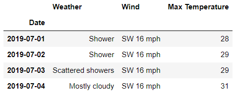<br />通过调用`loc()`方法来获取第一层级上的数据，要是想要获取所有“行”的数据，代码如下
```python
df.loc[:, 'Day']
## 或者是
df.loc[:, ('Day',)]
```
output<br />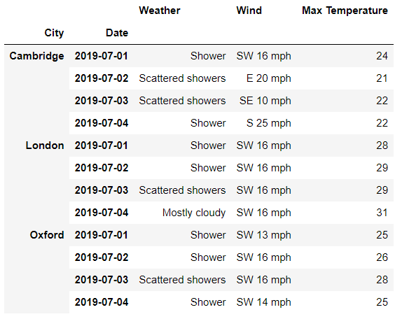<br />或者是所有“列”的数据，代码如下
```python
df.loc['London' , :]
## 或者是
df.loc[('London', ) , :]
```
output<br />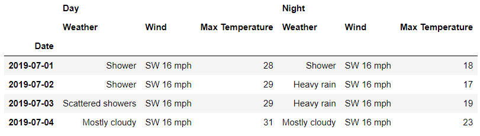<br />当然也可以这么来做，在行方向上指定第二层级上的索引，代码如下
```python
df.loc['London' , '2019-07-02']
## 或者是
df.loc[('London' , '2019-07-02')]
```
output<br />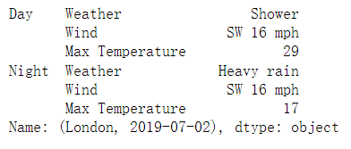
<a name="jjkXa"></a>
### 多重索引的数据获取
假设想要获取剑桥在2019年7月3日白天的数据，代码如下
```python
df.loc['Cambridge', 'Day'].loc['2019-07-03']
```
output<br />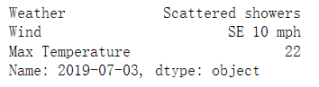<br />在第一次调用`loc['Cambridge', 'Day']`的时候返回的是DataFrame数据集，然后再通过调用`loc()`方法来提取数据，当然这里还有更加快捷的方法，代码如下
```python
df.loc[('Cambridge', '2019-07-01'), 'Day']
```
需要传入元组的形式的索引值来进行数据的提取。要是不只是想要获取单行或者是单列的数据，可以这么来操作
```python
df.loc[ 
	('Cambridge' , ['2019-07-01','2019-07-02'] ) ,
	'Day'
]
```
output<br />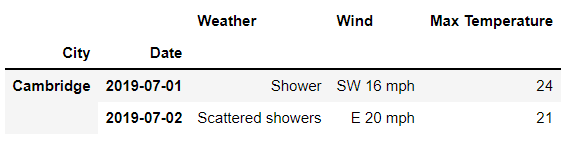<br />或者是获取多列的数据，代码如下
```python
df.loc[ 
    'Cambridge' ,
    ('Day', ['Weather', 'Wind'])
]
```
output<br />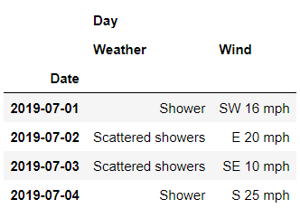<br />要是想要获取剑桥在2019年7月1日到3日，连续3天的白天气候数据，代码如下
```python
df.loc[
    ('Cambridge', '2019-07-01': '2019-07-03'),
    'Day'
]
```
output<br />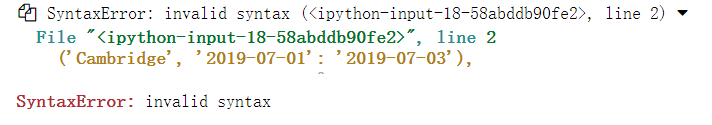<br />这么来写是会报语法错误的，正确的方法应该是这么来做，
```python
df.loc[
    ('Cambridge','2019-07-01'):('London','2019-07-03'),
    'Day'
]
```
<a name="MtXKc"></a>
### `xs()`方法的调用
另外推荐`xs()`方法来指定多重索引中的层级，例如只想要2019年7月1日各大城市的数据，代码如下
```python
df.xs('2019-07-01', level='Date')
```
output<br />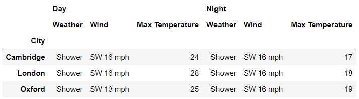<br />还能够接受多个维度的索引，例如想要获取伦敦在2019年7月4日的全天数据，代码如下
```python
df.xs(('London', '2019-07-04'), level=['City','Date'])
```
output<br />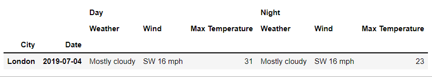<br />另外还有`axis`参数来指定是获取“列”方向还是“行”方向上的数据，例如想要获取“Weather”这一列的数据，代码如下
```python
df.xs('Weather', level=1, axis=1)
```
output<br />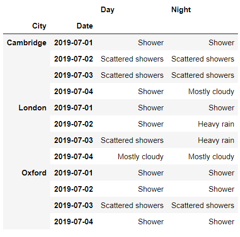<br />当中的`level`参数代表的是层级，将其替换成0，看一下出来的结果
```python
df.xs('Day', level=0, axis=1)
```
output<br />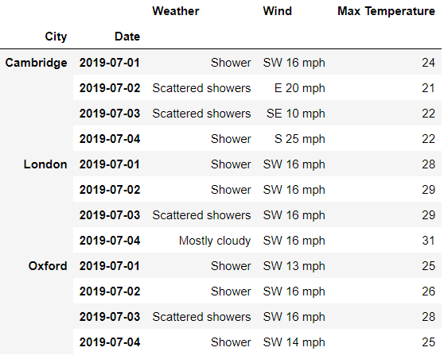<br />筛选出来的是三个主要城市2019年白天的气候数据
<a name="WNg9Y"></a>
### `IndexSlice()`方法的调用
同时Pandas内部也提供了`IndexSlice()`方法来方便更加快捷地提取出多重索引数据集中的数据，代码如下
```python
from pandas import IndexSlice as idx
df.loc[ 
    idx[: , '2019-07-04'], 
    'Day'
]
```
output<br />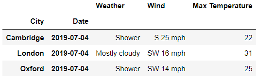<br />同时可以指定行以及列方向上的索引来进行数据的提取，代码如下
```python
rows = idx[: , '2019-07-02']
cols = idx['Day' , ['Max Temperature','Weather']]
df.loc[rows, cols]
```
output<br />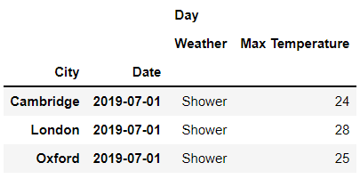
