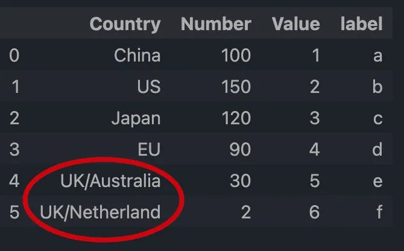
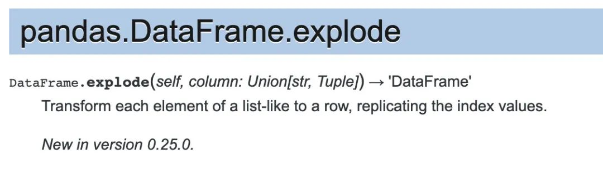
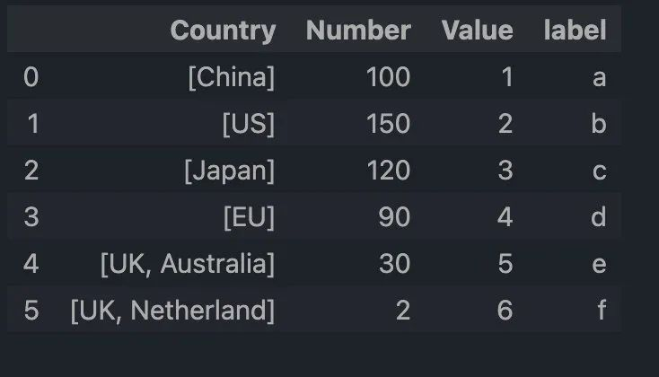
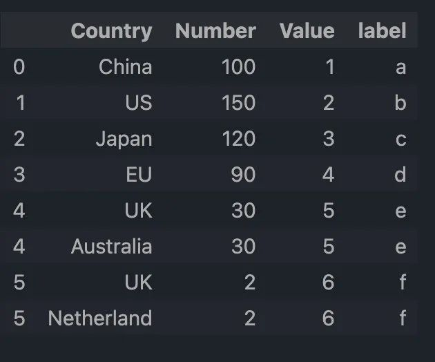

Python Pandas <br />在 Pandas 版本 0.25版本之后，pandas 提供了 `explode` 方法来处理这种数据情况。<br />因此，今天来介绍下 `explode` 方法的使用，同时也放上以前的处理方法，大家可以对比下。<br />三种方法：

- Method 1 （explode）
- Method 2
- Method 3
<a name="SzUaK"></a>
## 1、数据背景
在数据处理过程中，经常会遇到以下类型的数据：<br /><br />在同一列中，本该分别填入多行中的数据，被填在一行里了，然而在分析的时候，需要拆分成为多行。<br />在上图中，列名为 "Country" ，index 为 4 和 5 的单元格内，值为 UK/Australia 和 UK/Netherland 。<br />介绍将含有多值的内容分拆成多行的几种方法。加载数据如下：
```python
import pandas as pd

df = pd.DataFrame({'Country':['China','US','Japan','EU','UK/Australia', 'UK/Netherland'],
               'Number':[100, 150, 120, 90, 30, 2],
               'Value': [1, 2, 3, 4, 5, 6],
               'label': list('abcdef')})
df

Out[2]:
         Country  Number  Value label
0          China     100      1     a
1             US     150      2     b
2          Japan     120      3     c
3             EU      90      4     d
4   UK/Australia      30      5     e
5  UK/Netherland       2      6     f
```
<a name="Q8dqm"></a>
## 2、Method-1
Method-1 主要是使用 pandas 的 `explode` 方法来处理。<br /><br />根据 pandas 官方文档的介绍，`explode` 方法主要可以列表类似的情况拆分为多行。<br />列表类似(list-like)，指的是列表、元组、Series 和 numpy 的 ndarray 等类型。<br />需要注意的是，文字类型的文本类型(str) 是不可以直接用该方法进行处理的。<br />而上面的数据，比如 UK/Netherland ，则不是 list-like 的数据。<br />因此，在使用 `explode` 方法之前，可以先使用 `str.split()` 方法将文本转换为列表，如下：
```python
df['Country'] = df['Country'].str.split('/')
df
```
结果如下：<br /><br />现在， Country 已经是列表类似的情况了，下一步可以使用 `explode` 方法来处理，如下：
```python
df.explode('Country')
```
结果如下：<br />
<a name="yZ77T"></a>
## 3、Method-2
在早期的 Pandas 版本中，需要分多个步骤来处理这种情况，如下：

1. 将含有多值的列进行拆分，然后通过`stack()`方法进行变换，并通过index的设置来完成
2. 用`drop()`方法从DataFrame中删除含有多值的列
3. 然后用`join()`方法来合并
```python
df.drop('Country', axis=1).join(df['Country'].str.split('/', expand=True).stack().reset_index(level=1, drop=True).rename('Country'))
Out[3]:
   Number  Value label     Country
0     100      1     a       China
1     150      2     b          US
2     120      3     c       Japan
3      90      4     d          EU
4      30      5     e          UK
4      30      5     e   Australia
5       2      6     f          UK
5       2      6     f  Netherland
```
过程分步介绍
```python
df['Country'].str.split('/', expand=True).stack()
Out[4]:
0  0         China
1  0            US
2  0         Japan
3  0            EU
4  0            UK
   1     Australia
5  0            UK
   1    Netherland
dtype: object

df['Country'].str.split('/', expand=True).stack().reset_index(level=1, drop=True)
Out[5]:
0         China
1            US
2         Japan
3            EU
4            UK
4     Australia
5            UK
5    Netherland
dtype: object

df['Country'].str.split('/', expand=True).stack().reset_index(level=1, drop=True).rename('Country')
Out[6]:
0         China
1            US
2         Japan
3            EU
4            UK
4     Australia
5            UK
5    Netherland
Name: Country, dtype: object

df.drop('Country', axis=1)
Out[7]:
   Number  Value label
0     100      1     a
1     150      2     b
2     120      3     c
3      90      4     d
4      30      5     e
5       2      6     f
```
<a name="OJj9U"></a>
## 4、Method-3
该方法的思路跟Method-2基本是一样的，只是在具体的细节方面有些差异。代码如下：
```python
df['Country'].str.split('/', expand=True).stack().reset_index(level=0).set_index('level_0').rename(columns={0:'Country'}).join(df.drop('Country', axis=1))
Out[8]:
      Country  Number  Value label
0       China     100      1     a
1          US     150      2     b
2       Japan     120      3     c
3          EU      90      4     d
4          UK      30      5     e
4   Australia      30      5     e
5          UK       2      6     f
5  Netherland       2      6     f
```
过程分步介绍如下：
```python
df['Country'].str.split('/', expand=True).stack().reset_index(level=0)
Out[9]:
   level_0           0
0        0       China
0        1          US
0        2       Japan
0        3          EU
0        4          UK
1        4   Australia
0        5          UK
1        5  Netherland

df['Country'].str.split('/', expand=True).stack().reset_index(level=0).set_index('level_0')
Out[10]:
                  0
level_0            
0             China
1                US
2             Japan
3                EU
4                UK
4         Australia
5                UK
5        Netherland

df['Country'].str.split('/', expand=True).stack().reset_index(level=0).set_index('level_0').rename(columns={0:'Country'})
Out[11]:
            Country
level_0            
0             China
1                US
2             Japan
3                EU
4                UK
4         Australia
5                UK
5        Netherland

df.drop('Country', axis=1)
Out[12]:
   Number  Value label
0     100      1     a
1     150      2     b
2     120      3     c
3      90      4     d
4      30      5     e
5       2      6     f
```
<a name="YOTX6"></a>
## 5、小结
在 pandas 的 `explode` 方法出现以后，遇到类似的情形，建议优先考虑该方法。<br />`explode` 方法是将 list-like 的数据拆分为多行，还有时候，是需要将这些数据拆分为多列的。
