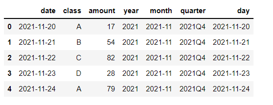

PythonPandas
<a name="hQo3p"></a>
### 创建数据集
首先先来创建一个数据集，代码如下
```python
import numpy as np
import pandas as pd
df = pd.DataFrame({
   "date": pd.date_range(start="2021-11-20", periods=100, freq="D"),
   "class": ["A","B","C","D"] * 25,
   "amount": np.random.randint(10, 100, size=100)
})
df.head()
```
output<br />
<a name="i6Hn3"></a>
### To_period
当在处理日期数据时，有时候需要提取出月份的数据，有时候需要的是季度的数据，这里就可以通过`to_period()`方法来实现了，代码如下
```python
df["year"] = df["date"].dt.to_period("Y")
df["month"] = df["date"].dt.to_period("M")
df["day"] = df["date"].dt.to_period("D")
df["quarter"] = df["date"].dt.to_period("Q")
df.head()
```
output<br /><br />在此基础之上，可以进一步对数据进行分析，例如
```python
df["month"].value_counts()
```
output<br /><br />想要筛选出“2021-12”该时段的数据，代码如下
```python
df[df['month'] == "2021-12"].head()
```
output<br />
<a name="Tecqo"></a>
### 生成假数据
在建模、训练模型的时候，需要用到大量的数据集，然鹅很多时候会遇到数据量不够的情况，小编之前写过一篇相关的教程，使用Python中的faker模块或者通过一些深度学习的模型来生成假数据<br />pandas模块中也有一些相关的方法来解决数据量不够的问题，代码如下
```python
pd.util.testing.makeDataFrame()
```
output<br /><br />默认生成的假数据是30行4列的，当然也可以指定生成数据的行数和列数，代码如下
```python
pd.util.testing.makeCustomDataframe(nrows=1000, ncols=5)
```

output<br /><br />要是希望创建的数据集当中存在的缺失值，调用的则是`makeMissingDataframe()`方法
```python
pd.util.testing.makeMissingDataframe()
```
output<br /><br />要是希望创建的数据集包含了整型、浮点型以及时间日期等其他类型的数据，调用的是`makeMixedDataFrame()`方法
```python
pd.util.testing.makeMixedDataFrame()
```
output<br />
<a name="eIPmJ"></a>
### 将数据集导出至压缩包中
众多周知，可以轻松地将数据集导出至csv文件、json格式的文件等等，但是有时候想要节省存储的资源，例如在文件的传送过程当中，想将其导出至压缩包当中，代码如下
```python
df = pd.util.testing.makeCustomDataframe(nrows=1000, ncols=5)
df.shape
```
output
```python
(1000, 5)
```
先将其存储成csv格式的文件，看一下文件的大小，结果大概是占到了45KB的存储，代码如下
```python
import os
os.path.getsize("sample.csv")/1024
```
output
```python
44
```
要是最后导出至压缩包当中呢，看一下文件的大小有多少？代码如下
```python
df.to_csv('sample.csv.gz', compression='gzip')
os.path.getsize('sample.csv.gz')/1024
```
output
```python
14
```
结果只占到了13KB的空间大小，大概是前者的三分之一吧，当然pandas还能够直接读取压缩包变成DataFrame数据集，代码如下
```python
df = pd.read_csv('sample.csv.gz', compression='gzip', index_col=0)
df.head()
```
output<br />
<a name="Ol5oI"></a>
### 一行代码让Pandas提速
很多时候想要通过pandas中的`apply()`方法将自定义函数或者是一些内部自带的函数应用到DataFrame每一行的数据当中，如果行数非常多的话，处理起来会非常地耗时间，这里使用的是swifter可以自动使`apply()`方法的运行速度达到最快，并且只需要一行代码即可，例如
```python
import swifter
 
df.swifter.apply(lambda x: x.max() - x.mean())
```
当然使用前，需要先前下载该模块，使用pip命令
```bash
pip install swifter
```
