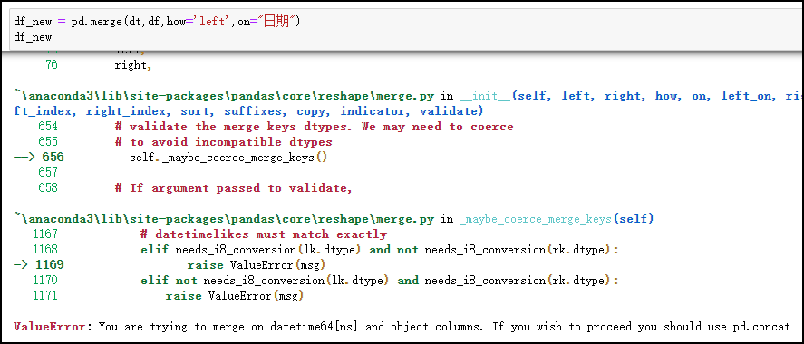

Python Pandas<br />因业务需要，每周需要统计每天提交资源数量，但提交时间不定，可能会有某一天或者某几天没有提，那么如何将没有数据的日期也填充进去呢？<br /><br />如上图所示，就缺少2021-09-04、2021-09-05、2021-09-08三天的数据，需要增加其记录并设置提交量为0。
<a name="C4IgF"></a>
### 实战
刚开始用的是比较笨的方法，直接复制到Excel，手动将日期往下偏移，差哪天补哪天，次数多了就累了，如果需要一个月、一个季度、一年的数据呢？这样一个一个手动偏移，还没开始淦就已经被吓趴下了~<br />所以有没有什么方法可以补上日期。<br /><br />这样不就可以出来想要的结果了吗~先来填充一个日期序列了来~
```python
# 习惯性导入包
import pandas as pd
import numpy as np
import time,datetime

# 填充日期序列
dt = pd.DataFrame(pd.date_range("2021-9-3", periods=7,freq='D')) 
dt.columns = ["日期"] 
dt
```
<br />接着就开始导入有提交数据的表。
```python
df = pd.read_excel("提交表.xlsx")
df
```
<br />dt表出来了，提交表df也出来，想要实现目的，直接左连接即可。
```python
df_new = pd.merge(dt,df,how='left',on="日期")
df_new
```
结果，报错了<br /><br />果然，df的日期格式是object类型，而dt是日期格式~<br />所以，要把df的日期也改成对应的格式才能join。
<a name="tgTuk"></a>
### 解决问题
<a name="pJXah"></a>
#### 如何将series 的object类型的日期改成日期格式呢？
将`infer_datetime_format`这个参数设置为True 就可以了，Pandas将会尝试转换为日期类型。<br />具体语法如下所示：
```python
df["日期"] = pd.to_datetime(df["日期"], infer_datetime_format=True)
```
另外，设置`errors 参数为 ='coerce'`。Pandas会遇到不能转换的数据就会赋值为NaN，但这个方法并不太适用于这个需求。
```python
df_new = pd.merge(dt, df, how='left', on="日期")
df_new
```
<br />看NaN有点不舒服，可以设置为0，这样就看着顺眼了
```python
df_new['搜狗提交量']=df_new['搜狗提交量'].fillna(0)
df_new
```
<br />这样就可以完成了。
