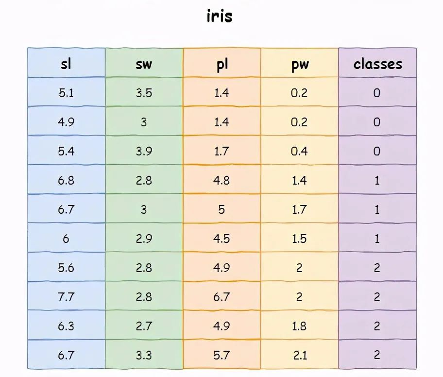
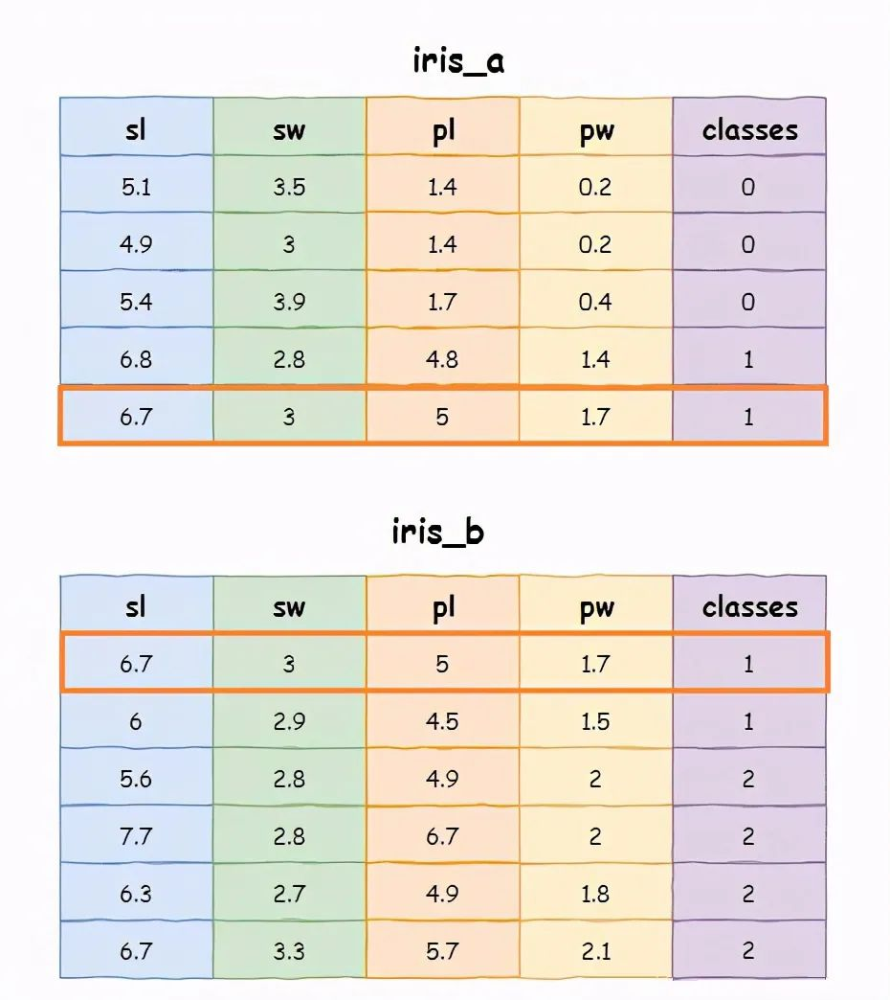
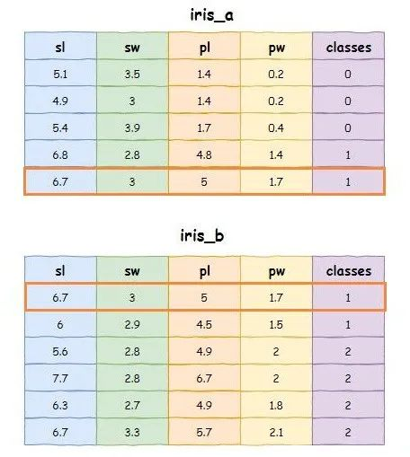

Python Pandas<br />相对于学习Pandas各种数据筛选操作，SQL语法显得更加简洁清晰，若能够将SQL语法与Pandas中对应的函数的使用方法关联起来，对于应用Pandas进行数据筛选来讲无疑是一个福音。<br />本文通过Pandas实现SQL语法中条件过滤、排序、关联、合并、更新、删除等简单及复杂操作，使得对方法的理解更加深刻，更加得心应手。
<a name="VKtgZ"></a>
## 演示数据集
采用安德森鸢尾花卉(iris)数据集进行演示，iris数据集包含150个样本，对应数据集的每行数据。每行数据包含每个样本的四个特征和样本的类别信息，因此iris数据集是一个150行*5列的二维表。<br />可以 UCI Iris dataset 获取或者使用 `from sklearn.datasets import load_iris` 方式获取，为了演示方便只取其中10行数据，如下：<br /><br />接下来，就一起学习一下，如何Pandas实现SQL语法中条件过滤、排序、关联、合并、更新、删除等数据查询操作。
<a name="sxufc"></a>
## 字段查询 SELECT
```sql
SELECT sl, sw, pl, pw FROM iris LIMIT 2;
```
如上SQL实现返回每行记录的 sl,sw,pl,pw 字段，仅返回2行记录。使用Pandas实现如上SQL的功能，代码如下：
```python
import pandas as pd

iris = pd.read_excel(io="iris.xlsx",
              sheet_name='iris',
              usecols=["sl", "sw", "pl", "pw", "classes"])

search = iris[["sl", "sw", "pl", "pw"]].head(2)
print(search)

# 执行上述代码，输出结果为：
    sl   sw   pl   pw
0  5.1  3.5  1.4  0.2
1  4.9  3.0  1.4  0.2
```
<a name="PDCoF"></a>
## 简单的条件过滤查询 `WHERE`
```sql
SELECT * FROM iris WHERE classes = 1 LIMIT 2;
```
如上SQL实现了查询满足`classes=1`的记录，并返回2行。使用Pandas实现该SQL，代码如下：
```python
import pandas as pd

iris = pd.read_excel(io="iris.xlsx",
              sheet_name='iris',
              usecols=["sl", "sw", "pl", "pw", "classes"])

search = iris[iris["classes"]==1].head(2)
print(search)

# 执行上述代码，输出结果为：
    sl   sw   pl   pw  classes
3  6.8  2.8  4.8  1.4        1
4  6.7  3.0  5.0  1.7        1
```
<a name="y63Xb"></a>
## 多条件的与或过滤查询 `WHERE AND I OR`
<a name="kw9BP"></a>
### 与关系 `&`
```sql
SELECT * FROM iris WHERE classes = 1 AND pl >= 5 LIMIT 2;
```
如上SQL实现查询同时满足classes=1 和 pl >=5 两个条件的记录，并返回2行。使用Pandas实现该SQL，代码如下：
```python
import pandas as pd

iris = pd.read_excel(io="iris.xlsx",
                     sheet_name='iris',
                     usecols=["sl", "sw", "pl", "pw", "classes"])

search = iris[
    (iris["classes"] == 1) &
              (iris["pl"] >= 5)
              ].head(2)
print(search)

# 执行上述代码，输出结果为：
    sl   sw   pl   pw  classes
4  6.7  3.0  5.0  1.7        1
```
<a name="ffFuj"></a>
### 或关系 `|`
```sql
SELECT * FROM iris WHERE sl >= 5 OR pl >=5 LIMIT 2;
```
如上SQL实现查询满足 sl >=5 或者 pl >=5 任一条件的记录，返回2行。使用Pandas实现该SQL，代码如下：
```python
import pandas as pd

iris = pd.read_excel(io="iris.xlsx",
                     sheet_name='iris',
                     usecols=["sl", "sw", "pl", "pw", "classes"])

search = iris[
    (iris["sl"] >= 5) |
              (iris["pl"] >= 5)
              ].head(2)
print(search)

# 执行上述代码，输出结果为：
    sl   sw   pl   pw  classes
0  5.1  3.5  1.4  0.2        0
2  5.4  3.9  1.7  0.4        0
```
<a name="zL6A3"></a>
## 条件过滤 空值判断
<a name="tmUJJ"></a>
### 空判断 `is null`
```sql
SELECT * FROM iris WHERE sl IS NULL;
```
如上SQL实现查询 sl 字段为NULL的记录，使用Pandas实现该SQL，代码如下：
```python
import pandas as pd

iris = pd.read_excel(io="iris.xlsx",
                     sheet_name='iris',
                     usecols=["sl", "sw", "pl", "pw", "classes"])

search = iris[iris["sl"].isna()]
print(search)
```
<a name="AkKKn"></a>
### 非空判断 `is not null`
```sql
SELECT * FROM iris WHERE sl IS NOT NULL;
```
如上SQL实现查询sl字段不为 NULL 的记录。使用Pandas实现该SQL，代码如下：
```python
import pandas as pd

iris = pd.read_excel(io="iris.xlsx",
                     sheet_name='iris',
                     usecols=["sl", "sw", "pl", "pw", "classes"])

search = iris[iris["sl"].notna()]
print(search)

# 执行上述代码，输出结果为：
    sl   sw   pl   pw  classes
0  5.1  3.5  1.4  0.2        0
1  4.9  3.0  1.4  0.2        0
2  5.4  3.9  1.7  0.4        0
3  6.8  2.8  4.8  1.4        1
4  6.7  3.0  5.0  1.7        1
5  6.0  2.9  4.5  1.5        1
6  5.6  2.8  4.9  2.0        2
7  7.7  2.8  6.7  2.0        2
8  6.3  2.7  4.9  1.8        2
9  6.7  3.3  5.7  2.1        2
```
<a name="G7BIJ"></a>
## 排序 `ORDER BY` `ASC`|`DESC`
```sql
SELECT * FROM iris WHERE sl >= 6 ORDER BY DESC classes;
```
如上SQL实现将满足sl字段值大于等于5的记录，按照classes降序排序。使用Pandas实现该SQL，代码如下：
```python
import pandas as pd

iris = pd.read_excel(io="iris.xlsx",
                     sheet_name='iris',
                     usecols=["sl", "sw", "pl", "pw", "classes"])

search = iris[(iris["sl"] >= 6)].sort_values(
                                 by="classes", ascending=False)
print(search)

# 执行上述代码，输出结果为：
    sl   sw   pl   pw  classes
7  7.7  2.8  6.7  2.0        2
8  6.3  2.7  4.9  1.8        2
9  6.7  3.3  5.7  2.1        2
3  6.8  2.8  4.8  1.4        1
4  6.7  3.0  5.0  1.7        1
5  6.0  2.9  4.5  1.5        1
```
<a name="E9nDa"></a>
## 更新 `UPDATE`
```sql
UPDATE iris SET classes = 2 WHERE pw = 1.7 AND pl >= 5;
```
如上SQL实现将同时满足pw = 1.7 和 pl >= 5的记录中的classes字段值更新为2。使用Pandas实现该SQL，代码如下：
```python
import pandas as pd

iris = pd.read_excel(io="iris.xlsx",
                     sheet_name='iris',
                     usecols=["sl", "sw", "pl", "pw", "classes"])

iris.loc[(iris["pw"] == 1.7) & (iris["pl"] >= 5), "classes"] = 2

print(iris[iris["pw"] == 1.7])

# 执行上述代码，输出结果为：
    sl   sw   pl   pw  classes
4  6.7  3.0  5.0  1.7        2
```
<a name="TuTQt"></a>
## 分组统计 `GROUP BY`
```sql
SELECT classes, COUNT(*) FROM iris GROUP BY classes;
```
如上SQL实现 根据classes进行分组，返回classes 及每组数量。使用Pandas实现该SQL，代码如下：
```python
import pandas as pd

iris = pd.read_excel(io="iris.xlsx",
                     sheet_name='iris',
                     usecols=["sl", "sw", "pl", "pw", "classes"])

count = iris.groupby("classes").size()

print(count)

# 执行上述代码，输出结果为：
classes
0    3
1    3
2    4
dtype: int64
```
<a name="H6S2s"></a>
## 分组统计 聚合输出
```sql
SELECT classes, avg(pl), max(sl) FROM iris GROUP BY classes;
```
如何SQL实现根据classes进行分组，返回classes值，每个分组的pl平均值以及每个分组的sl最大值。使用Pandas实现该SQL，代码如下：
```python
import pandas as pd
import numpy as np
iris = pd.read_excel(io="iris.xlsx",
                     sheet_name='iris',
                     usecols=["sl", "sw", "pl", "pw", "classes"])

search = iris.groupby("classes").agg(
                                {"sl":np.max, "pl":np.mean})

print(search)

# 执行上述代码，输出结果为：
          sl        pl
classes               
0        5.4  1.500000
1        6.8  4.766667
2        7.7  5.550000
```
<a name="EgDNM"></a>
## 删除
```sql
DELETE FROM iris WHERE pw = 1.7 AND pl >=5;
```
如上SQL实现将同时满足pw = 1.7 和 pl >= 5的记录删除。使用Pandas实现该SQL，代码如下：
```python
import pandas as pd

iris = pd.read_excel(io="iris.xlsx",
                     sheet_name='iris',
                     usecols=["sl", "sw", "pl", "pw", "classes"])

drop = iris.drop(iris[(iris["pw"] == 1.7) &
                       (iris["pl"] >= 5)].index)

print(drop[drop["pw"] > 1.6])

# 执行上述代码，输出结果为：
    sl   sw   pl   pw  classes
6  5.6  2.8  4.9  2.0        2
7  7.7  2.8  6.7  2.0        2
8  6.3  2.7  4.9  1.8        2
9  6.7  3.3  5.7  2.1        2
```
<a name="zDqek"></a>
## `UNION` & `JOIN` 演示数据集
接下来介绍如何使用Pandas进行合并查询及多表关联查询，为了演示方便，上面示例中的iris数据集，拆分成iris_a，iris_b两部分，如下：<br />
<a name="uBweo"></a>
### `UNION` 合并查询
<a name="SC41q"></a>
#### 合并结果 `UNION ALL` 可能存在重复记录
合并如下两个 `SELECT` 语句的结果集，需注意，`UNION ALL` 内部的 `SELECT` 语句必须拥有相同数量的列，列也必须拥有相似的数据类型。同时，每条 SELECT 语句中的列的顺序必须相同。
```sql
SELECT * FROM iris_a WHERE classes = 1
UNION ALL
SELECT * FROM iris_b WHERE classes = 1 ;
```
如上SQL实现将两个查询结果进行合并，允许存在重复记录。使用 `pandas.concat`方法实现该SQL，代码如下：
```python
import pandas as pd

iris_a = pd.read_excel(io="iris.xlsx",
                     sheet_name='iris_a',
                     usecols=["sl", "sw", "pl", "pw", "classes"])

iris_b = pd.read_excel(io="iris.xlsx",
                     sheet_name='iris_b',
                     usecols=["sl", "sw", "pl", "pw", "classes"])

data = pd.concat(
    [iris_a[iris_a["classes"] == 1], iris_b[iris_b["classes"] == 1]])

print(data)

# 执行上述代码，输出结果为：
    sl   sw   pl   pw  classes
3  6.8  2.8  4.8  1.4        1
4  6.7  3.0  5.0  1.7        1
0  6.7  3.0  5.0  1.7        1
1  6.0  2.9  4.5  1.5        1
```
<a name="SgvZ8"></a>
#### 合并结果 `UNION` 不存在重复记录
合并如下两个 `SELECT` 语句的结果集，同时也需注意，`UNION` 内部的 `SELECT` 语句必须拥有相同数量的列，列也必须拥有相似的数据类型。同时，每条 `SELECT` 语句中的列的顺序必须相同。
```sql
SELECT * FROM iris_a WHERE classes = 1
UNION
SELECT * FROM iris_b WHERE classes = 1 ;
```
如上SQL实现将两个select查询结果进行合并，不允许存在重复记录。使用`pandas.concat.drop_duplicates` 方法 实现该SQL，代码如下：
```python
import pandas as pd

iris_a = pd.read_excel(io="iris.xlsx",
                     sheet_name='iris_a',
                     usecols=["sl", "sw", "pl", "pw", "classes"])

iris_b = pd.read_excel(io="iris.xlsx",
                     sheet_name='iris_b',
                     usecols=["sl", "sw", "pl", "pw", "classes"])

data = pd.concat(
    [iris_a[iris_a["classes"] == 1],
     iris_b[iris_b["classes"] == 1]]).drop_duplicates()

print(data)

# 执行上述代码，输出结果为：
    sl   sw   pl   pw  classes
3  6.8  2.8  4.8  1.4        1
4  6.7  3.0  5.0  1.7        1
1  6.0  2.9  4.5  1.5        1
```
<a name="sry4X"></a>
### `JOIN` 连接查询
同样，依旧使用如上演示数据，如下：<br />
<a name="zPUGK"></a>
#### 内连接 `INNER JOIN`
获取iris_a，iris_b两个表中classes字段相同的记录，并返回满足条件的两张表中的所有记录。
```sql
SELECT * FROM iris_a 
INNER JOIN iris_b 
ON iris_a.classes = iris_b.classes;
```
如上SQL实现iris_a 与 iris_b 按照classes字段进行内连接。使用 `pandas.merge(iris_a, iris_b, on='classes')` 实现该SQL，代码如下：
```python
import pandas as pd

iris_a = pd.read_excel(io="iris.xlsx",
                     sheet_name='iris_a',
                     usecols=["sl", "sw", "pl", "pw", "classes"])

iris_b = pd.read_excel(io="iris.xlsx",
                     sheet_name='iris_b',
                     usecols=["sl", "sw", "pl", "pw", "classes"])

inner = pd.merge(iris_a, iris_b, on="classes")
print(inner)

# 执行上述代码，输出结果为：
   sl_x  sw_x  pl_x  pw_x  classes  sl_y  sw_y  pl_y  pw_y
0   6.8   2.8   4.8   1.4        1   6.7   3.0   5.0   1.7
1   6.8   2.8   4.8   1.4        1   6.0   2.9   4.5   1.5
2   6.7   3.0   5.0   1.7        1   6.7   3.0   5.0   1.7
3   6.7   3.0   5.0   1.7        1   6.0   2.9   4.5   1.5
```
<a name="BhCWE"></a>
#### 左连接 `LEFT OUTER JOIN`
获取左表 iris_a 所有记录，判断每条数据的 classes 字段是否能匹配到右表iris_b的数据，无论能否匹配到，左表 iris_a 数据都会保留。若能匹配，则左右表都保留。若不能匹配，右表iris_b字段都置空`NULL`，并返回保留的记录。
```sql
SELECT * FROM iris_a 
LEFT JOIN iris_b 
ON iris_a.classes = iris_b.classes;
```
如上SQL实现iris_a 与 iris_b 按照classes字段进行左连接。使用 `pandas.merge(iris_a, iris_b, on='classes', how='left')` 方法实现该SQL，代码如下：
```python
import pandas as pd

iris_a = pd.read_excel(io="iris.xlsx",
                     sheet_name='iris_a',
                     usecols=["sl", "sw", "pl", "pw", "classes"])

iris_b = pd.read_excel(io="iris.xlsx",
                     sheet_name='iris_b',
                     usecols=["sl", "sw", "pl", "pw", "classes"])

inner = pd.merge(iris_a, iris_b, on="classes", how="left")
print(inner)

# 执行上述代码，输出结果为：
   sl_x  sw_x  pl_x  pw_x  classes  sl_y  sw_y  pl_y  pw_y
0   5.1   3.5   1.4   0.2        0   NaN   NaN   NaN   NaN
1   4.9   3.0   1.4   0.2        0   NaN   NaN   NaN   NaN
2   5.4   3.9   1.7   0.4        0   NaN   NaN   NaN   NaN
3   6.8   2.8   4.8   1.4        1   6.7   3.0   5.0   1.7
4   6.8   2.8   4.8   1.4        1   6.0   2.9   4.5   1.5
5   6.7   3.0   5.0   1.7        1   6.7   3.0   5.0   1.7
6   6.7   3.0   5.0   1.7        1   6.0   2.9   4.5   1.5
```
<a name="zVR6X"></a>
#### 右连接 `RIGHT OUTER JOIN`
获取右表 iris_b 所有记录，判断每条数据的 classes 字段是否能匹配到右表 iris_a 的数据，无论能否匹配到，右表 iris_b 数据都会保留。若能匹配，则左右表都保留。若不能匹配，左表iris_a字段都置空NULL，并返回保留的记录。
```sql
SELECT * FROM iris_a 
RIGHT JOIN iris_b 
ON iris_a.classes = iris_b.classes;
```
如上SQL实现iris_a 与 iris_b 按照classes字段进行右连接。使用 `pandas.merge(iris_a, iris_b, on='classes', how='right')`实现该SQL，代码如下：
```python
import pandas as pd

iris_a = pd.read_excel(io="iris.xlsx",
                     sheet_name='iris_a',
                     usecols=["sl", "sw", "pl", "pw", "classes"])

iris_b = pd.read_excel(io="iris.xlsx",
                     sheet_name='iris_b',
                     usecols=["sl", "sw", "pl", "pw", "classes"])

inner = pd.merge(iris_a, iris_b, on="classes", how="right")
print(inner)

# 执行上述代码，输出结果为：
   sl_x  sw_x  pl_x  pw_x  classes  sl_y  sw_y  pl_y  pw_y
0   6.8   2.8   4.8   1.4        1   6.7   3.0   5.0   1.7
1   6.7   3.0   5.0   1.7        1   6.7   3.0   5.0   1.7
2   6.8   2.8   4.8   1.4        1   6.0   2.9   4.5   1.5
3   6.7   3.0   5.0   1.7        1   6.0   2.9   4.5   1.5
4   NaN   NaN   NaN   NaN        2   5.6   2.8   4.9   2.0
5   NaN   NaN   NaN   NaN        2   7.7   2.8   6.7   2.0
6   NaN   NaN   NaN   NaN        2   6.3   2.7   4.9   1.8
7   NaN   NaN   NaN   NaN        2   6.7   3.3   5.7   2.1
```
