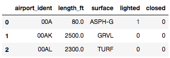

Python Pandas<br />对于数据分析师而言，Pandas与SQL可能是大家用的比较多的两个工具，两者都可以对数据集进行深度的分析，挖掘出有价值的信息，但是二者的语法有着诸多的不同，来总结归纳一下Pandas与SQL这两者之间在语法上到底有哪些不同。
<a name="VFxei"></a>
### 导入数据
对于Pandas而言，需要提前导入数据集，然后再进行进一步的分析与挖掘
```python
import pandas as pd

airports = pd.read_csv('data/airports.csv')
airport_freq = pd.read_csv('data/airport-frequencies.csv')
runways = pd.read_csv('data/runways.csv')
```
<a name="YHFvH"></a>
### 基础语法
在SQL当中，用`SELECT`来查找数据，`WHERE`来过滤数据，`DISTINCT`来去重，`LIMIT`来限制输出结果的数量，
<a name="Swet2"></a>
#### 输出数据集
```python
## SQL
select * from airports

## Pandas
airports
```
<a name="X8Bh8"></a>
#### 输出数据集的前三行数据
代码如下
```python
## SQL
select * from airports limit 3

## Pandas
airports.head(3)
```
<a name="DywYs"></a>
#### 对数据集进行过滤筛查
```python
## SQL
select id from airports where ident = 'KLAX'

## Pandas
airports[airports.ident == 'KLAX'].id
```
<a name="fSuVE"></a>
#### 对于筛选出来的数据进行去重
```python
## SQL
select distinct type from airport

## Pandas
airports.type.unique()
```
<a name="W3kSO"></a>
### 多个条件交集来筛选数据
多个条件的交集来筛选数据，代码如下
```python
## SQL
select * from airports 
where iso_region = 'US-CA' and 
type = 'seaplane_base'

## Pandas
airports[(airports.iso_region == 'US-CA') & 
(airports.type == 'seaplane_base')]
```
或者是
```python
## SQL
select ident, name, municipality from airports 
where iso_region = 'US-CA' and
type = 'large_airport'

## Pandas
airports[(airports.iso_region == 'US-CA') &
(airports.type == 'large_airport')][['ident', 'name', 'municipality']]
```
<a name="q9bP9"></a>
### 排序
在Pandas当中默认是对数据进行升序排序，要是希望对数据进行降序排序，需要设定`ascending`参数
```python
## SQL
select * from airport_freq
where airport_ident = 'KLAX'
order by type

## Pandas
airport_freq[airport_freq.airport_ident == 'KLAX']
.sort_values('type')
```
又或者是
```python
## SQL
select * from airport_freq
where airport_ident = 'KLAX'
order by type desc

## Pandas
airport_freq[airport_freq.airport_ident == 'KLAX']
.sort_values('type', ascending=False)
```
<a name="LBdvH"></a>
### 筛选出列表当中的数据
要是需要筛选出来的数据在一个列表当中，这里就需要用到`isin()`方法，代码如下
```python
## SQL
select * from airports 
where type in ('heliport', 'balloonport')

## Pandas
airports[airports.type.isin(['heliport', 'balloonport'])]
```
又或者是
```python
## SQL
select * from airports 
where type not in ('heliport', 'balloonport')

## Pandas
airports[~airports.type.isin(['heliport', 'balloonport'])]
```
<a name="evI0o"></a>
### 删除数据
在Pandas当中删除数据用的是`drop()`方法，代码如下
```python
## SQL
delete from dataframe where col_name = 'MISC'

## Pandas
df = df[df.type != 'MISC']
df.drop(df[df.type == 'MISC'].index)
```
<a name="ZjXRq"></a>
### 更新数据
在SQL当中更新数据使用的是`update`和`set`方法，代码如下
```python
### SQL
update airports set home_link = '......'
where ident == 'KLAX'

### Pandas
airports.loc[airports['ident'] == 'KLAX', 'home_link'] = '......'
```
<a name="ydqrN"></a>
### 调用统计函数
对于给定的数据集，如下图所示
```python
runways.head()
```
output<br /><br />调用`min()`、`max()`、`mean()`以及`median()`函数作用于`length_ft`这一列上面，代码如下
```python
## SQL
select max(length_ft), min(length_ft),
avg(length_ft), median(length_ft) from runways

## Pandas
runways.agg({'length_ft': ['min', 'max', 'mean', 'median']})
```
<a name="kRr1p"></a>
### 合并两表格
在Pandas当中合并表格用的是`pd.concat()`方法，在SQL当中则是`UNION ALL`，代码如下
```python
## SQL
select name, municipality from airports
where ident = 'KLAX'
union all
select name, municipality from airports
where ident = 'KLGB'

## Pandas
pd.concat([airports[airports.ident == 'KLAX'][['name', 'municipality']],
airports[airports.ident == 'KLGB'][['name', 'municipality']]])
```
<a name="qSDJk"></a>
### 分组
顾名思义也就是`groupby()`方法，代码如下
```python
## SQL
select iso_country, type, count(*) from airports
group by iso_country, type
order by iso_country, type

## Pandas
airports.groupby(['iso_country', 'type']).size()
```
<a name="cfidm"></a>
### 分组之后再做筛选
在Pandas当中是在进行了`groupby()`之后调用`filter()`方法，而在SQL当中则是调用`HAVING`方法，代码如下
```python
## SQL
select type, count(*) from airports
where iso_country = 'US'
group by type
having count(*) > 1000
order by count(*) desc

## Pandas
airports[airports.iso_country == 'US']
.groupby('type')
.filter(lambda g: len(g) > 1000)
.groupby('type')
.size()
.sort_values(ascending=False)
```
<a name="nC4vE"></a>
### TOP N records
代码如下
```python
## SQL 
select 列名 from 表名
order by size
desc limit 10

## Pandas
表名.nlargest(10, columns='列名')
```
