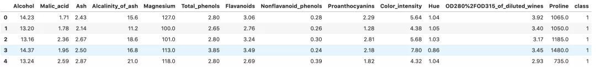
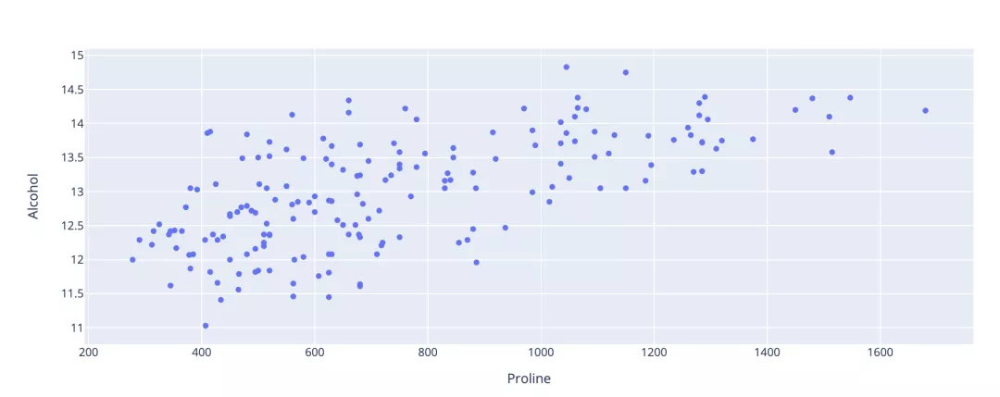
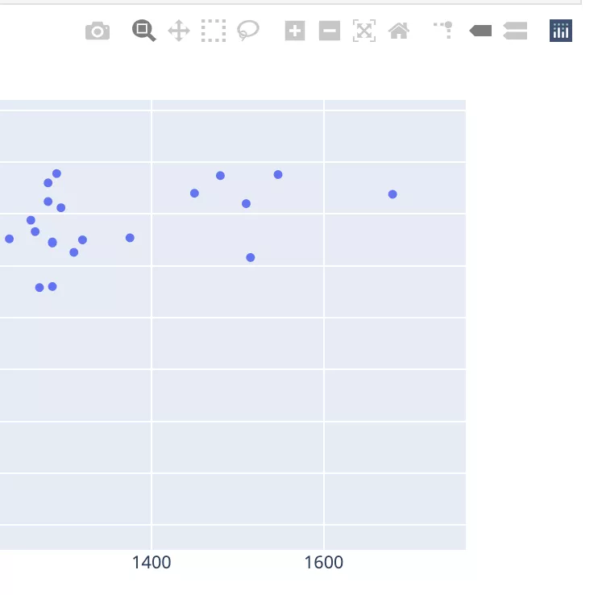
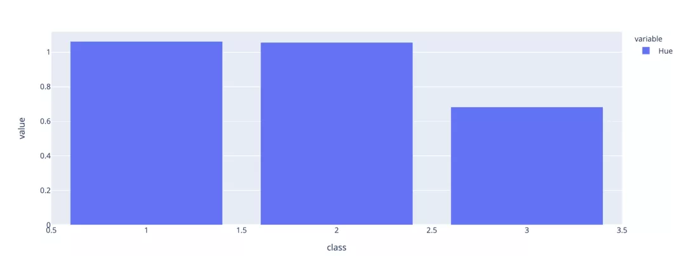
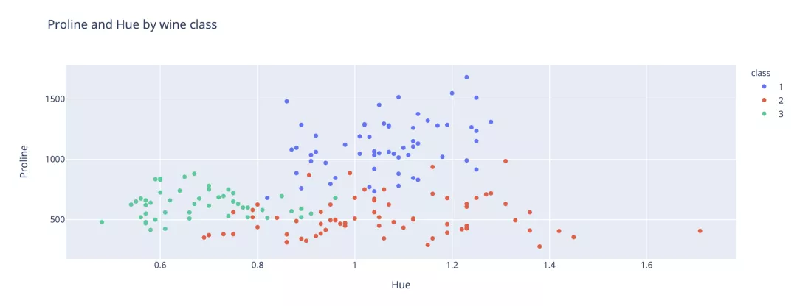
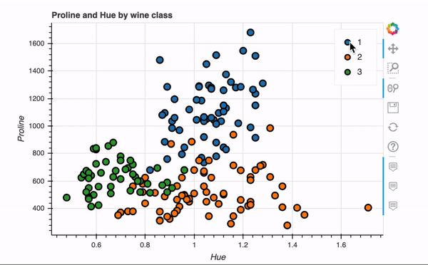
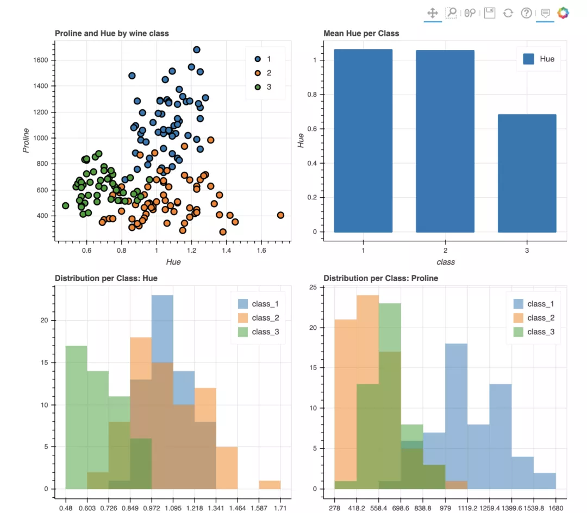

Pandas 可视化<br />用Python做数据分析离不开pandas，pnadas更多的承载着处理和变换数据的角色，pands中也内置了可视化的操作，但效果很糙。因此在用Python做数据分析时，正常的做法是用先pandas先进行数据处理，然后再用Matplotlib、Seaborn、Plotly、Bokeh等对dataframe或者series进行可视化操作。<br />但是每个可视化包都有自己独特的方法和函数，经常忘，这是让人一直很头疼的地方。<br />从最新的pandas版本0.25.3开始，不再需要上面的操作了，数据处理和可视化完全可以用pandas一个就全部搞定。<br />pandas现在可以使用Plotly、Bokeh作为可视化的backend，直接实现交互性操作，无需再单独使用可视化包了。
<a name="WskWr"></a>
#### 1. 激活backend
在import了pandas之后，直接使用下面这段代码激活backend，比如下面要激活plotly。
```python
pd.options.plotting.backend = 'plotly'
```
目前，pandas的backend支持以下几个可视化包。

- Plotly<br />
- Holoviews<br />
- Matplotlib<br />
- Pandas_bokeh<br />
- Hyplot<br />
<a name="kNTFc"></a>
#### 2. Plotly backend
Plotly的好处是，它基于Javascript版本的库写出来的，因此生成的Web可视化图表，可以显示为HTML文件或嵌入基于Python的Web应用程序中。<br />看下如何用plotly作为pandas的backend进行可视化。<br />如果还没安装Plotly，则需要安装它 `pip intsall plotly` 。如果是在Jupyterlab中使用Plotly，那还需要执行几个额外的安装步骤来显示可视化效果。<br />首先，安装IPywidgets。
```bash
pip install jupyterlab "ipywidgets>=7.5"
```
然后运行此命令以安装Plotly扩展。
```bash
jupyter labextension install jupyterlab-plotly@4.8.1
```
示例选自openml.org的的数据集，链接如下：<br />数据链接：[https://www.openml.org/d/187](https://www.openml.org/d/187)<br />这个数据也是Scikit-learn中的样本数据，所以也可以使用以下代码将其直接导入。
```python
import pandas as pd
import numpy as np
from sklearn.datasets import fetch_openml
pd.options.plotting.backend = 'plotly'
X,y = fetch_openml("wine", version=1, as_frame=True, return_X_y=True)
data = pd.concat([X,y], axis=1)
data.head()
```
该数据集是葡萄酒相关的，包含葡萄酒类型的许多功能和相应的标签。数据集的前几行如下所示。<br /><br />下面使用Plotly backend探索一下数据集。<br />绘图方式与正常使用Pandas内置的绘图操作几乎相同，只是现在以丰富的Plotly显示可视化效果。<br />下面的代码绘制了数据集中两个要素之间的关系。
```python
fig = data[['Alcohol', 'Proline']].plot.scatter(y='Alcohol', x='Proline')
fig.show()
```
<br />如果将鼠标悬停在图表上，可以选择将图表下载为高质量的图像文件。<br /><br />可以结合Pandas的groupby函数创建一个条形图，总结各类之间Hue的均值差异。
```python
data[['Hue','class']].groupby(['class']).mean().plot.bar()
```
<br />将class添加到刚才创建的散点图中。通过Plotly可以轻松地为每个类应用不同的颜色，以便直观地看到分类。
```python
fig = data[['Hue', 'Proline', 'class']].plot.scatter(x='Hue', y='Proline', color='class', title='Proline and Hue by wine class')
fig.show()
```

<a name="rBZxg"></a>
#### 3. Bokeh backend
Bokeh是另一个Python可视化包，也可提供丰富的交互式可视化效果。Bokeh还具有streaming API，可以为比如金融市场等流数据创建实时可视化。<br />pandas-Bokeh的GitHub链接如下：<br />[https://github.com/PatrikHlobil/Pandas-Bokeh](https://github.com/PatrikHlobil/Pandas-Bokeh)<br />用pip安装即可， `pip install pandas-bokeh` 。<br />为了在Jupyterlab中显示Bokeh可视化效果，还需要安装两个新的扩展。
```python
jupyter labextension install @jupyter-widgets/jupyterlab-manager
jupyter labextension install @bokeh/jupyter_bokeh
```
下面使用Bokeh backend重新创建刚刚plotly实现的的散点图。
```python
pd.options.plotting.backend = 'pandas_bokeh'
import pandas_bokeh
from bokeh.io import output_notebook
from bokeh.plotting import figure, show
output_notebook()
p1 = data.plot_bokeh.scatter(x='Hue', 
                              y='Proline', 
                              category='class', 
                              title='Proline and Hue by wine class',
                              show_figure=False)
show(p1)
```
关键语句就一行代码，非常快捷，交互式效果如下。<br /><br />Bokeh还具有plot_grid函数，可以为多个图表创建类似于仪表板的布局，下面在网格布局中创建了四个图表。
```python
output_notebook()
p1 = data.plot_bokeh.scatter(x='Hue', 
                             y='Proline', 
                             category='class', 
                             title='Proline and Hue by wine class',
                             show_figure=False)
p2 = data[['Hue','class']].groupby(['class']).mean().plot.bar(title='Mean Hue per Class')
df_hue = pd.DataFrame({
    'class_1': data[data['class'] == '1']['Hue'],
    'class_2': data[data['class'] == '2']['Hue'],
    'class_3': data[data['class'] == '3']['Hue']},
    columns=['class_1', 'class_2', 'class_3'])
p3 = df_hue.plot_bokeh.hist(title='Distribution per Class: Hue')
df_proline = pd.DataFrame({
    'class_1': data[data['class'] == '1']['Proline'],
    'class_2': data[data['class'] == '2']['Proline'],
    'class_3': data[data['class'] == '3']['Proline']},
    columns=['class_1', 'class_2', 'class_3'])
p4 = df_proline.plot_bokeh.hist(title='Distribution per Class: Proline')
pandas_bokeh.plot_grid([[p1, p2], 
                        [p3, p4]], plot_width=450)
```
可以看到，可视化的部分都是在pandas的dataframe基础上一行代码搞定，最后plot_grid完成布局。
<a name="vP32T"></a>
#### 4. 总结
在内置的Pandas绘图功能增加多个第三方可视化backend，大大增强了pandas用于数据可视化的功能。
