PythonPandas<br />Pandas是非常常见的数据分析工具，一般都会处理好处理数据然后使用searbon或matplotlib来进行绘制。但在Pandas内部就已经集成了matplotlib，这里展示Pandas内部的画图方法。
<a name="O4NZ6"></a>
## **画图类型**
在Pandas中内置的画图方法如下几类，基本上都是常见的画图方法。每种方法底层也是使用的matplotlib。

- **line : line plot (default)**
- **bar : vertical bar plot**
- **barh : horizontal bar plot**
- **hist : histogram**
- **box : boxplot**
- **density/kde : Density Estimation**
- **area : area plot**
- **pie : pie plot**
- **scatter : scatter plot**
- **hexbin : hexbin plot**

在进行画图时有两种调用方法：
```python
df = pd.DataFrame({
    'sales': [3, 3, 3, 9, 10, 6],
    'signups': [4, 5, 6, 10, 12, 13],
    'visits': [20, 42, 28, 62, 81, 50],
}, index=pd.date_range(start='2018/01/01', end='2018/07/01', freq='M'))

# 方法1，这种方法是高层API，需要制定kind
df.plot(kind='area')

# 方法2，这种方法是底层API
df.plot.area()
```

<a name="ZlbA5"></a>
## **面积图（area）**
面积图直观地显示定量数据下面的区域面积，该函数包装了 matplotlib 的area函数。<br />[https://pandas.pydata.org/docs/reference/api/pandas.DataFrame.plot.area.html](https://pandas.pydata.org/docs/reference/api/pandas.DataFrame.plot.area.html)
```python
# 默认为面积堆叠
df.plot(kind='area')
```
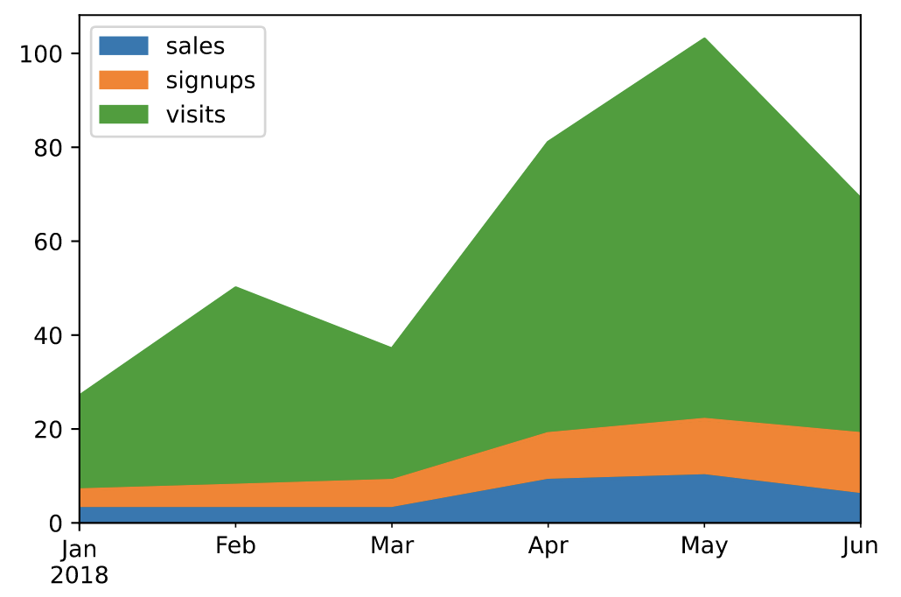
```python
# 设置面积不堆叠
df.plot.area(stacked=False)
```
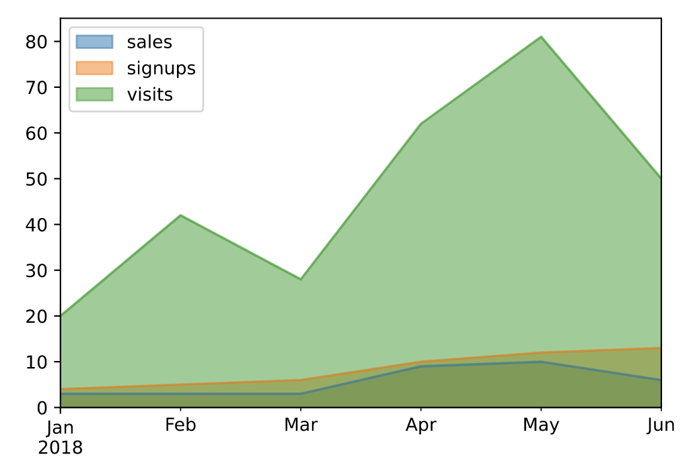
```python
# 手动指定坐标轴
df.plot.area(y='sales', x='signups')
```
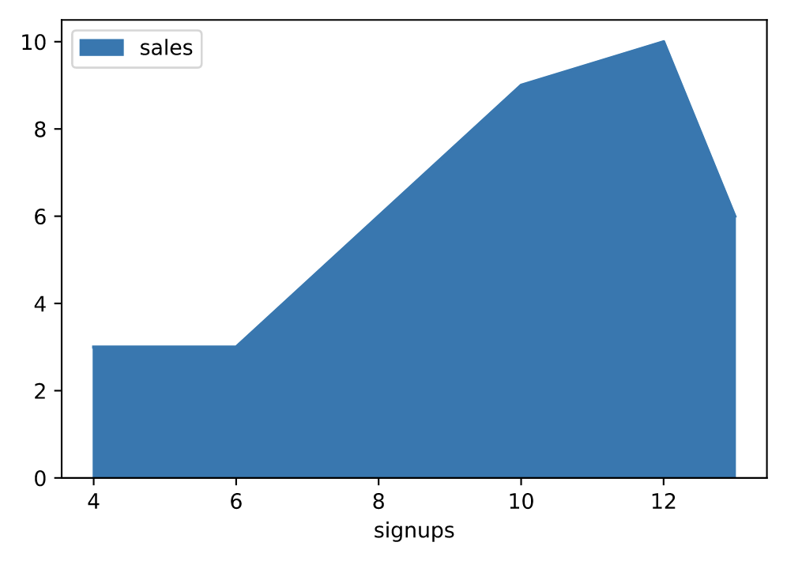
<a name="l9dCF"></a>
## **条形图（bar）**
条形图是一种用矩形条显示分类数据的图，矩形条的长度与它们所代表的值成比例。条形图显示离散类别之间的比较。图的一个轴显示比较的特定类别，另一个轴表示测量值。<br />[https://pandas.pydata.org/docs/reference/api/pandas.DataFrame.plot.bar.html](https://pandas.pydata.org/docs/reference/api/pandas.DataFrame.plot.bar.html)
```python
df = pd.DataFrame({'lab':['A', 'B', 'C'], 'val':[10, 30, 20]})
# 手动设置坐标轴
ax = df.plot.bar(x='lab', y='val', rot=0)
```
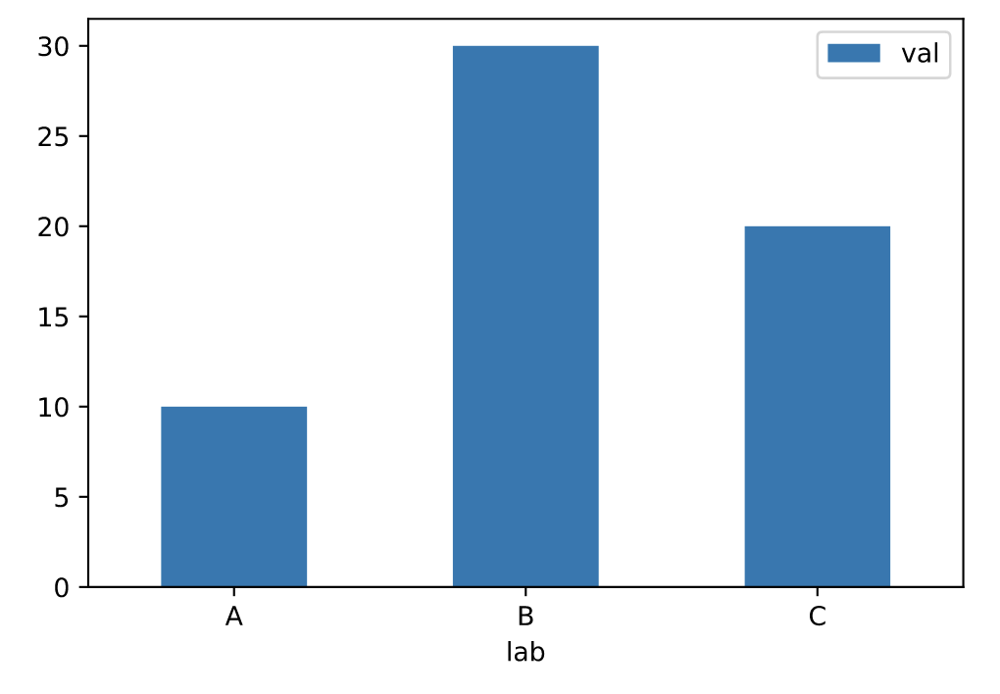
```python
# 并排绘制
df.plot.bar(rot=0)
```
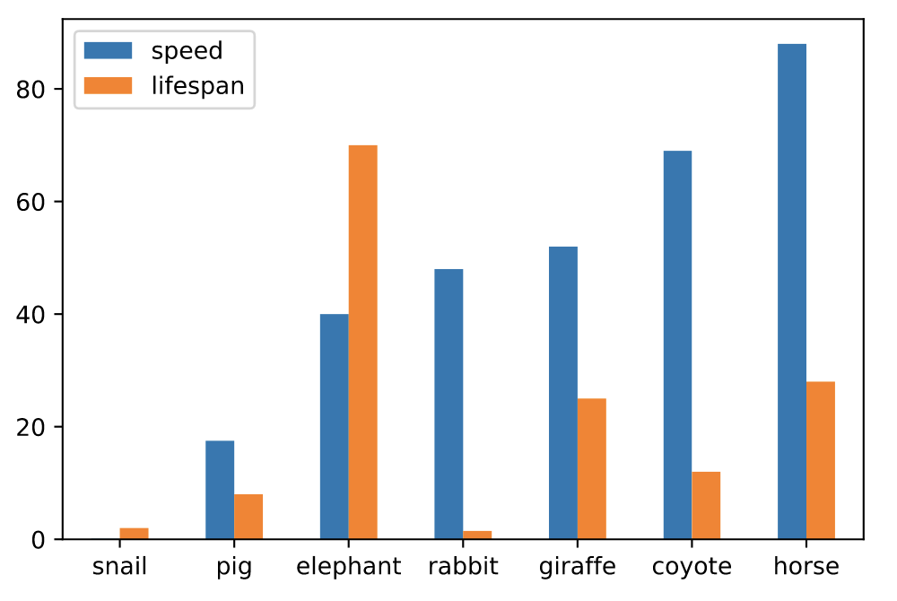
```python
# 堆叠绘制
df.plot.bar(stacked=True)
```
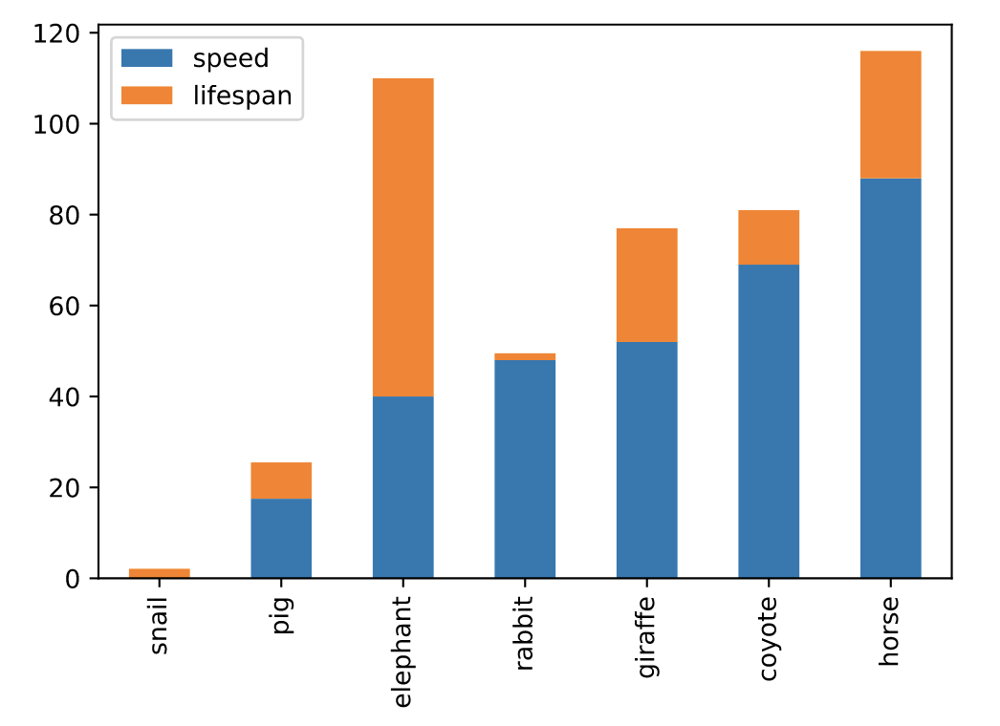
```python
# 分图绘制
axes = df.plot.bar(rot=0, subplots=True)
axes[0].legend(loc=2)
axes[1].legend(loc=2)
```
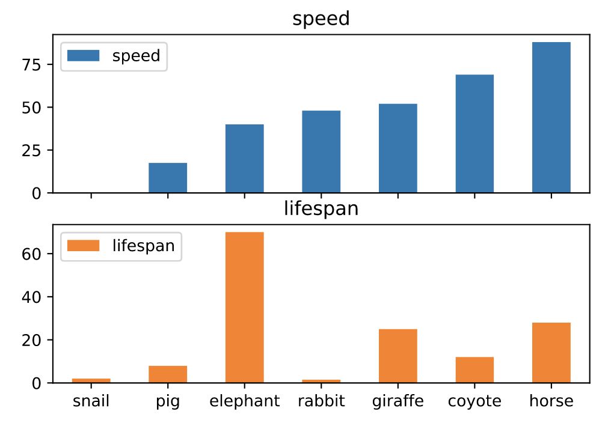
<a name="iNWWl"></a>
## **水平条形图（barh）**
水平条形图是用矩形条形表示定量数据的图表，矩形条形的长度与它们所代表的值成正比。条形图显示离散类别之间的比较。
```python
# 并排绘制
df.plot.barh(rot=0)
```
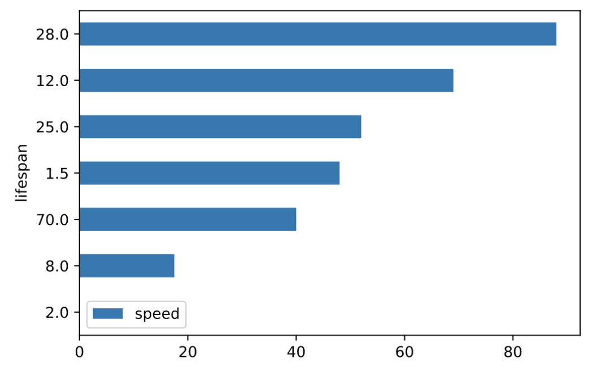
```python
# 堆叠绘制
df.plot.barh(stacked=True)
```
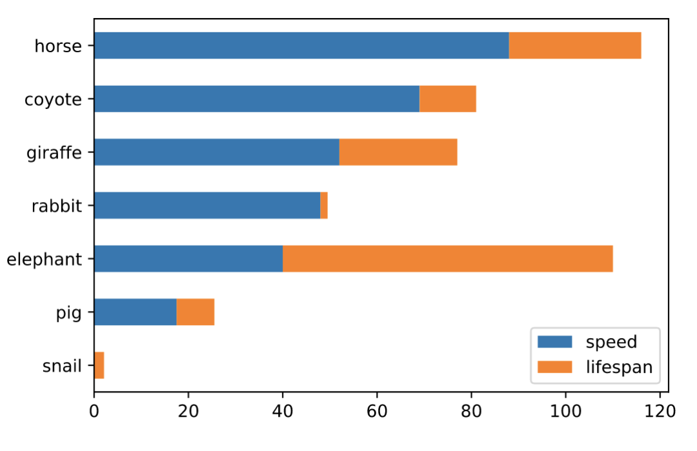
<a name="JRjiG"></a>
## **箱线图（boxplot）**
箱线图是一种通过四分位数以图形方式描绘数值数据组的方法。该框从数据的 Q1 到 Q3 四分位值延伸，在中位数 (Q2) 处有一条线。
```python
age_list = [8, 10, 12, 14, 72, 74, 76, 78, 20, 25, 30, 35, 60, 85]
df = pd.DataFrame({"gender": list("MMMMMMMMFFFFFF"), "age": age_list})
ax = df.plot.box(column="age", by="gender", figsize=(10, 8))
```
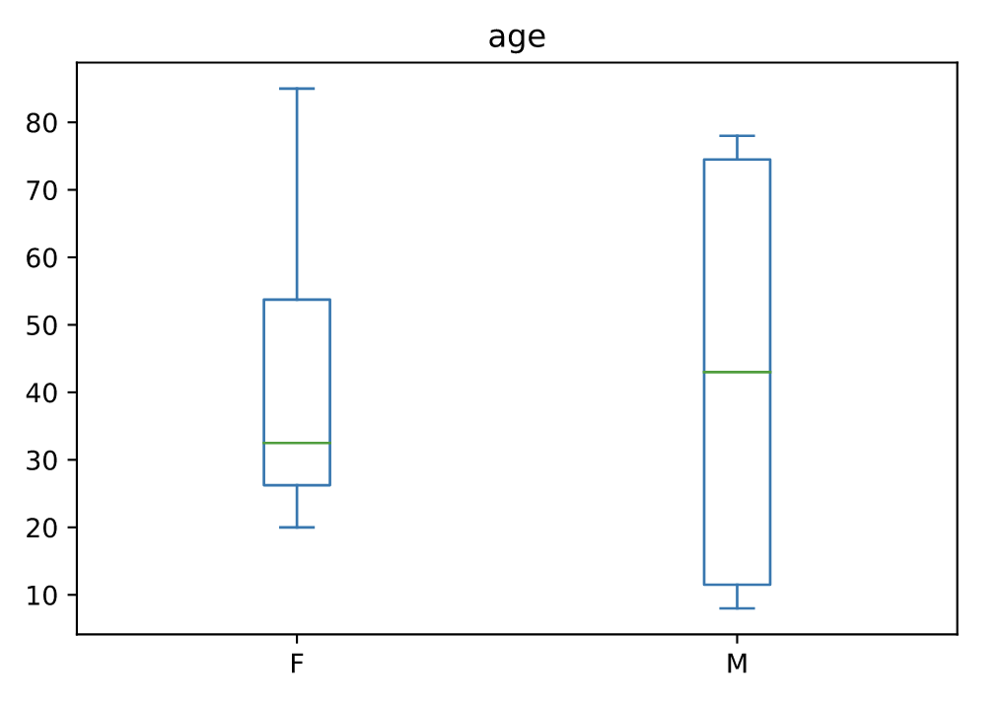
<a name="oMwq9"></a>
## **密度图（density）**
核密度估计 (KDE) 是一种估计随机变量的概率密度函数 (PDF) 的非参数方法。<br />[https://pandas.pydata.org/docs/reference/api/pandas.DataFrame.plot.density.html](https://pandas.pydata.org/docs/reference/api/pandas.DataFrame.plot.density.html)
```python
s = pd.Series([1, 2, 2.5, 3, 3.5, 4, 5])
ax = s.plot.kde()
```
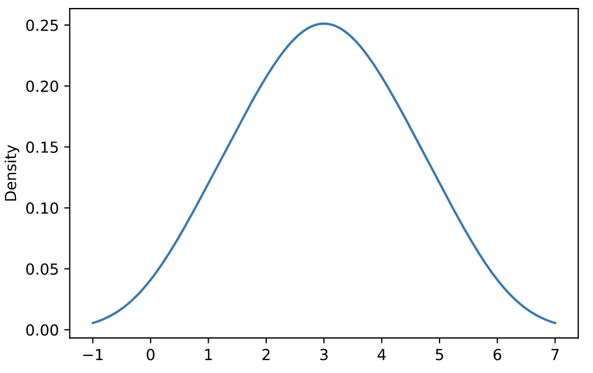
```python
df = pd.DataFrame({
    'x': [1, 2, 2.5, 3, 3.5, 4, 5],
    'y': [4, 4, 4.5, 5, 5.5, 6, 6],
})
ax = df.plot.kde()
```
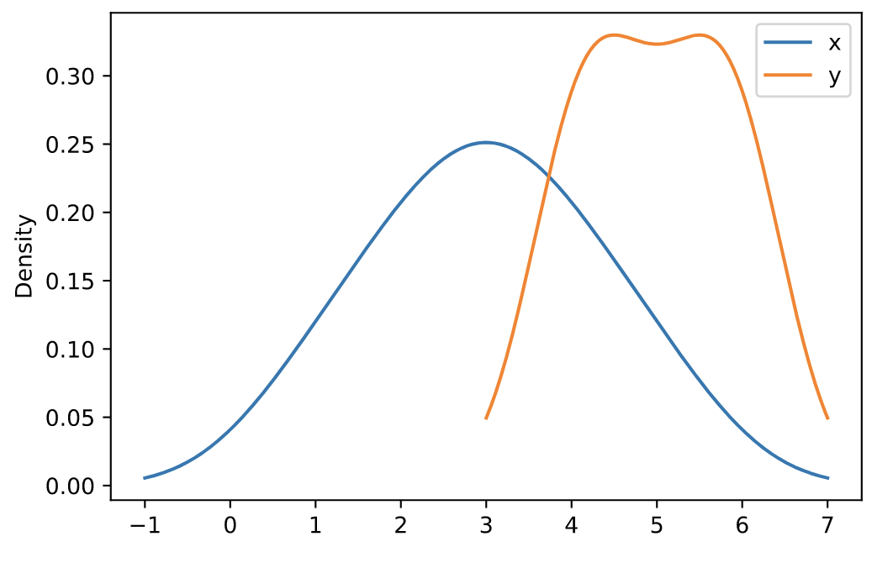
<a name="Sc1kU"></a>
## **六边形图（hexbin）**
和热力图类似，具体的颜色按照密度来进行展示。但形状使用六边形图代替。<br />[https://pandas.pydata.org/docs/reference/api/pandas.DataFrame.plot.hexbin.html](https://pandas.pydata.org/docs/reference/api/pandas.DataFrame.plot.hexbin.html)
```python
n = 10000
df = pd.DataFrame({'x': np.random.randn(n),
                   'y': np.random.randn(n)})

ax = df.plot.hexbin(x='x', y='y', gridsize=20)
```
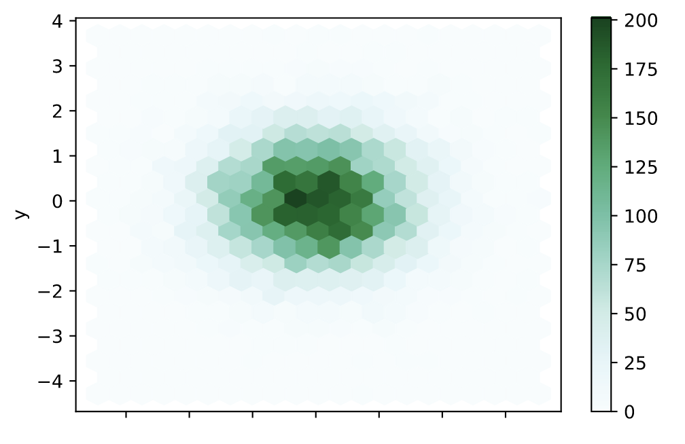
<a name="xsPd9"></a>
## **直方图（hist）**
[https://pandas.pydata.org/docs/reference/api/pandas.DataFrame.plot.hist.html](https://pandas.pydata.org/docs/reference/api/pandas.DataFrame.plot.hist.html)
```python
df = pd.DataFrame(
    np.random.randint(1, 7, 6000),
    columns = ['one'])
df['two'] = df['one'] + np.random.randint(1, 7, 6000)

ax = df.plot.hist(bins=12, alpha=0.5)
```
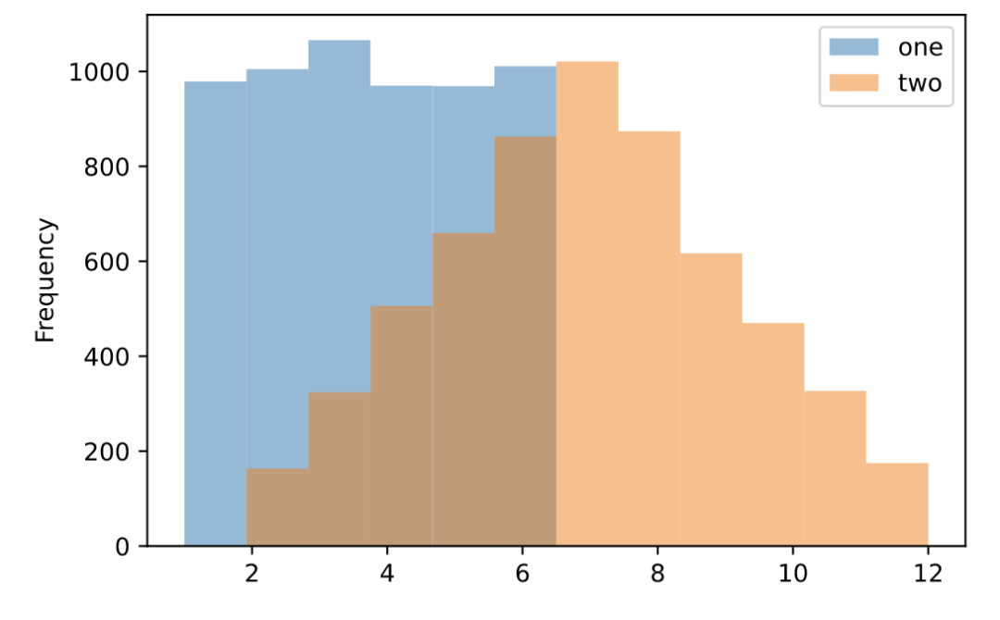
<a name="dlrqQ"></a>
## **折线图（line）**
[https://pandas.pydata.org/docs/reference/api/pandas.DataFrame.plot.line.html](https://pandas.pydata.org/docs/reference/api/pandas.DataFrame.plot.line.html)
```python
s = pd.Series([1, 3, 2])
s.plot.line()
```
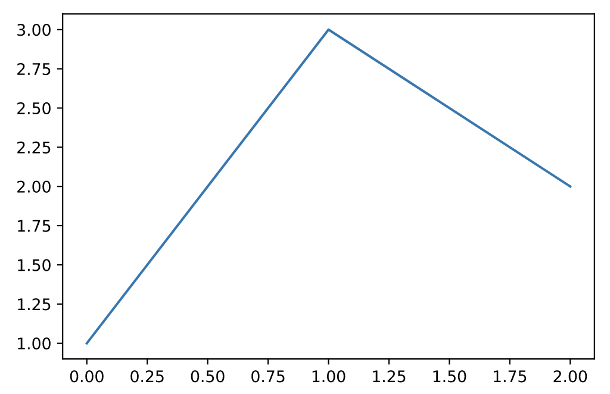
```python
df = pd.DataFrame({
   'pig': [20, 18, 489, 675, 1776],
   'horse': [4, 25, 281, 600, 1900]
   }, index=[1990, 1997, 2003, 2009, 2014])

lines = df.plot.line()
```
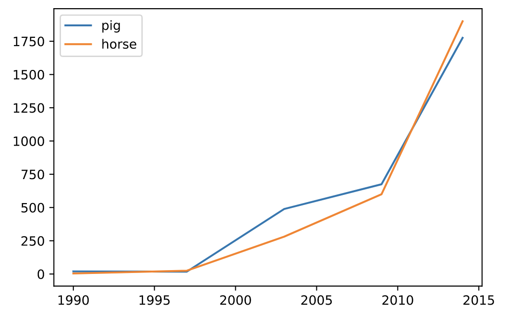
<a name="gBlgX"></a>
## **饼图（pie）**
[https://pandas.pydata.org/docs/reference/api/pandas.DataFrame.plot.pie.html](https://pandas.pydata.org/docs/reference/api/pandas.DataFrame.plot.pie.html)
```python
df = pd.DataFrame({'mass': [0.330, 4.87 , 5.97],
                   'radius': [2439.7, 6051.8, 6378.1]},
                  index=['Mercury', 'Venus', 'Earth'])

plot = df.plot.pie(y='mass', figsize=(5, 5))
```
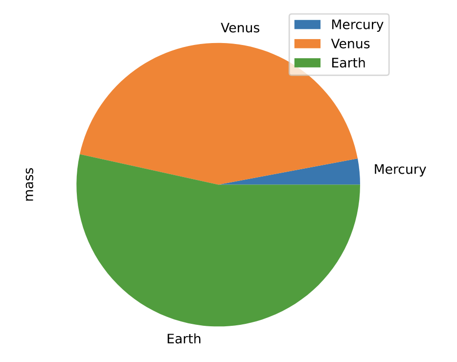
```python
# 默认使用index进行分组
df.plot.pie(subplots=True, figsize=(11, 6))
```
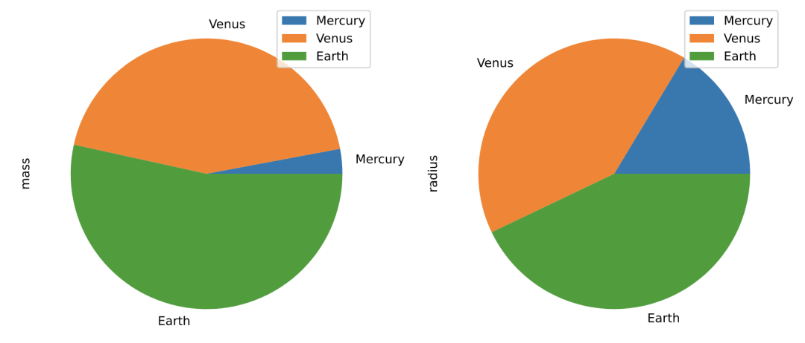
<a name="BiZ7L"></a>
## **散点图（scatter）**
[https://pandas.pydata.org/docs/reference/api/pandas.DataFrame.plot.scatter.html](https://pandas.pydata.org/docs/reference/api/pandas.DataFrame.plot.scatter.html)
```python
df = pd.DataFrame([[5.1, 3.5, 0], [4.9, 3.0, 0], [7.0, 3.2, 1],
                   [6.4, 3.2, 1], [5.9, 3.0, 2]],
                  columns=['length', 'width', 'species'])

ax1 = df.plot.scatter(x='length',y='width', c='DarkBlue')
```
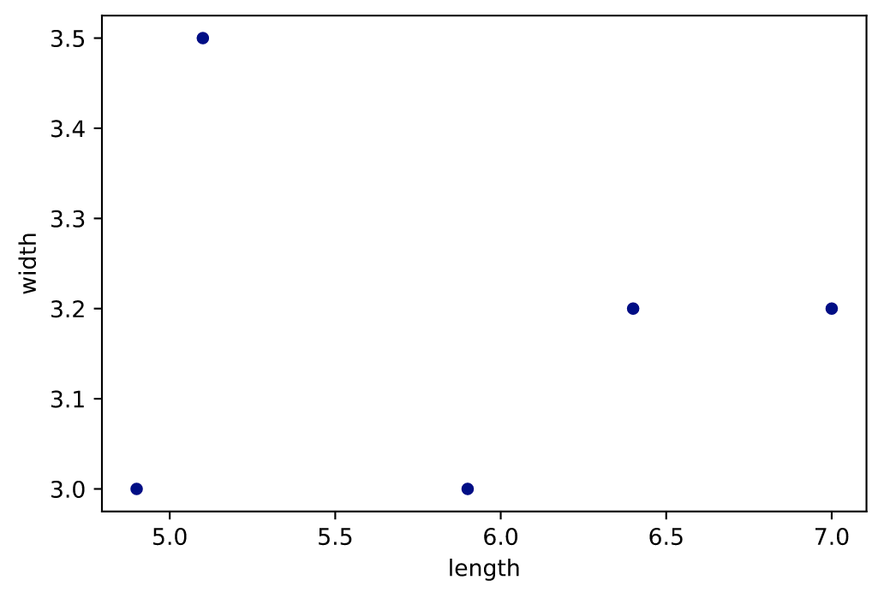
