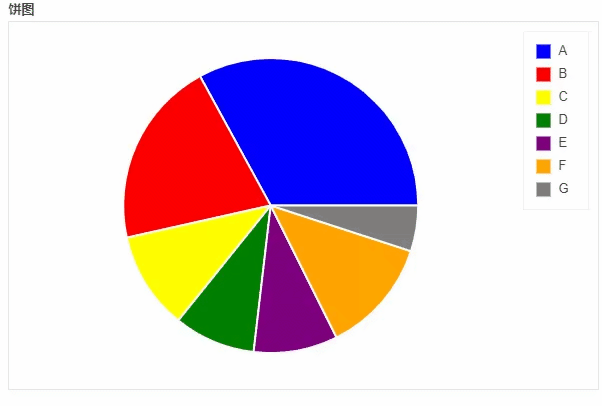

Python Pandas 可视化<br />用pandas一行代码来绘制可以动态交互的图表，并且将绘制的图表组合到一起，组成可视化大屏，本次绘制的图表有

- 折线图
- 散点图
- 直方图
- 柱状图
- 饼图
- 面积图
- 地图
- 组合图
<a name="T0zgR"></a>
#### 准备工作
先导入需要用到的库，并做相应的设置
```python
import pandas as pd
import pandas_bokeh
pandas_bokeh.output_notebook()
```
因为是在jupyter nobteook上面操作的，这边就用到了`output_notebook()`的设置
<a name="mXNCL"></a>
#### 折线图
先来画一张简单的折线图，当中随机生成一批数据
```python
import numpy as np

np.random.seed(55)
df = pd.DataFrame({"宁德时代": np.random.randn(100)+0.2, 
                   "贵州茅台": np.random.randn(100)+0.17}, 
                   index=pd.date_range('1/1/2021', periods=100))
df = df.cumsum()
df = df + 50
df.plot_bokeh(kind="line") 
```
output<br /><br />绘制出来的图表可以任意的缩放以及拖拽，也可以点击右边的“保存”按钮来实现对图表的下载保存，以至于图表的类型只需要对参数`kind`加以设定，将上面的代码优化一下
```python
df.plot_bokeh.line(
    figsize=(800, 450),
    title="宁德时代 vs 贵州茅台",
    xlabel="日期",
    ylabel="股票价格 [$]",
    yticks=[0, 100, 200, 300, 400],
    ylim=(0, 100),
    xlim=("2021-01-01", "2021-04-01"),
    colormap=["red", "blue"],
    plot_data_points=True,
    plot_data_points_size=10,
    marker="asterisk")
```
output<br /><br />对X轴以及Y轴坐标做了范围的限定，并且加上了标注，效果看起来也更加的美观一些。和`pyecharts`类似，也可以在图标的底部添加一个时间轴，拖动时间轴来展示数据
```python
ts = pd.Series(np.random.randn(100), index=pd.date_range('1/1/2021', periods=100))
df = pd.DataFrame(np.random.randn(100, 4), index=ts.index, columns=list('ABCD'))
df = df.cumsum()

df.plot_bokeh(rangetool=True)
```
output<br /><br />当然也可以对折线加以修改，就可以变成另外一种样子，主要修改的就是参数`marker`
```python
x = np.arange(-5, 5, 0.1)
y2 = x**2
y3 = x**3
df = pd.DataFrame({"x": x, "Type 1": y2, "Type 2": y3})
df.plot_bokeh.point(
    x="x",
    xticks=range(-5, 5),
    size=5,
    colormap=["#009933", "#ff3399"],
    title="折线图 (Type 1 vs. Type 2)",
    marker="x")
```
output<br />
<a name="vs1ov"></a>
#### 散点图
接下来看散点图，步骤与上述的折线图相类似
```python
df = pd.read_csv("iris.csv")
p_scatter = df.plot_bokeh.scatter(
    x="petal length(cm)",
    y="sepal width(cm)",
    category="species",
    title="Iris数据集可视化",
    show_figure=True,
)
```
output<br /><br />在读取了`iris`数据集之后，将x参数和y参数上填上要绘制的两列，而`title`参数则是设置图表的标题<br />也可以通过当中`size`这个参数来控制散点的大小，例如
```python
df.loc[13, "sepal length(cm)"] = 15
df.loc[15, "sepal length(cm)"] = 17
df.loc[20, "sepal length(cm)"] = 30
df.loc[40, "sepal length(cm)"] = 20

p_scatter = df.plot_bokeh.scatter(
    x="petal length(cm)",
    y="sepal width(cm)",
    category="species",
    title="Iris数据集可视化",
    show_figure=True,
    size="sepal length(cm)"
)
```
output<br />
<a name="z8gkS"></a>
#### 柱状图
下面来看一下直方图的绘制
```python
data = {
    'fruits':
    ['苹果', '梨', '草莓', '西瓜', '葡萄', '香蕉'],
    '2015': [2, 1, 4, 3, 2, 4],
    '2016': [5, 3, 3, 2, 4, 6],
    '2017': [3, 2, 4, 4, 5, 3]
}
df = pd.DataFrame(data).set_index("fruits")

p_bar = df.plot_bokeh.bar(
    ylabel="每斤的的价格 [￥]", 
    title="水果每年的价格", 
    alpha=0.6)
```
output<br /><br />可以看到上面的直方图是按照不同的年份分开来的，也可以堆叠起来，通过`stacked`这个参数来实现

```python
p_stacked_bar = df.plot_bokeh.bar(
    ylabel="每斤的的价格 [￥]",
    title="水果每年的价格",
    stacked=True,
    alpha=0.6)
```
output<br />
<a name="KnTEr"></a>
#### 直方图
绘制直方图的方式也是类似的
```python
p_hist = df_hist.plot_bokeh.hist(
    y=["a", "b"],
    bins=np.arange(-5, 5, 0.5),
    normed=100,
    vertical_xlabel=True,
    ylabel="Share[%]",
    title="正则分布直方图",
    show_average=True,
    xlim=(-4, 6),
    ylim=(0, 30),
    show_figure=True)
```
output<br />
<a name="iQpoi"></a>
#### 面积图
```python
df.plot_bokeh.area(
    x="Year",
    stacked=True,
    legend="top_left",
    colormap=["yellow", "orange", "black", "grey", "blue", "green"],
    title="全球不同能源的消耗量",
    ylabel="不同能源的消耗(吨)",
    ylim=(0, 16000))
```
output<br /><br />可以看到石油的消耗量一直都在不断的提升，另外有一个`normed`参数来更好的观察数据的走势
```python
df.plot_bokeh.area(
    x="Year",
    stacked=True,
    normed = 100,
    legend="bottom_left",
    colormap=["yellow", "orange", "black", "grey", "blue", "green"],
    title="全球不同能源的消耗量",
    ylabel="不同能源的消耗(吨)")
```
output<br />
<a name="rVnmy"></a>
#### 饼图
```python
df_pie.plot_bokeh.pie(
    x="Type",
    y="2017",
    colormap=["blue", "red", "yellow", "green", "purple", "orange", "grey"],
    title="饼图",
    )
```
output<br /><br />上面的代码只是引用了表格当中的一列，当然也可以不做指定，引用表格当中的每一列数据
```python
df_pie.plot_bokeh.pie(
    x="Type",
    colormap=["blue", "red", "yellow", "green", "purple", "orange", "grey"],
    title="多重饼图",
    line_color="black")
```
output<br />
<a name="GxH8Q"></a>
#### 地图
同时来看一下地图的绘制，下面的图表是基于全球各大城市的人口密度分布来绘制的
```python
df_mapped.plot_bokeh.map(
    x="longitude",
    y="latitude",
    hovertool_string="""<h2> @{name} </h2> 
    
                        <h3> Population: @{pop_max} </h3>""",
    tile_provider="STAMEN_TERRAIN_RETINA",
    size="population", 
    figsize=(900, 600),
    title="全球特大城市分布")
```
output<br /><br />从图中可以看出，亚洲的日本主要是集中在东京这块，而像在国内的话，有大家熟知的北上广深。上面的代码有两个参数x和y分别对应的是经纬度，
```python
import geopandas as gpd
import pandas_bokeh
pandas_bokeh.output_file("Interactive Plot.html")

df_states = gpd.read_file("states.geojson")
print(df_states.head())
```
下面这张图是美国各个州2017年的的人口总量，给上面的每一个州配上不同的颜色
```python
df_states.plot_bokeh(
    figsize=(900, 600),
    category="POPESTIMATE2017",
    simplify_shapes=5000,
    colormap="Inferno",
    colormap_uselog=True,
    colorbar_tick_format="0.0a")
```
output<br /><br />当然也可以在地图上面添加一个时间轴，让图表随着时间的流逝而变化
```python
for i in range(8):
    df_states["Delta_Population_201%d"%i] = ((df_states["POPESTIMATE201%d"%i] / df_states["POPESTIMATE2010"]) -1 ) * 100
    
slider_columns = ["Delta_Population_201%d"%i for i in range(8)]
slider_range = range(2010, 2018)
df_states.plot_bokeh(
    figsize=(900, 600),
    simplify_shapes=5000,
    slider=slider_columns,
    slider_range=slider_range,
    slider_name="Year",
    colormap="Inferno",
    hovertool_columns=["STATE_NAME"] + slider_columns,
    title="Change of Population [%]")
```
output<br /><br />同时也可以在地图上面添加一个下拉框，通过点选来筛选数据的展示
```python
df_states["STATE_NAME_SMALL"] = df_states["STATE_NAME"].str.lower()

df_states.plot_bokeh(
    figsize=(900, 600),
    simplify_shapes=5000,
    dropdown=["POPESTIMATE2010", "POPESTIMATE2017"],
    colormap="Viridis",
    hovertool_string="""
                        </img>
                
                        <h2>  @STATE_NAME </h2>
                        <h3> 2010: @POPESTIMATE2010 </h3>
                        <h3> 2017: @POPESTIMATE2017 </h3>""",
    tile_provider_url=r"http://c.tile.stamen.com/watercolor/{Z}/{X}/{Y}.jpg",
    tile_attribution='Map tiles by <a href="http://stamen.com">Stamen Design</a>, under <a href="http://creativecommons.org/licenses/by/3.0">CC BY 3.0</a>. Data by <a href="http://openstreetmap.org">OpenStreetMap</a>, under <a href="http://www.openstreetmap.org/copyright">ODbL</a>.'
    )
```
output<br /><br />最后可以通过区域的筛选来进行数据的呈现，通过`category`这个参数来实现
```python
df_states.plot_bokeh(
    figsize=(900, 600),
    simplify_shapes=5000,
    category="REGION",
    show_colorbar=False,
    colormap=["blue", "yellow", "green", "red"],
    hovertool_columns=["STATE_NAME", "REGION"],
    tile_provider="STAMEN_TERRAIN_RETINA")
```

<a name="I55S4"></a>
#### 多图组合
用`pandas_bokeh`模块也能够实现多张图表的组合，例如上面 人口密度的图表就可以和美国各大洲的人口总量的图表进行组合
```python
#绘制出大致的轮廓图
figure = df_states.plot_bokeh(
    figsize=(800, 450),
    simplify_shapes=10000,
    show_figure=False,
    xlim=[-170, -80],
    ylim=[10, 70],
    category="REGION",
    colormap="Dark2",
    legend="States",
    show_colorbar=False,
)

#绘制人口的密度图
df_cities.plot_bokeh(
    figure=figure,         # <== pass figure here!
    category="pop_max",
    colormap="Viridis",
    colormap_uselog=True,
    size="size",
    hovertool_string="""<h1>@name</h1>
                        <h3>Population: @pop_max </h3>""",
    marker="inverted_triangle",
    legend="Cities",
)
```
<br />上面的代码主要是用到了`pandas_bokeh.plot_grid`这个方法来将多个图结合起来，再来看几个简单的案例
```python
df = pd.read_csv("iris.csv")

from bokeh.models.widgets import DataTable, TableColumn
from bokeh.models import ColumnDataSource

data_table = DataTable(
    columns=[TableColumn(field=Ci, title=Ci) for Ci in df.columns],
    source=ColumnDataSource(df),
    height=300,
)

# 创建散点图:
p_scatter = df.plot_bokeh.scatter(
    x="petal length(cm)",
    y="sepal width(cm)",
    category="species",
    title="Iris数据可视化",
    show_figure=False,
)

# Combine Table and Scatterplot via grid layout:
pandas_bokeh.plot_grid([[data_table, p_scatter]], plot_width=400, plot_height=350)
```
output<br /><br />也可以借此多绘制几个直方图，然后组合起来
```python
#重置表格的行索引:
df.reset_index(inplace=True)

#创建水平方向的直方图:
p_hbar = df.plot_bokeh(
    kind="barh",
    x="fruits",
    xlabel="Price per Unit [€]",
    title="Fruit prices per Year",
    alpha=0.6,
    legend = "bottom_right",
    show_figure=False)

#创建堆叠式的柱状图:
p_stacked_hbar = df.plot_bokeh.barh(
    x="fruits",
    stacked=True,
    xlabel="Price per Unit [€]",
    title="Fruit prices per Year",
    alpha=0.6,
    legend = "bottom_right",
    show_figure=False)

#Plot all barplot examples in a grid:
pandas_bokeh.plot_grid([[p_bar, p_stacked_bar],
                        [p_hbar, p_stacked_hbar]], 
                       plot_width=450)
```
output<br />
