Python Pandas 可视化<br />常见的数据可视化库有:

- matplotlib 是最常见的2维库，可以算作可视化的必备技能库，由于matplotlib是比较底层的库，api很多，代码学起来不太容易。
- seaborn 是建构于matplotlib基础上，能满足绝大多数可视化需求。更特殊的需求还是需要学习matplotlib
- pyecharts 上面的两个库都是静态的可视化库，而pyecharts有很好的web兼容性，可以做到可视化的动态效果。

但是在数据科学中，几乎都离不开pandas数据分析库，而pandas可以做。

- 数据采集 
- 数据读取  `pd.read_csv`/`pd.read_excel`
- 数据清洗(预处理)  
- 可视化，**兼容matplotlib语法(重点)**

用pandas做

- 导入数据
- 绘制最简单的图`plot()`
- 多个y的绘制图
- 折线图、条形图、饼形图和散点图绘制
- 统计信息绘图
- 箱型图
- 轴坐标刻度
- `plot()`更多精细化参数
- 可视化结果输出保存
<a name="r1Wvo"></a>
### 准备工作
先安装好这几个库
```bash
!pip3 install numpy
!pip3 install pandas
!pip3 install matplotlib
```
已经安装好，现在导入这几个要用到的库。使用的是伦敦天气数据，一开始只有12个月的小数据作为例子
```python
#jupyter notebook中需要加这行代码
%matplotlib inline
import matplotlib.pyplot as plt
import numpy as np
import pandas as pd


#读取天气数据
df = pd.read_csv('data/london2018.csv')
df
```
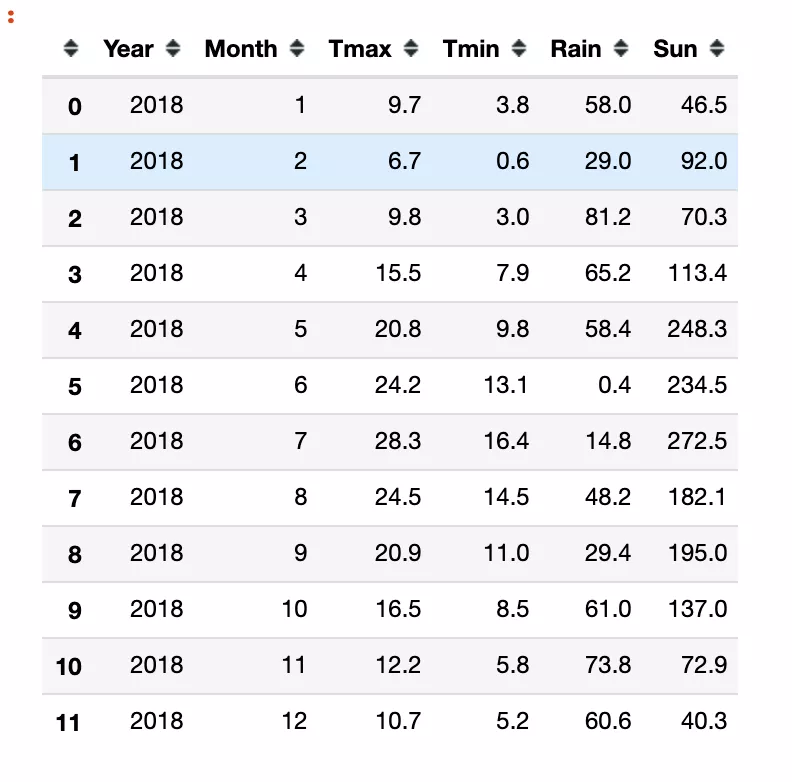
<a name="f0j32"></a>
### plot最简单的图
选择Month作为横坐标，Tmax作为纵坐标，绘图。<br />注意下面两种写法
```python
#写法1
df.plot(x='Month', y='Tmax')
plt.show()
```


- 横坐标轴参数x传入的是df中的列名Month
- 纵坐标轴参数y传入的是df中的列名Tmax
<a name="VTi6I"></a>
### 折线图
上面的图就是折线图，折线图语法有三种

- `df.plot(x='Month', y='Tmax')`
- `df.plot(x='Month', y='Tmax', kind='line')`
- `df.plot.line(x='Month', y='Tmax')`
```python
df.plot.line(x='Month', y='Tmax')
plt.show()
```

```python
#grid绘制格线
df.plot(x='Month', y='Tmax', kind='line', grid=True)
plt.show()
```
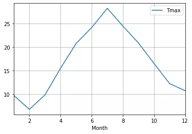
<a name="jV9sG"></a>
### 多个y值
上面的折线图中只有一条线， 如何将多个y绘制到一个图中<br />比如Tmax， Tmin
```python
df.plot(x='Month', y=['Tmax', 'Tmin'])
plt.show()
```
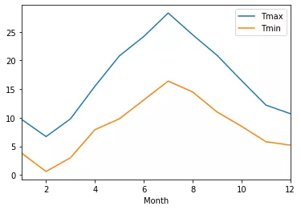
<a name="gSoyV"></a>
### 条形图
```python
df.plot(x='Month', 
        y='Rain', 
        kind='bar')
#同样还可以这样画
#df.plot.bar(x='Month', y='Rain')
plt.show()
```
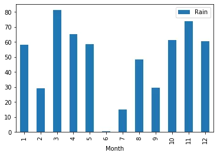
<a name="edTPA"></a>
### 水平条形图
bar环卫barh，就可以将条形图变为水平条形图
```python
df.plot(x='Month', 
        y='Rain', 
        kind='barh')
#同样还可以这样画
#df.plot.bar(x='Month', y='Rain')
plt.show()
```
<br />多个变量的条形图
```python
df.plot(kind='bar',
        x = 'Month',
       y=['Tmax', 'Tmin'])
plt.show()
```
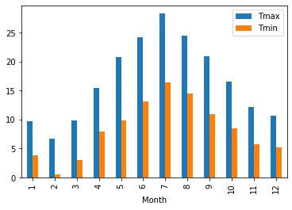
<a name="bW0Lk"></a>
### 散点图
```python
df.plot(kind='scatter',
        x = 'Month',
        y = 'Sun')
plt.show()
```
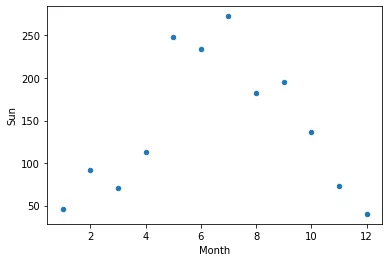
<a name="SEA3P"></a>
### 饼形图
```python
df.plot(kind='pie', y='Sun')
plt.show()
```
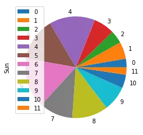<br />上图绘制有两个小问题:

- legend图例不应该显示
- 月份的显示用数字不太正规
```python
df.index = ['Jan','Feb','Mar','Apr','May','Jun','Jul','Aug','Sep','Oct','Nov','Dec']
df.plot(kind='pie', y = 'Sun', legend=False)
plt.show()
```

<a name="mh0d4"></a>
### 更多数据
开头的数据只有12条记录(12个月)的数据，现在用更大的伦敦天气数据
```python
import pandas as pd


df2 = pd.read_csv('data/londonweather.csv')
df2.head()
```
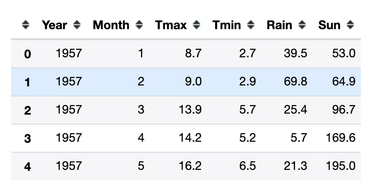
```python
df2.Rain.describe()
count    748.000000
mean      50.408957
std       29.721493
min        0.300000
25%       27.800000
50%       46.100000
75%       68.800000
max      174.800000
Name: Rain, dtype: float64
```
上面一共有748条记录, 即62年的记录。
<a name="yoX3U"></a>
### 箱型图
```python
df2.plot.box(y='Rain')
#df2.plot(y='Rain', kind='box')
plt.show()
```

<a name="uGZey"></a>
### 直方图
```python
df2.plot(y='Rain', kind='hist')
#df2.plot.hist(y='Rain')
plt.show()
```
<br />纵坐标的刻度可以通过`bins`设置
```python
df2.plot(y='Rain', kind='hist', bins=[0,25,50,75,100,125,150,175, 200])
#df2.plot.hist(y='Rain')
plt.show()
```

<a name="EoxWa"></a>
### 多图并存
```python
df.plot(kind='line',
         y=['Tmax', 'Tmin', 'Rain', 'Sun'], #4个变量可视化
         subplots=True,   #多子图并存
         layout=(2, 2),   #子图排列2行2列
         figsize=(20, 10)) #图布的尺寸
plt.show()
```
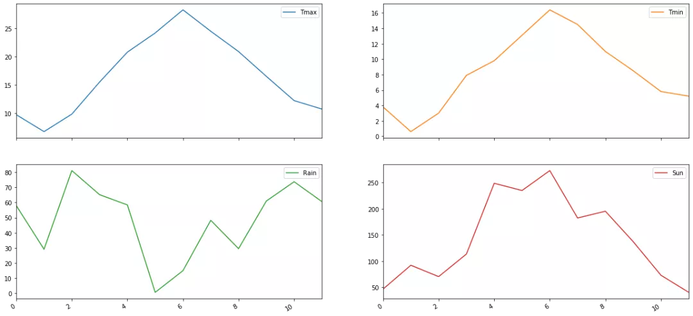
```python
df.plot(kind='bar',
         y=['Tmax', 'Tmin', 'Rain', 'Sun'], #4个变量可视化
         subplots=True,   #多子图并存
         layout=(2, 2),   #子图排列2行2列
         figsize=(20, 10)) #图布的尺寸
plt.show()
```
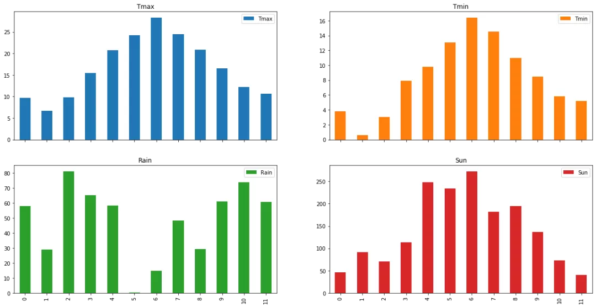
<a name="LwFqL"></a>
### 加标题
给可视化起个标题
```python
df.plot(kind='bar',
         y=['Tmax', 'Tmin'], #2个变量可视化
         subplots=True,   #多子图并存
         layout=(1, 2),   #子图排列1行2列
         figsize=(20, 5),#图布的尺寸
         title='The Weather of London')  #标题
plt.show()
```
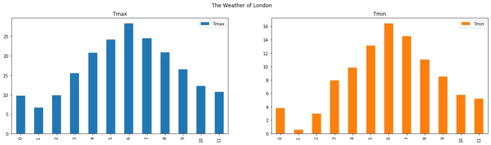
<a name="JqghA"></a>
## 保存结果
可视化的结果可以存储为图片文件
```python
df.plot(kind='pie', y='Rain', legend=False, figsize=(10, 5), title='Pie of Weather in London')
plt.savefig('img/pie.png')
plt.show()
```

<a name="zxU3p"></a>
### `df.plot`更多参数
`df.plot(x, y, kind, figsize, title, grid, legend, style)`

- x 只有dataframe对象时，x可用。横坐标
- y 同上，纵坐标变量
- kind 可视化图的种类，如line,hist, bar, barh, pie, kde, scatter
- figsize 画布尺寸
- title 标题
- grid 是否显示格子线条
- legend 是否显示图例
- style 图的风格

查看plot参数可以使用help
```python
import pandas as pd
help(pd.DataFrame.plot)
```

