Python Pandas 可视化<br />Pandas其实提供了一个绘图方法`plot()`，可以很方便的将`Series`和`Dataframe`类型数据直接进行数据可视化。
<a name="N7pdb"></a>
## 1、概述
这里引入需要用到的库，并做一些基础设置。
```python
import pandas as pd
import numpy as np
import matplotlib.pyplot as plt

# 设置 可视化风格
plt.style.use('tableau-colorblind10') 

# 以下代码从全局设置字体为SimHei（黑体），解决显示中文问题【Windows】
plt.rcParams['font.sans-serif'] = ['SimHei']

# 解决中文字体下坐标轴负数的负号显示问题
plt.rcParams['axes.unicode_minus'] = False 
```
`plot`方法默认是折线图，而它还支持以下几类图表类型：<br />'line' : 折线图 (default)<br />'bar' : 柱状图<br />'barh' : 条形图
'hist' : 直方图
<br />'box' : 箱型图
<br />'kde' : 密度图
<br />'density' : 同密度图
<br />'area' : 面积图
<br />'pie' : 饼图
<br />'scatter' : 散点图 (DataFrame only)
<br />'hexbin' : 六边形箱体图 (DataFrame only)
```python
# 随机种子
np.random.seed(1)
ts = pd.Series(np.random.randn(100), index=pd.date_range("1/1/2020", periods=100))
ts = ts.cumsum()
ts.plot()
```
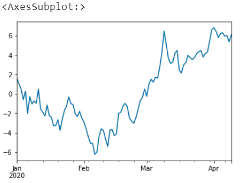
<a name="WhXSK"></a>
## 2、图表元素设置
图表元素设置主要是指 数据源选择、图大小、标题、坐标轴文字、图例、网格线、图颜色、字体大小、线条样式、色系、多子图、图形叠加与绘图引擎等等。
<a name="jX7V2"></a>
### 数据源选择
这里是指坐标轴的x、y轴数据，对于`Series`类型数据来说其索引就是x轴，y轴则是具体的值；对于`Dataframe`类型数据来说，其索引同样是x轴的值，y轴默认为全部，不过可以进行指定选择。
```python
# 随机种子
np.random.seed(1)
df = pd.DataFrame(np.random.randn(100, 4), index=ts.index, columns=list("ABCD"))
df = df.cumsum()
df.head()
```
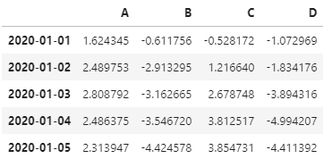<br />对于案例数据，直接绘图效果如下（显示全部列）
```python
df.plot()
```
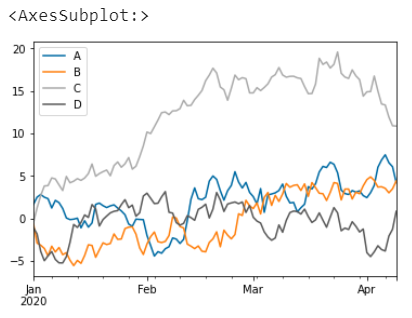<br />可以指定数据源，比如指定列A的数据
```python
df.plot(y='A')
```
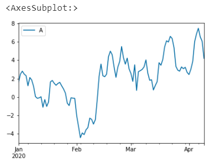<br />还可以指定x轴和多列为y，这里先构建一列X，然后进行数据源选取
```python
df["X"] = list(range(len(df)))
df.head()
```
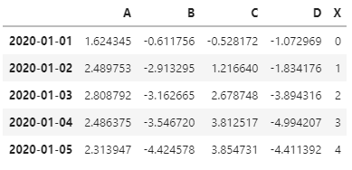<br />选择X列为x轴，B、C列为y轴数据
```python
# 指定多个Y
df.plot(x='X',y=['B','C'])
```
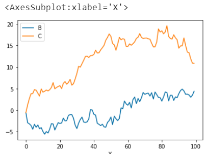
<a name="QerQX"></a>
### 图大小
通过参数`figsize`传入一个元组，指定图的长宽（英寸）<br />注意：以下以柱状图为例做演示
```python
np.random.seed(1)
df = pd.DataFrame(np.random.rand(10, 3), columns=["a", "b", "c"])
df.head()
```
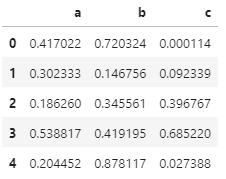
```python
# 图像大小
df.plot.bar(figsize=(10,5))
```
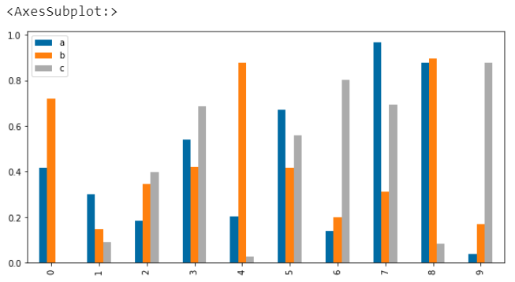<br />除了在绘图时定义图像大小外，还可以通过`matplotlib`的全局参数设置图像大小
```python
plt.rcParams['figure.figsize'] = (10,5)
```
<a name="sQli0"></a>
### 标题
通过参数`title`设置图表标题，需要注意的是如果想要显示中文，需要提前设置相关字体参数。
```python
# 标题
df.plot.bar(title='标题',)
```
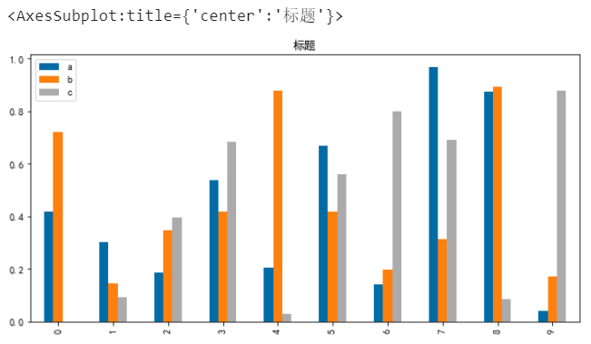
<a name="NfUFz"></a>
### 图例
通过参数`legend`可以设置图例，默认是显示图例的，可以不显示或者显示的图例顺序倒序
```python
# 图例不显示
df.plot.bar(legend=False)
```
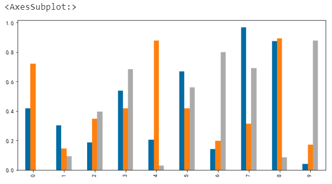
```python
# 图例倒序
df.plot.bar(legend='reverse')
```
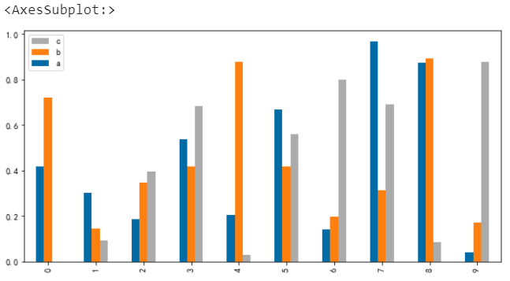
<a name="gLGCs"></a>
### 坐标轴文字
在上图中x轴标签数字显示是躺着的，怎么坐起来呢？<br />那么可以通过参数`rot`设置文字的角度
```python
# x轴标签旋转角度
df.plot.bar(rot=0)
```
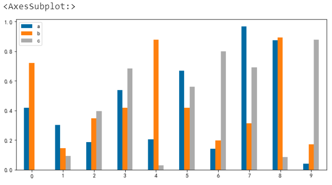
<a name="oVGni"></a>
### 网格线
默认情况下图表是不显示网格线的，可以通过参数`grid`来设置其显隐
```python
# 网格线
df.plot.bar(grid=True)
```
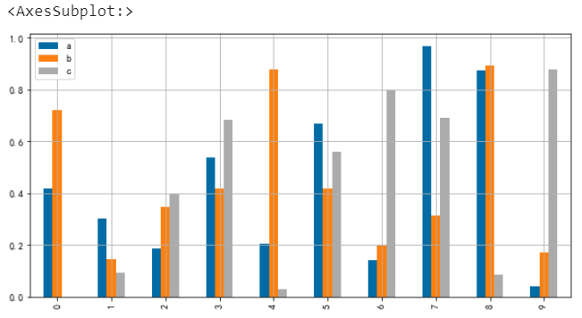
<a name="LzTHw"></a>
### 图颜色
通过`color`参数可以设定填充颜色，`edgecolor`可以设置边框颜色
```python
# 指定颜色
df.plot.bar(color=['red','orange','yellow'], edgecolor='grey')
```
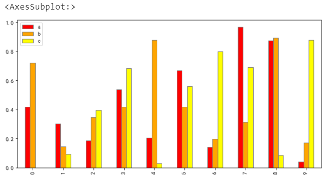
<a name="xucIM"></a>
### 字体大小
通过`fontsize`可以设置字体大小
```python
# 字体大小
df.plot.bar(fontsize=20)
```
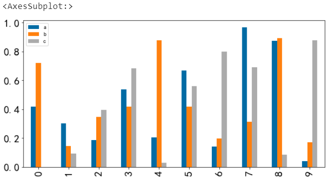
<a name="Pn6bs"></a>
### 线条样式
对于折线图来说，还可以设置线条样式`style`
```python
df.plot(style = ['.-','--','*-'] # 圆点、虚线、星星
       )
```
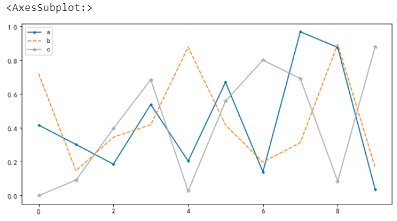
<a name="rcE2o"></a>
### 色系
通过`colormap`参数可以指定色系，色系选择可以参考`matplotlib`库的色系表
```python
# 指定色系
x = df.plot.bar(colormap='rainbow')
```
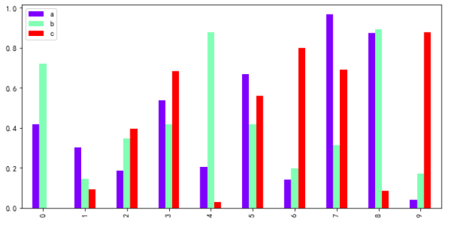
<a name="AbMQ7"></a>
### 多子图
通过`subplots`参数决定是否以多子图形式输出显示图表
```python
# 多子图
x = df.plot.line(title ='多子图',
             fontsize =16,
             subplots =True, # 分列
             style = ['.-','--','*-','^-'] # 圆点、虚线、星星
            )
```
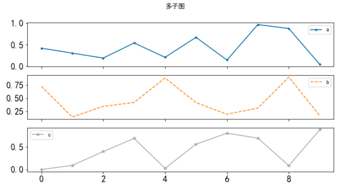
<a name="a1iNL"></a>
### 图像叠加
不同的图表类型组合在一起
```python
df.a.plot.bar()
df.b.plot(color='r')
```
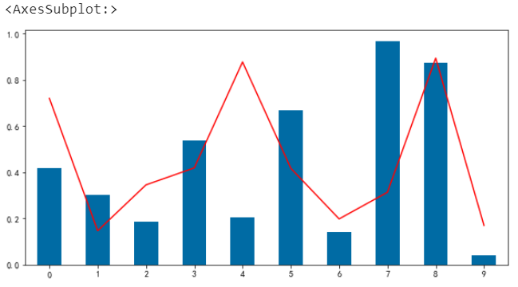
<a name="WViu1"></a>
### 绘图引擎
通过`backend`可以指定不同的绘图引擎，目前默认是`matplotlib`，还支持`bokeh`、`plotly`、`Altair`等等。当然，在使用新的引擎前需要先安装对应的库。
```python
# 绘图引擎
import pandas_bokeh

pandas_bokeh.output_notebook()
df.plot.bar(backend='pandas_bokeh')
```
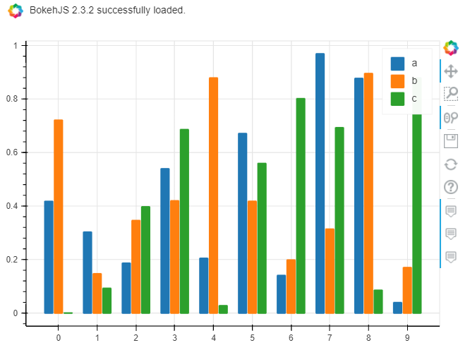
```python
# 绘图引擎 plotly
df.plot.bar(backend='plotly',
            barmode='group',
            height=500, # 图表高度
            width=800, # 图表宽度
           )
```
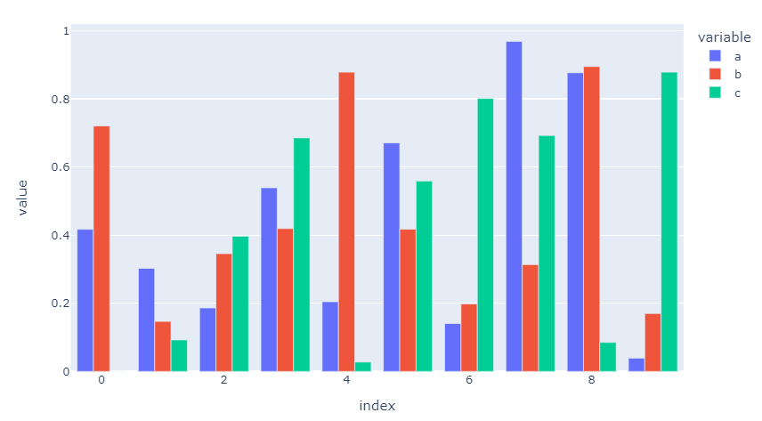
<a name="fYqnx"></a>
## 3、常见图表类型
在介绍完图表元素设置后，演示一下常见的几种图表类型。
<a name="okPCR"></a>
### 柱状图
柱状图主要用于数据的对比，通过柱形的高低来表达数据的大小。
```python
# 柱状图bar
df.plot.bar()
```
（这里不做展示，前面案例中有）<br />此外还可以绘制堆叠柱状图，通过设置参数`stacked`来搞定
```python
# 堆叠柱状图
df.plot.bar(stacked=True)
```
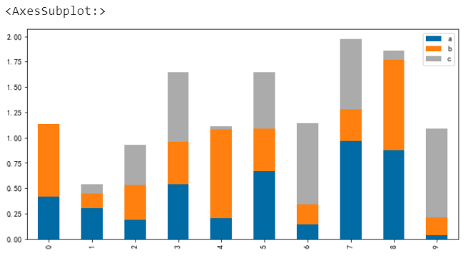
<a name="cLJiG"></a>
#### 柱状图多子图
```python
# 柱状图多子图
df.plot.bar(subplots=True, rot=0)
```
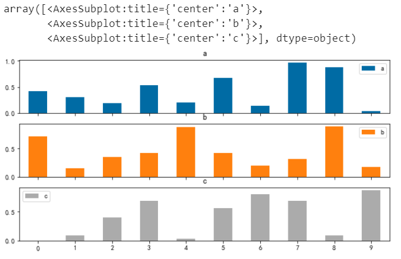
<a name="yHLKn"></a>
### 条形图
条形图和柱状图其实差不多，条形图就是柱状图的横向展示
```python
# 条形图barh
df.plot.barh(figsize=(6,8))
```
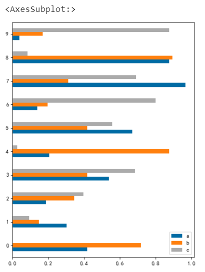
<a name="WD5gF"></a>
#### 堆叠条形图
```python
# 堆叠条形图
df.plot.barh(stacked=True)
```
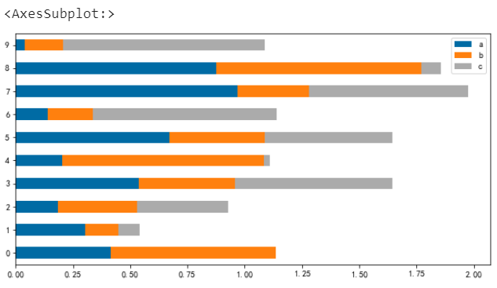
<a name="Vg7lB"></a>
### 直方图
直方图又称为质量分布图，主要用于描述数据在不同区间内的分布情况，描述的数据量一般比较大。
```python
# 直方图
np.random.seed(1)
df = pd.DataFrame(
    {
        "a": np.random.randn(1000) + 1,
        "b": np.random.randn(1000),
        "c": np.random.randn(1000) - 1,
    },
     columns=["a", "b", "c"],
)
df.head()
```
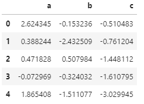
```python
df.plot.hist(alpha=0.5) # alpha设置透明度
```
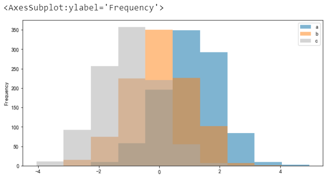
<a name="lpjKi"></a>
#### 单直方图
```python
# 单直方图
df.a.plot.hist()
```
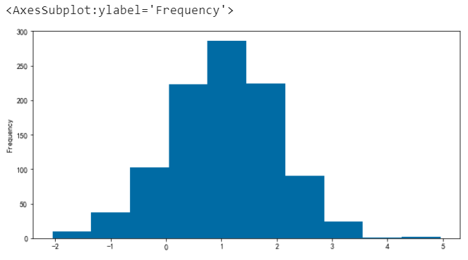
<a name="zgflq"></a>
#### 堆叠并指定分箱数（默认为 10）
```python
# 堆叠并指定分箱数（默认为 10）
df.plot.hist(stacked=True, bins=20)
```
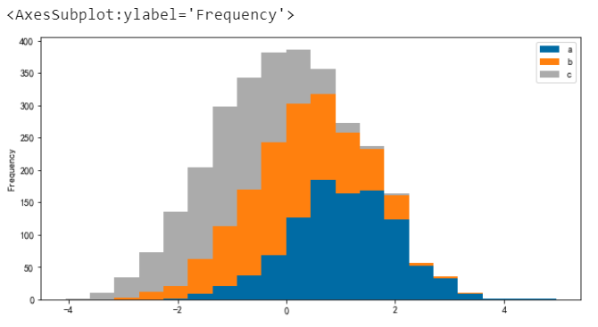
<a name="OSSNY"></a>
#### 横向展示
```python
# 可以通过orientation='horizontal'和 cumulative=True 绘制横向和累积直方图
df["a"].plot.hist(orientation="horizontal", cumulative=True)
```
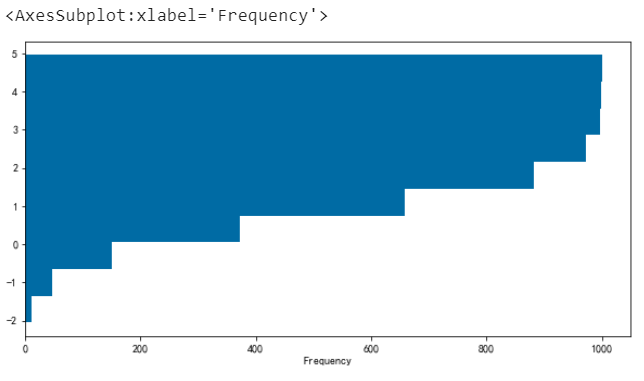
<a name="LmQJN"></a>
#### 多子图展示
```python
# 绘制多子图
df.hist(color="k", alpha=0.5, bins=50)
```
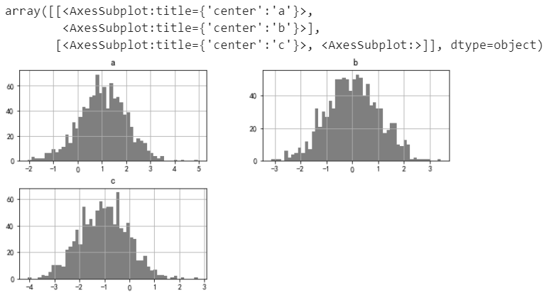
<a name="ve7Np"></a>
#### 单个直方图（自定义分箱+透明度）
```python
# 以下2种方式效果一致
df.hist('a', bins = 20, alpha=0.5)
# df.a.hist(bins = 20, alpha=0.5)
```
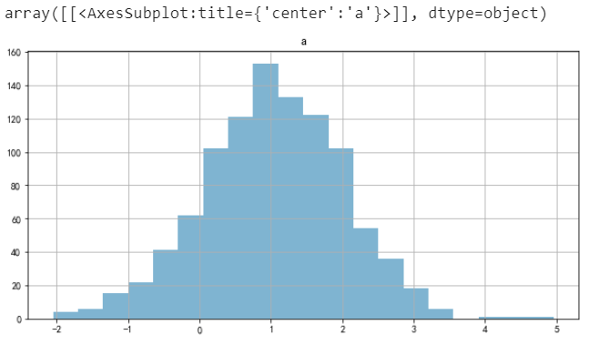
<a name="BsOIQ"></a>
#### 分组
```python
# by 分组
np.random.seed(1)
data = pd.Series(np.random.randn(1000))
data.hist(by=np.random.randint(0, 4, 1000), figsize=(6, 4))
```
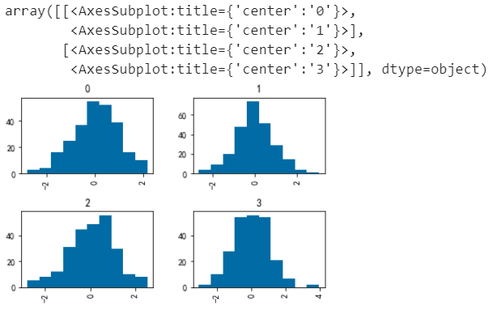
<a name="zJXeG"></a>
### 箱线图
箱线图又称盒须图、箱型图等，用于显示一组数据分布情况的统计图。
```python
np.random.seed(1)
df = pd.DataFrame(np.random.rand(10, 5), columns=["A", "B", "C", "D", "E"])
df.head()
```
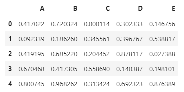
```python
df.boxplot()
```
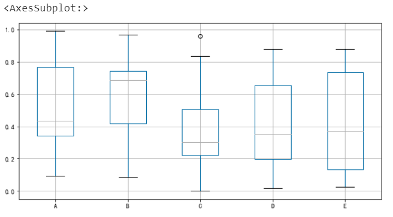
<a name="WR5vt"></a>
#### 指定元素颜色
```python
# 指定元素颜色
color = {
  "boxes": "Green", # 箱体颜色
  "whiskers": "Orange", # 连线颜色
  "medians": "Blue", # 中位数颜色
  "caps": "Gray", # 极值颜色
}

df.boxplot(color=color, sym="r+")
```
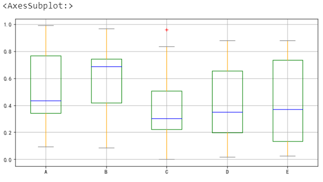
<a name="IlL2n"></a>
#### 横向展示
```python
df.boxplot(vert=False, positions=[1, 4, 5, 6, 8])
```
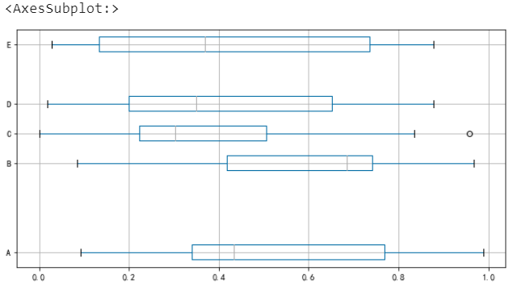
<a name="SYZKp"></a>
### 面积图
面积图又称区域图，是将折线图与坐标轴之间的区域使用颜色填充，填充颜色可以很好地突出趋势信息，一般颜色带有透明度会更合适于观察不同序列之间的重叠关系。
```python
np.random.seed(1)
df = pd.DataFrame(np.random.rand(10, 4), columns=["a", "b", "c", "d"])
df.head()
```
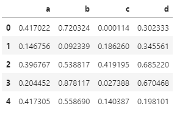<br />默认情况下，面积图是堆叠的
```python
# 默认是堆叠
df.plot.area()
```
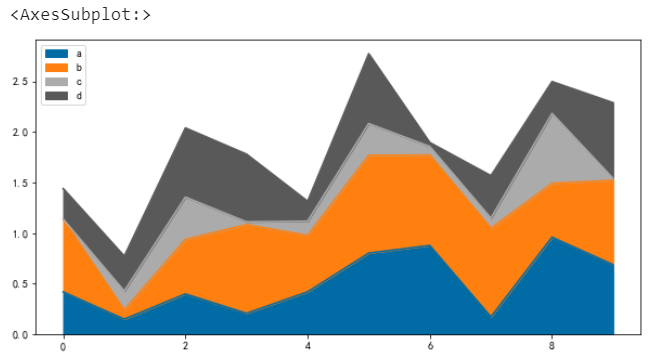
<a name="fsxkG"></a>
#### 单个面积图
```python
df.a.plot.area()
```
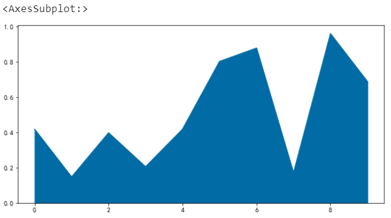
<a name="wnjiV"></a>
#### 取消堆叠
```python
# 取消堆叠
df.plot.area(stacked=False)
```
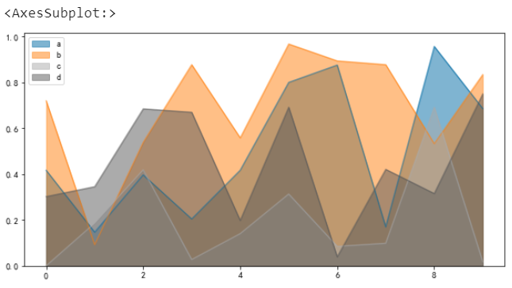
<a name="gELkm"></a>
### 散点图
散点图就是将数据点展示在直角坐标系上，可以很好地反应变量之间的相互影响程度
```python
np.random.seed(1)
df = pd.DataFrame(np.random.rand(50, 4), columns=["a", "b", "c", "d"])

df["species"] = pd.Categorical(
  ["setosa"] * 20 + ["versicolor"] * 20 + ["virginica"] * 10
)

df.head()
```
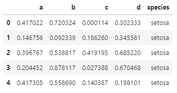<br />指定一组数据
```python
df.plot.scatter(x="a", y="b")
```
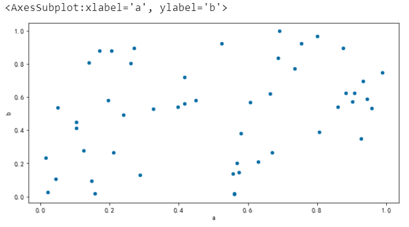<br />多组数据并用不同颜色标注
```python
ax = df.plot.scatter(x="a", y="b", color="Blue", label="Group 1")
df.plot.scatter(x="c", y="d", color="red", label="Group 2", ax=ax)
```
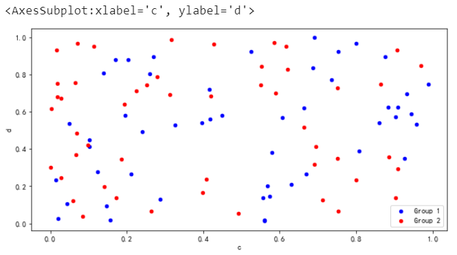<br />一组数据，x/y及z，其中x/y表示位置、z的值用于颜色区分
```python
df.plot.scatter(x="a", y="b", c="c", s=50) # 参数s代表散点大小
```
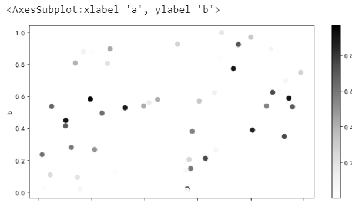<br />一组数据，然后分类并用不同颜色（色系下）表示
```python
df.plot.scatter(x="a", y="b", c="species", cmap="viridis", s=50)
```
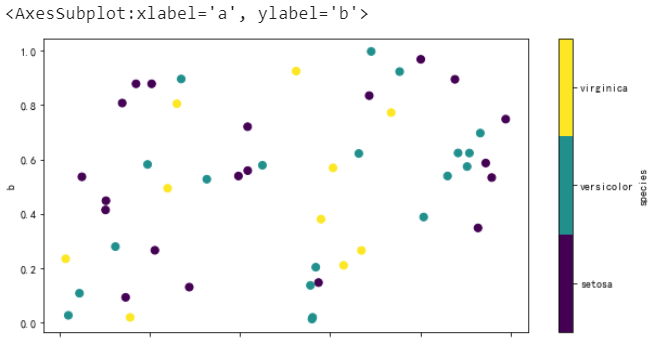
<a name="acfEG"></a>
### 气泡图
```python
df.plot.scatter(x="a", y="b", color="red", s=df["c"] * 200)
```
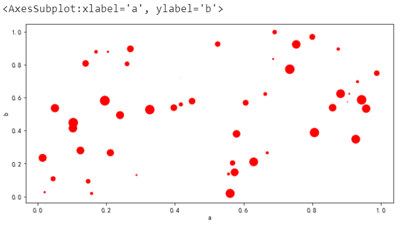
<a name="QoOUp"></a>
### 饼图
饼图主要用于不同分类的数据占总体的比例情况
```python
np.random.seed(8)
series = pd.Series(3 * np.random.rand(4), index=["a", "b", "c", "d"], name="series")
series
```
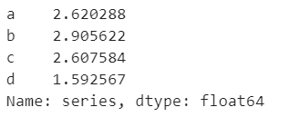
```python
series.plot.pie(figsize=(6, 6), fontsize=20)
```
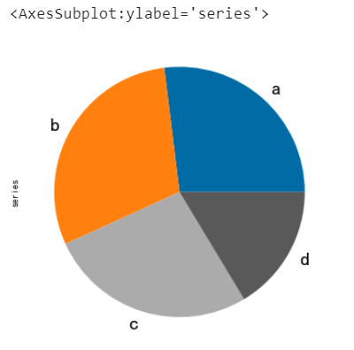
<a name="tL7g8"></a>
#### 多子图展示
```python
np.random.seed(8)
df = pd.DataFrame(
     3 * np.random.rand(4, 2), index=["a", "b", "c", "d"], columns=["x", "y"]
 )
df
```
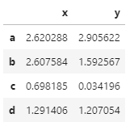
```python
df.plot.pie(subplots=True, figsize=(8, 4), fontsize=16)
```

<a name="SE0Ux"></a>
#### 指定显示样式
```python
series.plot.pie(
     labels=["AA", "BB", "CC", "DD"], # 标签
     colors=["r", "g", "b", "c"], # 指定颜色
     autopct="%.2f", # 数字格式（百分比）
     fontsize=20,
     figsize=(6, 6),
 )
```
<br />如果数据总和小于1，可以绘制扇形
```python
series = pd.Series([0.1] * 4, index=["a", "b", "c", "d"], name="series2")
series.plot.pie(figsize=(6, 6), normalize=False)
```

<a name="iQVYh"></a>
## 4、其他图表类型
在常见图表中，有密度图和六边形箱型图 绘制过程报错，暂时没有解决（本机环境：pandas1.3.1）<br />本节主要介绍散点矩形图、安德鲁曲线等，更多资料大家可以查阅官方文档了解<br />[https://pandas.pydata.org/pandas-docs/stable/user_guide/visualization.html](https://pandas.pydata.org/pandas-docs/stable/user_guide/visualization.html)
<a name="D7FK9"></a>
### 散点矩形图
```python
from pandas.plotting import scatter_matrix

df = pd.DataFrame(np.random.randn(1000, 4), columns=["a", "b", "c", "d"])
scatter_matrix(df, alpha=0.2, figsize=(6, 6), diagonal="kde")
```

<a name="wHVtk"></a>
### 安德鲁曲线
```python
from pandas.plotting import andrews_curves

data = pd.read_csv("iris.csv")
andrews_curves(data, "Name")
```

