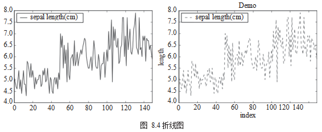
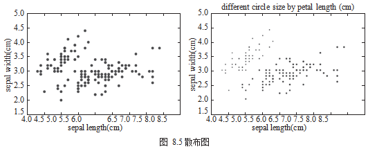
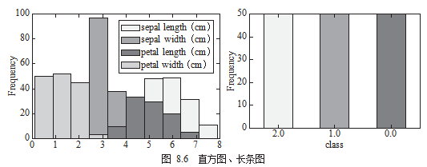
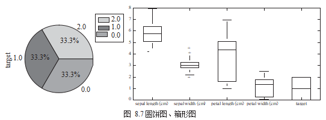
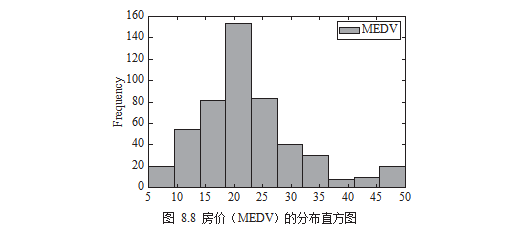
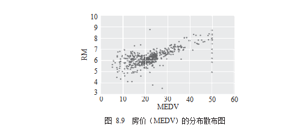
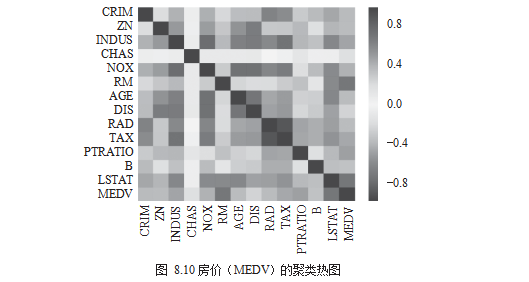

Python Pandas
<a name="Mzdt9"></a>
## 一、数据可视化与探索图
数据可视化是指用图形或表格的方式来呈现数据。图表能够清楚地呈现数据性质， 以及数据间或属性间的关系，可以轻易地让人看图释义。用户通过探索图（Exploratory Graph）可以了解数据的特性、寻找数据的趋势、降低数据的理解门槛。
<a name="adlzp"></a>
## 二、常见的图表实例
这里主要采用 Pandas 的方式来画图，而不是使用 Matplotlib 模块。其实 Pandas 已经把 Matplotlib 的画图方法整合到 DataFrame 中，因此在实际应用中，不需要直接引用 Matplotlib 也可以完成画图的工作。
<a name="lHHpU"></a>
### 1、折线图
折线图（line chart）是最基本的图表，可以用来呈现不同栏位连续数据之间的关系。绘制折线图使用的是 `plot.line()` 的方法，可以设置颜色、形状等参数。在使用上，拆线图绘制方法完全继承了 Matplotlib 的用法，所以程序最后也必须调用 `plt.show()` 产生图，如图8.4 所示。
```python
df_iris[['sepal length (cm)']].plot.line() 
plt.show()
ax = df[['sepal length (cm)']].plot.line(color='green',title="Demo",style='--') 
ax.set(xlabel="index", ylabel="length")
plt.show()
```

<a name="yk4Tn"></a>
### 2、散布图
散布图（Scatter Chart）用于检视不同栏位离散数据之间的关系。绘制散布图使用的是 `df.plot.scatter()`，如图8.5所示。
```python
df = df_iris
df.plot.scatter(x='sepal length (cm)', y='sepal width (cm)')

from matplotlib import cm 
cmap = cm.get_cmap('Spectral')
df.plot.scatter(x='sepal length (cm)',
          y='sepal width (cm)', 
          s=df[['petal length (cm)']]*20, 
          c=df['target'],
          cmap=cmap,
          title='different circle size by petal length (cm)')
```

<a name="lMinl"></a>
### 3、直方图、长条图 
直方图（Histogram Chart）通常用于同一栏位，呈现连续数据的分布状况，与直方图类似的另一种图是长条图（Bar Chart），用于检视同一栏位，如图 8.6 所示。
```python
df[['sepal length (cm)', 'sepal width (cm)', 'petal length (cm)','petal width (cm)']].plot.hist()
2 df.target.value_counts().plot.bar()
```

<a name="tDlIW"></a>
### 4、圆饼图、箱形图
圆饼图（Pie Chart）可以用于检视同一栏位各类别所占的比例，而箱形图（Box Chart）则用于检视同一栏位或比较不同栏位数据的分布差异，如图 8.7 所示。
```python
df.target.value_counts().plot.pie(legend=True)
df.boxplot(column=['target'],figsize=(10,5))
```

<a name="eCM6m"></a>
## 数据探索实战分享
用两个真实的数据集实际展示数据探索的几种手法。
<a name="YdKA0"></a>
### 一、2013年美国社区调查
在美国社区调查（American Community Survey）中，每年约有 350 万个家庭被问到关于他们是谁及他们如何生活的详细问题。调查的内容涵盖了许多主题，包括祖先、教育、工作、交通、互联网使用和居住。<br />数据来源：[https://www.kaggle.com/census/2013-american-community-survey](https://www.kaggle.com/census/2013-american-community-survey)。<br />数据名称：2013 American Community Survey。<br />先观察数据的样子与特性，以及每个栏位代表的意义、种类和范围。
```python
# 读取数据
df = pd.read_csv("./ss13husa.csv")
# 栏位种类数量
df.shape
# (756065,231)

# 栏位数值范围
df.describe()
```
先将两个 ss13pusa.csv 串连起来，这份数据总共包含 30 万笔数据，3 个栏位：SCHL ( 学历，School Level)、 PINCP ( 收入，Income) 和 ESR ( 工作状态，Work Status)。
```python
pusa = pd.read_csv("ss13pusa.csv") pusb = pd.read_csv("ss13pusb.csv")
# 串接两份数据
col = ['SCHL','PINCP','ESR']
df['ac_survey'] = pd.concat([pusa[col],pusb[col],axis=0)
```
依据学历对数据进行分群，观察不同学历的数量比例，接着计算他们的平均收入。
```python
group = df['ac_survey'].groupby(by=['SCHL']) print('学历分布:' + group.size())
group = ac_survey.groupby(by=['SCHL']) print('平均收入:' +group.mean())
```
<a name="pKlLG"></a>
### 二、波士顿房屋数据集
波士顿房屋数据集（Boston House Price Dataset）包含有关波士顿地区的房屋信息， 包 506 个数据样本和 13 个特征维度。<br />数据来源：[https://archive.ics.uci.edu/ml/machine-learning-databases/housing/](https://archive.ics.uci.edu/ml/machine-learning-databases/housing/)。<br />数据名称：Boston House Price Dataset。<br />先观察数据的样子与特性，以及每个栏位代表的意义、种类和范围。<br />可以用直方图的方式画出房价（MEDV）的分布，如图 8.8 所示。
```python
df = pd.read_csv("./housing.data")
# 栏位种类数量
df.shape
# (506, 14)

#栏位数值范围df.describe()
import matplotlib.pyplot as plt 
df[['MEDV']].plot.hist() 
plt.show()
```
<br />接下来需要知道的是哪些维度与“房价”关系明显。先用散布图的方式来观察，如图8.9所示。
```python
# draw scatter chart 
df.plot.scatter(x='MEDV', y='RM') .
plt.show()
```
<br />最后，计算相关系数并用聚类热图（Heatmap）来进行视觉呈现，如图 8.10 所示。
```python
# compute pearson correlation 
corr = df.corr()
# draw  heatmap 
import seaborn as sns 
corr = df.corr() 
sns.heatmap(corr) 
plt.show()
```
<br />颜色为红色，表示正向关系；颜色为蓝色，表示负向关系；颜色为白色，表示没有关系。RM 与房价关联度偏向红色，为正向关系；LSTAT、PTRATIO 与房价关联度偏向深蓝， 为负向关系；CRIM、RAD、AGE 与房价关联度偏向白色，为没有关系。
