Python Pandas lux 可视化<br />Pandas是用于数据处理的核心库，它也可以进行简单的可视化，绘制散点、折线、直方等基础图表都不在话下。<br />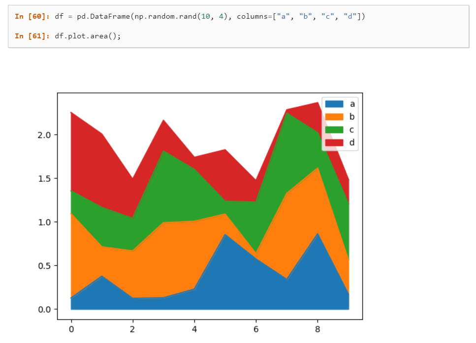<br />Pandas自带的可视化方法是基于matplotlib的函数接口，在Jupyter里可以静态展示。<br />这次介绍一个可视化工具-LUX，它能自动地将DataFrame数据转化为统计图表，可以一目了然地看到相关性、分布、频率等信息。<br /><br />LUX在Jupyter Notebook或Lab中进行交互，图表与数据可以同步显示。<br />项目地址： <br />[https://github.com/lux-org/lux](https://github.com/lux-org/lux)
<a name="QhknU"></a>
## 安装设置
lux安装过程和其他库一样，可以通过pip或conda安装，直接在命令行输入：
```bash
pip install lux-api
```
或
```bash
conda install -c conda-forge lux-api
```
因为lux一般用在Jupyter生态中，所以需要安装并激活luxwidget拓展，才能显示交互式窗口。<br />如果是在Jupyter Notebook或VSCode中使用，使用下面代码激活拓展：
```bash
jupyter nbextension install --py luxwidget
jupyter nbextension enable --py luxwidget
```
如果使用的是Jupyter Lab，则激活lab拓展：
```bash
jupyter labextension install @jupyter-widgets/jupyterlab-manager
jupyter labextension install luxwidget
```
<a name="UmxtP"></a>
## 使用LUX
以下面数据集（美国各大学信息表）为例：
```python
# 导入pandas和lux库
import pandas as pd
import lux

#加载数据
df = pd.read_excel("C:\\Users\\zii\\Documents\\USA_College.xlsx")
df
```

读取的数据如下：<br />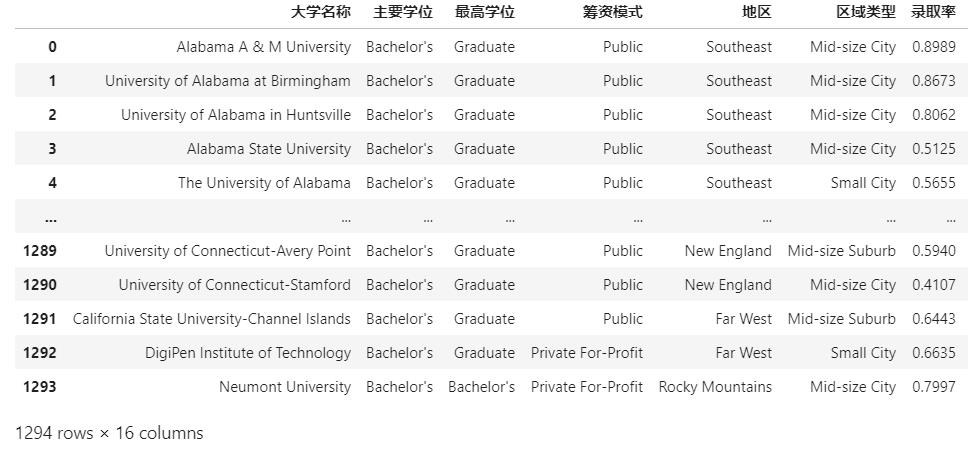<br />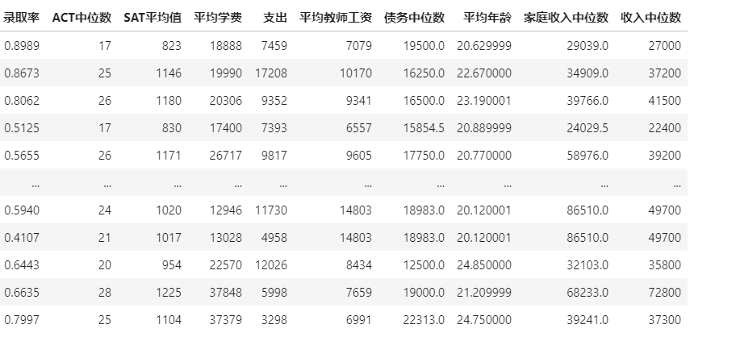<br />除了显示的数据表外，同时还会看到数据集上面出现一个按钮，可以进行数据/图表的交换显示。<br />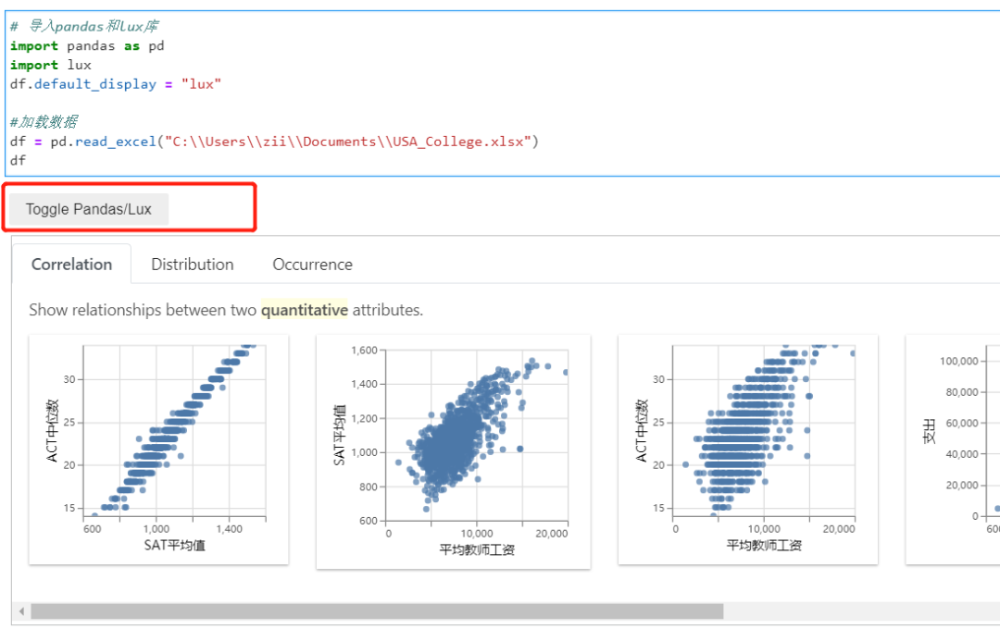<br />所以说只需要导入lux库，就能直接使用图表功能。<br />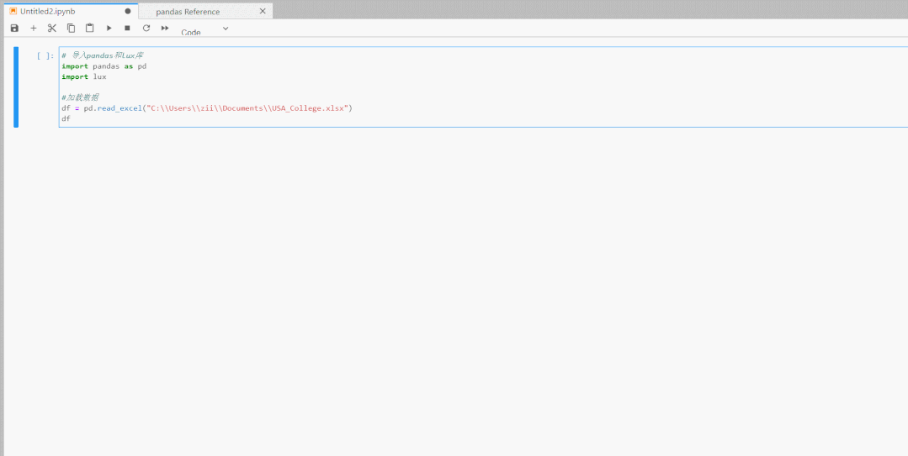<br />LUX显示有三种类型的图表，代表的统计学含义分别是相关性、直方分布、事件频次。<br />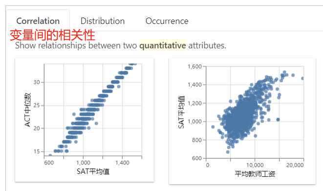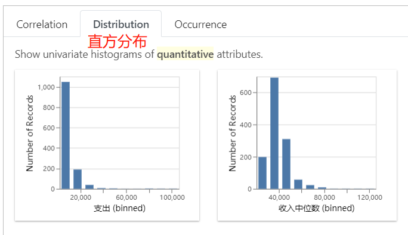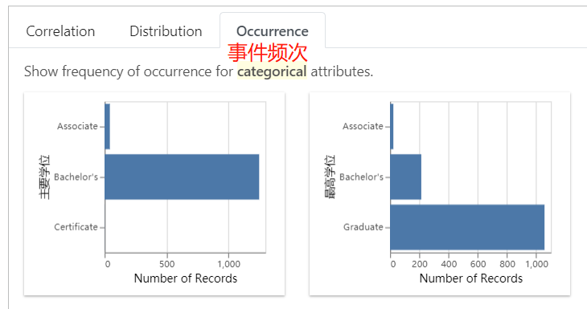<br />除了全表的可视化探索外，还可以研究特定变量间的关系。<br />比如想看SAT平均值和收入中位数的关联性.
```python
df.intent = ['SAT平均值','收入中位数']
df
```
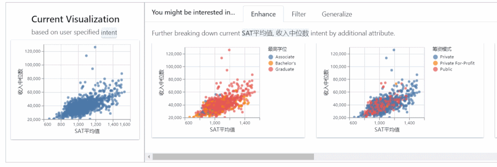<br />左边的表是两个变量的总体分布，右边是在有筛选条件下的分布。
<a name="hZPIz"></a>
## 导出图表
LUX支持图表的导出，既可以导出图表文件，也可以导出相应的matplotlib、altair代码。<br />首先选定一个或多个图表，点击导出按钮。<br />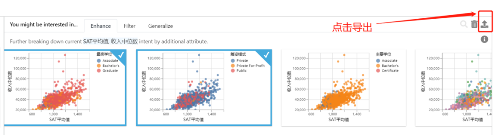<br />可以直接将选定的图表单独显示出来：<br />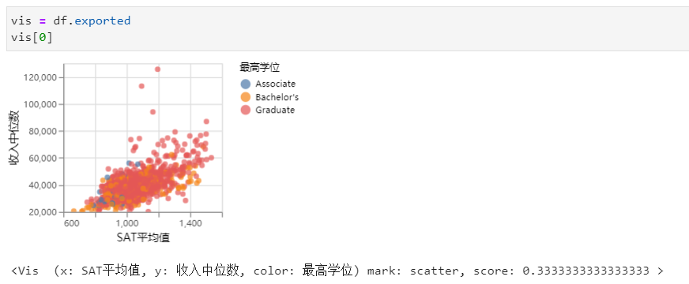
<a name="MiRCb"></a>
### 导出`htmldf.save_as_html('hpi.html')`
<a name="p8pHc"></a>
### 导出matplotlib代码
```python
vis = df.exported
print (vis[0].to_matplotlib())
```
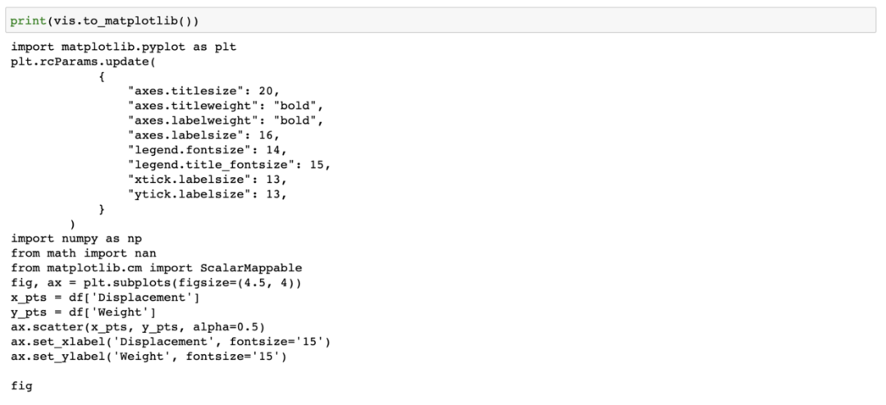
<a name="HjIFA"></a>
### 导出altair代码
```python
vis = df.exported
print(vis[0].to_Altair())
```
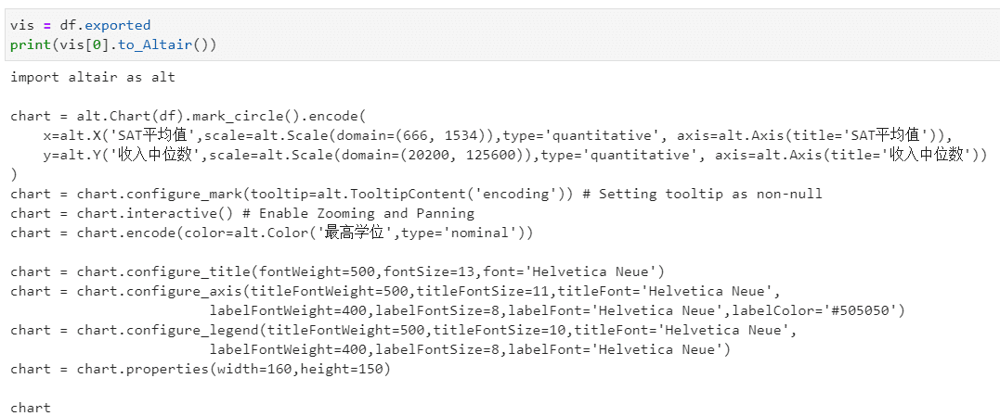
<a name="ULMz2"></a>
### 导出的代码可以直接运行
```python
import altair as alt

chart = alt.Chart(df).mark_circle().encode(
    x=alt.X('SAT平均值',scale=alt.Scale(domain=(666, 1534)),type='quantitative', axis=alt.Axis(title='SAT平均值')),
    y=alt.Y('收入中位数',scale=alt.Scale(domain=(20200, 125600)),type='quantitative', axis=alt.Axis(title='收入中位数'))
)
chart = chart.configure_mark(tooltip=alt.TooltipContent('encoding')) # Setting tooltip as non-null
chart = chart.interactive() # Enable Zooming and Panning
chart = chart.encode(color=alt.Color('最高学位',type='nominal'))

chart = chart.configure_title(fontWeight=500,fontSize=13,font='Helvetica Neue')
chart = chart.configure_axis(titleFontWeight=500,titleFontSize=11,titleFont='Helvetica Neue',
labelFontWeight=400,labelFontSize=8,labelFont='Helvetica Neue',labelColor='#505050')
chart = chart.configure_legend(titleFontWeight=500,titleFontSize=10,titleFont='Helvetica Neue',
labelFontWeight=400,labelFontSize=8,labelFont='Helvetica Neue')
chart = chart.properties(width=160,height=150)

chart
```
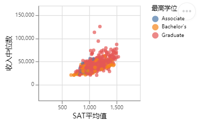
