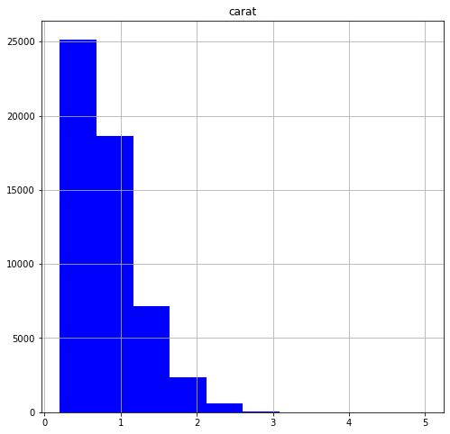

Python Pandas <br />可视化是用来探索性数据分析最强大的工具之一。Pandas库包含基本的绘图功能，可以创建各种绘图。Pandas中的绘图是在matplotlib之上构建的，如果很熟悉matplotlib可以发现他们的绘图风格是一样的。<br />本案例用到的数据集是关于钻石的。
```python
import numpy as np
import pandas as pd
import matplotlib
%matplotlib inline
```
```python
diamonds = pd.read_csv("diamonds.csv")
diamonds = diamonds.drop("Unnamed: 0", axis=1)
print(diamonds.shape)        
diamonds.head(5)
```
```
(53940, 10)
```
<br />输出结果显示，数据集包含53940个不同钻石的10个特征，其中有数值变量也有分类变量。
<a name="rhl6V"></a>
## 柱状图
柱状图是一个单变量图（注意区分柱状图和条形图），它将一个数值变量分组到各个数值单元中，并显示每个单元中的观察值数量。直方图是了解数值变量分布的一种有用工具。所用到的方法是`df.hist()`
```python
diamonds.hist(column="carat",        # 具体列
              figsize=(8,8),         # 图片大小
              color="blue");         # 绘画颜色
```
<br />从图上可以看到钻石重量的分布是十分倾斜的：大多数钻石大约1克拉及以下，但也有极少量极端值。<br />为了获得更多细节的数据，可以增加分箱的数量来查看更小范围内的钻石重量，通过限制x轴的宽度使整个图形在画布上显得不那么拥挤。
```python
diamonds.hist(column="carat",        
              figsize=(8,8),         
              color="blue",          
              bins=50,               
              range= (0,3.5));
```
<br />这个直方图让我们更好地了解了分布中的一些细微差别，但不能确定它是否包含所有数据。将X轴限制在3.5可能会剔除一些异常值，以至于它们在原始图表中没有显示。接下来看看有没有钻石大于3.5克拉：
```python
diamonds[diamonds["carat"] > 3.5]
```

<a name="9Oxjf"></a>
## 箱线图
箱线图是另一种单变量图， 方法`pd.boxplot()`
```python
diamonds.boxplot(column="carat");
```
<br />箱线图的中心框代表中间50%的观察值，中心线代表中位数。<br />`boxplot`最有用的特性之一是能够生成并排的`boxplots`。每个分类变量都在一个不同的`boxside`上绘制一个分类变量。接下来将钻石价格按钻石净度分成两部分来做一个并排的方框图：
```python
diamonds.boxplot(column="price",        
                 by= "clarity",         
                 figsize= (8,8));
```
<br />上面的箱线图很奇怪：按理说清晰度更好的钻石能卖到更高的价格，然而清晰度最高的钻石(IF)的中间价却比低净度钻石低！这是为什么呢？也许下面这个图可以给一些启示：
```python
diamonds.boxplot(column="carat",        
                 by= "clarity",         
                 figsize= (8,8));
```
<br />上面的图表显示，透明度较低的钻石往往更大,透明度高的钻石更加小巧。由于尺寸重量是决定钻石价值的另一个重要因素，因此低透明度钻石的中间价较高也就不足为奇了。
<a name="FIHnI"></a>
## 密度图
密度图以连续曲线显示数值变量的分布。它类似于柱状图，但密度图能更好地显示分布的基本形状。`series.plot(kind="density")`
```python
diamonds["carat"].plot(kind="density", 
                      figsize=(8,8),    
                      xlim= (0,5));
```

<a name="1galH"></a>
## 条形图
条形图是直观显示分类变量计数的图形，`df.plot(kind="bar")`：
```python
carat_table = pd.crosstab(index=diamonds["clarity"], columns="count")
carat_table
```

```python
carat_table.plot(kind="bar",
                 figsize=(8,8));
```
<br />可以使用二维表格创建堆积条形图。堆积条形图显示每个条形图中另一个变量的分布：
```python
carat_table = pd.crosstab(index=diamonds["clarity"], 
                          columns=diamonds["color"])
carat_table
```

```python
carat_table.plot(kind="bar", 
                 figsize=(8,8),
                 stacked=True);
```
<br />分组条形图是堆叠条形图的另一种选择，设置stacked=False即可：
```python
carat_table.plot(kind="bar", 
                 figsize=(8,8),
                 stacked=False);
```

<a name="s6odq"></a>
## 散点图
散点图是双变量图，采用两个数值变量，并在x/y平面上绘制数据点。创建单个散点图使用方法`df.plot(kind="scatter")`：
```python
diamonds.plot(kind="scatter",     # Create a scatterplot
              x="carat",          # Put carat on the x axis
              y="price",          # Put price on the y axis
              figsize=(10,10),
              ylim=(0,20000));
```
<br />尽管上面的散点图有许多重叠点，但它仍然让我们对钻石克拉重量和价格之间的关系有了一些了解：大钻石通常更贵。
<a name="6qNiR"></a>
## 折线图
折线图通常用于绘制时间序列数据：
```python
years = [y for y in range(1950,2016)]
readings = [(y+np.random.uniform(0,20)-1900) for y in years]
time_df = pd.DataFrame({"year":years,
                        "readings":readings})
time_df.plot(x="year",
             y="readings",
             figsize=(9,9));
```

<a name="ker1v"></a>
## 保存绘图
如果要保存图片供以后使用，两步就可以轻松解决：首先用`plot.get_figure()`，然后用`figure.savefig("filename")`。图片可以保存为多种常见的文件格式，例如png、jpeg和pdf。
```python
my_plot = time_df.plot(x="year",    
             y="readings",
             figsize=(9,9))
my_fig = my_plot.get_figure()            
my_fig.savefig("line_plot_example.png")
```
