Python Pandas
<a name="PZj36"></a>
## Pandas的基本功能
Pandas常用的基本功能如下：

- 从Excel、CSV、网页、SQL、剪贴板等文件或工具中读取数据；
- 合并多个文件或者电子表格中的数据，将数据拆分为独立文件；
- 数据清洗，如去重、处理缺失值、填充默认值、补全格式、处理极端值等；
- 建立高效的索引；
- 支持大体量数据；
- 按一定业务逻辑插入计算后的列、删除列；
- 灵活方便的数据查询、筛选；
- 分组聚合数据，可独立指定分组后的各字段计算方式；
- 数据的转置，如行转列、列转行变更处理；
- 连接数据库，直接用SQL查询数据并进行处理；
- 对时序数据进行分组采样，如按季、按月、按工作小时，也可以自定义周期，如工作日；
- 窗口计算，移动窗口统计、日期移动等；
- 灵活的可视化图表输出，支持所有的统计图形；
- 为数据表格增加展示样式，提高数据识别效率。
<a name="v2q1d"></a>
## Pandas快速入门
<a name="Aat0Y"></a>
### 1、安装导入
首先安装pandas库。打开“终端”并执行以下命令：
```bash
pip install pandas matplotlib

# 如网络慢，可指定国内源快速下载安装
pip install pandas matplotlib -i https://pypi.tuna.tsinghua.edu.cn/simple
```
安装完成后，在终端中启动Jupyter Notebook，给文件命名，如pandas-01。在Jupyter Notebook中导入Pandas，按惯例起别名pd：
```python
# 引入 Pandas库，按惯例起别名pd

import pandas as pd
```
这样就可以使用pd调用Pandas的所有功能了。
<a name="txUl7"></a>
### 2、准备数据集
数据集（Data set或dataset），又称为资料集、数据集合或资料集合，是一种由数据组成的集合，可以简单理解成一个Excel表格。在分析处理数据时，要先了解数据集。对所持有数据各字段业务意义的理解是分析数据的前提。<br />介绍下后面会经常用的数据集team.xlsx，可以从网址 [https://www.gairuo.com/file/data/dataset/team.xlsx](https://www.gairuo.com/file/data/dataset/team.xlsx)下载。它的内容见表1。<br />[team.xlsx](https://www.yuque.com/attachments/yuque/0/2021/xlsx/396745/1628125991332-660a2f71-f0b3-4aff-8dc9-e948869e6b0b.xlsx?_lake_card=%7B%22src%22%3A%22https%3A%2F%2Fwww.yuque.com%2Fattachments%2Fyuque%2F0%2F2021%2Fxlsx%2F396745%2F1628125991332-660a2f71-f0b3-4aff-8dc9-e948869e6b0b.xlsx%22%2C%22name%22%3A%22team.xlsx%22%2C%22size%22%3A12277%2C%22type%22%3A%22application%2Fvnd.openxmlformats-officedocument.spreadsheetml.sheet%22%2C%22ext%22%3A%22xlsx%22%2C%22status%22%3A%22done%22%2C%22taskId%22%3A%22u03948405-1d37-4521-b1fc-a6fb3b88512%22%2C%22taskType%22%3A%22upload%22%2C%22id%22%3A%22u39516b77%22%2C%22card%22%3A%22file%22%7D)<br />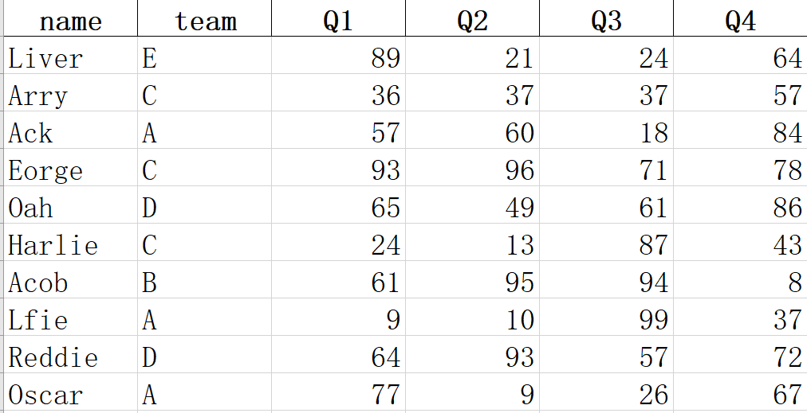<br />表1 team.xlsx的部分内容<br />这是一个学生各季度成绩总表（节选），各列说明如下。

- name：学生的姓名，这列没有重复值，一个学生一行，即一条数据，共100条。
- team：所在的团队、班级，这个数据会重复。
- Q1～Q4：各个季度的成绩，可能会有重复值。
<a name="C2uDF"></a>
### 3、读取数据
了解了数据集的意义后，将数据读取到Pandas里，变量名用df（DataFrame的缩写，后续会介绍），它是Pandas二维数据的基础结构。
```python
import pandas as pd # 引入Pandas库，按惯例起别名pd

# 以下两种效果一样，如果是网址，它会自动将数据下载到内存

df = pd.read_excel('https://www.gairuo.com/file/data/dataset/team.xlsx')

df = pd.read_excel('team.xlsx') # 文件在notebook文件同一目录下

# 如果是CSV，使用pd.read_csv()，还支持很多类型的数据读取
```
这样就把数据读取到变量df中，输入df看一下内容，在Jupyter Notebook中的执行效果如图2所示。<br /><br />图2 读取数据的执行效果<br />其中：

- 自动增加了第一列，是Pandas为数据增加的索引，从0开始，程序不知道真正的业务索引，往往需要后面重新指定，使它有一定的业务意义；
- 由于数据量大，自动隐藏了中间部分，只显示前后5条；
- 底部显示了行数和列数。
<a name="XIP7g"></a>
### 4、查看数据
读取完数据后来查看一下数据：
```python
df.head() # 查看前5条，括号里可以写明你想看的条数

df.tail() # 查看尾部5条

df.sample(5) # 随机查看5条
```
查看前5条时的结果如图3所示。<br />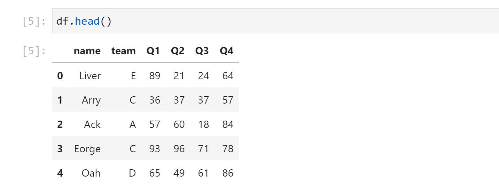<br />图3 查看df前5条数据
<a name="IzXxH"></a>
### 5、验证数据
拿到数据，还需要验证一下数据是否加载正确，数据大小是否正常。下面是一些常用的代码，可以执行看看效果（一次执行一行）：
```python
df.shape # (100, 6) 查看行数和列数

df.info() # 查看索引、数据类型和内存信息

df.describe() # 查看数值型列的汇总统计

df.dtypes # 查看各字段类型

df.axes # 显示数据行和列名

df.columns # 列名
```
`df.info()`显示有数据类型、索引情况、行列数、各字段数据类型、内存占用等：
```python
df.info()

<class 'pandas.core.frame.DataFrame'>
RangeIndex: 100 entries, 0 to 99
Data columns (total 6 columns):
 #   Column  Non-Null Count  Dtype 
---  ------  --------------  ----- 
 0   name    100 non-null    object
 1   team    100 non-null    object
 2   Q1      100 non-null    int64 
 3   Q2      100 non-null    int64 
 4   Q3      100 non-null    int64 
 5   Q4      100 non-null    int64 
dtypes: int64(4), object(2)
memory usage: 4.8+ KB
```
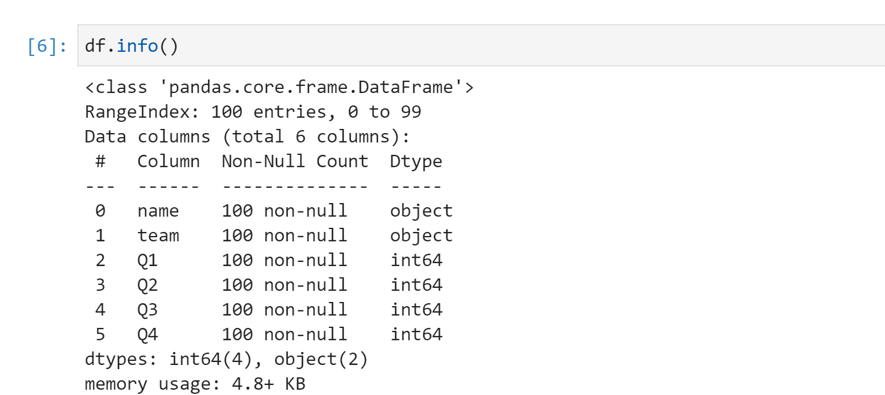<br />`df.describe()`会计算出各数字字段的总数（count）、平均数（mean）、标准差（std）、最小值（min）、四分位数和最大值（max）：
```python
	Q1	Q2	Q3	Q4
count	100.000000	100.000000	100.000000	100.000000
mean	49.200000	52.550000	52.670000	52.780000
std	29.962603	29.845181	26.543677	27.818524
min	1.000000	1.000000	1.000000	2.000000
25%	19.500000	26.750000	29.500000	29.500000
50%	51.500000	49.500000	55.000000	53.000000
75%	74.250000	77.750000	76.250000	75.250000
max	98.000000	99.000000	99.000000	99.000000
```
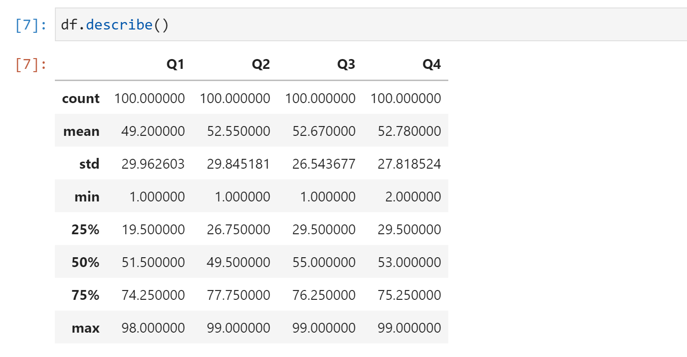
<a name="so07Y"></a>
### 6、建立索引
以上数据真正业务意义上的索引是name列，所以需要使它成为索引：
```python
df.set_index('name', inplace=True) # 建立索引并生效
```
其中可选参数`inplace=True`会将指定好索引的数据再赋值给df使索引生效，否则索引不会生效。注意，这里并没有修改原Excel，从读取数据后就已经和它没有关系了，处理的是内存中的df变量。<br />将name建立索引后，就没有从0开始的数字索引了，如图4所示。<br /><br />图4 将name设置为索引的执行效果
<a name="HcKql"></a>
### 7、数据选取
接下来，像Excel那样，对数据做一些筛选操作。
<a name="erhMn"></a>
#### （1）选择列
选择列的方法如下：
```python
# 查看指定列

df['Q1']
df.Q1 # 同上，如果列名符合Python变量名要求，可使用
```
显示如下内容：<br />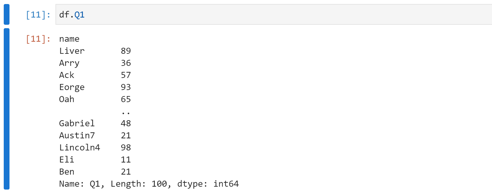<br />这里返回的是一个Series类型数据，可以理解为数列，它也是带索引的。之前建立的索引在这里发挥出了作用，否则索引是一个数字，无法知道与之对应的是谁的数据。<br />选择多列的可以用以下方法：
```python
# 选择多列

df[['team', 'Q1']] # 只看这两列，注意括号

df.loc[:, ['team', 'Q1']] # 和上一行效果一样
```
`df.loc[x, y]`是一个非常强大的数据选择函数，其中x代表行，y代表列，行和列都支持条件表达式，也支持类似列表那样的切片（如果要用自然索引，需要用`df.iloc[]`）。下面的例子中会进行演示。
<a name="WuYU6"></a>
#### （2）选择行
选择行的方法如下：
```python
# 用指定索引选取

df[df.index == 'Liver'] # 指定姓名


# 用自然索引选择，类似列表的切片

df[0:3] # 取前三行

df[0:10:2] # 在前10个中每两个取一个

df.iloc[:10,:] # 前10个
```
<a name="mXyZn"></a>
#### （3）指定行和列
同时给定行和列的显示范围：
```python
df.loc['Ben', 'Q1':'Q4'] # 只看Ben的四个季度成绩

df.loc['Eorge':'Alexander', 'team':'Q4'] # 指定行区间
```
<a name="nudVp"></a>
#### （4）条件选择
按一定的条件显示数据：
```python
# 单一条件

df[df.Q1 > 90] # Q1列大于90的

df[df.team == 'C'] # team列为'C'的

df[df.index == 'Oscar'] # 指定索引即原数据中的name


# 组合条件

df[(df['Q1'] > 90) & (df['team'] == 'C')] # and关系

df[df['team'] == 'C'].loc[df.Q1>90] # 多重筛选
```
<a name="lyk4m"></a>
### 8、排序
Pandas的排序非常方便，示例如下：
```python
df.sort_values(by='Q1') # 按Q1列数据升序排列

df.sort_values(by='Q1', ascending=False) # 降序

df.sort_values(['team', 'Q1'], ascending=[True, False]) # team升序，Q1降序
```
<a name="zKk2Z"></a>
### 9、分组聚合
可以实现类似SQL的`groupby`那样的数据透视功能：
```python
df.groupby('team').sum() # 按团队分组对应列相加

df.groupby('team').mean() # 按团队分组对应列求平均

# 不同列不同的计算方法
df.groupby('team').agg({'Q1': sum,  # 总和
                        'Q2': 'count', # 总数
                        'Q3':'mean', # 平均
                        'Q4': max}) # 最大值
```
统一聚合执行后的效果如图5所示。<br />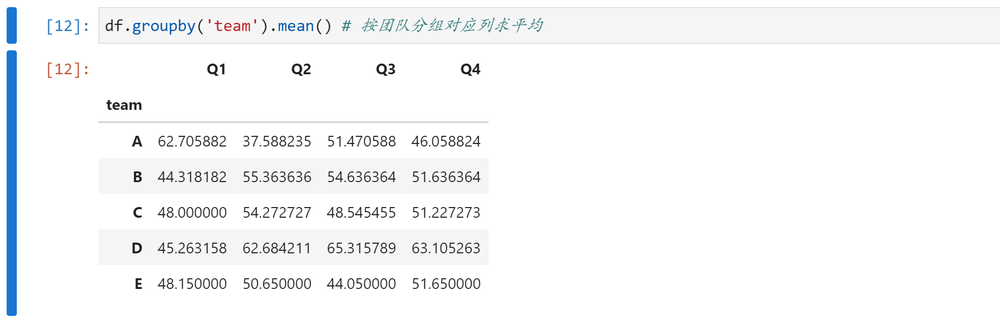<br />图5 按team分组后求平均数<br />不同计算方法聚合执行后的效果如图6所示。<br />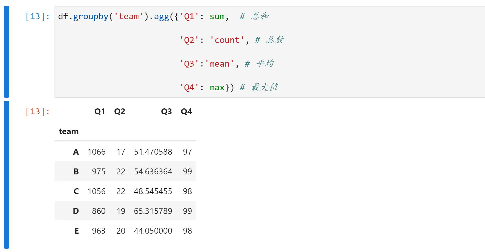<br />图6 分组后每列用不同的方法聚合计算
<a name="nzVMo"></a>
### 10、数据转换
对数据表进行转置，对类似图6中的数据以A-Q1、E-Q4两点连成的折线为轴对数据进行翻转，效果如图7所示，不过这里仅用`sum`聚合。
```python
df.groupby('team').sum().T
```
<br />图7 对聚合后的数据进行翻转<br />也可以试试以下代码，看有什么效果：
```python
df.groupby('team').sum().stack()

df.groupby('team').sum().unstack()
```
<a name="cesft"></a>
### 11、增加列
用Pandas增加一列非常方便，就与新定义一个字典的键值一样。
```python
df['one'] = 1 # 增加一个固定值的列

df['total'] = df.Q1 + df.Q2 + df.Q3 + df.Q4 # 增加总成绩列

# 将计算得来的结果赋值给新列

df['total'] = df.loc[:,'Q1':'Q4'].apply(lambda x:sum(x), axis=1)

df['total'] = df.sum(axis=1) # 可以把所有为数字的列相加

df['avg'] = df.total/4 # 增加平均成绩列
```
<a name="bCMQ7"></a>
### 12、统计分析
根据数据分析目标，试着使用以下函数，看看能得到什么结论。
```python
df.mean() # 返回所有列的均值

df.mean(1) # 返回所有行的均值，下同

df.corr() # 返回列与列之间的相关系数

df.count() # 返回每一列中的非空值的个数

df.max() # 返回每一列的最大值

df.min() # 返回每一列的最小值

df.median() # 返回每一列的中位数

df.std() # 返回每一列的标准差

df.var() # 方差

s.mode() # 众数
```
<a name="us1Ue"></a>
### 13、绘图
Pandas利用`plot()`调用Matplotlib快速绘制出数据可视化图形。注意，第一次使用`plot()`时可能需要执行两次才能显示图形。如图8所示，可以使用`plot()`快速绘制折线图。
```python
df['Q1'].plot() # Q1成绩的折线分布
```
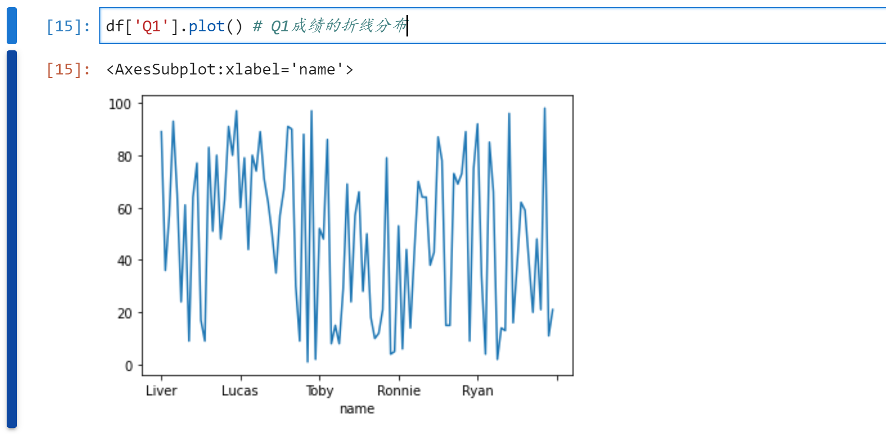<br />图8 利用`plot()`快速绘制折线图<br />如图9所示，可以先选择要展示的数据，再绘图。
```python
df.loc['Ben','Q1':'Q4'].plot() # ben四个季度的成绩变化
```
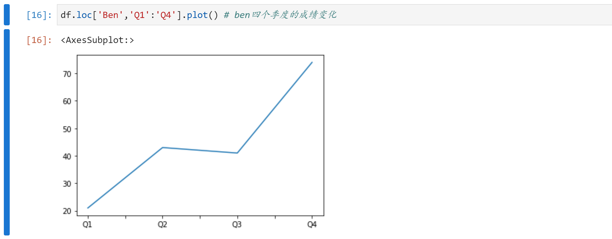<br />图9 选择部分数据绘制折线图<br />如图10所示，可以使用`plot.bar`绘制柱状图。
```python
df.loc[ 'Ben','Q1':'Q4'].plot.bar() # 柱状图

df.loc[ 'Ben','Q1':'Q4'].plot.barh() # 横向柱状图
```
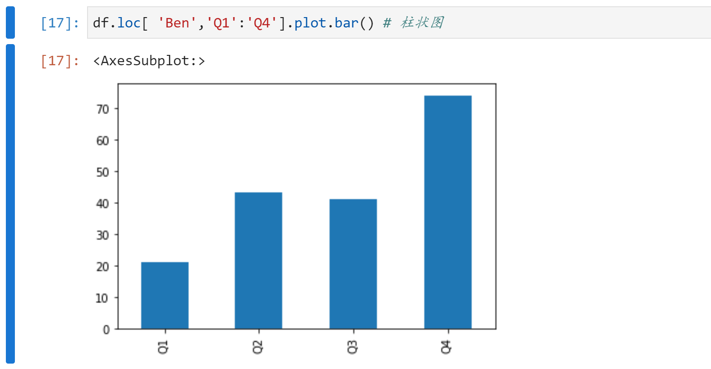<br />图10 利用plot.bar绘制的柱状图<br />如果想绘制横向柱状图，可以将bar更换为barh，如图11所示。<br />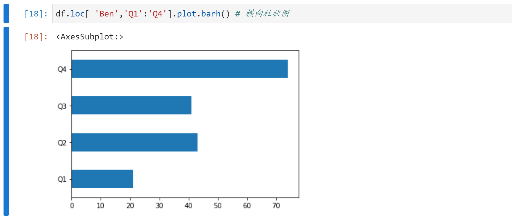<br />图11 利用barh绘制的横向柱状图<br />对数据聚合计算后，可以绘制成多条折线图，如图12所示。
```python
# 各Team四个季度总成绩趋势

df.groupby('team').sum().T.plot()
```
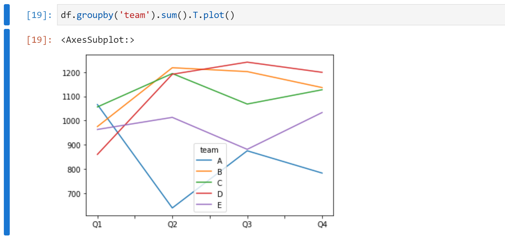<br />图12 多条折线图<br />也可以用pie绘制饼图，如图13所示。
```python
# 各组人数对比

df.groupby('team').count().Q1.plot.pie()
```
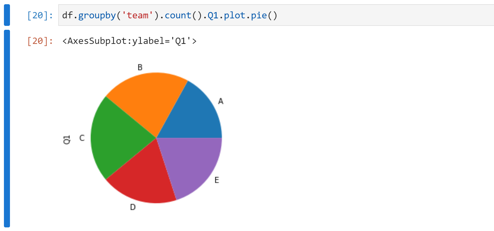<br />图13 饼图的绘制效果
<a name="JGRn2"></a>
### 14、导出
可以非常轻松地导出Excel和CSV文件。
```python
df.to_excel('team-done.xlsx') # 导出 Excel文件

df.to_csv('team-done.csv') # 导出 CSV文件
```
导出的文件位于notebook文件的同一目录下。
<a name="f7xkw"></a>
## 本示例的Jupyter代码
[Pandas-samples.ipynb](https://www.yuque.com/attachments/yuque/0/2021/ipynb/396745/1628126014639-b128c99c-10f8-49d2-a397-7b41251487bd.ipynb?_lake_card=%7B%22src%22%3A%22https%3A%2F%2Fwww.yuque.com%2Fattachments%2Fyuque%2F0%2F2021%2Fipynb%2F396745%2F1628126014639-b128c99c-10f8-49d2-a397-7b41251487bd.ipynb%22%2C%22name%22%3A%22Pandas-samples.ipynb%22%2C%22size%22%3A133194%2C%22type%22%3A%22%22%2C%22ext%22%3A%22ipynb%22%2C%22status%22%3A%22done%22%2C%22taskId%22%3A%22u12b30cb4-c859-459a-b372-20bd908f5d6%22%2C%22taskType%22%3A%22upload%22%2C%22id%22%3A%22u3074f459%22%2C%22card%22%3A%22file%22%7D)
