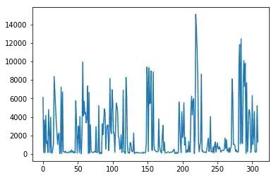
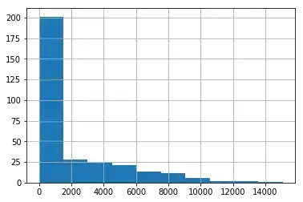
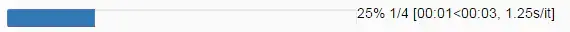
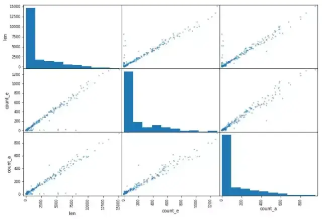
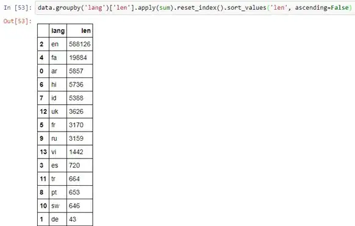

Python Pandas
<a name="NyA19"></a>
## pandas 最基本的功能
<a name="NLQb1"></a>
### 读取数据
```python
data = pd.read_csv( my_file.csv )
data = pd.read_csv( my_file.csv , sep= ; , encoding= latin-1 , nrows=1000, skiprows=[2,5])
```
`sep` 代表的是分隔符。如果使用法语数据，excel 中 csv 分隔符是`「;」`，因此需要显式地指定它。编码设置为 `latin-1` 来读取法语字符。`nrows=1000` 表示读取前 1000 行数据。e 表示在读取文件的时候会移除第 2 行和第 5 行。

- 最常用的功能：`read_csv`, `read_excel`
- 其他一些很棒的功能：`read_clipboard`, `read_sql`
<a name="rWkCF"></a>
### 写数据
```python
data.to_csv( my_new_file.csv , index=None)
```
`index=None` 表示将会以数据本来的样子写入。如果没有写 index=None，会多出一个第一列，内容是 1，2，3，...，一直到最后一行。<br />通常不会去使用其他的函数，像`.to_excel`, `.to_json`, `.to_pickle` 等等，因为`.to_csv` 就能很好地完成工作，并且 csv 是最常用的表格保存方式。
<a name="hqlD7"></a>
### 检查数据
```python
Gives (#rows, #columns)
```
给出行数和列数
```python
data.describe()
```
计算基本的统计数据
<a name="dZqxt"></a>
### 查看数据
```python
data.head(3)
```
打印出数据的前 3 行。与之类似，`.tail()` 对应的是数据的最后一行。
```python
data.loc[8]
```
打印出第八行
```python
data.loc[8, column_1 ]
```
打印第八行名为「column_1」的列
```python
data.loc[range(4,6)]
```
第四到第六行（左闭右开）的数据子集
<a name="WrnZl"></a>
## pandas 的基本函数
<a name="opfRn"></a>
### 逻辑运算
```python
data[data[ column_1 ]== french ]
data[(data[ column_1 ]== french ) & (data[ year_born ]==1990)]
data[(data[ column_1 ]== french ) & (data[ year_born ]==1990) & ~(data[ city ]== London )]
```
通过逻辑运算来取数据子集。要使用 & (AND)、 ~ (NOT) 和 | (OR)，必须在逻辑运算前后加上「and」。
```python
data[data[ column_1 ].isin([ french ,  english ])]
```
除了可以在同一列使用多个 OR，还可以使用`.isin()` 函数。
<a name="rPtwU"></a>
### 基本绘图
matplotlib 包使得这项功能成为可能。它可以直接在 pandas 中使用。
```python
data[ column_numerical ].plot()
```
<br />`.plot()` 输出的示例
```python
data[ column_numerical ].hist()
```
画出数据分布（直方图）<br /><br />`.hist()` 输出的示例
```python
%matplotlib inline
```
如果在使用 Jupyter，不要忘记在画图之前加上以上代码。
<a name="Ew5b2"></a>
### 更新数据
```python
data.loc[8,  column_1 ] =  english
将第八行名为 column_1 的列替换为「english」
```
```python
data.loc[data[ column_1 ]== french ,  column_1 ] =  French
```
在一行代码中改变多列的值<br />好现在可以做一些在 excel 中可以轻松访问的事情了。
<a name="1ynuN"></a>
## 中级函数
统计出现的次数
```python
data[ column_1 ].value_counts()
```
<a name="qpa7U"></a>
### 在所有的行、列或者全数据上进行操作
```python
data[ column_1 ].map(len)
```
`len()` 函数被应用在了「`column_1`」列中的每一个元素上<br />`.map()` 运算给一列中的每一个元素应用一个函数
```python
data[ column_1 ].map(len).map(lambda x: x/100).plot()
```
pandas 的一个很好的功能就是链式方法（[https://tomaugspurger.github.io/method-chaining](https://tomaugspurger.github.io/method-chaining)）。它可以在一行中更加简单、高效地执行多个操作（`.map()` 和`.plot()`）。
```python
data.apply(sum)
```
`.apply()` 会给一个列应用一个函数。<br />`.applymap()` 会给表 (DataFrame) 中的所有单元应用一个函数。
<a name="7IRa2"></a>
### tqdm-唯一的
在处理大规模数据集时，pandas 会花费一些时间来进行`.map()`、`.apply()`、`.applymap()` 等操作。tqdm 是一个可以用来帮助预测这些操作的执行何时完成的包
```python
from tqdm import tqdm_notebook
tqdm_notebook().pandas()
```
用 pandas 设置 tqdm
```python
data[ column_1 ].progress_map(lambda x: x.count( e ))
```
用 `.progress_map()` 代替`.map()`、`.apply()` 和`.applymap()` 也是类似的。<br /><br />在 Jupyter 中使用 tqdm 和 pandas 得到的进度条
<a name="Aw9Yi"></a>
### 相关性和散射矩阵
```python
data.corr()
data.corr().applymap(lambda x: int(x*100)/100)
```
|  | column_1 | column_2 | column_3 |
| --- | --- | --- | --- |
| column_1 | 1 | 0,78 | 0,67 |
| column_2 | 0,78 | 1 | 0,93 |
| column_3 | 0,67 | 0,93 | 1 |

`.corr()` 会给出相关性矩阵
```python
pd.plotting.scatter_matrix(data, figsize=(12,8))
```
<br />散点矩阵的例子。它在同一幅图中画出了两列的所有组合。
<a name="8FyxZ"></a>
## pandas 中的高级操作
<a name="TCkxA"></a>
### The SQL 关联
在 pandas 中实现关联是非常非常简单的
```python
data.merge(other_data, on=[ column_1 ,  column_2 ,  column_3 ])
```
关联三列只需要一行代码
<a name="b5NdT"></a>
### 分组
一开始并不是那么简单，首先需要掌握语法，然后会发现一直在使用这个功能。
```python
data.groupby( column_1 )[ column_2 ].apply(sum).reset_index()
```
按一个列分组，选择另一个列来执行一个函数。.reset_index() 会将数据重构成一个表。<br /><br />正如前面解释过的，为了优化代码，在一行中将函数连接起来。
<a name="xUD5V"></a>
### 行迭代
```python
dictionary = {}
for i,row in data.iterrows():
 dictionary[row[ column_1 ]] = row[ column_2 ]
```
`.iterrows()` 使用两个变量一起循环：行索引和行的数据 (上面的 i 和 row)<br />总而言之，pandas 是 python 成为出色的编程语言的原因之一<br />pandas 有以下优点：

- 易用，将所有复杂、抽象的计算都隐藏在背后了；
- 直观；
- 快速，即使不是最快的也是非常快的。

它有助于数据科学家快速读取和理解数据，提高其工作效率
