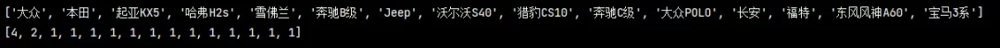

Python Pandas
<a name="tAoKj"></a>
## Pandas的下载
使用命令下载：
```bash
pip install pandas 
```
<br />或者自行下载whl文件安装：[https://www.lfd.uci.edu/~gohlke/pythonlibs/](https://www.lfd.uci.edu/~gohlke/pythonlibs/)<br />
<a name="eKK58"></a>
## 创建DataFrame数据
```python
pd_data = pd.DataFrame({
    "name":["小明","小红","小孙","王小","关宇","刘蓓","张菲"],
    "age":[20,18,27,20,28,18,25],
    "sex":["男","女","男","男","男","女","女"],
    "score":[669,570,642,590,601,619,701],
    "address":["北京","深圳","广州","武汉","深圳","广州","长沙"]
})

print(pd_data)
```

<a name="slzQo"></a>
## 读取本地文件
```python
pd_data = pd.read_excel('./测试.xlsx')

pd.set_option('display.max_columns', None)   # 显示完整的列
pd.set_option('display.max_rows', None)  # 显示完整的行
pd.set_option('display.expand_frame_repr', False)  # 设置不折叠数据

print(pd_data)
```

<a name="yXBCc"></a>
## 查看数据是否有缺失
```python
# 如果缺失显示为True，否则显示False
isnull = pd_data.isnull()        
print(isnull)
```

<a name="qLUQu"></a>
## 统计缺失值个数
```python
# 统计缺失值个数
null_count = pd_data.isnull().sum()
print(null_count)
```

<a name="dhYKm"></a>
## 缺失值填充
```python
# 填充数据 我选择了8.888,你随意
pd_data.fillna(8.888, inplace=True)
print(pd_data)
```

<a name="vYYmG"></a>
## 缺失值删除
```python
# 如果有缺失值，删除此行
exist_col = pd_data.dropna()
print(exist_col)
```

<a name="P2Qte"></a>
## 查看头尾文件
```python
# 查看头尾文件
print('头文件:', pd_data.head())
print('尾文件:', pd_data.tail())
```

<a name="p3YOU"></a>
## 取单列值
```python
# 单列值
pd_data = pd.read_excel('./测试.xlsx')
print(pd_data['全款价'])
```

<a name="Z7GGB"></a>
## 取多列值
```python
# 多列值
pd_data = pd.read_excel('./测试.xlsx')
print(pd_data[['车辆概况', '全款价']])
```

<a name="HEX08"></a>
## 单条件取值
```python
pd_data = pd.read_excel('./测试.xlsx')
print(pd_data[pd_data['全款价'] == 4])
print('-'*100)
print(pd_data[pd_data['汽车排量'] == '2.0T'])
```

<a name="SwlGZ"></a>
## 多条件取值-与
```python
# 多条件筛选数据
print(pd_data[(pd_data['车龄'] == '2018年') & (pd_data['变速箱'] == '自动')])
```

<a name="ClnlS"></a>
## 多条件取值-或
```python
# 多条件筛选数据
print(pd_data[(pd_data['车龄'] == '2018年') | (pd_data['变速箱'] == '自动')])
```

<a name="c0Njg"></a>
## 字符串的开始函数
```python
# 找出在 车辆概况 中以'大众'开头的
cars = pd_data[pd_data['车辆概况'].str.startswith('大众')]
print(cars)
```

<a name="Kwwai"></a>
## 字符串的结尾函数
```python
# 找出在 车辆概况 中以'豪华型'结尾的
cars = pd_data[pd_data['车辆概况'].str.endswith('豪华型')]
print(cars)
```

<a name="TVzUY"></a>
## 字符串的包含函数‍‍‍‍‍‍‍‍‍‍‍‍‍‍‍
```python
# 找出在 车辆概况 中包含'进口'的
cars = pd_data[pd_data['车辆概况'].str.contains('进口')]
print(cars)
```

<a name="FXWTB"></a>
## 统计元素个数
```python
# 统计 过户分类 以及对应次数
trans_count = pd_data['过户情况'].value_counts()
print(trans_count)
```
<br />为了便于进一步的数据分析，将它们置于不同的数组之中，可以采用如下方法：
```python
# 统计 过户分类 以及对应次数
trans_count = pd_data['过户情况'].value_counts()
# 针对于过户情况的分类
x1_data = trans_count.index.tolist()    
# 分类后各组数据的统计
x2_data = trans_count.tolist()      

print(x1_data)
print(x2_data)
```
<br />这种格式的数据才是最适合做可视化分析的！这里再多介绍两种方法，条条大路通罗马，都能轻松实现目标。
```python
# 统计 过户分类 以及对应次数
trans_count = pd_data['过户情况'].value_counts()
# 针对于过户情况的分类
x1_data = trans_count.index.tolist()
x11_data = trans_count.index
x12_data = trans_count.index.values
# 类后各组数据的统计
x2_data = trans_count.tolist()
print('index.tolist():', x1_data)
print('index:', x11_data)
print('index.values:', x12_data)
print('x2:', x2_data)
```

<a name="X2ED8"></a>
## 分割字符串
这个功能也很实用，大家可以看看汽车名称数据这一列，目标仅仅是车名而已，后面的车型、车龄、排列、变速箱信息都是冗余信息。非常不利于后续数据可视化，所以字符串分割在这里就显得尤为重要。<br />
```python
# 对 汽车名称 这一列按照空格分割 并取第一个字符
pd_data['汽车名称'] = pd_data['车辆概况'].map(lambda x: x.split(" ")[0])
name = pd_data['汽车名称'].value_counts()
# 汽车名称分类
name1 = name.index.tolist()  
# 汽车名称对应数量
name2 = name.tolist()  
print(name1)
print(name2)
```
<br />看到取出来数据的样子了吗，要的就是这个！
<a name="Fusq9"></a>
## 清理数据
当相对汽车里程做进一步的分析时会发现数据后面都有一个'万公里'，这种数据要做可视化必须先对数据进行处理，<br />就是先要去除数字后面的字符<br /><br />可以使用字符串的`replace()`方法，使用空格替换字符
```python
pd_data.loc[:, '表显里程new'] = pd_data['表显里程'].str.replace('万公里', '').astype('float32')  # 去除 30 ’万公里‘
# 保存数据
pd_data.to_excel('测试1.xlsx')
```
黄色一列是处理之前的数据，绿色一列是处理之后的数据，已经达到了想要的效果<br />
<a name="VZc55"></a>
## 划分区间
现在有这么一个需求，想要按照汽车的行驶里程分类，基本上每个车的行驶里程都是不一样的，如果将每个数据都反映在图标上就会看起来很冗余，<br />也就失去了作图的意义，所以可以按照区间来划分，例如5w-10w公里、10w-15w公里这样图表展示展示出来的效果就会很好了。<br />
```python
pd_data.loc[:, '表显里程new'] = pd_data['表显里程'].str.replace('万公里', '').astype('float32')  # 去除 30 ’万公里‘
# 划分区间
pd_data['里程区间'] = pd.cut(pd_data['表显里程new'], [0, 2, 4, 6, 8, 10, 20],
                             labels=['0-2', '2-4', '4-6', '6-8', '8-10', '>10'])
mile = pd_data['里程区间'].value_counts()
mile1 = mile.index.tolist()         # 里程区间分类
mile2 = mile.tolist()               # 里程区间分类对应数量
print(mile1)
print(mile2)
```

<a name="Ry8yR"></a>
## 重置索引
其实在上面案例的演示中已经发现了，根据条件取出来的数据的索引都是处理数据之前的索引，<br />现在要重置索引的话要怎么办呢？可以使用`reset_index()`来索引重置，重置索引前：
```python
# 找出在 过户情况 中所有'0次'的汽车
cars = pd_data[pd_data['过户情况'].str.contains('0次')]
print(cars.reset_index())
```
<br />重置索引后：<br /><br />很好，但是不完美。多了一列colm name叫做 index的先前序列号。不想看到它，有办法吗？<br />`drop = True`
```python
# 找出在 过户情况 中所有'0次'的汽车
cars = pd_data[pd_data['过户情况'].str.contains('0次')]
print(cars.reset_index(drop=True))
```

<a name="VqPEz"></a>
## column重命名
```python
# 重命名
pd_data = pd_data.rename(columns = {'车辆概况':'车辆详情'})
print(pd_data)
```

<a name="u7jOF"></a>
## 分组统计`groupby`-单条件
```python
# 统计不同变速箱总里程
pd_data.loc[:, '表显里程new'] = pd_data['表显里程'].str.replace('万公里', '').astype('float32')    # 去除 30 ’万公里‘
trans_mile = pd_data.groupby('变速箱')['表显里程new'].sum()
print(trans_mile)
```

<a name="a6gIu"></a>
## 分组统计`groupby`-多条件
```python
# 统计不同变速箱和过户情况总里程
pd_data.loc[:, '表显里程new'] = pd_data['表显里程'].str.replace('万公里', '').astype('float32')    # 去除 30 ’万公里‘
trans_mile = pd_data.groupby(['变速箱','过户情况'])['表显里程new'].sum()
print(trans_mile)
```
<br />如果再加上一个重置索引 `trans_mile.reset_index()`<br />
<a name="Se0Hx"></a>
## 求平均
```python
# 统计不同过户次数车辆平均里程
pd_data.loc[:, '表显里程new'] = pd_data['表显里程'].str.replace('万公里', '').astype('float32')    # 去除 30 ’万公里‘
trans_mile = pd_data.groupby('过户情况')['表显里程new'].mean()
print(trans_mile.reset_index())
```

<a name="XfrNJ"></a>
## `apply`函数
爬出来的大学的数据如果是985或者是211显示为1，如果非985或者211，显示为2<br /><br />现在不要1和2了，因为看不懂它是什么意思？如果是985或者211，就显示是，如果不是，就显示否！
```python
pd_data = pd.read_excel('./全国高校数据.xlsx')
print(pd_data)
pd_data1 = pd_data.copy()  # 生成一个副本, 防止数据损坏
pd_data['f985'] = pd_data['f985'].apply(lambda x: '是' if x == 1 else '否')       # 通过匿名函数解决
pd_data['f211'] = pd_data['f985'].apply(lambda x: '是' if x == 1 else '否')       # 通过匿名函数解决
print(pd_data)
```
<br />同理利用`lambda`函数还可以给省份这一列后面加个'省'
```python
pd_data = pd.read_excel('./全国高校数据.xlsx')
print(pd_data)
pd_data1 = pd_data.copy()  # 生成一个副本, 防止数据损坏

pd_data['province_name'] = pd_data['province_name'].apply(lambda x: x+'省')       # 通过匿名函数解决
print(pd_data)
'''
```
<br />同理利用`lambda`函数还可以给人气值`view_total`这一列最后面的'w'
```python
pd_data['view_total'] = pd_data['view_total'].apply(lambda x: x[:-1])       # 通过匿名函数解决
print(pd_data)
```

<a name="sxSlq"></a>
## 求最大最小值
```python
max_view_total = pd_data[pd_data['view_total'] == pd_data['view_total'].max()]
print(max_view_total)
```

```python
min_view_total = pd_data[pd_data['view_total'] == pd_data['view_total'].min()]
print(min_view_total)
```

<a name="QseWW"></a>
## 时间提取
为了便于演示，加上了一列 Date 选项，如下：<br /><br />现在想提取其中的年份或者月份，可以使用 '`DatetimeIndex`'这个方法来实现。
```python
pd_data = pd.read_excel('./全国高校数据.xlsx')
pd_data['year'] = pd.DatetimeIndex(pd_data['Date']).year
pd_data['month'] = pd.DatetimeIndex(pd_data['Date']).month
pd_data['day'] = pd.DatetimeIndex(pd_data['Date']).day
print(pd_data)
```

<a name="hhciS"></a>
## 增加列
把刚才的生成的年+月+日方法到前三列，可以使用`insert()`方法来实现
```python
Year = pd.DatetimeIndex(pd_data['Date']).year
Month = pd.DatetimeIndex(pd_data['Date']).month
day = pd.DatetimeIndex(pd_data['Date']).day
pd_data.insert(0, 'Year', Year)
pd_data.insert(1, 'Month', Month)
pd_data.insert(2, 'day', day)
print(pd_data)
```

