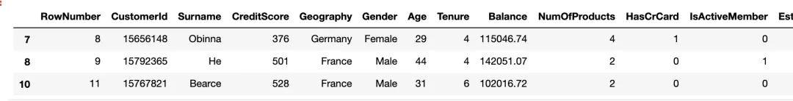
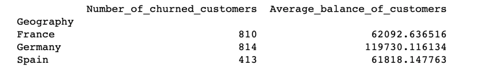
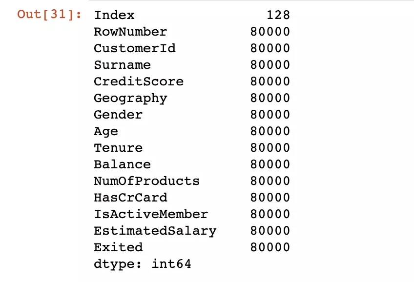
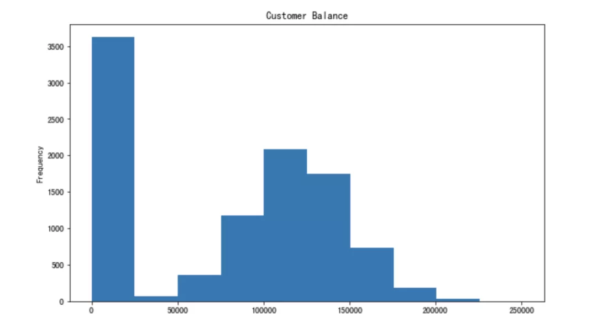
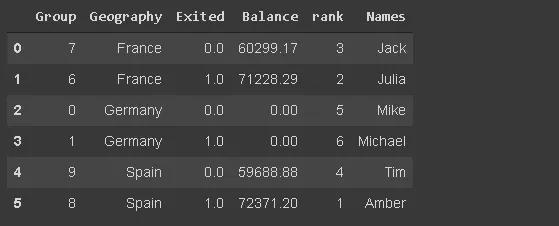

Python Pandas<br />Pandas 是 Python 中最广泛使用的数据分析和操作库。它提供了许多功能和方法，可以加快「数据分析」和「预处理」步骤。<br />[Churn_Modelling.csv](https://www.yuque.com/attachments/yuque/0/2021/xls/396745/1636905893593-936dc12f-a885-4e89-ac49-f59ed596a715.xls?_lake_card=%7B%22src%22%3A%22https%3A%2F%2Fwww.yuque.com%2Fattachments%2Fyuque%2F0%2F2021%2Fxls%2F396745%2F1636905893593-936dc12f-a885-4e89-ac49-f59ed596a715.xls%22%2C%22name%22%3A%22Churn_Modelling.csv%22%2C%22size%22%3A684858%2C%22type%22%3A%22application%2Fvnd.ms-excel%22%2C%22ext%22%3A%22xls%22%2C%22status%22%3A%22done%22%2C%22taskId%22%3A%22u5d18379c-2735-454d-a695-df0542a6f49%22%2C%22taskType%22%3A%22upload%22%2C%22id%22%3A%22u7264ef11%22%2C%22card%22%3A%22file%22%7D)<br />数据如下所示：
```python
import numpy as np
import pandas as pd
df = pd.read_csv("Churn_Modelling.csv")
print(df.shape)
df.columns
```
结果输出
```python
(10000, 14)
Index(['RowNumber', 'CustomerId', 'Surname', 'CreditScore', 'Geography','Gender', 'Age', 'Tenure', 'Balance', 'NumOfProducts', 'HasCrCard','IsActiveMember', 'EstimatedSalary', 'Exited'],dtype='object')
```
<a name="qN0nj"></a>
### 1、删除列
```python
df.drop(['RowNumber', 'CustomerId', 'Surname', 'CreditScore'], axis=1, inplace=True)
print(df[:2])
print(df.shape)
```
结果输出
```python
  Geography  Gender  Age  Tenure  Balance  NumOfProducts  HasCrCard  \
0    France  Female   42       2      0.0              1          1   

   IsActiveMember  EstimatedSalary  Exited  
0               1        101348.88       1  
(10000, 10)
```
说明：「`axis`」 参数设置为 1 以放置列，0 设置为行。「`inplace=True`」 参数设置为 True 以保存更改。减了 4 列，因此列数从 14 个减少到 10 列。
<a name="epWMt"></a>
### 2、选择特定列
从 csv 文件中读取部分列数据。可以使用 `usecols` 参数。
```python
df_spec = pd.read_csv("Churn_Modelling.csv", usecols=['Gender', 'Age', 'Tenure', 'Balance'])
df_spec.head()
```
<a name="MA4Os"></a>
### 3、`nrows`
可以使用 nrows 参数，创建了一个包含 csv 文件前 5000 行的数据帧。还可以使用 skiprows 参数从文件末尾选择行。Skiprows=5000 表示将在读取 csv 文件时跳过前 5000 行。
```python
df_partial = pd.read_csv("Churn_Modelling.csv", nrows=5000)
print(df_partial.shape)
```
<a name="bHNC4"></a>
### 4、样品
创建数据框后，可能需要一个小样本来测试数据。可以使用 n 或 frac 参数来确定样本大小。
```python
df= pd.read_csv("Churn_Modelling.csv", usecols=['Gender', 'Age', 'Tenure', 'Balance'])
df_sample = df.sample(n=1000)
df_sample2 = df.sample(frac=0.1)
```
<a name="TmQKA"></a>
### 5、检查缺失值
`isna` 函数确定数据帧中缺失的值。通过将 `isna` 与 `sum` 函数一起使用，可以看到每列中缺失值的数量。
```python
df.isna().sum()
```
<a name="QkvAb"></a>
### 6、使用 `loc` 和 `iloc` 添加缺失值
使用 loc 和 iloc 添加缺失值，两者区别如下：

- `loc`：选择带标签
- `iloc`：选择索引

首先创建 20 个随机索引进行选择
```python
missing_index = np.random.randint(10000, size=20)
```
使用 `loc` 将某些值更改为 `np.nan`（缺失值）。
```python
df.loc[missing_index, ['Balance','Geography']] = np.nan
```
"Balance"和"Geography"列中缺少 20 个值。用 iloc 做另一个示例。
```python
df.iloc[missing_index, -1] = np.nan
```
<a name="emVE9"></a>
### 7、填充缺失值
`fillna` 函数用于填充缺失的值。它提供了许多选项。可以使用特定值、聚合函数（例如均值）或上一个或下一个值。
```python
avg = df['Balance'].mean()
df['Balance'].fillna(value=avg, inplace=True)
```
`fillna` 函数的方法参数可用于根据列中的上一个或下一个值（例如方法="ffill"）填充缺失值。它可以对顺序数据（例如时间序列）非常有用。
<a name="ELQ2U"></a>
### 8、删除缺失值
处理缺失值的另一个方法是删除它们。以下代码将删除具有任何缺失值的行。
```python
df.dropna(axis=0, how='any', inplace=True)
```
<a name="a1sJ8"></a>
### 9、根据条件选择行
在某些情况下，需要适合某些条件的观测值（即行）
```python
france_churn = df[(df.Geography == 'France') & (df.Exited == 1)]
france_churn.Geography.value_counts()
```
<a name="EPKIZ"></a>
### 10、用查询描述条件
查询函数提供了一种更灵活的传递条件的方法。可以用字符串来描述它们。
```python
df2 = df.query('80000 < Balance < 100000')
# 让我们通过绘制平衡列的直方图来确认结果。
df2['Balance'].plot(kind='hist', figsize=(8,5))
```
<a name="EUgjg"></a>
### 11、用 isin 描述条件
条件可能有多个值。在这种情况下，最好使用 isin 方法，而不是单独编写值。
```python
df[df['Tenure'].isin([4,6,9,10])][:3]
```
<br />结果
<a name="nDT8q"></a>
### 12、Groupby 函数
Pandas Groupby 函数是一个多功能且易于使用的功能，可帮助获取数据概述。它使浏览数据集和揭示变量之间的基本关系更加容易。<br />将做几个组比函数的示例。从简单的开始。以下代码将基于 Geography、Gender 组合对行进行分组，然后给出每个组的平均流失率。
```python
df[['Geography','Gender','Exited']].groupby(['Geography','Gender']).mean()
```
<a name="Hx7O0"></a>
### 13、Groupby与聚合函数结合
agg 函数允许在组上应用多个聚合函数，函数的列表作为参数传递。
```python
df[['Geography','Gender','Exited']].groupby(['Geography','Gender']).agg(['mean','count'])
```
<a name="lVw4H"></a>
### 14、对不同的群体应用不同的聚合函数
```python
df_summary = df[['Geography','Exited','Balance']].groupby('Geography').agg({'Exited':'sum', 'Balance':'mean'})
df_summary.rename(columns={'Exited':'# of churned customers', 'Balance':'Average Balance of Customers'},inplace=True)
```
此外，「NamedAgg 函数」允许重命名聚合中的列
```python
import pandas as pd
df_summary = df[['Geography','Exited','Balance']].groupby('Geography').agg(Number_of_churned_customers = pd.NamedAgg('Exited', 'sum'),Average_balance_of_customers = pd.NamedAgg('Balance', 'mean'))
print(df_summary)
```
<br />结果
<a name="StRJ7"></a>
### 15、重置索引
是否已经注意到上图的数据格式了。可以通过重置索引来更改它。
```python
print(df_summary.reset_index())
```
<br />结果
<a name="MLSb8"></a>
### 16、重置并删除原索引
在某些情况下，需要重置索引并同时删除原始索引。
```python
df[['Geography','Exited','Balance']].sample(n=6).reset_index(drop=True)
```
<a name="FV3fI"></a>
### 17、将特定列设置为索引
可以将数据帧中的任何列设置为索引。
```python
df_new.set_index('Geography')
```
<a name="Kqbs8"></a>
### 18、插入新列
```python
group = np.random.randint(10, size=6)
df_new['Group'] = group
```
<a name="RCTwc"></a>
### 19、`where` 函数
它用于根据条件替换行或列中的值。默认替换值为 NaN，但也可以指定要作为替换值。
```python
df_new['Balance'] = df_new['Balance'].where(df_new['Group'] >= 6, 0)
```
<a name="QuPb1"></a>
### 20、等级函数
等级函数为值分配一个排名。创建一个列，根据客户的余额对客户进行排名。
```python
df_new['rank'] = df_new['Balance'].rank(method='first', ascending=False).astype('int')
```
<a name="V46Hm"></a>
### 21、列中的唯一值数
它使用分类变量时派上用场。可能需要检查唯一类别的数量。可以检查值计数函数返回的序列的大小或使用 `nunique` 函数。
```python
df.Geography.nunique
```
<a name="zIWVn"></a>
### 22、内存使用情况
使用函数 `memory_usage`，这些值显示以字节为单位的内存.
```python
df.memory_usage()
```
<br />结果
<a name="IhCAP"></a>
### 23、数据类型转换
默认情况下，分类数据与对象数据类型一起存储。但是，它可能会导致不必要的内存使用，尤其是当分类变量具有较低的基数。<br />低基数意味着列与行数相比几乎没有唯一值。例如，地理列具有 3 个唯一值和 10000 行。<br />可以通过将其数据类型更改为"类别"来节省内存。
```python
df['Geography'] = df['Geography'].astype('category')
```
<a name="LkUOg"></a>
### 24、替换值
替换函数可用于替换数据帧中的值。
```python
df['Geography'].replace({0:'B1',1:'B2'})
```
<a name="OkqOb"></a>
### 25、绘制直方图
pandas 不是一个数据可视化库，但它使得创建基本绘图变得非常简单。<br />使用 Pandas 创建基本绘图更容易，而不是使用其他数据可视化库。<br />创建平衡列的直方图。<br /><br />结果
<a name="RwgNM"></a>
### 26、减少浮点数小数点
pandas 可能会为浮点数显示过多的小数点。可以轻松地调整它。
```python
df['Balance'].plot(kind='hist', figsize=(10,6), 
title='Customer Balance')
```
<a name="tNw5E"></a>
### 27、更改显示选项
可以更改各种参数的默认显示选项，而不是每次手动调整显示选项。

- `get_option`：返回当前选项
- `set_option`：更改选项 将小数点的显示选项更改为 2。
```python
pd.set_option("display.precision", 2)
```
可能要更改的一些其他选项包括：

- `max_colwidth`：列中显示的最大字符数
- `max_columns`：要显示的最大列数
- `max_rows`：要显示的最大行数
<a name="ie7nr"></a>
### 28、通过列计算百分比变化
pct_change用于计算序列中值的变化百分比。在计算时间序列或元素顺序数组中更改的百分比时，它很有用。
```python
ser= pd.Series([2,4,5,6,72,4,6,72])
ser.pct_change()
```
<a name="u2tAU"></a>
### 29、基于字符串的筛选
可能需要根据文本数据（如客户名称）筛选观测值（行）。已经在数据帧中添加了df_new名称。
```python
df_new[df_new.Names.str.startswith('Mi')]
```
<br />结果
<a name="rBPYo"></a>
### 30、设置数据帧样式
可以通过使用返回 Style 对象的 Style 属性来实现此目的，它提供了许多用于格式化和显示数据框的选项。例如，可以突出显示最小值或最大值。<br />它还允许应用自定义样式函数。
```python
df_new.style.highlight_max(axis=0, color='darkgreen')
```

