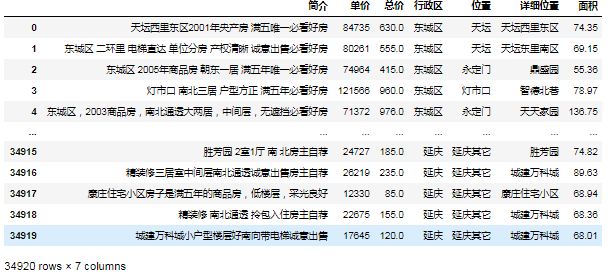
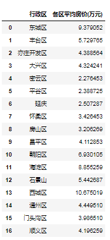
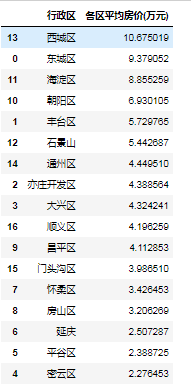
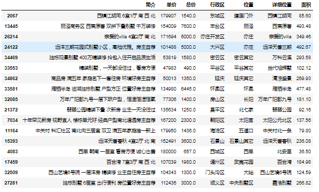
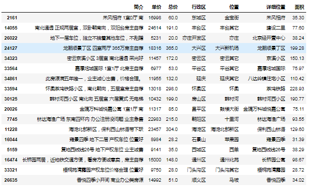

用Python分析北京市二手房数据，从中归纳了非常有用的Pandas的7种神级操作，一起分享给大家<br />数据文件：[北京房价汇总.xlsx](https://www.yuque.com/attachments/yuque/0/2023/xlsx/396745/1701670707004-488328c4-38ad-4977-8195-cff739e7613b.xlsx?_lake_card=%7B%22src%22%3A%22https%3A%2F%2Fwww.yuque.com%2Fattachments%2Fyuque%2F0%2F2023%2Fxlsx%2F396745%2F1701670707004-488328c4-38ad-4977-8195-cff739e7613b.xlsx%22%2C%22name%22%3A%22%E5%8C%97%E4%BA%AC%E6%88%BF%E4%BB%B7%E6%B1%87%E6%80%BB.xlsx%22%2C%22size%22%3A2561794%2C%22ext%22%3A%22xlsx%22%2C%22source%22%3A%22%22%2C%22status%22%3A%22done%22%2C%22download%22%3Atrue%2C%22taskId%22%3A%22u117598c8-0e7b-4fda-a733-ab08dc2b8fc%22%2C%22taskType%22%3A%22upload%22%2C%22type%22%3A%22application%2Fvnd.openxmlformats-officedocument.spreadsheetml.sheet%22%2C%22__spacing%22%3A%22both%22%2C%22id%22%3A%22u5bda8382%22%2C%22margin%22%3A%7B%22top%22%3Atrue%2C%22bottom%22%3Atrue%7D%2C%22card%22%3A%22file%22%7D)<br />首先读取数据：
```python
import pandas as pd
data=pd.read_excel('北京房价汇总.xlsx')
data
```
<br />总共34920条数据，包含简介、单价、总价、行政区、位置以及详细位置、面积等信息
<a name="X4FNI"></a>
## 一、计算各区平均房价（groupby分组及排序）
通过比较一下各个区的平均房价，来探索一下北京的哪里的房价最贵<br />首先看看北京有多少区
<a name="YBreG"></a>
### 1、Pandas去重转列表方法
```python
data['行政区'].unique().tolist()
```
```python
['东城区',
 '西城区',
 '朝阳区',
 '海淀区',
 '丰台区',
 '石景山',
 '通州区',
 '昌平区',
 '大兴区',
 '亦庄开发区',
 '顺义区',
 '房山区',
 '门头沟区',
 '平谷区',
 '怀柔区',
 '密云区',
 '延庆']
```
<a name="qh3SF"></a>
### 2、Pandas计算出各地区的平均房价：
单价=地区总金额/地区总面积
```python
data1 = data.groupby('行政区')['总价'].sum()/data.groupby('行政区')['面积'].sum()
data1
```
```python
行政区
东城区       9.379052
丰台区       5.729765
亦庄开发区     4.388564
大兴区       4.324241
密云区       2.276453
平谷区       2.388725
延庆        2.507287
怀柔区       3.426453
房山区       3.206269
昌平区       4.112853
朝阳区       6.930105
海淀区       8.855259
石景山       5.442687
西城区      10.675019
通州区       4.449510
门头沟区      3.986510
顺义区       4.196259
dtype: float64
```
<a name="EABxt"></a>
### 3、转化为DataFrame格式
```python
data2 = pd.DataFrame({'各区平均房价(万元)':data1})
data2.reset_index(inplace=True)
```

<a name="XFbG9"></a>
### 4、房价由高到低排序
```python
data3=data2.sort_values(by='各区平均房价(万元)',ascending=False)
data3
```
<br />前三名分别是西城、东城和海淀，这三个区之所以房价这么高，大概率是因为大部分优质小学都在这里！
<a name="hiFPQ"></a>
## 二、定位各区单价最高、最低的位置（apply筛选）
<a name="Qt0WV"></a>
### 5、apply获取各区单价最高、最低所在的行号
```python
max_num=data.groupby(['行政区']).apply(lambda x:x['单价'].idxmax())
min_num=data.groupby(['行政区']).apply(lambda x:x['单价'].idxmin())
```
<a name="hAD7z"></a>
### 6、iloc输出这些行
```python
data.iloc[max_num]
```

```python
data.iloc[min_num]
```

<a name="xv0wU"></a>
## 三、分析全北京房价分布
<a name="X6jDF"></a>
### 7、比较符号筛选数据
```python
result={}
list_interval=['0-19999','20000-39999','40000-59999','60000-79999','80000-99999',
               '100000-119999','120000-139999','140000-159999','160000-180000']
for i in list_interval:
    result[i]=data[(data.单价>int(i.split('-')[0]))&(data.单价<int(i.split('-')[1]))]['单价'].count()
result
```
```python
{'0-19999': 559,
 '20000-39999': 11042,
 '40000-59999': 11310,
 '60000-79999': 4817,
 '80000-99999': 3398,
 '100000-119999': 2126,
 '120000-139999': 892,
 '140000-159999': 492,
 '160000-180000': 243}
```
