PythonPandas<br />大多数 Pandas 用户都熟悉 `iloc[]` 和 `loc[]` 索引器方法，用于从 Pandas DataFrame 中检索行和列。但是随着检索数据的规则变得越来越复杂，这些方法也随之变得更加复杂而臃肿。<br />同时 SQL 也是经常接触且较为熟悉的语言，那么为什么不使用类似于 SQL 的东西来查询数据呢<br />事实证明实际上可以使用 `query()` 方法做到这一点。因此，这里展示如何使用 `query()` 方法对数据框执行查询
<a name="J39JA"></a>
## **获取数据**
使用 kaggle 上的 Titanic 数据集作为本文章的测试数据集。
<a name="JFm4n"></a>
### **载入数据**
下面文末就可以使用 read_csv 来载入数据了
```python
import pandas as pd
df = pd.read_csv('titanic_train.csv')
df
```
数据集有 891 行和 12 列：<br />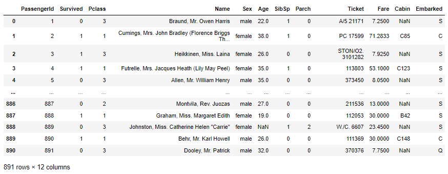
<a name="wN1dL"></a>
## **使用 **`**query()**`** 方法**
找出从南安普敦 (‘S’) 出发的所有乘客，可以使用方括号索引，代码如下所示：
```python
df[df['Embarked'] == 'S']
```
如果使用 `query()` 方法，那么看起来更整洁：
```python
df.query('Embarked == "S"')
```
与 SQL 比较，则 `query()` 方法中的表达式类似于 SQL 中的 WHERE 语句。<br />结果是一个 DataFrame，其中包含所有从南安普敦出发的乘客：<br />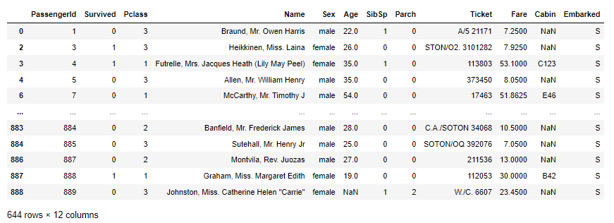<br />`query()` 方法接受字符串作为查询条件串，因此，如果要查询字符串列，则需要确保字符串被正确括起来：<br />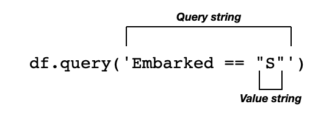<br />很多时候，可能希望将变量值传递到查询字符串中，可以使用 `@` 字符执行此操作：
```python
embarked = 'S'
df.query('Embarked == @embarked')
```
或者也可以使用 f 字符串，如下所示：
```python
df.query(f'Embarked == "{embarked}"')
```
与 f-string 方式相比，使用 `@` 字符更简单、更优雅。<br />如果列名中有空格，可以使用反引号 (````) 将列名括起来：
```python
df.query('`Embarked On` == @embarked')
```
<a name="X0h6d"></a>
### **以 In-place 的方式执行 query 方法**
当使用 query() 方法执行查询时，该方法将结果作为 DataFrame 返回，原始 DataFrame 保持不变。如果要更新原始 DataFrame，需要使用 inplace 参数，如下所示：
```python
df.query('Embarked == "S"', inplace=True)
```
当 `inplace` 设置为 `True` 时，`query()` 方法将不会返回任何值，原始 DataFrame 被修改。
<a name="zLyuI"></a>
## **指定多个条件查询**
可以在查询中指定多个条件，例如假设想获取所有从南安普敦 (‘S’) 或瑟堡 (‘C’) 出发的乘客。如果使用方括号索引，这种语法很快变得非常笨拙：
```python
df[(df['Embarked'] == 'S') | (df['Embarked'] == 'C')]
```
可以注意到，在这里需要在查询的条件下引用 DataFrame 两次，而使用 query() 方法，就简洁多了：
```python
df.query('Embarked in ("S","C")')
```
查询结果如下<br />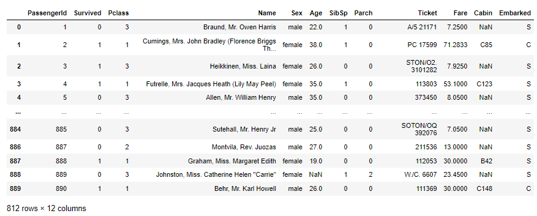<br />如果要查找所有不是从南安普敦（‘S’）或瑟堡（‘C’）出发的乘客，可以在 Pandas 中使用否定运算符 (~)：
```python
df[~((df['Embarked'] == 'S') | (df['Embarked'] == 'C'))]
```
使用 `query()` 方法，只需要使用 not 运算符：
```python
df.query('Embarked not in ("S","C")')
```
以下输出显示了从皇后镇 (‘Q’) 出发的乘客以及缺失值的乘客：<br />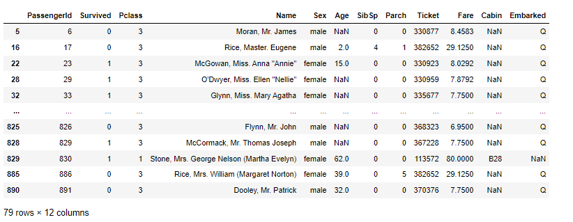<br />说到缺失值，该怎么查询缺失值呢，当应用于列名时，可以使用 `isnull()` 方法查找缺失值：
```python
df.query('Embarked.isnull()')
```
现在将显示 Embarked 列中缺少值的行：<br />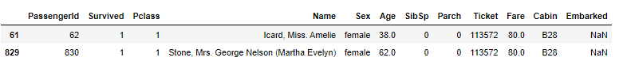<br />其实可以直接在列名上调用各种 Series 方法：
```python
df.query('Name.str.len() < 20')  # find passengers whose name is 
                                 # less than 20 characters
df.query(f'Ticket.str.startswith("A")') # find all passengers whose 
                                        # ticket starts with A
```
<a name="FluoH"></a>
### **比较数值列**
还可以轻松比较数字列：
```python
df.query('Fare > 50')
```
以下输出显示了票价大于 50 的所有行：<br />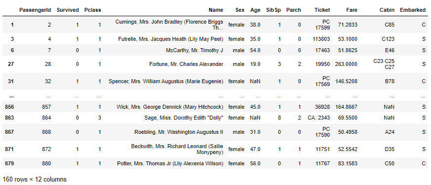
<a name="DZXaM"></a>
### **比较多个列**
还可以使用 and、or 和 not 运算符比较多个列，以下语句检索 Fare 大于 50 和 Age 大于 30 的所有行：
```python
df.query('Fare > 50 and Age > 30')
```
下面是查询结果<br />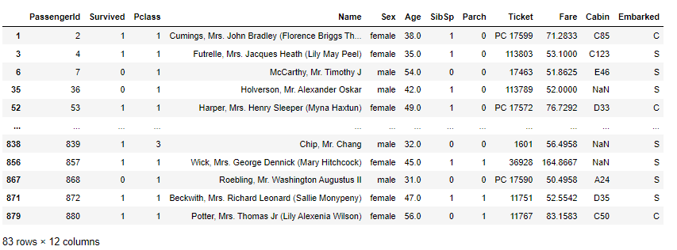
<a name="Z0Atd"></a>
### **查询索引**
通常当根据索引值检索行时，可以使用 `loc[]` 索引器，如下所示：
```python
df.loc[[1],:]  # get the row whose index is 1; return as a dataframe
```
但是使用 `query()` 方法，使得事情变得更加直观：
```python
df.query('index==1')
```
结果如下<br />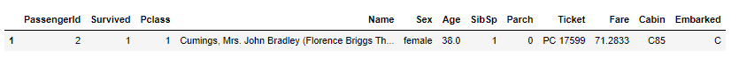<br />如果要检索索引值小于 5 的所有行：
```python
df.query('index<5')
```
结果如下<br />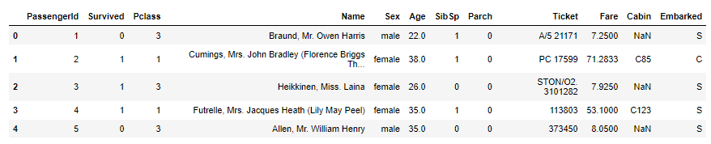<br />还可以指定索引值的范围：
```python
df.query('6 <= index < 20')
```
结果如下<br />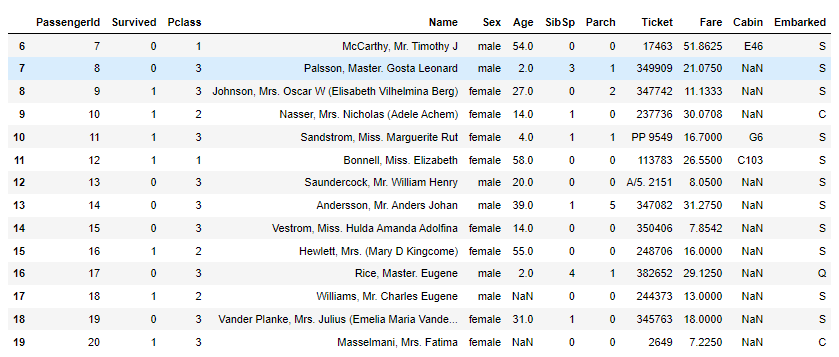
<a name="iOOiX"></a>
### **比较多列**
还可以比较列之间的值，例如以下语句检索 Parch 值大于 SibSp 值的所有行：
```python
df.query('Parch > SibSp')
```
结果如下<br />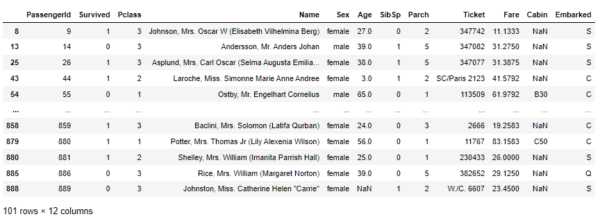
<a name="XNOpO"></a>
## **总结**
从上面的示例可以看出，`query()` 方法使搜索行的语法更加自然简洁。
