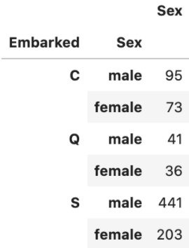
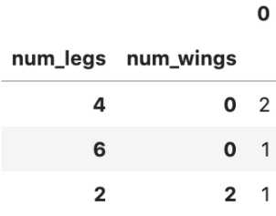

PythonPandas<br />在探索和预处理数据上。当谈到数据分析和理解数据结构时，Pandas `value_counts()` 是最受欢迎的函数之一。该函数返回一个包含唯一值计数的系列。生成的 Series 可以按降序或升序排序，通过参数控制包括或排除NA。<br />这里探讨 Pandas `value_counts()` 的不同用例。接下来学习如何使用它来处理以下常见任务。

1. **默认参数**
2. **按升序对结果进行排序**
3. **按字母顺序排列结果**
4. **结果中包含空值**
5. **以百分比计数显示结果**
6. **将连续数据分入离散区间**
7. **分组并调用 **`**value_counts()**`
8. **将结果系列转换为 DataFrame**
9. **应用于DataFrame**
<a name="ZD8Yx"></a>
## 1、默认参数
Pandas `value_counts()` 函数返回一个包含唯一值计数的系列。默认情况下，结果系列按降序排列，不包含任何 NA 值。例如，从 Titanic 数据集中获取“Embarked”列的计数。
```python
df['Embarked'].value_counts()
```
```python
S    644 
C    168 
Q     77 
Name: Embarked, dtype: int64
```
<a name="iNf9Z"></a>
## 2、按升序对结果进行排序
`value_count()` 返回的系列默认按降序排列。对于升序结果，可以将参数升序设置为 True。
```python
df['Embarked'].value_counts(ascending=True)
```
```
Q     77 
C    168 
S    644 
Name: Embarked, dtype: int64
```
<a name="IGBNr"></a>
## 3、按字母顺序排列结果
已经学习了参数升序以获得按值计数 ASC 或 DESC 排序的结果。在某些情况下，最好按字母顺序显示结果。这可以通过在 `value_counts()` 之后调用 `sort_index(ascending=True)` 来完成，例如
```python
df['Embarked'].value_counts(ascending=True).sort_index(ascending=True)
```
```
C    168 
Q     77 
S    644 
Name: Embarked, dtype: int64
```
<a name="wVmex"></a>
## 4、包括结果中的 NA
默认情况下，结果中会忽略包含任何 NA 值的行。有一个参数 dropna 来配置它。可以将该值设置为 False 以包含 NA 的行数。
```python
df['Embarked'].value_counts(dropna=False)
```
```
S      644 
C      168 
Q       77 
NaN      2 
Name: Embarked, dtype: int64
```
<a name="cqVls"></a>
## 5、以百分比计数显示结果
在进行探索性数据分析时，有时查看唯一值的百分比计数会更有用。这可以通过将参数 normalize 设置为 True 来完成，例如：
```python
df['Embarked'].value_counts(normalize=True)
```
```
S    0.724409 
C    0.188976 
Q    0.086614 
Name: Embarked, dtype: float64
```
如果更喜欢用百分号 (%) 格式化结果，可以设置 Pandas 显示选项如下：
```python
pd.set_option('display.float_format', '{:.2f}%'.format) 
df['Embarked'].value_counts(normalize = True)
```
```
S   0.72% 
C   0.19% 
Q   0.09% 
Name: Embarked, dtype: float64
```
<a name="bbyZ6"></a>
## 6、将连续数据分入离散区间
Pandas `value_counts()` 可用于使用 bin 参数将连续数据分入离散区间。与 Pandas `cut()` 函数类似，可以将整数或列表传递给 bin 参数。<br />当整数传递给 bin 时，该函数会将连续值离散化为大小相等的 bin，例如：
```python
df['Fare'].value_counts(bins=3)
```
```
(-0.513, 170.776]     871 
(170.776, 341.553]     17 
(341.553, 512.329]      3 
Name: Fare, dtype: int64
```
当列表传递给 bin 时，该函数会将连续值划分为自定义组，例如：
```python
df['Fare'].value_counts(bins=[-1, 20, 100, 550])
```
```
(-1.001, 20.0]    515 
(20.0, 100.0]     323 
(100.0, 550.0]     53 
Name: Fare, dtype: int64
```
<a name="dynvZ"></a>
## 7、分组并执行 `value_counts()`
Pandas `groupby()` 允许将数据分成不同的组来执行计算以进行更好的分析。一个常见的用例是按某个列分组，然后获取另一列的唯一值的计数。例如，按“Embarked”列分组并获取不同“Sex”值的计数。
```python
df.groupby('Embarked')['Sex'].value_counts() 
```
```python
Embarked  Sex    
C         male       95 
          female     73 
Q         male       41 
          female     36 
S         male      441 
          female    203 
Name: Sex, dtype: int64
```
<a name="eeku6"></a>
## 8、将结果系列转换为 DataFrame
Pandas `value_counts()` 返回一个Series，包括前面带有 MultiIndex 的示例。如果希结果显示为 DataFrame，可以在 `value_count()` 之后调用 `to_frame()`。
```python
df.groupby('Embarked')['Sex'].value_counts().to_frame()
```

<a name="ZBtTJ"></a>
## 9、应用于DataFrame
到目前为止，一直将 `value_counts()` 应用于 Pandas Series，在 Pandas DataFrame 中有一个等效的方法。Pandas `DataFrame.value_counts()` 返回一个包含 DataFrame 中唯一行计数的系列。<br />看一个例子来更好地理解它：
```python
df = pd.DataFrame({ 
    'num_legs': [2, 4, 4, 6], 
    'num_wings': [2, 0, 0, 0]}, 
    index=['falcon', 'dog', 'cat', 'ant'] 
) 
df.value_counts()
```
```
num_legs  num_wings 
4         0            2 
6         0            1 
2         2            1 
dtype: int64
```
通过在 df 上调用 `value_counts()`，它返回一个以 num_legs 和 num_wings 作为索引的 MultiIndex 系列。从结果中，可以发现有 2 条记录的 num_legs=4 和 num_wing=0。<br />同样，可以调用 `to_frame()` 将结果转换为 DataFrame
```python
df.value_counts().to_frame()
```

<a name="K52O9"></a>
## 总结
探讨了 Pandas `value_counts()` 的不同用例。
