PythonPandas<br />Pandas模块中的`pivot_table()`函数可以用来制作数据透视表，来介绍一下Pandas模块中的另外一个函数`corsstab()`，可以通过调用该函数来制作交叉表，下面就来看看其中的主要流程和步骤吧。
<a name="Zmu9z"></a>
## 模块导入和数据读取
那按照惯例，首先导入模块并且来读取所要使用到的数据集，引用的依然是之前制作数据透视表的数据集
```python
import pandas as pd

def load_data():
    return pd.read_csv('coffee_sales.csv', parse_dates=['order_date'])
```
那这里是通过自定义一个函数，然后通过调用该函数来读取数据，在实际工作当中每个人都可以根据自己的喜好来操作
```python
df = load_data()
df.head()
```
output<br />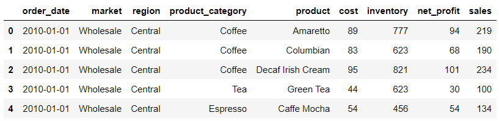
<a name="qTvgW"></a>
## 牛刀小试
交叉表是用于统计分组频率的特殊透视表。简单来说，就是将两个或者多个列中不重复的元素组成一个新的DataFrame，新数据的行和列交叉的部分值为其组合在原数据中的数量，先来看一个简单的例子，代码如下
```python
pd.crosstab(index = df['region'], columns = df['product_category'])
```
output<br />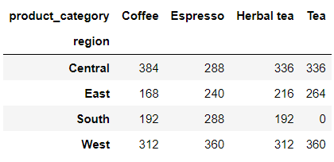<br />在行方向上代表的是不同的地区，而在列方向上代表的则是不同的咖啡种类，出来的结果表示的是不同地区不同咖啡种类的汇总数据，
```python
df[(df["region"] == "Central")&(df["product_category"] == "Tea")].shape[0]
```
output
```python
336
```
例如筛选出地区是中部地区并且品种是茶饮的数据，出来的结果总共有336条数据，和交叉表中的结果一致，<br />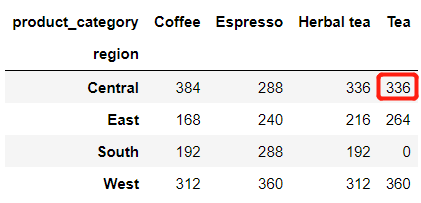<br />可以对列名以及行索引更换名字，通过调用`rownames`参数以及`colnames`参数，代码如下
```python
pd.crosstab(
    index = df['region'], 
    columns = df['product_category'], 
    rownames=['US Region'], 
    colnames=['Product Category']
)
```
output<br />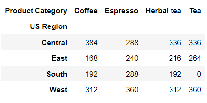<br />除了咖啡的品类之外，还想要知道到底不同品种的咖啡在批发和零售之间销量的数据，就可以这么来操作
```python
pd.crosstab(
    index = df['region'], 
    columns = [df['product_category'], df['market']]
)
```
output<br />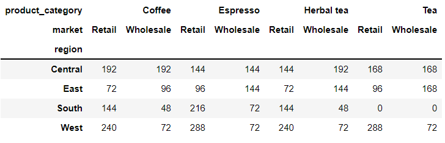<br />或者是
```python
pd.crosstab(
    index = df['region'], 
    columns = [df['product_category'], df['market']],
    rownames=['US Region'], 
    colnames=['Product Category', 'Market']
)
```
output<br />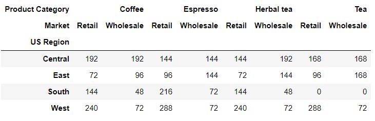<br />输出的DataFrame数据集当中的列有两层，最上面的是咖啡的种类，然后紧接着第二层的便是不同的市场，当然也可以在行方向上添加多个层次的索引，代码如下
```python
pd.crosstab(
    index = [df['region'], df['market']], 
    columns = df['product_category']
)
```
output<br />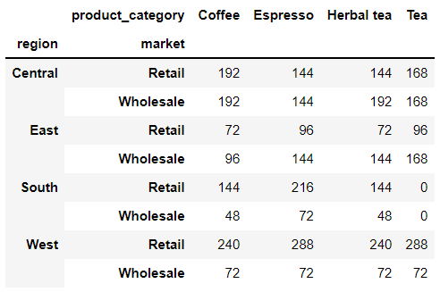
<a name="GGQdl"></a>
## 进阶的操作
和`pd.pivot_table()`函数一样，也可以通过调用当中的`margin`参数来给整合出来的数据做一个加总，代码如下
```python
pd.crosstab(index = df['region'],
            columns = df['product_category'],
            margins = True)
```
output<br />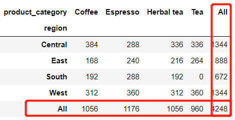<br />还能指定该列的列名，
```python
pd.crosstab(
    index = df['region'],
    columns = df['product_category'], 
    margins = True, 
    margins_name = 'Subtotals'
)
```
output<br />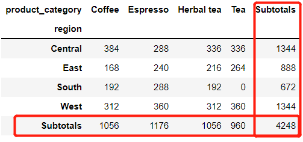<br />另外还有参数`normalize`用来将所有值除以值的总和进行归一化
```python
pd.crosstab(index = df['region'], 
            columns = df['product_category'],
            normalize = True)
```
output<br />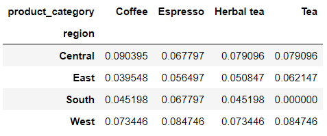<br />从美观的角度出发，想要保留两位小数，代码如下
```python
pd.crosstab(
	index = df['region'], 
	columns = df['product_category'], 
	normalize = True
).style.format('{:.2%}')
```
output<br />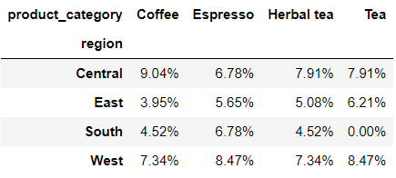<br />要是和之间的`margin`参数相结合来使用的话，将所有的结果汇总到一起等于100%，代码如下
```python
pd.crosstab(
    index = df['region'], 
    columns = df['product_category'], 
    margins = True, 
    normalize = True
).style.format('{:.2%}')
```
output<br />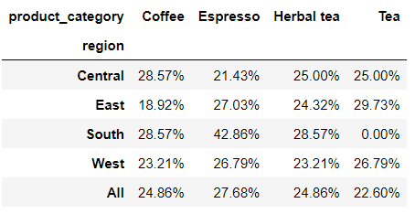
<a name="noAud"></a>
## 进一步衍生
最后还有`values`以及`aggfunc`两参数，其中`aggfunc`参数具体指的是指定聚合函数，例如平均数、求和以及中位数等统计方法，对value参数指定的连续性变量的列进行计算，
```python
df.info()
```
output
```python
<class 'pandas.core.frame.DataFrame'>
RangeIndex: 4248 entries, 0 to 4247
Data columns (total 9 columns):
 #   Column            Non-Null Count  Dtype         
---  ------            --------------  -----         
 0   order_date        4248 non-null   datetime64[ns]
 1   market            4248 non-null   object        
 2   region            4248 non-null   object        
 3   product_category  4248 non-null   object        
 4   product           4248 non-null   object        
 5   cost              4248 non-null   int64         
 6   inventory         4248 non-null   int64         
 7   net_profit        4248 non-null   int64         
 8   sales             4248 non-null   int64         
dtypes: datetime64[ns](1), int64(4), object(4)
memory usage: 298.8+ KB
```
当前数据集中“market”、“region”、“product_category”、“product”四列是离散型变量，而有“cost”、“inventory”、“net_profit”、“sales”四列是连续性变量，分别代表的是成本、库存、净利润以及销量，其中想针对不同地区、不同咖啡种类的成本做一个平均值，那么代码如下
```python
pd.crosstab(
    index = df['region'], 
    columns = df['product_category'], 
    values = df['cost'],
    aggfunc = 'mean'
)
```
output<br />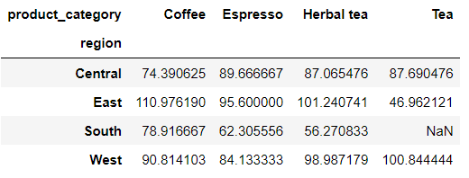<br />要是想要对计算出来的结果保留两位小数，代码如下
```python
pd.crosstab(
    index = df['region'], 
    columns = df['product_category'], 
    values = df['cost'],
    aggfunc = 'mean'
).round(2)
```
output<br />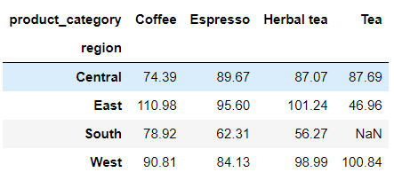<br />当然要是针对存在缺失值的情况，也可以替换成其他值来处理，代码如下
```python
pd.crosstab(
    index = df['region'], 
    columns = df['product_category'], 
    values = df['cost'],
    aggfunc = 'mean',
).fillna(0)
```
output<br />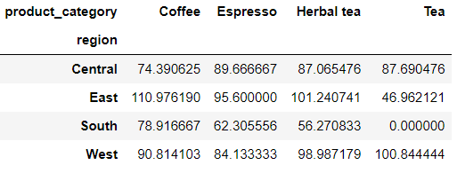
