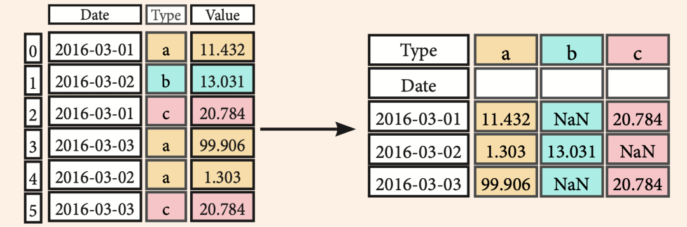
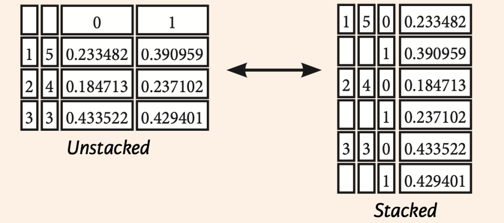
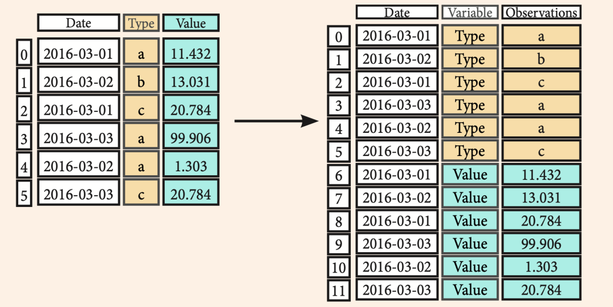
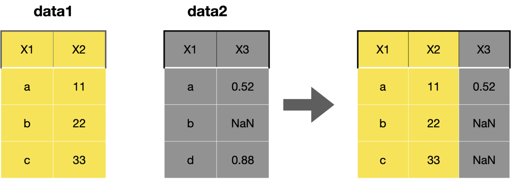
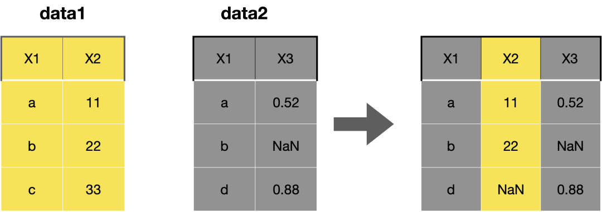
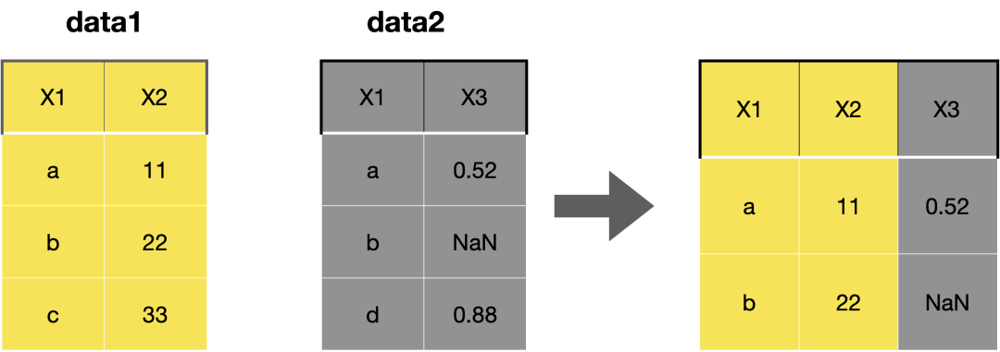
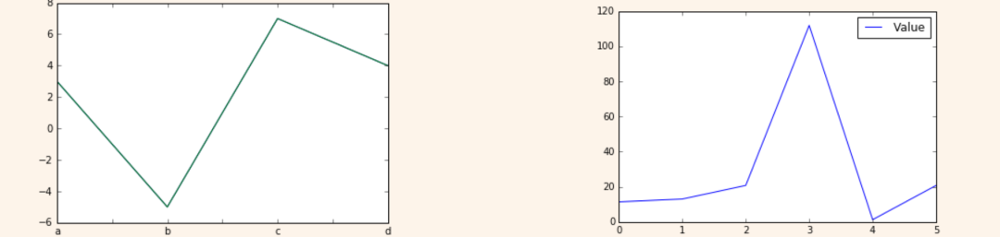

Python Pandas<br />Pandas库建立在NumPy上，并为Python编程语言提供了易于使用的数据结构和数据分析工具。
<a name="FcMKW"></a>
### 导入Pandas
```python
>>> import pandas as pd
```
<a name="nD0QQ"></a>
### Series
```python
>>> s = pd.Series([3,5,-7,9], index=['A', 'B', 'C', 'D'])
```

<a name="VT0Ca"></a>
### DataFrame
```python
>>> data = {'Country': ['Belgium', 'India', 'Brazil'],
            'Capital': ['Brussels', 'New Delhi', 'Brasília'],
            'Population': [11190846, 1303171035, 207847528]}
>>> df = pd.DataFrame(data,
                     columns=['Country', 'Capital', 'Population'])
```

<a name="q4WEi"></a>
### 获取帮助信息
```python
>>> help(pd.Series.loc)
```
<a name="q2SvB"></a>
### 切片与索引
<a name="DpjMV"></a>
#### 获取元素
```python
>>> s['b'] # 获取一个元素
-5
>>> df[1:] # 获取DataFrame子表
    Country   Capital     Population
  1   India   New Delhi   1303171035
  2  Brazil   Brasília    207847528
```
<a name="zsrr7"></a>
#### 布尔索引
```python
# 通过位置
>>> df.iloc[[0],[0]]  # 按行和列选择单个值
'Belgium'
>>> df.iat([0],[0])   
'Belgium'
# 通过标签
>>> df.loc[[0], ['Country']] # 通过行和列标签选择单个值
'Belgium'
>>> df.at([0], ['Country'])  
'Belgium'
# 通过标签或位置
>>> df.ix[2]            # 选择行子集中的单行
Country    Brazil 
Capital    Brasília 
Population 207847528
>>> df.ix[:,'Capital']  # 选择列子集中的单列
0 Brussels
1 New Delhi
2 Brasília
>>> df.ix[1,'Capital']  # 选择行和列
'New Delhi'
# 布尔索引
>>> s[~(s > 1)]           # 选择Series s的值不大于1的子集
>>> s[(s < -1) | (s > 2)] # 选择Seriess的值是<-1或>2 的子集
>>> df[df['Population']>1200000000] # 使用过滤器来调整数据框
# 设置
>>> s['a'] = 6 # 将Series s的索引a设为6
```
<a name="CZP2J"></a>
### Dropping
```python
>>> s.drop(['a', 'c']) # 从行删除值 (axis=0) 
>>> df.drop('Country', axis=1) # 从列删除值
```
<a name="MBP5b"></a>
### `Sort` & `Rank`
```python
>>> df.sort_index() # 按轴上的标签排序 
>>> df.sort_values(by='Country') # 按轴上的值排序
>>> df.rank()
```
<a name="jX9Tr"></a>
### 检索`Series` / DataFrame上的信息
<a name="LZTXs"></a>
#### 基础信息
```python
>>> df.shape   # (行、列)
>>> df.index   # 描述指数
>>> df.columns # 描述DataFrame列
>>> df.info()  # DataFrame信息
>>> df.count() # 非空值的个数
```
<a name="QEKPX"></a>
#### 统计信息
```python
>>> df.sum()          # 值的总和
>>> df.cumsum()       # 值的累积和
>>> df.min()/df.max() # 最小/最大值
>>> df.idxmin()/df.idxmax() # 最小/最大索引值
>>> df.describe()# 摘要统计信息
>>> df.mean()    # 值的意思
>>> df.median()  # 中位数的值
```
<a name="u8GQe"></a>
### `Apply` 函数
```python
>>> f = lambda x: x*2
>>> df.apply(f)        # Apply函数
>>> df.applymap(f)     # Apply每个元素
```
<a name="mFDKh"></a>
### 数据一致性
<a name="Bv4UK"></a>
#### 内部数据一致
在不重叠的索引中引入NA值
```python
>>> s3 = pd.Series([7, -2, 3], index=['a', 'c', 'd'])
>>> s + s3
a 10.0 
b NaN 
c 5.0 
d 7.0
```
<a name="SanUt"></a>
#### 填充方法的算术运算
也可以在`fill`方法的帮助做内部数据一致
```python
>>> s.add(s3, fill_value=0) 
a 10.0
b -5.0
c 5.0
d 7.0
>>> s.sub(s3, fill_value=2) 
>>> s.div(s3, fill_value=4) 
>>> s.mul(s3, fill_value=3)
```
<a name="BywwT"></a>
### 输入与输出
<a name="enHx4"></a>
#### 读取与写入到CSV
```python
>>> pd.read_csv('file.csv', header=None, nrows=5) 
>>> df.to_csv('myDataFrame.csv')
```
<a name="d0039"></a>
#### 读取与写入到Excel
```python
>>> pd.read_excel('file.xlsx')
>>> pd.to_excel('dir/myDataFrame.xlsx', sheet_name='Sheet1')
# 从同一个文件中读取多个工作表
>>> xlsx = pd.ExcelFile('file.xls')
>>> df = pd.read_excel(xlsx, 'Sheet1')
```
<a name="nUdjk"></a>
#### 读取与写入到SQL 查询或数据库表中
```python
>>> from sqlalchemy import create_engine
>>> engine = create_engine('sqlite:///:memory:')
>>> pd.read_sql("SELECT * FROM my_table;", engine)
>>> pd.read_sql_table('my_table', engine)
>>> pd.read_sql_query("SELECT * FROM my_table;", engine)

>>> pd.to_sql('myDf', engine)
```
`read_sql()`是`read_sql_table()`和`read_sql_query()`到一个便捷的封装。
<a name="VmwI7"></a>
### 数据透视`Pivot`
```python
# 将行展开成列
>>> df3= df2.pivot(index='Date',
                   columns='Type',
                   values='Value')
```

<a name="j92xa"></a>
### 数据透视表`Pivot_table`
```python
# 将行展开成列
>>> df4 = pd.pivot_table(df2, 
                         values='Value',
                         index='Date',
                         columns=['Type'])
```
<a name="mmRlC"></a>
### 堆叠`stack`/`unstack`
`stack`和`unstack`是Python进行层次化索引的重要操作。

- `Stack`：将数据的列索引转换为行索引(列索引可以简单理解为列名)
- `Unstack`：将数据的行索引转换为列索引
```python
>>> stacked = df5.stack()
>>> stacked.unstack()  
```

```python
pandas.melt(frame, 
            id_vars=None, 
            value_vars=None, 
            var_name=None, 
            value_name='value', 
            col_level=None)
```
`frame`:要处理的数据集。<br />`id_vars`:不需要被转换的列名。<br />`value_vars`:需要转换的列名，如果剩下的列全部都要转换，就不用写了。<br />`var_name`和`value_name`:是自定义设置对应的列名。<br />`col_level`:如果列是`MultiIndex`，则使用此级别。<br />宽数据--->>长数据，有点像用Excel做透视跟逆透视的过程。
```python
>>> pd.melt(df2,
            id_vars=["Date"],
            value_vars=["Type", "Value"],
            value_name="Observations")
```

<a name="jlIr8"></a>
### 迭代
```python
# (Column-index, Series) 对
>>> df.iteritems() 
# (Row-index, Series) 对
>>> df.iterrows() 
```
<a name="LlF7q"></a>
### 高级索引
```python
# 按条件选择
>>> df3.loc[:,(df3>1).any()]       # 选择只要有变量大于1的列
>>> df3.loc[:,(df3>1).all()]       # 选择所有变量大于1的列
>>> df3.loc[:,df3.isnull().any()]  # 选择带NaN的列
>>> df3.loc[:,df3.notnull().all()] # 选择不带NaN的列
# 用isin索引选择
>>> df[(df.Country.isin(df2.Type))] # 找到相同的元素
>>> df3.filter(items=["a","b"])     # 过滤值
>>> df.select(lambda x: not x%5)    # 选择特定的元素
# Where
>>> s.where(s > 0)  # 满足条件的子集的数据
# Query
>>> df6.query('second > first')  # 查询DataFrame
```
<a name="OUTkD"></a>
### 设置与重置索引
```python
>>> df.set_index('Country')  # 设置索引
>>> df4 = df.reset_index()   # 重置索引
# DataFrame重命名
>>> df = df.rename(index=str,columns={"Country":"cntry", 
                                      "Capital":"cptl", 
                                      "Population":"ppltn"})
```
<a name="HCpuo"></a>
### 重建索引
```python
>>> s2 = s.reindex(['a','c','d','e','b'])
```
<a name="ZmRWN"></a>
#### 向前填充
```python
>> df.reindex(range(4),
              method='ffill')
Country Capital Population 
0 Belgium Brussels 11190846 
1 India New Delhi 1303171035 
2 Brazil Brasília 207847528 
3 Brazil Brasília 207847528
```
<a name="cT7Mi"></a>
#### 向后填充
```python
>>> s3 = s.reindex(range(5), 
                   method='ffill')
0  3 
1  3 
2  3 
3  3 
4  3
```
<a name="l6uB3"></a>
### 多重索引
```python
>>> arrays = [np.array([1,2,3]),
              np.array([5,4,3])]
>>> df5 = pd.DataFrame(np.random.rand(3, 2), index=arrays)
>>> tuples = list(zip(*arrays))
>>> index = pd.MultiIndex.from_tuples(tuples,
                                      names=['first', 'second'])
>>> df6 = pd.DataFrame(np.random.rand(3, 2), index=index)
>>> df2.set_index(["Date", "Type"])
```
<a name="IIjU8"></a>
### 数据去重
```python
>>> s3.unique()            # 返回唯一的值
>>> df2.duplicated('Type') # 检查特定列重复的
>>> df2.drop_duplicates('Type', 
                        keep='last') # 去重
>>> df.index.duplicated()  # 检查索引重复
```
<a name="PhkHo"></a>
### 数据聚合
<a name="bggtb"></a>
#### `groupby`
```python
>>> df2.groupby(by=['Date','Type']).mean()
>>> df4.groupby(level=0).sum()
>>> df4.groupby(level=0).agg({'a':lambda x:sum(x)/len(x),
                              'b': np.sum})
```
<a name="xbQbS"></a>
#### 转换 Transformation
`transform`方法，它与`apply`很像，但是对使用的函数有⼀定限制：

- 它可以产生向分组形状广播标量值
- 它可以以产生⼀个和输入组形状相同的对象
- 它不能修改输⼊
```python
>>> customSum = lambda x: (x+x%2)
>>> df4.groupby(level=0).transform(customSum)
```
<a name="yOW0U"></a>
### 缺失值处理
```python
>>> df.dropna()           # 删除缺失值
>>> df3.fillna(df3.mean())# 用特定的值填充NaN值
>>> df2.replace("a", "f") # 使用其他值替换缺失值
```
<a name="XfFkW"></a>
### 数据合并
<a name="kI1eO"></a>
#### `Merge`
```python
>>> pd.merge(data1,
             data2,
             how='left',
             on='X1')
```

```python
>>> pd.merge(data1,
             data2,
             how='right',
             on='X1')
```

```python
>>> pd.merge(data1,
             data2,
             how='inner',
             on='X1')
```

```python
>>> pd.merge(data1,
             data2,
             how='outer',
             on='X1')
```

<a name="n2i07"></a>
#### `Join`
`join`方法提供了一个简便的方法用于将两个DataFrame中的不同的列索引合并成为一个DataFrame。<br />其中参数的意义与`merge`方法基本相同,只是`join`方法默认为左外连接`how=left`。
```python
>>> data1.join(data2, how='right')
```
<a name="Xpagu"></a>
#### Concatenate
```python
# 垂直拼接
>>> s.append(s2)
# 水平或垂直拼接
>>> pd.concat([s,s2],axis=1, keys=['One','Two'])
>>> pd.concat([data1, data2], axis=1, join='inner')
```
<a name="imdXt"></a>
### 日期
```python
>>> df2['Date']= pd.to_datetime(df2['Date'])
>>> df2['Date']= pd.date_range('2000-1-1',
                               freq='M')
>>> dates = [datetime(2012,5,1), datetime(2012,5,2)]
>>> index = pd.DatetimeIndex(dates)
>>> index = pd.date_range(datetime(2012,2,1), end, freq='BM')
```
<a name="ggMjL"></a>
### 可视化
<a name="GnmQT"></a>
#### Series可视化
```python
>>> import matplotlib.pyplot as plt
>> s.plot()
>>> plt.show()

>>> df2.plot()
>>> plt.show()
```

