Python Pandas
<a name="d56R4"></a>
## 1、简介
在日常开展数据分析的过程中，经常需要对字符串类型数据进行处理，此类过程往往都比较繁琐，而pandas作为表格数据分析利器，其内置的基于`Series.str`访问器的诸多针对字符串进行处理的方法，以及一些top-level级的内置函数，则可以大大提升字符串型数据处理的效率。<br />学习pandas中常用的一些高效字符串处理方法，提升日常数据处理分析效率😋：
<a name="T8G08"></a>
## 2、pandas常用字符串处理方法
pandas中的常用字符串处理方法，可分为以下几类：
<a name="hzthv"></a>
### 2.1 拼接合成类方法
这一类方法主要是基于原有的Series数据，按照一定的规则，利用拼接或映射等方法合成出新的Series，主要有：
<a name="mE4WV"></a>
#### 2.1.1 利用`join()`方法按照指定连接符进行字符串连接
当原有的Series中每个元素均为列表，且列表中元素均为字符串时，就可以利用`str.join()`来将每个列表按照指定的连接符进行连接，主要参数有：

- 「sep：」 `str`型，必选，用于设置连接符

它除了可以简化常规使用`apply()`配合`'连接符'.join(列表)`实现的等价过程之外，还可以在列表中包含非字符型元素时自动跳过此次拼接返回缺失值，譬如下面的例子：
```python
s = pd.Series([
    ['a', 'b', 'c'],
    [1, 'a', 'b'],
    list('pandas')
])

s.str.join('-')
```
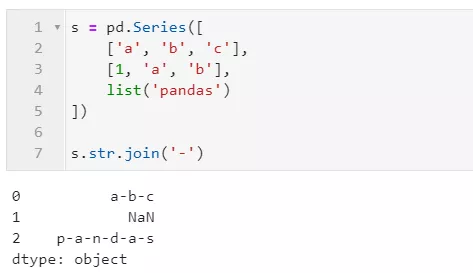
<a name="ZKne5"></a>
#### 2.1.2 利用`cat()`方法进行字符串拼接
当需要对整个序列进行拼接，或者将多个序列按位置进行元素级拼接时，就可以使用`str.cat()`方法来加速这个过程，其主要参数有：

- 「others：」 序列型，可选，用于传入待进行按位置元素级拼接的字符串序列对象
- 「sep：」 str型，可选，用于设置连接符，默认为''
- 「na_rep：」 str型，可选，用于设置对缺失值的替换值，默认为None时：
   - 当others参数未设置时，返回的拼接结果中缺失项自动跳过
   - 当others参数设置时，两边的序列对应位置上存在缺失值时，拼接结果对应位置返回缺失值

下面是一些简单的例子：<br />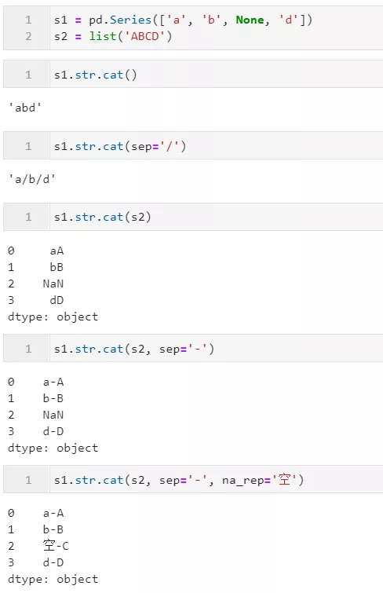
<a name="NzZWr"></a>
### 2.2 判断类方法
判断类方法在这里指的是针对字符型Series，按照一定的条件判断从而返回与原序列等长的bool型序列，可进一步辅助数据筛选等操作，在pandas中此类字符串处理方法主要有：
<a name="eQvTc"></a>
#### 2.2.1 利用`startswith()`与`endswith()`匹配字符串首尾
当需要判断字符型Series中的每个元素是否以某段字符片段开头或结尾时，就可以使用到`startswith()`/`endswith()`，它们的参数一致：

- 「pat：」 str型，用于定义要检查的字符片段
- 「na：」 任意对象，当对应位置元素为空值时，用于自定义该位置返回判断结果，默认为NaN，会原值返回，通常建议设置为False

下面是一些简单的例子：<br />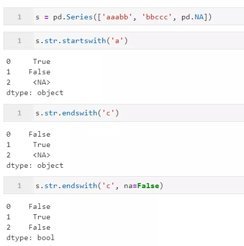
<a name="S6JB6"></a>
#### 2.2.2 利用`contains()`判断是否包含指定模式
当想要判断字符型Series中每个元素，是否包含指定的字符片段或正则模式时，则可以使用到`str.contains()`方法，其主要参数有：

- 「pat：」 str型，必选，用于定义要检查的字符模式，当regex=True时表示正则表达式，当regex=False时，表示原始字符串片段
- 「flags：」 int型，可选，对应re模块中的flags参数，用于配合正则表达式模式，实现更多功能，譬如re.IGNORECASE即代表大小写忽略
- 「na：」 用于自定义遇到缺失值时返回的对象，通常建议设置为False
- 「regex：」 bool型，用于设置是否将pat参数视为正则表达式进行解析，默认为True

下面是一些简单的例子：<br />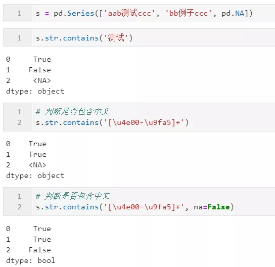
<a name="TXLxx"></a>
#### 2.2.3 利用`match()`判断是否以指定正则模式开头
类似前面介绍的`startswith()`，不同的是，`match()`支持正则表达式，可以帮助掌握正则表达式的用户拓展匹配能力，其主要参数有：

- 「pat：」 str型，必选，用于定义要检查的字符模式，当`regex=True`时表示正则表达式，当`regex=False`时，表示原始字符串片段
- 「flags：」 `int`型，可选，对应re模块中的flags参数，用于配合正则表达式模式，实现更多功能，譬如`re.IGNORECASE`即代表大小写忽略
- 「na：」 用于自定义遇到缺失值时返回的对象，通常建议设置为False

下面是一些简单的例子：<br />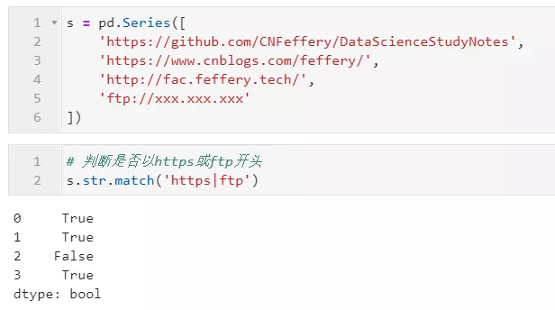
<a name="fRmJv"></a>
#### 2.2.4 利用`fullmatch()`判断字符串是否完整满足指定正则模式
上面介绍的`match()`局限性在于只能从开头匹配是否满足指定正则表达式，而从pandas1.1.0版本开始，新增了`fullmatch()`方法，可以传入正则表达式来判断目标字符串是否可以「完全匹配」，其参数同`match()`，下面是一个简单的例子：<br />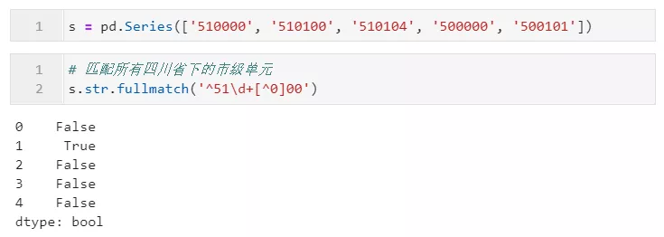
<a name="YIxq8"></a>
### 2.3 生成型方法
「生成型」方法这里指的是，基于原有的单列字符型Series数据，按照一定的规则产生出新计算结果的一系列方法，pandas中常用的有：
<a name="GgwHb"></a>
#### 2.3.1 利用`slice()`进行字符切片
当想要对字符型Series进行元素级的切片操作时，就可以用到`str.slice()`，其三个参数依次为`start`、`stop`和`step`，分别代表切片的开始下标、结束下标与步长，与Python原生的切片方式一致，下面是一些简单的例子（也可以直接使用类似Python中`[start:stop:step]`）：<br />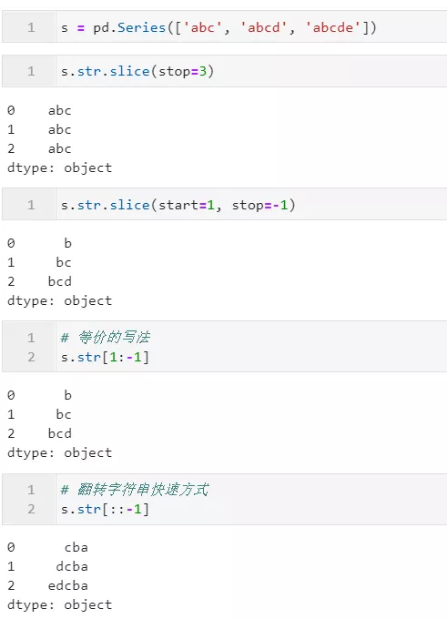
<a name="Xq54F"></a>
#### 2.3.2 利用`replace()`对指定字符片段或正则模式进行替换
当希望对字符型Series进行元素级的字符片段/正则模式替换时，就可以使用到`str.replace()`方法，其除了常规的`pat`、`flags`、`regex`等参数外，还有特殊的参数`n`用于设置每个元素字符串（默认为-1即不限制次数），参数`repl`用于设置填充的新内容，从开头开始总共替换几次，下面是一些简单的例子：<br />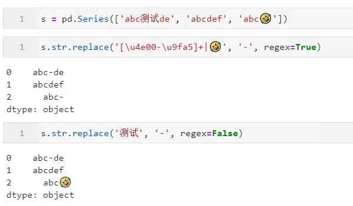
<a name="avqfl"></a>
#### 2.3.3 利用`split()`按照指定字符片段或正则模式拆分字符串
利用`str.split()`方法，可以基于指定的字符片段或正则模式对原始字符Series进行元素级拆分，主要参数有pat、n，同上文类似的参数设定，另外还有特殊参数`expand`来设定对于是否以DataFrame中不同列的形式存储拆分结果，默认为`False`。下面是一些简单的例子：<br />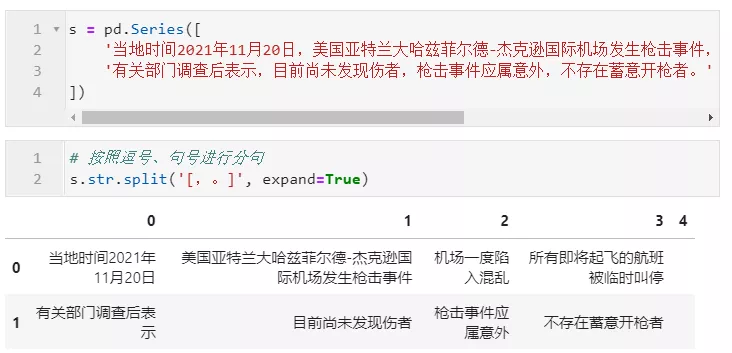
<a name="kvl4U"></a>
#### 2.3.4 利用`findall()`提取符合指定模式的片段
利用`findall()`，可以按照指定的字符片段/正则模式对字符型Series进行元素级提取，可用的参数有`pat`、`flags`，下面是一些简单的例子：<br />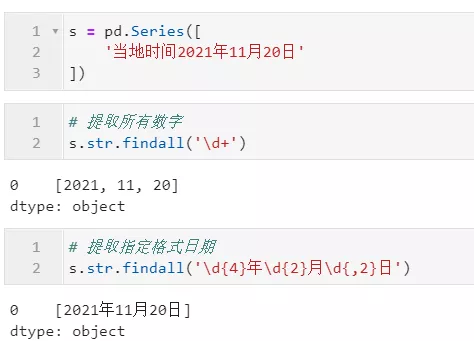
<a name="jPnk6"></a>
#### 2.3.5 利用`count()`进行频数统计
通过`count()`，可以对指定的字符片段/正则模式在字符型Series中每个字符串元素中出现的次数进行统计，其参数同上文中的`findall()`，下面是一些简单的例子：<br />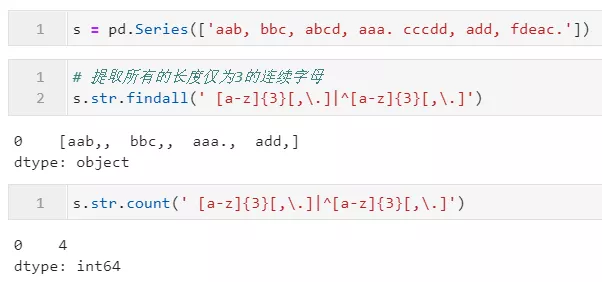
<a name="lKwEy"></a>
### 2.4 特殊型方法
除了上述介绍到的字符串处理方法外，pandas中还有一些特殊方法，可以配合字符串解决更多处理需求，典型的有：
<a name="bK9LA"></a>
#### 2.4.1 利用`get_dummies()`方法生成哑变量
在涉及到机器学习特征工程的过程中，可以使用到`str.get_dummies()`方法来对具有固定分隔符的字符串进行哑变量的生成，它只有一个参数sep，用于设置分隔符，暂时不支持正则模式：<br />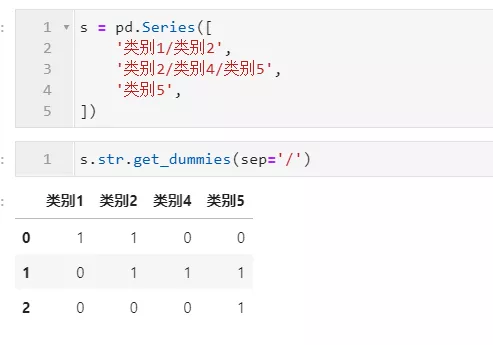
<a name="RVq7K"></a>
#### 2.4.2 利用`pd.to_numeric()`修复数值错误
有些情况下，从外部数据源（如excel表）中读入的数据，由于原始数据文件加工的问题，导致一些数值型字段中的某些单元格混入非数值型字符，如：<br />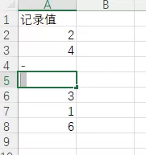<br />这种情况下，直接读入的数据，本应该为数值型的字段会变成object型：<br />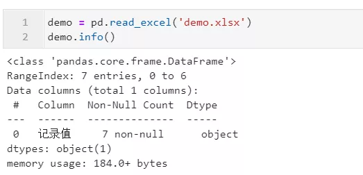<br />这种时候就可以利用`pd.to_numeric()`方法，设置参数`errors='coerce'`，就可以将可以合法转为数值型的记录转换为相应的数值，不合法的位置返回缺失值：<br />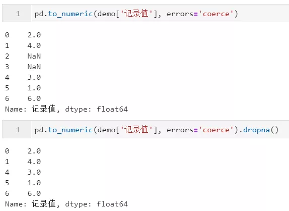
