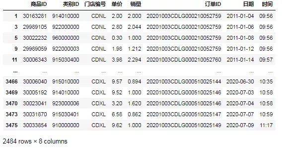

Pandas<br />Pandas筛选数据的15个常用技巧，主要包括5个知识点：

1. 比较运算：`==、<、>、>=、<=、!=`
2. 范围运算：`between(left,right)`
3. 字符筛选：`str.contains(pattern或字符串,na=False)`
4. 逻辑运算：`&`（与）、`|`（或）、`not`(取反)
5. 比较函数：`eq`，`ne`，`le`，`lt`，`ge`，`gt`（相当于`==`，`=!`，`<=`，`<`，`>=`，`>`）
6. `apply`和`isin`函数

下面以超市运营数据为例，首先读取数据：
```python
import pandas as pd
data=pd.read_excel('超市运营数据模板.xlsx')
data
```
<br />先看一下各列的数据类型：
```python
data.dtypes
商品ID             int64
类别ID             int64
门店编号            object
单价             float64
销量             float64
订单ID            object
日期      datetime64[ns]
时间              object
dtype: object
```
下面以实际应用场景为例开始讲解：
<a name="p6KR9"></a>
## 1、筛选门店编号为'CDXL'的运营数据
<a name="y5jDF"></a>
#### ①第一种方法，用比较运算符'`==`'：
```python
data[data.门店编号=='CDXL']
```

<a name="d2Oei"></a>
#### ②第二种方法，用比较函数'`eq`'：
```python
data[data['门店编号'].eq('CDXL')]
```

<a name="jvUhu"></a>
## 2、筛选单价小于等于10元的运营数据
<a name="bCqHp"></a>
#### ③第一种方法，用比较运算符'`<=`'：
```python
data[data.单价<=10]
```

<a name="ncf3z"></a>
#### ④第二种方法，用比较函数'`le`'：
```python
data[data['单价'].le(10)]
```

<a name="306Zn"></a>
## 3、筛选销量大于2000的运营数据
<a name="jXSmp"></a>
#### ⑤第一种方法，用比较运算符'`>=`'：
```python
data[data.销量>2]
```

<a name="EsFtM"></a>
#### ⑥第二种方法，用比较函数'`ge`'：
```python
data[data['销量'].ge(2)]
```

<a name="EddNq"></a>
## 4、筛选除门店'CDXL'外的运营数据
<a name="GqrXP"></a>
#### ⑦第一种方法，用比较运算符'`!=`'：
```python
data[data.门店编号!='CDXL']
```

<a name="Rc64s"></a>
#### ⑧第二种方法，用比较函数'`ne`'：
```python
data[data['门店编号'].ne('CDXL')]
```

<a name="39DoT"></a>
## 5、筛选2020年5月的运营数据
首先将日期格式化：
```python
data['日期']=data["日期"].values.astype('datetime64')  #如果已为日期格式则此步骤可省略
data['日期']
import datetime
s_date = datetime.datetime.strptime('2020-04-30', '%Y-%m-%d').date()  #起始日期
e_date = datetime.datetime.strptime('2020-06-01', '%Y-%m-%d').date()  #结束日期
```
<a name="z7VGe"></a>
#### ⑨第一种方法，用逻辑运算符号'`>`' '`<`'和'`&`'：
`Pandasdatetime64[ns]`不能直接与`datetime.date`相比，需要用`pd.Timestamp`进行转化
```python
data[(data.日期>pd.Timestamp(s_date))&(data.日期<pd.Timestamp(e_date))]
```

<a name="aNln1"></a>
#### ⑩第二种，用比较函数'`gt`'，'`lt`'和'`&`':
```python
data[(data['日期'].lt(pd.Timestamp(e_date)))&(data['日期'].gt(pd.Timestamp(s_date)))]
```

<a name="WPGn5"></a>
#### ⑪第三种，用`apply`函数实现：
```python
id_a=data.日期.apply(lambda x: x.year ==2020  and x.month==5)
data[id_a]
```

<a name="EnQGF"></a>
#### ⑫第四种，用`between`函数实现：
```python
id_b=data.日期.between(pd.Timestamp(s_date),pd.Timestamp(e_date))
data[id_b]
```

<a name="zAfOB"></a>
## 6、筛选“类别ID”包含'000'的数据
<a name="5z8C7"></a>
#### ⑬第一种，用`contains`函数：
```python
data['类别ID']=data['类别ID'].values.astype('str')  #将该列转换为字符数据类型
id_c=data.类别ID.str.contains('000',na=False)
data[id_c]
```

<a name="aPL2f"></a>
#### ⑭第二种，用`isin`函数：
```python
id_i=data.类别ID.isin(['000'])  #接受一个列表
data[id_i]
```
很遗憾，isin函数搞不定，因为它只能判断该列中元素是否在列表中
<a name="oAo7A"></a>
## 7、筛选商品ID以“301”开头的运营数据
<a name="eMX6k"></a>
#### ⑮需要用`contains`函数结合正则表达式使用：
```python
data['商品ID']=data['商品ID'].values.astype('str')  #将该列转换为字符数据类型
id_c2=data.商品ID.str.contains('301\d{5}',na=False)
data[id_c2]
```

