Python Pandas
<a name="CdQWR"></a>
### 导入数据集和模块
先导入`pandas`模块，并且读取数据，代码如下
```python
import pandas as pd
df = pd.read_csv("netflix_titles.csv")
df.head()
```
<a name="C8Ybt"></a>
### 根据文本内容来筛选
首先可以根据文本内容直接来筛选，返回的是`True`如果文本内容是相匹配的，`False`如果文本内容是不匹配的，代码如下
```python
mask = df['type'].isin(['TV Show'])
mask.head()
```
output
```python
0    False
1     True
2     True
3     True
4     True
Name: type, dtype: bool
```
然后将这个`mask`作用到整个数据集当中，返回的则是满足与`True`条件的数据
```python
df[mask].head()
```
output<br />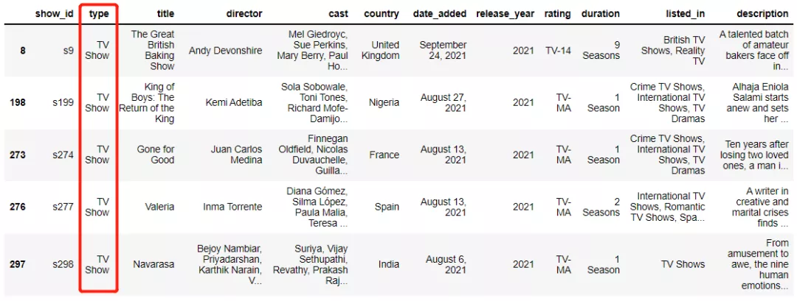<br />当然也可以和`.loc`方法来相结合，只挑选少数的几个指定的列名，代码如下
```python
df.loc[mask, ['title','country','duration']].head()
```
output
```python
                   title       country   duration
1          Blood & Water  South Africa  2 Seasons
2              Ganglands           NaN   1 Season
3  Jailbirds New Orleans           NaN   1 Season
4           Kota Factory         India  2 Seasons
5          Midnight Mass           NaN   1 Season
```
当然要是所要筛选的文本内容并不仅仅只有1个，就可以这么来操作，代码如下
```python
mask = df['type'].isin(['Movie','TV Show'])
```
结果返回的是`True`，要是文本内容全部都匹配，要是出现一个不匹配的现象则返回的是`False`
<a name="sP94V"></a>
### 根据关键字来筛选
可以根据某个关键字来筛选数据，数据集当中的listed-in包含的是每部电影的种类，当然很多电影并不只有一个种类，而是同时涉及到很多个种类，例如某一部电影既有“科幻”元素，也有“爱情”元素同时还包含了部分“动作片”的元素。<br />按照某个关键字来筛选，例如筛选出包含了“horror”这个关键字的影片，代码如下
```python
mask = df['listed_in'].str.contains('horror', case=False, na=False)
```
其中的`case=False`表明的是忽略字母的大小写问题，`na=False`表明的是对于缺失值返回的是`False`，
```python
df[mask].head()
```
output<br />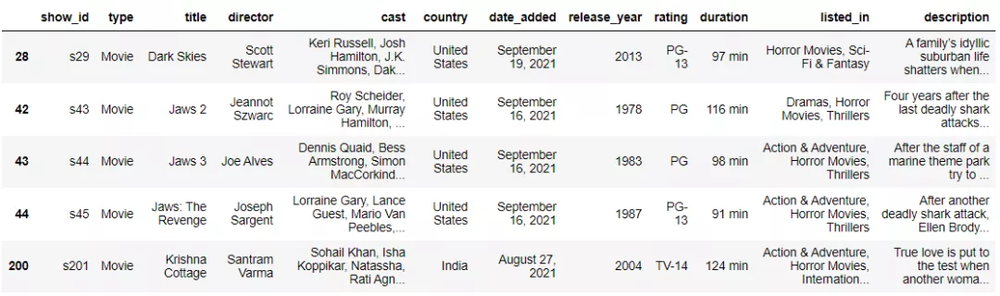<br />而要是文本数据当中包含了一些特殊符号，例如`+`、`^`以及`=`等符号时，可以将`regex`参数设置成`False`（默认的是`True`），这样就不会被当做是正则表达式的符号，代码如下
```python
df['a'].str.contains('^', regex=False)
#或者是
df['a'].str.contains('\^')
```
<a name="waCcl"></a>
### 根据多个关键字来筛选
当关键字不仅仅只有一个的时候，就可以这么来操作
```python
pattern = 'horror|stand-up'
mask = df['listed_in'].str.contains(pattern, case=False, na=False)
df[mask].sample(5)
```
output<br /><br />用`|`来表示“或”的意思，将电影类别包含“horror”或者是“stand-up”这两类的电影筛选出来<br />除此之外，还可以这么来做
```python
mask1 = df['listed_in'].str.contains("horror", case=False)
mask2 = df['listed_in'].str.contains("stand-up", case=False)
df[mask1 | mask2].sample(5)
```
出来的结果和上述一样，只不过过程可能稍加繁琐，除了`|`表示的是“或”之外，也有表示的是和，也就是`&`标识符，意味着条件全部都需要满足即可，例如
```python
mask1 = (df['listed_in'].str.contains('horror', case=False, na=False))
mask2 = (df['type'].isin(['TV Show']))
df[mask1 & mask2].head(3)
```
output<br />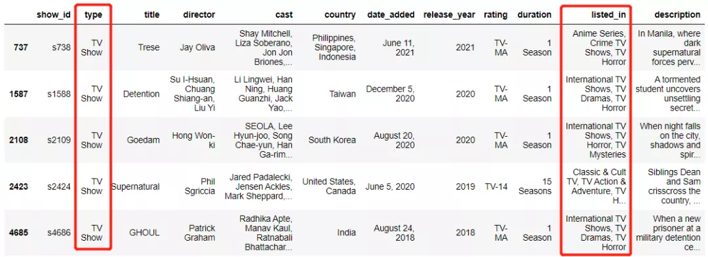<br />可以添加多个条件在其中，多个条件同时满足，例如
```python
mask1 = df['rating'].str.contains('tv', case=False, na=False)
mask2 = df['listed_in'].str.contains('tv', case=False, na=False)
mask3 = df['type'].str.contains('tv', case=False, na=False)
df[mask1 & mask2 & mask3].head()
```
output<br />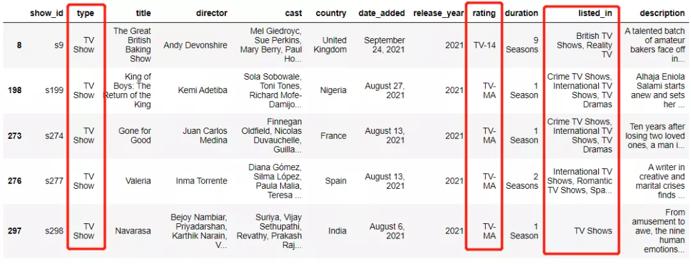
<a name="MEhDo"></a>
### 正则表达式在pandas筛选数据中的应用
同时也可以将正则表达式应用在如下的数据筛选当中，例如`str.contains('str1.*str2')`代表的是文本数据是否以上面的顺序呈现，
```python
pattern = 'states.*mexico'
mask = data['country'].str.contains(pattern, case=False, na=False)
data[mask].head()
```
output<br />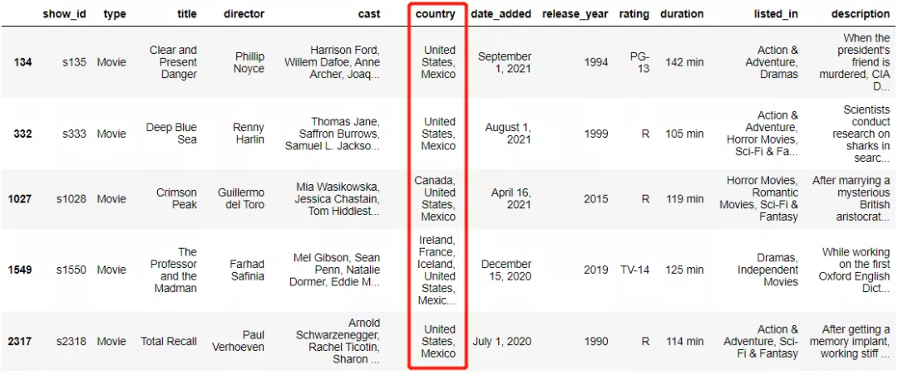<br />其中`.*`在正则表达式当中表示匹配除换行符之外的所有字符，需要筛选出来包含`states`以及`mexico`结尾的文本数据，再来看下面的例子
```python
pattern = 'states.*mexico|mexico.*states'
mask = data['country'].str.contains(pattern, case=False, na=False)
data[mask].head()
```
output<br />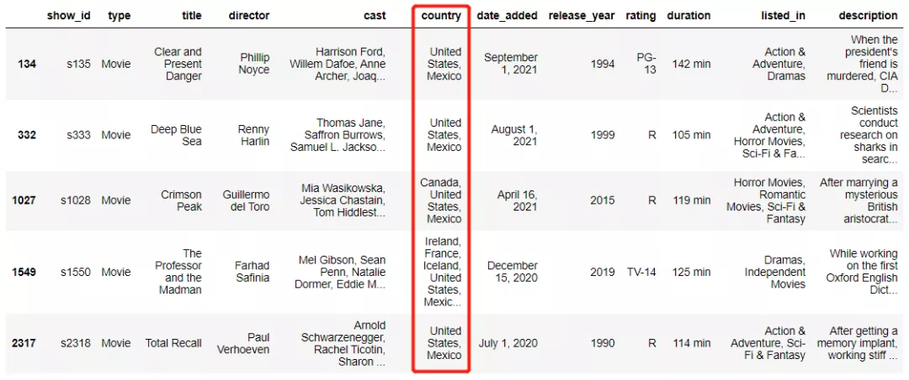<br />筛选出来的文本数据满足两个条件当中的一个即可
<a name="o31Lq"></a>
### lambda方法来筛选文本数据中的应用
有一些筛选数据的方式可能稍显复杂，因此需要lambda方法的介入，例如
```python
cols_to_check = ['rating','listed_in','type']
pattern = 'tv'
mask = data[cols_to_check].apply(
        lambda col:col.str.contains(
        pattern, na=False, case=False)).all(axis=1)
```
需要在`rating`、`listed_in`以及`type`这三列当中筛选出包含`tv`的数据，来看一下结果如何
```python
df[mask].head()
```
output<br />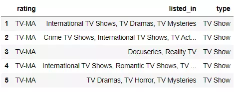<br />再来看下面的这个例子，
```python
mask = df.apply(
    lambda x: str(x['director']) in str(x['cast']), 
    axis=1)
```
上面的例子当中是来查看`director`这一列是否被包含在了`cast`这一列当中，结果如下
```python
df[mask].head()
```
output<br />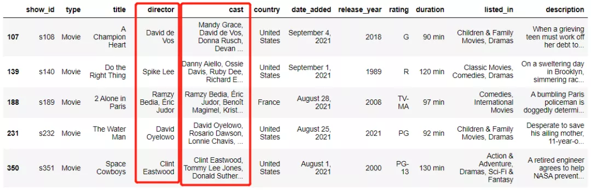
<a name="iDx4J"></a>
### `filter`方法
还可以通过`filter`方法来筛选文本的数据，例如筛选出列名包含`in`的数据，代码如下
```python
df.filter(like='in', axis=1).head(5)
```
output<br />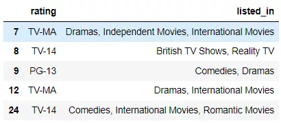<br />当然也可以用`.loc`方法来实现，代码如下
```python
df.loc[:, df.columns.str.contains('in')]
```
出来的结果和上述的一样<br />要是将`axis`改成`0`，就意味着是针对行方向的，例如筛选出行索引中包含Love的影片，代码如下
```python
df_1 = df.set_index('title')
df_1.filter(like='Love', axis=0).head(5)
```
output<br />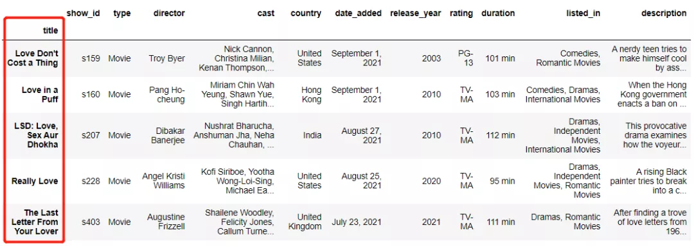<br />当然也可以通过`.loc`方法来实现，代码如下
```python
df_1.loc[df_1.index.str.contains('Love'), :].head()
```
<a name="nUjOZ"></a>
### 筛选文本数据的其他方法
可以使用`query`方法，例如筛选出国家是韩国的影片
```python
df.query('country == "South Korea"').head(5)
```
output<br />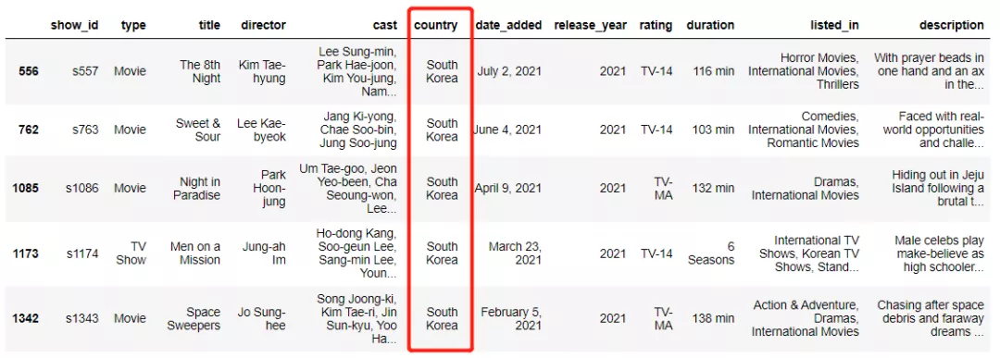<br />例如筛选出影片的添加时间是11月的，代码如下
```python
mask = df["date_added"].str.startswith("Nov")
df[mask].head()
```
output<br />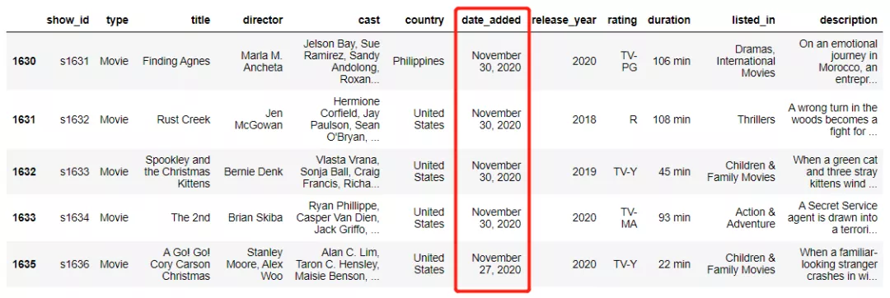<br />那既然用到了`startswith`方法，那么就会有`endswith`方法，例如
```python
df['col_name'].str.endswith('2019')
```
除此之外还有这些方法可以用来筛选文本数据

- `df['col_name'].str.len()>10`
- `df['col_name'].str.isnumeric()`
- `df[col_name].str.isupper()`
- `df[col_name].str.islower()`
