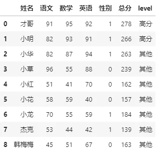
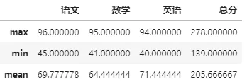
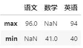
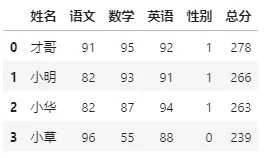
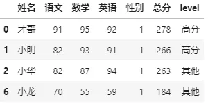
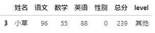

Python Pandas
<a name="N3dWI"></a>
## 数据预览
这里的数据是虚构的语数外成绩，在操作的时候拷贝一下就好。
```python
import pandas as pd

df = pd.read_clipboard()
df
```
| <br /> | 姓名 | 语文 | 数学 | 英语 | 性别 | 总分 |
| --- | --- | --- | --- | --- | --- | --- |
| 0 | 才哥 | 91 | 95 | 92 | 1 | 278 |
| 1 | 小明 | 82 | 93 | 91 | 1 | 266 |
| 2 | 小华 | 82 | 87 | 94 | 1 | 263 |
| 3 | 小草 | 96 | 55 | 88 | 0 | 239 |
| 4 | 小红 | 51 | 41 | 70 | 0 | 162 |
| 5 | 小花 | 58 | 59 | 40 | 0 | 157 |
| 6 | 小龙 | 70 | 55 | 59 | 1 | 184 |
| 7 | 杰克 | 53 | 44 | 42 | 1 | 139 |
| 8 | 韩梅梅 | 45 | 51 | 67 | 0 | 163 |

<a name="Cfy2s"></a>
## 1、apply
`apply`可以对`DataFrame`类型数据按照**列或行**进行函数处理，**默认**情况下是按照**列**（单独对`Series`亦可）。<br />在案例数据中，比如将**性别**列中的1替换为男，0替换为女，那么可以这样搞定。<br />先自定义一个函数，这个函数有一个参数 s（Series类型数据）。
```python
def getSex(s):
    if s==1:
        return '男'
    elif s==0:
        return '女'
```
上述函数还有更简洁写法，这里方便理解采用最直观的写法哈。<br />然后，直接使用`apply`去调用这个函数即可。
```python
df['性别'].apply(getSex)
```
可以看到输出结果如下：
```python
0    男
1    男
2    男
3    女
4    女
5    女
6    男
7    男
8    女
Name: 性别, dtype: object
```
当然，也可以直接用调用匿名函数`lambda`的形式：
```python
df['性别'].apply( lambda s: '男' if s==1 else '女' )
```
可以看到结果是一样的：
```python
0    男
1    男
2    男
3    女
4    女
5    女
6    男
7    男
8    女
Name: 性别, dtype: object
```
以上是单纯根据**一列**的值条件进行的数据处理，也可以根据**多列组合条件**（可以了解为**按行**）进行处理，需要注意这种情况下需要指定参数`axis=1`，具体看下面案例。<br />案例中，认为**总分高于200**且**数学分数高于90**为高分
```python
# 多列条件组合
df['level'] = df.apply(lambda df: '高分' if df['总分']>=200 and df['数学']>=90 else '其他', axis=1)
df
```
<br />同样，上述用`apply`调用的函数都是自定义的，实际上也可以调用**内置**或者`pandas`/`numpy`等**自带**的函数。<br />比如，**求语数外和总分最高分：**
```python
# python内置的函数
df[['语文','数学','英语','总分']].apply(max)

语文     96
数学     95
英语     94
总分    278
dtype: int64
```
**求语数外和总分平均分：**
```python
# numpy自带的函数
import numpy as np

df[['语文','数学','英语','总分']].apply(np.mean)

语文     69.777778
数学     64.444444
英语     71.444444
总分    205.666667
dtype: float64
```
<a name="LKXZN"></a>
## 2、`applymap`
`applymap`则是对每个元素的函数处理，变量是每个元素值。<br />比如对语数外三科超过90分认为是科目高分
```python
df[['语文','数学','英语']].applymap(lambda x:'高分' if x>=90 else '其他')
```
| 

 | 语文 | 数学 | 英语 |
| --- | --- | --- | --- |
| 0 | 高分 | 高分 | 高分 |
| 1 | 其他 | 高分 | 高分 |
| 2 | 其他 | 其他 | 高分 |
| 3 | 高分 | 其他 | 其他 |
| 4 | 其他 | 其他 | 其他 |
| 5 | 其他 | 其他 | 其他 |
| 6 | 其他 | 其他 | 其他 |
| 7 | 其他 | 其他 | 其他 |
| 8 | 其他 | 其他 | 其他 |

<a name="i13OO"></a>
## 3、`map`
`map`则是根据输入对应关系映射值返回最终数据，作用于某一列。传入的值可以是字典，键值为原始值，值为需要替换的值。也可以传入一个函数或者字符格式化表达式等等。<br />以上面性别列中的1替换为男，0替换为女为例，还可以通过`map`来实现
```python
df['性别'].map({1:'男', 0:'女'})
```
输出结果也是一致的：
```python
0    男
1    男
2    男
3    女
4    女
5    女
6    男
7    男
8    女
Name: 性别, dtype: object
```
比如总分列想变成格式化字符：
```python
df['总分'].map('总分：{}分'.format)

0    总分：278分
1    总分：266分
2    总分：263分
3    总分：239分
4    总分：162分
5    总分：157分
6    总分：184分
7    总分：139分
8    总分：163分
Name: 总分, dtype: object
```
<a name="p9q2F"></a>
## 4、`agg`
`agg`一般用于**聚合**，在分组或透视操作中常见到，用法是和`apply`比较接近。<br />比如，求语数外和总分的最高分、最低分和平均分
```python
df[['语文','数学','英语','总分']].agg(['max','min','mean'])
```
<br />还可以**对不同的列进行不同的运算**（用字典形式指定）
```python
# 语文最高分、数学最低分和英文最高最低分
df.agg({'语文':['max'],'数学':'min','英语':['max','min']})
```
<br />当然也支持自定义函数的调用
<a name="Qj3oQ"></a>
## 5、pipe
以上四个调用函数的方法，可以发现被调用的函数的参数就是 DataFrame或Serise数据，如果被调用的函数**还需要别的参数**，那么该如何做呢？<br />所以，`pipe`就出现了。<br />pipe又称管道方法，可以将处理分析过程标准化、流程化。它在调用函数的时候可以带被调用函数的其他参数，这样就方便自定义函数的功能扩展了。<br />比如，需要**获取总分大于n，性别为sex的同学的数据，其中n和sex是可变参数**，那么用`apply`等就不太好处理。这个时候，就可以用到`pipe`方法来搞事了！<br />先定义一个函数
```python
# 定义一个函数，总分大于等于n，性别为sex的同学数据（sex为2表示不分性别）
def total(df, n, sex):
    dfT = df.copy()
    if sex == 2:
        return dfT[(dfT['总分']>=n)]
    else:
        return dfT[(dfT['总分']>=n) & (dfT['性别']==sex)]
```
如果要找到**总分大于200，不分性别**的学生成绩，可以这样：
```python
df.pipe(total,200,2)
```
<br />再找**总分大于150，性别为男生**（1）的学生成绩，可以这样：
```python
df.pipe(total,150,1)
```
<br />再找总分大于200，性别为女生（0）的学生成绩，可以这样：
```python
df.pipe(total,200,0)
```

