Python Pandas
<a name="lLhOT"></a>
## 1、`concat()`
`concat()` 可用于两个及多个 DataFrame 间行/列方向进行内联或外联拼接操作，默认对行(沿 y 轴)取并集。
<a name="glUqY"></a>
### 「使用方式」
```python
pd.concat(
    objs: Union[Iterable[~FrameOrSeries], Mapping[Union[Hashable, NoneType], ~FrameOrSeries]],
    axis=0,
    join='outer',
    ignore_index: bool = False,
    keys=None,
    levels=None,
    names=None,
    verify_integrity: bool = False,
    sort: bool = False,
    copy: bool = True,
)
```
<a name="G0jFI"></a>
### 「主要参数」

- `objs`：一个序列或是Series，DataFrame对象的映射。
- `axis`：连接的轴，0('index'，行)，1('columns',列)，默认为0。
- `join`：连接方式 ，inner(交集), outer(并集)，默认为outer。
- `ignore_index`：是否重置串联轴的索引值。如果为True，则重置索引为0，…, n - 1。
- `keys`：创建层次化索引。可以是任意值的列表或数组、元组数组、数组列表（如果将levels设置成多级数组的话）
- `names`：生成的分层索引中级别的名称。
<a name="u8RrV"></a>
### 示例
创建两个 DataFrame。
```python
df1 = pd.DataFrame(
          {'char': ['a', 'b'],
           'num': [1, 2]})
df2 = pd.DataFrame(
          {'char': ['b', 'c'],
           'num': [3, 4]})
```
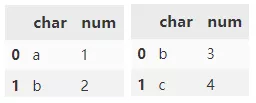<br />`concat()` 默认会对行方向进行拼接操作，连接方式 outer。
```python
pd.concat([d1, d2])
```
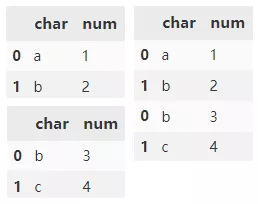<br />清除现有索引并重置索引。
```python
pd.concat(
    [d1, d2],
    ignore_index=True)
```
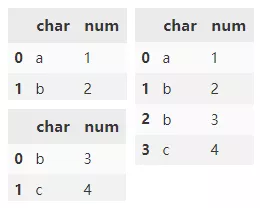<br />通过 keys 参数在数据的最外层添加分层索引。
```python
pd.concat(
    [d1, d2],
    keys=['d1', 'd2'])
```
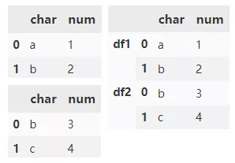<br />指定 names 参数来标记创建的索引键。
```python
pd.concat(
    [d1, d1],
    keys=['d1', 'd2'],
    names=['DF Name', 'Row ID'])
```
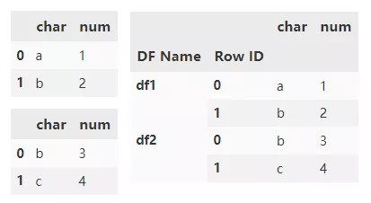<br />将两个 DataFrame 与重叠的列进行组合并返回所有内容。交集外的列填充 NaN。
```python
df3 = pd.DataFrame(
          {'char': ['b', 'c'],
          'float': [3.0, 4.0]})
pd.concat([df1, df3])
```
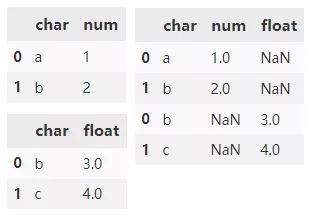<br />将两个 DataFrame 与重叠的列进行组合，只返回重叠列的内容。
```python
pd.concat(
    [df1, df3],
    join="inner")
```
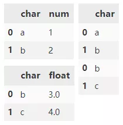<br />指定 `axis=1` 沿 x 轴水平组合 DataFrame 对象。
```python
df4 = pd.DataFrame(
          {'char': ['b', 'c', 'd'],
           'num': [3, 4, 5]},
           index=range(1, 4))
pd.concat([df1, df4], axis=1)
```
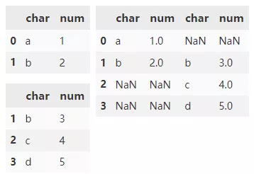
<a name="rPyN0"></a>
## 2、`merge()`
`merge()` 只能用于两个 DataFrame 间列方向进行内联或外联合并操作，默认列合并(沿 x 轴)，取交集（即：以两个 DataFrame 列名的交集作为连接键）
<a name="gfXZ0"></a>
### 「使用方式」
```python
pd.merge(
    left,
    right,
    how: str = 'inner',
    on=None,
    left_on=None,
    right_on=None,
    left_index: bool = False,
    right_index: bool = False,
    sort: bool = False,
    suffixes=('_x', '_y'),
    copy: bool = True,
    indicator: bool = False,
    validate=None,
)
```
<a name="SgoK8"></a>
### 「参数」

- `left`：DataFrame
- `right`：DataFrame 或者带有 name 的Series
- `how`：{'left', 'right', 'outer', 'inner'}, 默认为 'inner'，连接的方式
- `on`：用于连接的列索引名称，必须同时存在于左、右两个DataFrame中，默认是以两个DataFrame列名的交集作为连接键。
- `left_on`：左侧DataFrame中用于连接键的列名，这个参数在左右列名不同但代表的含义相同时非常有用；
- `right_on`：右侧DataFrame中用于连接键的列名
- `left_index`：默认为False，不使用左侧DataFrame中的行索引作为连接键（但是这种情况下最好用JOIN）
- `right_index`：默认为False，不使用右侧DataFrame中的行索引作为连接键（ 但是这种情况下最好用JOIN）
- `sort`：默认为False，将合并的数据进行排序，设置为False可以提高性能
- `suffixes`：字符串值组成的元组，用于指定当左右DataFrame存在相同列名时在列名后面附加的后缀名称，默认为('_x', '_y')
- `copy`：默认为True，总是将数据复制到数据结构中，设置为False可以提高性能
- `indicator`：显示合并数据中数据的来源情况
- `validate`：{"one_to_one" or "1:1", "one_to_many" or "1:m", "many_to_one" or "m:1", "many_to_many" or "m:m"}如果指定，则检查合并是否为指定类型。
<a name="lP8f3"></a>
### 示例
创建两个DataFrame。
```python
df1 = pd.DataFrame(
          {'name': ['A1', 'B1', 'C1'],
           'grade': [60, 70, 80]})
df2 = pd.DataFrame(
          {'name': ['B1', 'C1', 'D1'],
           'grade': [70, 80, 100]})
```
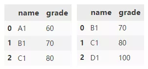<br />`merge()` 默认情况下，会根据两个 DataFrame 中同时存在的列进行合并，合并方法采用取交集的方式。
```python
df1.merge(df2)
```
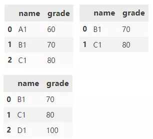<br />指定合并的方式为 outer，取并集。
```python
df1.merge(df2, how='outer')
```
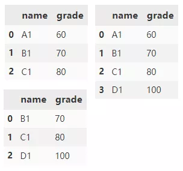<br />下面再创建两个 DataFrame。
```python
df1 = pd.DataFrame(
      {'name1': ['A1', 'B1', 'B1', 'C1'],
       'grade': [60, 70, 80, 90]})
df2 = pd.DataFrame(
      {'name2': ['B1', 'C1', 'D1', 'E1'],
       'grade': [70, 80, 90, 100]})
```
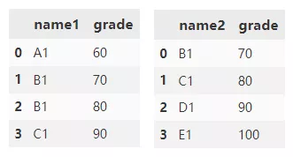<br />根据 name1 和 name2 列合并 df1 和 df2。grade 列附加了默认后缀 _x 和 _y。
```python
df1.merge(
    df2,
    left_on='name1',
    right_on='name2')
```
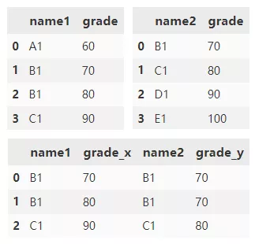<br />合并 df1 和 df2，并将指定的左右后缀附加到重叠列末尾。
```python
df1.merge(
    df2,
    left_on='name1',
    right_on='name2',
    suffixes=('_1', '_2'))
```
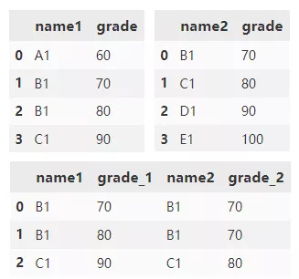
<a name="tiTRF"></a>
## 3、`append()`
`append()` 可用于两个及多个 DataFrame 间行方向(沿 y 轴)的拼接操作，默认取并集。
<a name="JMTwh"></a>
### 「使用方式」
```python
df1.append(
    other,
    ignore_index=False,
    verify_integrity=False,
    sort=False)
```
<a name="NbOAR"></a>
### 「参数」

- `other `: 指定要添加的数据。DataFrame 或 Series 对象，或这些对象的列表
- `ignore_index`: 是否忽略索引，如果为 True，轴将被重置为 0, 1, ..., n - 1。默认为False
- `verify_integrity`：如果为 True，则在创建具有重复项的索引时引发 ValueError。默认为 False
- `sort `: 如果 df1 和 other 的列未对齐，则对列进行排序。默认为 False。
<a name="F3cfe"></a>
### 示例
创建两个 DataFrame。
```python
df1 = pd.DataFrame(
          [[1, 2], [3, 4]],
          columns=list('AB'))
df2 = pd.DataFrame(
          [[5, 6], [7, 8]],
          columns=list('BC'))
```
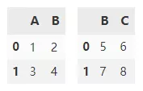<br />`append()` 在默认情况下会沿y轴垂直拼接两个 DataFrame ，df1，df2 交集外的列填充 NaN。
```python
df1.append(df2)
```
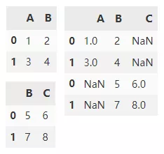<br />将 `ignore_index` 设置为 True，来达到重置轴的索引。
```python
df1.append(df2, ignore_index=True)
```
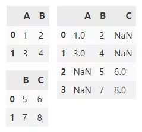
<a name="pRCQQ"></a>
## 4、`join()`
`join()` 用于两个及多个 DataFrame 间列方向(沿 x 轴)的拼接操作，默认左拼接。
<a name="cqKB5"></a>
### 「使用方式」
```python
df1.join(
    other,
    on=None,
    how='left',
    lsuffix='',
    rsuffix='',
    sort=False)
```

- `other`：指定要添加的数据。DataFrame 或 Series 对象，或这些对象的列表
- `on`：连接的列，默认使用索引连接
- `how`：`{'left', 'right', 'outer', 'inner'}`，默认为 'left'，连接的方式
- `lsuffix`：默认为空字符串，表示df1中重复列的后缀
- `rsuffix`：other中重复列的后缀
- `sort`：按照字典顺序对结果在连接键上排序。如果为False，连接键的顺序取决于连接类型（关键字）。
<a name="u6oih"></a>
### 示例
创建两个 DataFrame。
```python
df1 = pd.DataFrame(
          {'A': ['A0', 'A1', 'A2', 'A3', 'A4'],
          'val': ['V0', 'V1', 'V2', 'V3', 'V4']})
df2 = pd.DataFrame(
          {'B': ['B3', 'B4', 'B5'],
          'val': ['V3', 'V4', 'V5']})
```
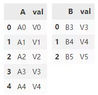<br />如果想使用 val 列进行连接，需要将 val 设置为 df1 和 df2 中的索引。
```python
df1.set_index('val').join(
    df2.set_index('val'))
```
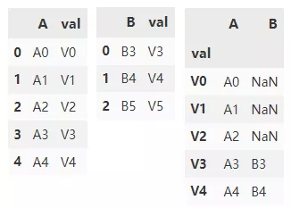<br />使用 val 列连接的另一个方法是指定 on 参数。`df1.join` 只能使用 df2 的索引，但可以使用 df1 中的任何列。所以可以只将 df2 中的 val 列转为索引，并通过 on 参数指定 df1 的连接列为 val。
```python
df1.join(
    df2.set_index('val'),
    on='val')
```
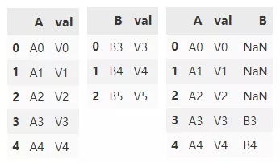<br />使用外连接的方式连接 df1，df2
```python
df1.join(
    df2.set_index('val'),
    on='val',
    how='outer')
```
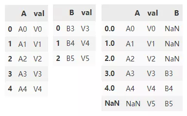
<a name="Txei1"></a>
## 四种方法总结

- `concat()` 可沿任意轴连接 Pandas 对象，并且可在串联轴上添加一层分层索引
- `join()` 主要用于基于行索引进行列的拼接
- `merge()` 使用数据库样式的连接合并，连接是基于列或索引。
- 一般情况下 `append()`, `join()` 可以看成是 `concat()` 与 `merge()`的简易版，参数较少，易用性比较强。
