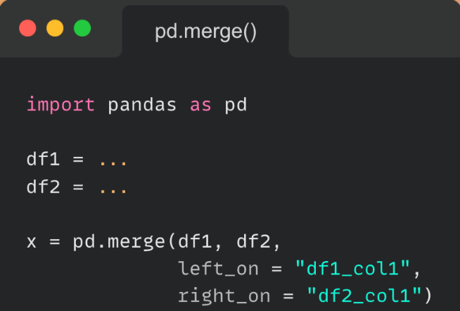
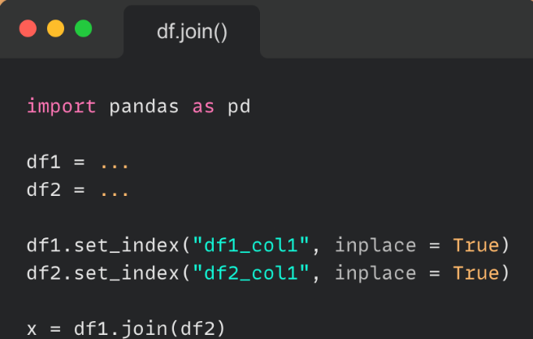
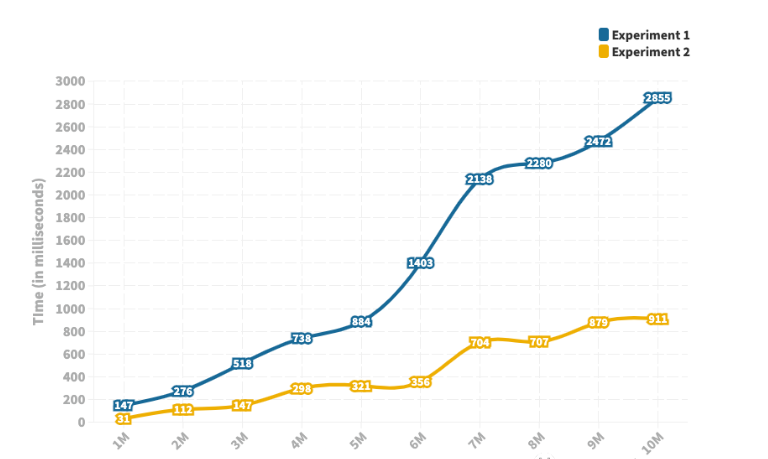

PythonPandas<br />在 Pandas 中有很多种方法可以进行dataframe(数据框)的合并。<br />本文将研究这些不同的方法，以及如何将它们执行速度的对比。
<a name="HyUf4"></a>
## 合并DF
Pandas 使用 `.merge()` 方法来执行合并。
```python
import pandas as pd  

# a dictionary to convert to a dataframe
data1 = {'identification': ['a', 'b', 'c', 'd'],
         'Customer_Name':['King', 'West', 'Adams', 'Mercy'],         'Category':['furniture', 'Office Supplies', 'Technology', 'R_materials'],}  

# our second dictionary to convert to a dataframe  
data2 = {'identification': ['a', 'b', 'c', 'd'],
         'Class':['First_Class', 'Second_Class', 'Same_day', 'Standard Class'],  
         'Age':[60, 30, 40, 50]}  

# Convert the dictionary into DataFrame  
df1 = pd.DataFrame(data1)
df2 = pd.DataFrame(data2)
```
运行代码后，有两个 DataFrame，如下所示。
```
identification Customer_Name         Category
0             a         King       furniture
1             b         West Office Supplies
2             c         Adams       Technology
3             d         Mercy     R_materials  

identification           Class Age
0             a     First_Class   60
1             b   Second_Class   30
2             c       Same_day   40
3             d Standard Class   50
```
使用 `merge()` 函数进一步合并。<br />
```python
# using .merge() function  
new_data = pd.merge(df1, df2, on='identification')
```
这产生了下面的新数据；
```
identification Customer_Name Category     Class           Age
0     a           King         furniture     First_Class     60
1     b           West         Office Supplies Second_Class   30
2     c           Adams         Technology     Same_day     40
3     d           Mercy         R_materials Standard Class   50
```
`.join()` 方法也可以将不同索引的 DataFrame 组合成一个新的 DataFrame。可以使用参数 'on' 参数指定根据哪列进行合并。<br /><br />看看下面的例子，如何将单索引 DataFrame 与多索引 DataFrame 连接起来；
```python
import pandas as pd  

# a dictionary to convert to a dataframe
data1 = {
    'Customer_Name':['King', 'West', 'Adams'],  
    'Category':['furniture', 'Office Supplies', 'Technology'],} 7    
# our second dictionary to convert to a dataframe  
data2 = {
    'Class':['First_Class', 'Second_Class', 'Same_day', 'Standard Class'],  
    'Age':[60, 30, 40, 50]}  

# Convert the dictionary into DataFrame  
Ndata = pd.DataFrame(data1, index=pd.Index(['a', 'b', 'c'], name='identification'))

index = pd.MultiIndex.from_tuples([('a', 'x0'), ('b', 'x1'),
                                   ('c', 'x2'), ('c', 'x3')],
                                  names=['identification', 'x']) 19  
# Convert the dictionary into DataFrame  
Ndata2 = pd.DataFrame(data2, index= index)

print(Ndata, "\n\n", Ndata2)


# joining singly indexed with
# multi indexed
result = Ndata.join(Ndata2, how='inner')
```
结果如下所示；
```
Customer_Name       Category     Class       Age
identification x                                                     3 a         x0       King       furniture     First_Class     60
b         x1       West     Office Supplies   Second_Class   30
c         x2       Adams       Technology       Same_day     40
        x3       Adams       Technology Standard Class     50
```
<a name="fi5nz"></a>
## 连接DF
Pandas 中`concat()` 方法在可以在垂直方向（axis=0）和水平方向（axis=1）上连接 DataFrame。还可以一次连接两个以上的 DataFrame 或 Series。<br />看一个如何在 Pandas 中执行连接的示例；
```python
import pandas as pd  

# a dictionary to convert to a dataframe
data1 = {'identification': ['a', 'b', 'c', 'd'],
         'Customer_Name':['King', 'West', 'Adams', 'Mercy'],  
         'Category':['furniture', 'Office Supplies', 'Technology', 'R_materials'],}  

# our second dictionary to convert to a dataframe  
data2 = {'identification': ['a', 'b', 'c', 'd'],
         'Class':['First_Class', 'Second_Class', 'Same_day', 'Standard Class'],  
         'Age':[60, 30, 40, 50]}  

# Convert the dictionary into DataFrame  
df1 = pd.DataFrame(data1)
df2 = pd.DataFrame(data2)  
#perform concatenation here based on horizontal axis
new_data = pd.concat([df1, df2], axis=1)
print(new_data)
```
这样就获得了新的 DataFrame ：
```
identification Customer_Name         Category identification \
0             a         King       furniture             a   3 1             b         West Office Supplies             b   4 2             c         Adams       Technology             c   5 3             d         Mercy     R_materials             d    

        Class       Age  
0     First_Class   60  
1   Second_Class   30  
2       Same_day   40  
3 Standard Class   50
```
<a name="WzKz8"></a>
## Merge和Join的效率对比
Pandas 中的Merge Joins操作都可以针对指定的列进行合并操作（SQL中的join）那么他们的执行效率是否相同呢？下面来进行一下测。<br />两个 DataFrame 都有相同数量的行和两列，实验中考虑了从 100 万行到 1000 万行的不同大小的 DataFrame，并在每次实验中将行数增加了 100 万。对固定数量的行重复了十次实验，以消除任何随机性。下面是这十次试验中合并操作的平均运行时间。<br /><br />上图描绘了操作所花费的时间（以毫秒为单位）。<br />正如从图中看到的，运行时间存在显着差异——最多相差 5 倍。随着 DataFrame 大小的增加，运行时间之间的差异也会增加。两个 JOIN 操作几乎都随着 DataFrame 的大小线性增加。但是，Join的运行时间增加的速度远低于Merge。<br />如果需要处理大量数据，还是请使用`join()`进行操作。
