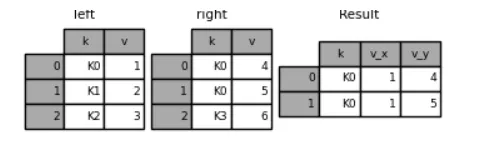

Python Pandas
<a name="wnsoe"></a>
#### 目录

- `concat()`方法的简单介绍
- `append()`方法的简单介绍
- `merge()`方法的简单介绍
- `join()`方法的简单介绍
- 多重行索引的合并介绍
- 表格合并之后的列名重命名
- `combine()`方法的简单介绍
- `combine_first()`方法的简单介绍
<a name="rrKjR"></a>
#### `concat()`方法的简单介绍
在开始`concat()`方法的正是介绍之前，先来看一下简单的例子
```python
df1 = pd.DataFrame(
    {
        "A": ["A0", "A1", "A2", "A3"],
        "B": ["B0", "B1", "B2", "B3"],
        "C": ["C0", "C1", "C2", "C3"],
        "D": ["D0", "D1", "D2", "D3"],
    },
    index=[0, 1, 2, 3],
)
df2 = pd.DataFrame(
    {
        "A": ["A4", "A5", "A6", "A7"],
        "B": ["B4", "B5", "B6", "B7"],
        "C": ["C4", "C5", "C6", "C7"],
        "D": ["D4", "D5", "D6", "D7"],
    },
    index=[4, 5, 6, 7],
)
df3 = pd.DataFrame(
    {
        "A": ["A8", "A9", "A10", "A11"],
        "B": ["B8", "B9", "B10", "B11"],
        "C": ["C8", "C9", "C10", "C11"],
        "D": ["D8", "D9", "D10", "D11"],
    },
    index=[8, 9, 10, 11],
)
```
来看一下使用`concat()`方法之后的效果
```python
frames = [df1, df2, df3]
result = pd.concat(frames)
result
```
output
```python
      A    B    C    D
0    A0   B0   C0   D0
1    A1   B1   C1   D1
2    A2   B2   C2   D2
3    A3   B3   C3   D3
4    A4   B4   C4   D4
5    A5   B5   C5   D5
6    A6   B6   C6   D6
7    A7   B7   C7   D7
8    A8   B8   C8   D8
9    A9   B9   C9   D9
10  A10  B10  C10  D10
11  A11  B11  C11  D11
```
大致合并的方向就是按照轴垂直的方向来进行合并，如下图<br /><br />下面来详细介绍一下`concat()`方法中的各个参数作用
```python
pd.concat(
    objs,
    axis=0,
    join="outer",
    ignore_index=False,
    keys=None,
    levels=None,
    names=None,
    verify_integrity=False,
    copy=True,
)
```

- `objs`:需要用来进行合并的数据集，可以是Series类型或者是DataFrame类型的数据
- `axis`:可以理解为是合并的方向，默认是0
- `join`:可以理解为是合并的方式，有并集或是交集两种方式，默认的是并集
- `ignore_index`:忽略索引，默认是`False`
- `keys`:用于做行方向的多重索引

大家可能会有些迷惑，什么是多重的索引呢？看下面的例子
```python
result = pd.concat(frames, keys=["x", "y", "z"])
result
```
output<br /><br />如此一来，可以通过“x”、“y”以及“z”这些元素来获取每一部分的数据，例如
```python
result.log["x"]
```
output
```python
    A   B   C   D
0  A0  B0  C0  D0
1  A1  B1  C1  D1
2  A2  B2  C2  D2
3  A3  B3  C3  D3
```
除此之外，`keys`参数还能够被用在列索引上
```python
s3 = pd.Series([0, 1, 2, 3], name="foo")
s4 = pd.Series([0, 1, 2, 3])
s5 = pd.Series([0, 1, 4, 5])
pd.concat([s3, s4, s5], axis=1, keys=["red", "blue", "yellow"])
```
output
```python
   red  blue  yellow
0    0     0       0
1    1     1       1
2    2     2       4
3    3     3       5
```
列名就变成了`keys`列表中的元素<br />而对于`join`参数，默认的是以`outer`也就是并集的方式在进行两表格的合并
```python
df4 = pd.DataFrame(
    {
        "B": ["B2", "B3", "B6", "B7"],
        "D": ["D2", "D3", "D6", "D7"],
        "F": ["F2", "F3", "F6", "F7"],
    },
    index=[2, 3, 6, 7],
)
result = pd.concat([df1, df4], axis=1)
```
output<br /><br />而当将`join`参数设置成`inner`，也就是交集的方式来进行合并，出来的结果就会不太一样
```python
result = pd.concat([df1, df4], axis=1, join="inner")
```
output<br /><br />接下来看一下`ignore_index`参数的作用，它能够对行索引做一个重新的整合
```python
result = pd.concat([df1, df4], ignore_index=True, sort=False)
```
output<br /><br />对于一个表格是`DataFrame`格式，另外一个是`Series`格式，`concat()`方法也可以将两者合并起来，
```python
s1 = pd.Series(["X0", "X1", "X2", "X3"], name="X")
result = pd.concat([df1, s1], axis=1)
```
output<br /><br />要是在加上`ignore_index`参数的话，看一下效果会如何
```python
result = pd.concat([df1, s1], axis=1, ignore_index=True)
```
output<br />
<a name="J0fU0"></a>
#### `append()`方法的简单介绍
`append()`方法是对上面`concat()`方法的简单概括，来看一下简单的例子
```python
result = df1.append(df2)
result
```
output<br /><br />当然`append()`方法当中也可以放入多个DataFrame表格，代码如下
```python
result = df1.append([df2, df3])
```
output<br /><br />和上面的`concat()`方法相类似的是，`append()`方法中也有`ignore_index`参数，
```python
result = df1.append(df4, ignore_index=True, sort=False)
```
output<br /><br />同样地，也可以通过`append()`方法来给DataFrame表格添加几行的数据
```python
s2 = pd.Series(["X0", "X1", "X2", "X3"], index=["A", "B", "C", "D"])
result = df1.append(s2, ignore_index=True)
```
output<br />
<a name="unF5G"></a>
#### 关于`merge()`方法的介绍
在`merge()`方法中有这些参数
```python
pd.merge(
    left,
    right,
    how="inner",
    on=None,
    left_on=None,
    right_on=None,
    left_index=False,
    right_index=False,
    sort=True,
    suffixes=("_x", "_y"),
    copy=True,
    indicator=False,
    validate=None,
)
```

- `left`/`right`:也就是所要合并的两个表格
- `on`:左右所要合并的两表格的共同列名
- `left_on`/`right_on`:两表格进行合并时所对应的字段
- `how`:合并的方式，有left、right、outer、inner四种，默认是inner
- `suffixes`:在两表格进行合并时，重复的列名后面添加的后缀
- `left_index`:若为True，按照左表格的索引来连接两个数据集
- `right_index`:若为True，按照右表格的索引来连接两个数据集

先来看一个简单的例子
```python
left = pd.DataFrame(
    {
        "key": ["K0", "K1", "K2", "K3"],
        "A": ["A0", "A1", "A2", "A3"],
        "B": ["B0", "B1", "B2", "B3"],
    }
)
right = pd.DataFrame(
    {
        "key": ["K0", "K1", "K2", "K3"],
        "C": ["C0", "C1", "C2", "C3"],
        "D": ["D0", "D1", "D2", "D3"],
    }
)
result = pd.merge(left, right, on="key")
result
```
output<br /><br />在`merge()`的过程当中有三种类型的合并，分别是一对一、多对一、多对多。其中“一对一”类型也就是`merge()`方法会去寻找两个表格当中相同的列，例如上面的“key”，并自动以这列作为键来进行排序，需要注意的是共同列中的元素其位置可以是不一致的。

那么来看一下“多对一”的合并类型，例如下面两张表格有共同的列“group”，并且第一张表格当中的“group”有两个相同的值，
```python
df1:

employee        group  hire_date
0      Bob   Accounting       2008
1     Jake  Engineering       2002
2     Mike  Engineering       2005
3     Linda          HR       2010

df2:

       group supervisor
0   Accounting      Cathey
1  Engineering      Dylan
2           HR      James
```
然后来进行合并
```python
pd.merge(df_1, df_2)
```
output
```python
  employee        group  hire_date supervisor
0      Bob   Accounting       2008     Cathey
1     Jake  Engineering       2002      Dylan
2     Mike  Engineering       2005      Dylan
3    Linda           HR       2010      James
```
最后便是“多对多”的合并类型，可以理解为两张表格的共同列中都存在着重复值，例如
```python
df3:

employee        group
0      Bob   Accounting
1     Jake  Engineering
2     Lisa  Engineering
3      Sue           HR

df4: 

       group        skills
0   Accounting          math
1   Accounting  spreadsheets
2  Engineering        coding
3  Engineering         linux
4           HR  spreadsheets
5           HR  organization
```
然后进行合并之后，看一下出来的结果
```python
df = pd.merge(df3, df4)
print(df)
```
output
```python
  employee        group       skills
0      Bob   Accounting         math
1      Bob   Accounting  programming
2     Jake  Engineering        linux
3     Jake  Engineering       python
4     Lisa  Engineering        linux
5     Lisa  Engineering       python
6      Sue           HR         java
7      Sue           HR          c++
```
那么涉及到参数`how`有四种合并的方式，有“left”、“right”、“inner”、“outer”，分别代表

- inner:也就是交集，在使用`merge()`方法的时候，默认采用的都是交集的合并方式
- outer:可以理解为是并集的合并方式
- left/right: 单方向的进行并集的合并

先来看一下“left”方向的并集的合并
```python
result = pd.merge(left, right, how="left", on=["key1", "key2"])
result
```
output<br /><br />再来看一下“right”方向的并集的合并
```python
result = pd.merge(left, right, how="right", on=["key1", "key2"])
result
```
output<br /><br />“outer”方式的合并
```python
result = pd.merge(left, right, how="outer", on=["key1", "key2"])
result
```
output<br /><br />“inner”方式的合并
```python
result = pd.merge(left, right, how="inner", on=["key1", "key2"])
result
```
output<br />
<a name="Y2ZEn"></a>
#### 关于join()方法的简单介绍
join()方法用于将两个有着不同列索引的表格合并到一起，先来看一个简单的例子
```python
left = pd.DataFrame(
    {"A": ["A0", "A1", "A2"], "B": ["B0", "B1", "B2"]}, index=["K0", "K1", "K2"]
)
right = pd.DataFrame(
    {"C": ["C0", "C2", "C3"], "D": ["D0", "D2", "D3"]}, index=["K0", "K2", "K3"]
)

result = left.join(right)
```
output<br /><br />在`join()`方法中也有参数`how`用来定义合并的方式，和`merge()`方法相类似，这里便也有不做赘述
<a name="YbEdB"></a>
#### 当多重行索引遇到`join()`方法
当遇到一表格，其中的行索引是多重行索引的时候，例如
```python
left = pd.DataFrame(
    {"A": ["A0", "A1", "A2"], "B": ["B0", "B1", "B2"]},
    index=pd.Index(["K0", "K1", "K2"], name="key"),
)
index = pd.MultiIndex.from_tuples(
    [("K0", "Y0"), ("K1", "Y1"), ("K2", "Y2"), ("K2", "Y3")],
    names=["key", "Y"],
)
right = pd.DataFrame(
    {"C": ["C0", "C1", "C2", "C3"], "D": ["D0", "D1", "D2", "D3"]},
    index=index,
)
result = left.join(right, how="inner")
```
output<br /><br />那么要是要合并的两张表格都是多重行索引呢？
```python
leftindex = pd.MultiIndex.from_product(
    [list("abc"), list("xy"), [1, 2]], names=["abc", "xy", "num"]
)
left = pd.DataFrame({"v1": range(12)}, index=leftindex)
```
output
```python
            v1
abc xy num    
a   x  1     0
       2     1
    y  1     2
       2     3
b   x  1     4
       2     5
    y  1     6
       2     7
c   x  1     8
       2     9
    y  1    10
       2    11
```
第二张表格如下
```python
rightindex = pd.MultiIndex.from_product(
    [list("abc"), list("xy")], names=["abc", "xy"]
)
right = pd.DataFrame({"v2": [100 * i for i in range(1, 7)]}, index=rightindex)
```
output
```python
         v2
abc xy     
a   x   100
    y   200
b   x   300
    y   400
c   x   500
    y   600
```
将上述的两张表格进行合并
```python
left.join(right, on=["abc", "xy"], how="inner")
```
output
```python
            v1   v2
abc xy num         
a   x  1     0  100
       2     1  100
    y  1     2  200
       2     3  200
b   x  1     4  300
       2     5  300
    y  1     6  400
       2     7  400
c   x  1     8  500
       2     9  500
    y  1    10  600
       2    11  600
```
<a name="yi3e0"></a>
#### 列名的重命名
要是两张表格的列名相同，合并之后会对其列名进行重新命名，例如
```python
left = pd.DataFrame({"k": ["K0", "K1", "K2"], "v": [1, 2, 3]})
right = pd.DataFrame({"k": ["K0", "K0", "K3"], "v": [4, 5, 6]})
result = pd.merge(left, right, on="k")
```
output<br /><br />这里就不得不提到`suffixes`这个参数，通过这个参数来个列进行重命名，例如
```python
result = pd.merge(left, right, on="k", suffixes=("_l", "_r"))
```
output<br />
<a name="lQVKK"></a>
#### `combine_first()`方法的简单介绍
要是要合并的两表格，其中一个存在空值的情况，就可以使用`combine_first()`方法，
```python
df1 = pd.DataFrame({'A': [None, 0], 'B': [None, 4]})
df2 = pd.DataFrame({'A': [1, 1], 'B': [3, 3]})
df1.combine_first(df2)
```
output
```python
     A    B
0  1.0  3.0
1  0.0  4.0
```
表格当中的空值就会被另外一张表格的非空值给替换掉
<a name="Uq52p"></a>
#### `combine()`方法的简单介绍
`combine()`方法是将两表格按照列的方向进行合并，但是不同在于还需要另外传进去一个第三方的函数或者是方法，来看一个简单的例子
```python
df1 = pd.DataFrame({'A': [0, 0], 'B': [4, 4]})
df2 = pd.DataFrame({'A': [1, 1], 'B': [3, 3]})
take_smaller = lambda s1, s2: s1 if s1.sum() < s2.sum() else s2
```
定义了一个简单的方法，在合并的过程中提取出总和较小的值
```python
df1.combine(df2, take_smaller)
```
output
```python
   A  B
0  0  3
1  0  3
```
要是表格中存在空值，`combine()`方法也有`fill_value`这个参数来处理
```python
df1 = pd.DataFrame({'A': [0, 0], 'B': [None, 4]})
df2 = pd.DataFrame({'A': [2, 2], 'B': [3 3]})
df1.combine(df2, take_smaller, fill_value=-5)
```
output
```python
   A    B
0  0 -5.0
1  0  4.0
```
