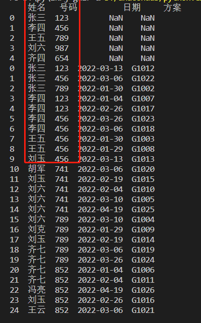
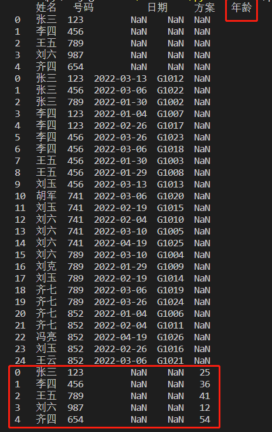
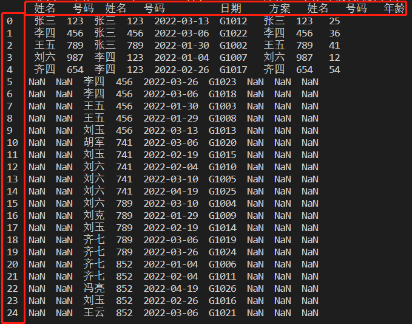

PythonPandas
<a name="Omkv5"></a>
## merge连接
pandas的两个表的连接技能`merge`，也就是根据一个表的条件去匹配另一个表的内容。
<a name="teB4g"></a>
### 准备数据
<a name="D5bqZ"></a>
#### 先导入模块
```python
import pandas as pd

df1 = pd.DataFrame({
    '姓名': ['张三', '李四', '王五', '刘六', '齐四'],
    '号码': ['123', '456', '789', '987', '654']
})

df2 = pd.DataFrame({
    '姓名': ['张三', '张三', '张三', '李四', '李四', '李四', '李四', '王五', '王五', '刘玉', '胡军', '刘玉', '刘六', '刘六', '刘六', '刘六', '刘克', '刘玉', '齐七', '齐七', '齐七', '齐七', '冯亮', '刘玉', '王云'],

    '号码': ['123', '123', '123', '123', '123', '456', '456', '456', '456', '456', '741', '741', '741', '741', '741', '789', '789', '789', '789', '789', '852', '852', '852', '852', '852'],

    '日期': ['2022-03-13', '2022-03-06', '2022-01-30', '2022-01-04', '2022-02-26', '2022-03-26', '2022-03-06', '2022-01-30', '2022-01-29', '2022-03-13', '2022-03-06', '2022-02-19', '2022-02-04', '2022-03-10', '2022-04-19', '2022-03-10', '2022-01-29', '2022-02-19', '2022-03-06', '2022-03-26', '2022-01-04', '2022-02-04', '2022-04-19', '2022-02-26', '2022-03-06'],

    '方案': ['G1012', 'G1022', 'G1002', 'G1007', 'G1017', 'G1023', 'G1018', 'G1003', 'G1008', 'G1013', 'G1020', 'G1015', 'G1010', 'G1005', 'G1025', 'G1004', 'G1009', 'G1014', 'G1019', 'G1024', 'G1006', 'G1011', 'G1026', 'G1016', 'G1021']
})
```
<a name="qrZTy"></a>
#### 输出内容
df1内容
```python
   姓名   号码
0  张三  123
1  李四  456
2  王五  789
3  刘六  987
4  齐四  654
```
df2内容:
```python
    姓名  号码    日期      方案
0   张三  123  2022-03-13  G1012
1   张三  123  2022-03-06  G1022
2   张三  123  2022-01-30  G1002
3   李四  123  2022-01-04  G1007
4   李四  123  2022-02-26  G1017
5   李四  456  2022-03-26  G1023
6   李四  456  2022-03-06  G1018
7   王五  456  2022-01-30  G1003
8   王五  456  2022-01-29  G1008
9   刘玉  456  2022-03-13  G1013
10  胡军  741  2022-03-06  G1020
11  刘玉  741  2022-02-19  G1015
12  刘六  741  2022-02-04  G1010
13  刘六  741  2022-03-10  G1005
14  刘六  741  2022-04-19  G1025
15  刘六  789  2022-03-10  G1004
16  刘克  789  2022-01-29  G1009
17  刘玉  789  2022-02-19  G1014
18  齐七  789  2022-03-06  G1019
19  齐七  789  2022-03-26  G1024
20  齐七  852  2022-01-04  G1006
21  齐七  852  2022-02-04  G1011
22  冯亮  852  2022-04-19  G1026
23  刘玉  852  2022-02-26  G1016
24  王云  852  2022-03-06  G1021
```
<a name="ne4Na"></a>
### 连接
函数说明：
```python
pd.merge(left=df1（需要匹配的原始表）, right=df2（被匹配的数据表）, on="姓名"（需要匹配的条件列）, how="inner"（连接方式）)
```
<a name="RIOP5"></a>
#### 内连接
`how`默认为`inner`：内连接查询特点是df1有匹配的才显示，不匹配的不显示
```python
df = pd.merge(left=df1, right=df2, on="姓名", how="inner")
```
输出：
```python
    姓名 号码_x 号码_y  日期     方案
0   张三  123  123  2022-03-13  G1012
1   张三  123  123  2022-03-06  G1022
2   张三  123  123  2022-01-30  G1002
3   李四  456  123  2022-01-04  G1007
4   李四  456  123  2022-02-26  G1017
5   李四  456  456  2022-03-26  G1023
6   李四  456  456  2022-03-06  G1018
7   王五  789  456  2022-01-30  G1003
8   王五  789  456  2022-01-29  G1008
9   刘六  987  741  2022-02-04  G1010
10  刘六  987  741  2022-03-10  G1005
11  刘六  987  741  2022-04-19  G1025
12  刘六  987  789  2022-03-10  G1004
```
df1表里需要匹配的姓名里，在df2里面能匹配上姓名的都会列出来，而匹配不上的，都不会列出来，包括df1里面的内容<br />小提示：如果两表有相同列名的，会自动在列名后面加_x,_y来区分
<a name="j84d0"></a>
#### 外连接
`how="outer"`为外连接：查询特点是无论匹不匹配都显示，对应的值没有则显示空
```python
df = pd.merge(left=df1, right=df2, on="姓名", how="outer")
```
输出：
```python
    姓名 号码_x 号码_y   日期     方案
0   张三  123  123  2022-03-13  G1012
1   张三  123  123  2022-03-06  G1022
2   张三  123  123  2022-01-30  G1002
3   李四  456  123  2022-01-04  G1007
4   李四  456  123  2022-02-26  G1017
5   李四  456  456  2022-03-26  G1023
6   李四  456  456  2022-03-06  G1018
7   王五  789  456  2022-01-30  G1003
8   王五  789  456  2022-01-29  G1008
9   刘六  987  741  2022-02-04  G1010
10  刘六  987  741  2022-03-10  G1005
11  刘六  987  741  2022-04-19  G1025
12  刘六  987  789  2022-03-10  G1004
13  齐四  654  NaN         NaN    NaN
14  刘玉  NaN  456  2022-03-13  G1013
15  刘玉  NaN  741  2022-02-19  G1015
16  刘玉  NaN  789  2022-02-19  G1014
17  刘玉  NaN  852  2022-02-26  G1016
18  胡军  NaN  741  2022-03-06  G1020
19  刘克  NaN  789  2022-01-29  G1009
20  齐七  NaN  789  2022-03-06  G1019
21  齐七  NaN  789  2022-03-26  G1024
22  齐七  NaN  852  2022-01-04  G1006
23  齐七  NaN  852  2022-02-04  G1011
24  冯亮  NaN  852  2022-04-19  G1026
25  王云  NaN  852  2022-03-06  G1021
```
df1表里索引13里的齐四无匹配，是空值，而在df2里面的内容都会列出来，和df1匹配不上的其它列的内容也是空值<br />注意：这有点互相匹配的意思哟
<a name="zJUVt"></a>
#### 左连接
`how="left"`为左连接：查询表示左边的值全部显示，如右边无匹配则显示空。但是右边有的值匹配不了左边则不显示
```python
df = pd.merge(left=df1, right=df2, on="姓名", how="outer")
```
输出：
```python
    姓名 号码_x 号码_y   日期     方案
0   张三  123  123  2022-03-13  G1012
1   张三  123  123  2022-03-06  G1022
2   张三  123  123  2022-01-30  G1002
3   李四  456  123  2022-01-04  G1007
4   李四  456  123  2022-02-26  G1017
5   李四  456  456  2022-03-26  G1023
6   李四  456  456  2022-03-06  G1018
7   王五  789  456  2022-01-30  G1003
8   王五  789  456  2022-01-29  G1008
9   刘六  987  741  2022-02-04  G1010
10  刘六  987  741  2022-03-10  G1005
11  刘六  987  741  2022-04-19  G1025
12  刘六  987  789  2022-03-10  G1004
13  齐四  654  NaN         NaN    NaN
```
df1表里索引13里的齐四还是无匹配，是空值，而在df2里面的内容就不会列出来了
<a name="Bvr2L"></a>
#### 右连接
`how="right"`为右连接：与左连接相反
```python
df = pd.merge(left=df1, right=df2, on="姓名", how="right")
```
输出：
```python
    姓名 号码_x 号码_y          日期     方案
0   张三  123  123  2022-03-13  G1012
1   张三  123  123  2022-03-06  G1022
2   张三  123  123  2022-01-30  G1002
3   李四  456  123  2022-01-04  G1007
4   李四  456  123  2022-02-26  G1017
5   李四  456  456  2022-03-26  G1023
6   李四  456  456  2022-03-06  G1018
7   王五  789  456  2022-01-30  G1003
8   王五  789  456  2022-01-29  G1008
9   刘玉  NaN  456  2022-03-13  G1013
10  胡军  NaN  741  2022-03-06  G1020
11  刘玉  NaN  741  2022-02-19  G1015
12  刘六  987  741  2022-02-04  G1010
13  刘六  987  741  2022-03-10  G1005
14  刘六  987  741  2022-04-19  G1025
15  刘六  987  789  2022-03-10  G1004
16  刘克  NaN  789  2022-01-29  G1009
17  刘玉  NaN  789  2022-02-19  G1014
18  齐七  NaN  789  2022-03-06  G1019
19  齐七  NaN  789  2022-03-26  G1024
20  齐七  NaN  852  2022-01-04  G1006
21  齐七  NaN  852  2022-02-04  G1011
22  冯亮  NaN  852  2022-04-19  G1026
23  刘玉  NaN  852  2022-02-26  G1016
24  王云  NaN  852  2022-03-06  G1021
```
右连接正好与左连接相反，df1里面匹配不上的不显示，df2里面的内容全都出来了，匹配不上df1的其它列值则为空值
:::danger
PS：这完全是反向匹配
:::
<a name="LIlxq"></a>
## concat进行多表连接
还是用上次的数据，这次多加了一个DataFrame，用于显示结果。
<a name="DOQpG"></a>
### 初始化数据
```python
import pandas as pd

df1 = pd.DataFrame({
    '姓名': ['张三', '李四', '王五', '刘六', '齐四'],
    '号码': ['123', '456', '789', '987', '654']
})

df2 = pd.DataFrame({
    '姓名': ['张三', '张三', '张三', '李四', '李四', '李四', '李四', '王五', '王五', '刘玉', '胡军', '刘玉', '刘六', '刘六', '刘六', '刘六', '刘克', '刘玉', '齐七', '齐七', '齐七', '齐七', '冯亮', '刘玉', '王云'],

    '号码': ['123', '456', '789', '123', '123', '456', '456', '456', '456', '456', '741', '741', '741', '741', '741', '789', '789', '789', '789', '789', '852', '852', '852', '852', '852'],

    '日期': ['2022-03-13', '2022-03-06', '2022-01-30', '2022-01-04', '2022-02-26', '2022-03-26', '2022-03-06', '2022-01-30', '2022-01-29', '2022-03-13', '2022-03-06', '2022-02-19', '2022-02-04', '2022-03-10', '2022-04-19', '2022-03-10', '2022-01-29', '2022-02-19', '2022-03-06', '2022-03-26', '2022-01-04', '2022-02-04', '2022-04-19', '2022-02-26', '2022-03-06'],

    '方案': ['G1012', 'G1022', 'G1002', 'G1007', 'G1017', 'G1023', 'G1018', 'G1003', 'G1008', 'G1013', 'G1020', 'G1015', 'G1010', 'G1005', 'G1025', 'G1004', 'G1009', 'G1014', 'G1019', 'G1024', 'G1006', 'G1011', 'G1026', 'G1016', 'G1021']
})

df3 = pd.DataFrame({
    '姓名': ['张三', '李四', '王五', '刘六', '齐四'],
    '号码': ['123', '456', '789', '987', '654'],
    '年龄': ['25', '36', '41', '12', '54']
})
```
<a name="lR0H2"></a>
### 用法
<a name="q8Tz0"></a>
#### 说明
`concat`是一个轴向连接的功能，可以沿着一条轴将多个表对象堆叠到一起：`how`的模式是`outer`<br />`axis=0`是上下拼接，列重复的会自动合并，`axis=1`是左右拼接，行或索引重复的会自动合并
<a name="KKnJY"></a>
#### 上下拼接
<a name="HjOp9"></a>
##### 先连接两个表:
```python
df = pd.concat([df1, df2], axis=0)
```
输出：<br /><br />两个表的重复列名自动合并了，缺失的值为NaN
<a name="F27pA"></a>
##### 连接三个表：
```python
df = pd.concat([df1, df2, df3], axis=0)
```
输出：<br /><br />同时增加了另一个表的内容和增加了一列，缺失值同样为NaN
<a name="JsOlc"></a>
#### 左右拼接
<a name="OrB6F"></a>
##### 直接拼接三个表：
```python
df = pd.concat([df1, df2, df3], axis=1)
```
输出：<br /><br />这次是在右边拼接的，行是按内容行最多的来算，其它的内容为空，列一直在增加，是把三个表的列都拼接上了。
<a name="ujQuC"></a>
## 总结
`merge`和`concat`的表连接，都有各自的特点，需要按自己所需要的结果去用，想匹配内容的，就用`merge`，想全部连接到一起的，就用`concat`。
