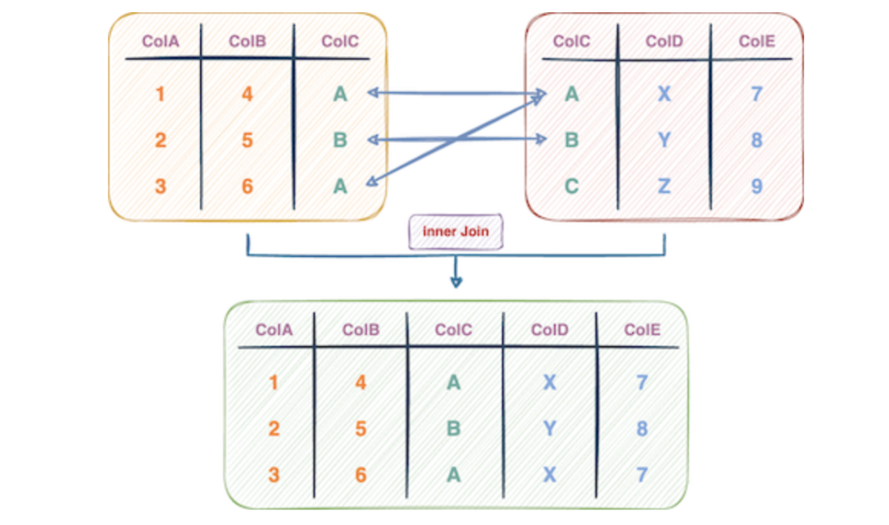
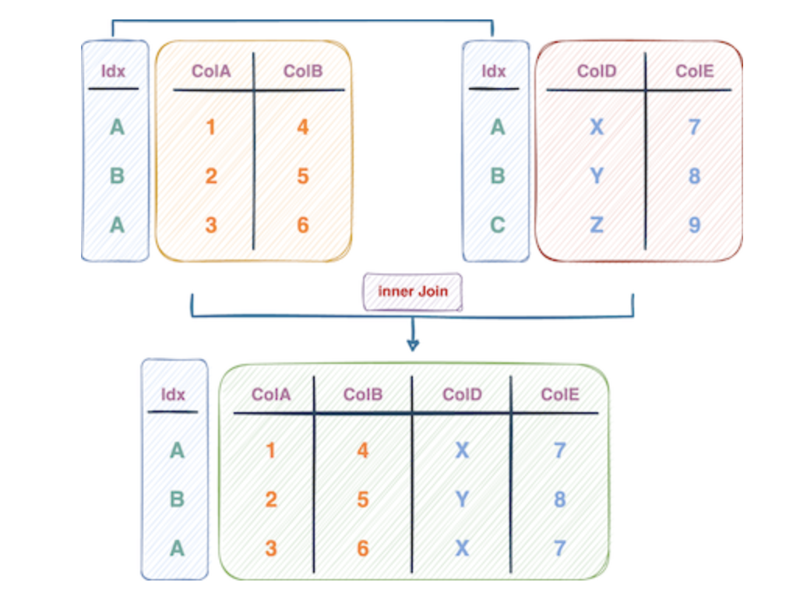
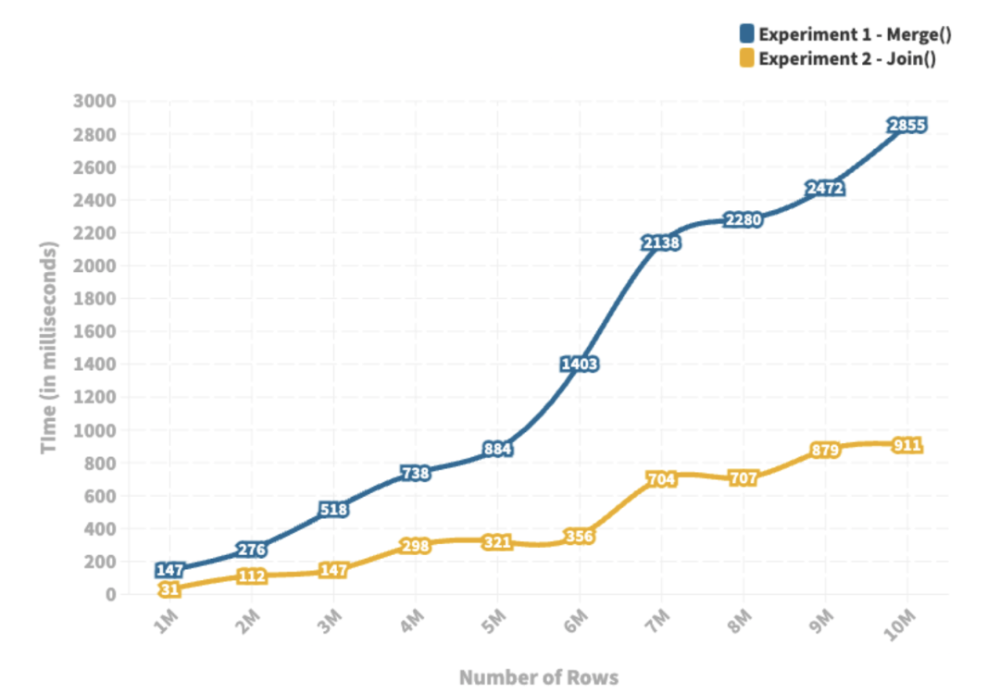

PythonPandas<br />Pandas 中的`merge()`方法无疑是数据科学家在其数据科学项目中最常用的方法之一。<br />该方法源自 SQL 中的表连接思想并扩展到在 Python 环境中连接表，该方法基于一列或多列中的匹配值合并两个 Pandas DataFrame。<br />如下图所示：<br /><br />`Merge()`方法的直观特性使其成为Pandas用户合并数据框的理想选择。<br />但是，在运行时方面，Pandas 中有一个相对更好的替代方法，甚至已经超过该 `merge()`方法了。
<a name="GDTvB"></a>
## 合并表的方法
<a name="yjTBk"></a>
### 方法一：使用`merge()`
如上所述，在 Pandas 中合并 DataFrame 的传统和最常见的方法是使用该`merge()`方法。
```python
df = pd.merge(df1, df2, 
              how = "left", 
              left_on = "df1_col_name", 
              right_on = "df2_col_name")
```
如上面的代码块所示，该方法接受两个DataFrames，df1和df2。<br />此外，使用 how 参数指定希望执行的连接类型（在上面的例子中是 left）。<br />最后，用left_on参数指定要考虑与第一个DataFrame(df1) 的值匹配的列，用right_on参数指定与第二个DataFrame(df2)的值匹配的列。
<a name="zJdCm"></a>
### 方法二：使用 `join()`
`Join()` 方法在目标上与 Pandas 中的 `merge()` 方法相似，但在实现上有一些区别。

1. `Join()`方法在df2和df1的索引上执行查找。然而，`merge()`方法主要用于使用列中的条目进行连接。
2. `Join()`方法默认执行的是左键连接。而`merge()`方法在其默认行为中采用了内联接。

<br />下面的代码块演示了该`join()`方法。
```python
df = df1.join(df2, how = "inner")
```
如上所述，`join()`方法执行了一个索引查询来连接两个DataFrame。也就是说，对应于相同索引值的行被合并。<br />因此，在使用`join()`方法时，应该首先设置希望执行join的列作为DataFrame的索引，然后再调用`join()`方法。
```python
df1.set_index("df1_col_name", inplace = True)
df2.set_index("df2_col_name", inplace = True)

df = df1.join(df2, how = "inner")
```
<a name="nfzF8"></a>
## 实验验证
为了评估 Pandas 中 `merge()` 方法的运行时性能，把它与 `join()` 方法进行比较。<br />具体来说，将创建两个假的DataFrames，并使用 `merge()` 和 `join()` 这两种方法进行连接。<br />本实验的实现如下。

- 首先，将整数的值设置为(-high, +high)。将比较两种方法在不同大小的DataFrame上的表现，行数为 rows_list，列数为 n_columns。最后，将重复运行每个实验。
```python
high = 10000
rows_list = [(i+1)*1_000_000 for i in range(10)] 
n_columns = 5
repeat = 5
```

- 该 create_df 方法接受一系列参数并返回一个随机数据框。
```python
def create_df(n_rows, n_columns, col_names):

data = np.random.randint(low = -high, high = high, size = (n_rows, n_columns))
return pd.DataFrame(data, columns = col_names)
```

- 在下面的代码中，测量了 `merge()` 方法和  `join()` 方法在同一个DataFrame df1 和 df2 上的运行时间。
```python
result = []
for n_rows in rows_list:
    
    sum_time_merge1 = 0
    sum_time_merge2 = 0
    
    for _ in range(repeat):
        
        df1 = create_df(n_rows, n_columns, [f"col_{i}" for i in range(n_columns)])
        df2 = create_df(n_rows, n_columns, [f"Col_{i}" for i in range(n_columns)])
        
        ## Method 1
        start = time()
        df = pd.merge(df1, df2, how = "left", left_on = "col_0", right_on="Col_0")
        sum_time_merge1 += (time()-start)
        
        ## Method 2
        start = time()
        df1.set_index("col_0", inplace = True)
        df2.set_index("Col_0", inplace = True)
        df = df1.join(df2)
        sum_time_merge2 += (time()-start)
        
    result.append([df1.shape[0], sum_time_merge1/repeat, sum_time_merge2/repeat])
```
注意，要使用`join()`方法，应该首先将列作为DataFrame的索引。
<a name="GlLkX"></a>
## 结果


- 蓝色线图描述了`merge()`方法的运行时间，黄色线图表示`join()`方法的运行时间。
- 将行数从 100 万变化到 1000 万，注意到两种方法的运行时间都与行数呈**正相关**。
- 然而，与传统的`merge()`方法相比，`join()`方法的运行时间有明显的改善。
- 随着行数的增加，两种方法的运行时间的差异也在增加。这表明应该始终使用`join()`方法来合并DataFrames，特别是在较大的数据集的情况下。
<a name="LHl1r"></a>
## 写在最后
这里比较了Pandas的`merge()`和`join()`方法在一个假的DataFrame上的性能。<br />实验结果表明，使用`join()`方法在索引列上进行合并，在运行时间上比`merge()`方法高效——提供了**高达4到5倍的性能提升**。
