Python Pandas 数据清洗

### 1、缺失值处理
缺失值是各类数据集中经常会遇到的情形，相较于工整完全的数据记录，带有一定的缺失值更接近于数据的真实原貌。一般而言，缺失值处理的原则无非就是以下三种：

- 缺失比例较小，可直接过滤掉缺失值所在行
- 缺失比例较大，根据特定的业务理解进行一定规则的填充
- 缺失记录有特定业务含义，不做任何处理

至于在实际数据分析中应该采取哪种方案来处理，这个要结合具体的数据分析场景和业务需求，不可一概而论。所以，这里仅给出基于Pandas的具体处理方法。

#### 1. 过滤掉缺失值所在行
在过滤之前，首先要分析缺失比例的大小，其基础在于判断各个值是否为空，pandas提供了4个相关API，包括

- `isna()`，`isnull()`，二者等价
- `notna()`，`notnull()`，二者等价

这四个函数用法也非常显然了，前两个用于判断各元素是否为空，后两个则用于判断各元素是否非空。4个函数返回值元素类型均为Boolean值，所以可进一步嵌套一层`mean()`函数直接计算缺失比例。例如： 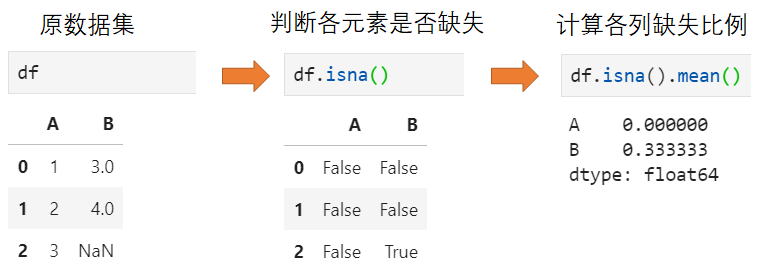 在完成缺失值比例分析的基础上，断定可以直接过滤掉缺失值，那么仅需执行如下操作即可：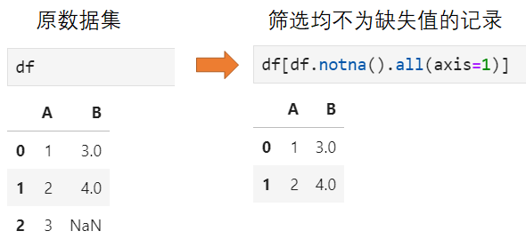

#### 2. 对缺失值进行填充
有些情况下，对缺失值直接进行过滤会导致样本分布受到影响。同时基于特定的业务理解，可以采取一定的规则进行填充，一般而言填充的方式包括两大类：特定值和特定规则。缺失值的填充API主要是用`fillna()`，当然也可手动用缺失值筛选+赋值的形式完成这一操作。

- 特定值填充。特定值填充一般是对缺失的位置填充某种特定值，当然这里的特定值一般又可细分为3种情况：常数，均值，众数，其中均值填充主要适用于取值连续的情形，而众数填充则适用于取值离散的情形，常数值填充则是基于特定的业务含义。举个例子：

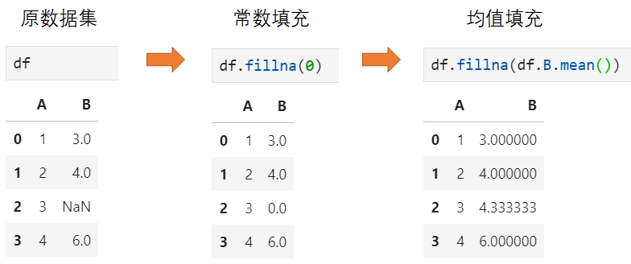

- 特定规则填充。在某些不适合利用常数值填充的情况下时，基于特定场景可基于特定规则填充，例如得到疫情期间各地累计感染人数，当某地某天的感染人数最新数字缺失时，可以用其前一天的感染人数填充。这实际上就是前向填充，类似地还有后向填充。再比如，获取一天各时刻的温度值，当某一时刻温度数据缺失时，那么实际上可基于前后记录拟合插值的方式填充。

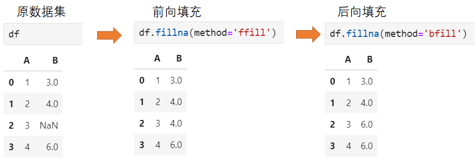

### 2、重复值处理
与缺失值一样，重复值也是数据分析中经常遇到的一种情形，一般是由于样本重复记录或重复读取造成。当然，根据特定的分析场景和业务需求，对于重复值的处理实际上也包含两种情况：

- 对重复值进行过滤
- 重复值存在合理性，不做处理

这里仅给出需过滤重复值时的处理方法。既然要过滤掉重复值，那么首先要判断哪些是重复值，pandas中提供接口为`duplicated()`，具体如下： 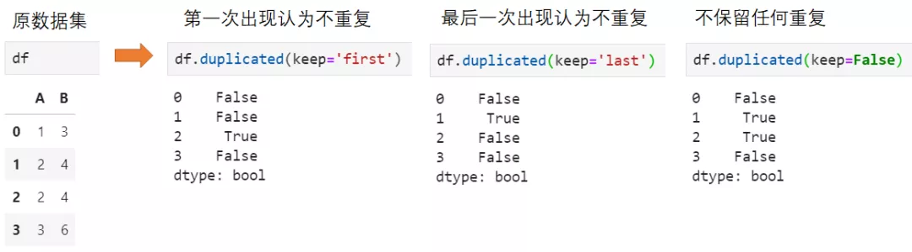 类似地，执行重复值过滤的接口为`drop_duplicates()`，仍然可选keep参数保留不同不同的重复记录：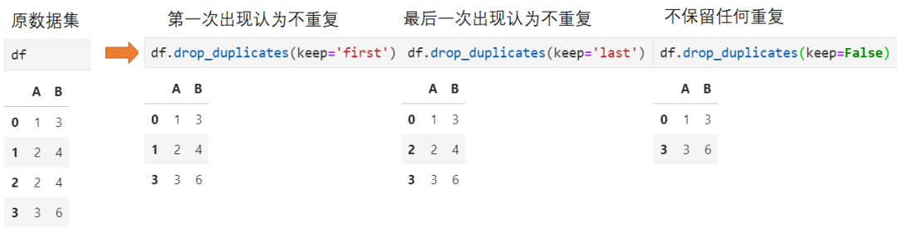 另外，在某些情况下不需要针对所有列进行重复值判断，而是仅在特定几列范围内展开去重，此时`drop_duplicates`还可选一个参数`subset`，接收列名序列。

### 3、异常值处理
不同于缺失值和重复值那样规则相对明朗，异常值的处理相对更为复杂。首先要基于业务理解出什么情况下算作是异常值，其次还要指定异常值的处理规则，要么是对异常值所在记录进行过滤，要么是按照一定的规则进行转换，使得异常值变为"正常值"。 就个人目前所应用到数据处理而言，常用的异常值判断规则包括如下几类：

- 基于数值范围，对于取值连续的情形，可判断数值的绝对大小是否在合理范围，分布是否在箱线图之间，例如车速的大小一般可用[0, 120]作为合理区间进行判断；对于取值离散的情形，可判断取值是否在指定的候选集之间，例如性别的取值范围可能包括男、女和未知三种。
- 基于特定业务含义，例如每条记录中的两个字段对应了明确的大小或先后关系，当不满足这一关系时可判断为异常值。例如城市抓拍过车记录中，对于一条包括出发时间和到达时间的车辆行驶记录，当到达时间小于等于出发时间时，或者到达时间与出发时间的时间差小于某个阈值时，都可以认为是异常记录
- 基于特定业务含义，单条记录并无异常，但放在整个数据集中则是异常记录。例如仍以城市抓拍车辆出行为例，虽然从单条记录来看并无异常之处，但对于整个数据集来看，某车牌号在全天仅出现1次，那么相较于该车牌号确实仅出现1次而言，认为该记录中的车牌号识别错误的可能性更为合理，因为该条记录也应认为是异常记录。

这里以某真实GPS数据集为例，原始数据集如下：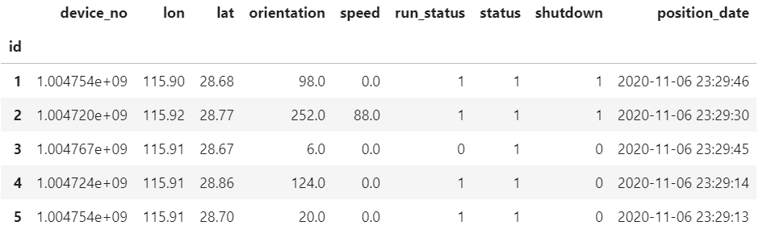 以上述三种异常值的清洗需求为例，其执行流程分别如下：

#### 1. 清洗单字段取值异常的记录
以速度字段为例，首先判断其取值分布情况： 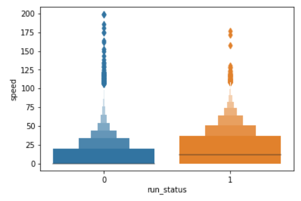 绘图接口：`seaborn.boxenplot()` 显然，无论是从箱线图来看，还是从绝对取值来看，都有一部分速度值异常的记录，为了过滤掉这些记录，可直接用`query()`实现。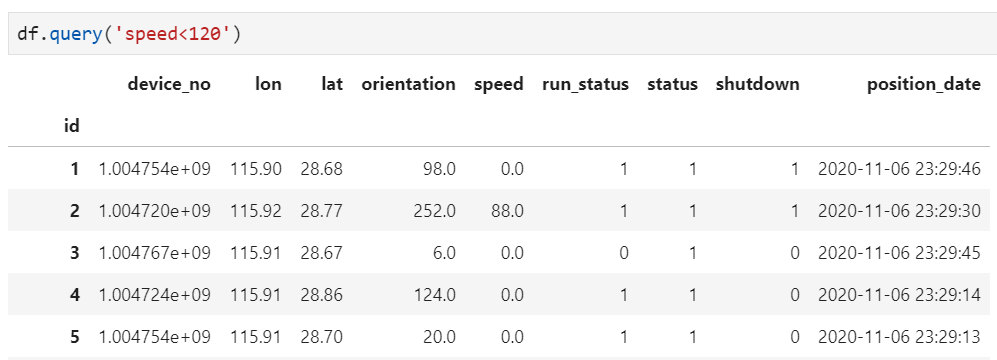

#### 2. 根据记录内部条件过滤异常值
这里暂时脱离GPS数据中的具体含义，假设给定规则为`run_status≥status`，否则视为异常记录，那么执行这一过程的方法为： 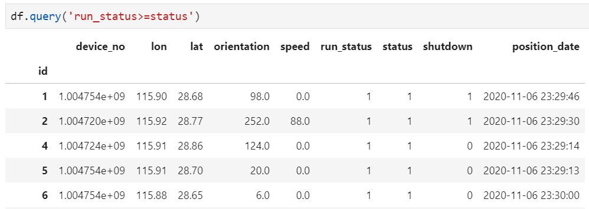 更一般地，要求`run_status-status>=1`，则可用如下方法实现：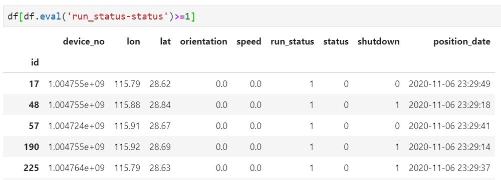

#### 3. 基于整个数据集进行整体判断
在以上数据集中，假定`device_no`对应了唯一GPS终端信息，现在要求各终端在整个数据集中要求至少出现10次，否则认为其为异常记录，例如某`device_no`在整个数据集中仅出现了9次，那么认为这9条记录均为异常记录而需要清洗。实现方法也有很多，但借助`groupby`+`transform`可轻松实现这一清洗过程： 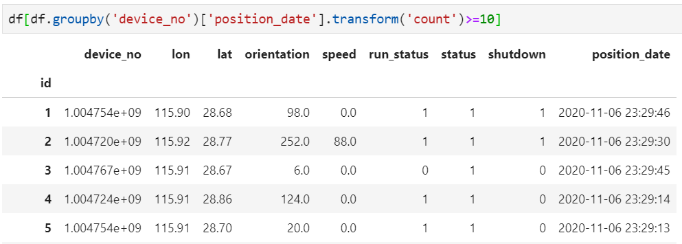
