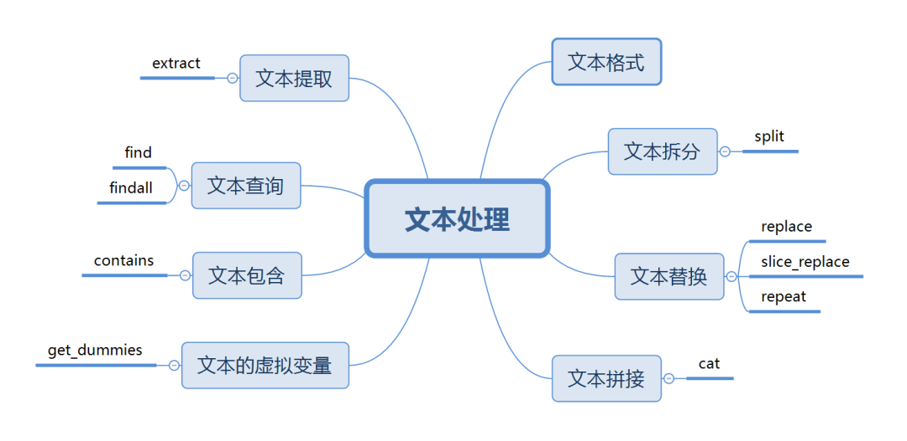

Python Pandas<br />这里介绍关于文本处理的常用方法。

---

文本的主要两个类型是`string`和`object`。如果不特殊指定类型为`string`，文本类型一般为`object`。<br />文本的操作主要是通过**访问器str** 来实现的，功能十分强大，但使用前需要注意以下几点。

1. **访问器只能对Series数据结构使用。** 除了常规列变量`df.col`以外，也可以对索引类型`df.Index`和`df.columns`使用
2. **确保访问的对象类型是字符串str类型。** 如果不是需要先`astype(str)`转换类型，否则会报错
3. **访问器可以多个连接使用。** 如`df.col.str.lower().str.upper()`，这个和Dataframe中的一行操作是一个原理

下面正式介绍文本的各种操作，基本可以涵盖日常95%的数据清洗需要了，一共 8 个场景。<br /><br />以下操作均基于下面的数据：
```python
import pandas as pd
import numpy as np

df = pd.DataFrame({'name':['jordon', 'MIKE', 'Kelvin', 'xiaoLi', 'qiqi','Amei'],
                   'Age':[18, 30, 45, 23, 45, 62],
                   'level':['high','Low','M','L','middle',np.nan],
                   'Email':['jordon@sohu.com','Mike@126.cn','KelvinChai@gmail.com','xiaoli@163.com',np.nan,'amei@qq.com']})
--------------------------------------------
   name   Age   level    Email
0  jordon  18    high    jordon@sohu.com
1  MIKE    30     Low    Mike@126.cn
2  Kelvin  45       M    KelvinChai@gmail.com
3  xiaoLi  23       L    xiaoli@163.com
4  qiqi    45  middle    NaN
5  Amei    62     NaN    amei@qq.com
```
<a name="gxp9m"></a>
## 1、文本格式
<a name="DohsI"></a>
### 大小写变换
```python
# 字符全部变成小写
s.str.lower()
# 字符全部大写
s.str.upper()
# 每个单词首字母大写
s.str.title()
# 字符串第一个字母大写
s.str.capitalize()
# 大小写字母转换
s.str.swapcase()
```
上面用法都比较简单，不逐一举例，这里举一个对`columns`变成小写的例子。
```python
df.columns.str.lower()
--------------------------------------------------------
Index(['name', 'age', 'level', 'email'], dtype='object')
```
<a name="urAnT"></a>
### 格式判断
下面均为判断操作，因此返回布尔值。
```python
s.str.isalpha # 是否为字母
s.str.isnumeric # 是否为数字0-9
s.str.isalnum # 是否由字母和数字组成
s.str.isupper # 是否为大写
s.str.islower # 是否为小写
s.str.isdigit # 是否为数字
```
<a name="mtE50"></a>
### 对齐
```python
# 居中对齐，宽度为8，其余用’*’填充
s.str.center(, fillchar='*')
# 左对齐，宽度为8，其余用’*’填充
s.str.ljust(8, fillchar='*')
# 右对齐，宽度为8，其余用’*’填充
s.str.rjust(8, fillchar='*')
# 自定义对齐方式，参数可调整宽度、对齐方向、填充字符
s.str.pad(width=8, side='both',fillchar='*')

# 举例
df.name.str.center(8, fillchar='*')
-------------
0    *jordon*
1    **MIKE**
2    *Kelvin*
3    *xiaoLi*
4    **qiqi**
5    **Amei**
```
<a name="WxNpz"></a>
### 计数和编码
```python
s.str.count('b') # 字符串种包括指定字母的数量
s.str.len() # 字符串长度
s.str.encode('utf-8') # 字符编码
s.str.decode('utf-8') # 字符解码
```
<a name="IbsVq"></a>
## 2、文本拆分
通过使用`split`方法可以某个指定的字符作为分割点拆分文本。其中，`expand`参数可以让拆分的内容展开，形成单独的列，`n`参数可以指定拆分的位置来控制形成几列。<br />下面将`email`变量按照`@`进行拆分。
```python
# 使用方法
s.str.split('x', expand=True, n=1)
# 举例
df.Email.str.split('@')
----------------------------
0         [jordon, sohu.com]
1            [Mike, 126.cn]
2    [KelvinChai, gmail.com]
3          [xiaoli, 163.com]
4                        NaN
5             [amei, qq.com]

# expand可以让拆分的内容扩展成单独一列
df.Email.str.split('@' ,expand=True)
----------------------------
   0          1
0  jordon      sohu.com
1  Mike        126.cn
2  KelvinChai  gmail.com
3  xiaoli      163.com
4  NaN         NaN
5  amei        qq.com
```
更复杂的拆分可以借助正则表达式，比如想同时通过`@`和`.`进行拆分，那么可以这样实现。
```python
df.Email.str.split('\@|\.',expand=True)
----------------------------
   0           1      2
0  jordon      sohu   com
1  Mike        126    cn
2  KelvinChai  gmail  com
3  xiaoli      163    com
4  NaN         NaN    NaN
5  amei        qq     com
```
<a name="KkOXe"></a>
## 3、文本替换
文本替换有几种方法：`replace`，`slice_replace`，`repeat`
<a name="vbUrk"></a>
### replace替换
`replace`方法是最常用的替换方法，参数如下：

- `pal`：为被替代的内容字符串，也可以为正则表达式
- `repl`：为新内容字符串，也可以是一个被调用的函数
- `regex`：用于设置是否支持正则，默认是`True`
```python
# 将email种的com都替换为cn
df.Email.str.replace('com','cn')
------------------------
0         jordon@sohu.cn
1            Mike@126.cn
2    KelvinChai@gmail.cn
3          xiaoli@163.cn
4                    NaN
5             amei@qq.cn
```
更复杂一点的，比如将旧内容写成**正则表达式**。
```python
#将@之前的名字都替换成xxx
df.Email.str.replace('(.*?)@','xxx@')
------------------
0     xxx@sohu.com
1       xxx@126.cn
2    xxx@gmail.com
3      xxx@163.com
4              NaN
5       xxx@qq.com
```
或者将新内容写成**被调用的函数**。
```python
df.Email.str.replace('(.*?)@', lambda x:x.group().upper())
-------------------------
0         JORDON@sohu.com
1             MIKE@126.cn
2    KELVINCHAI@gmail.com
3          XIAOLI@163.com
4                     NaN
5             AMEI@qq.com
```
<a name="KOar0"></a>
### 切片替换
`slice_replace`通过切片的方式实现替换，通过切片可以保留或者删除指定的字符，参数如下。

- `start`：起始位置
- `stop`：结束位置
- `repl`：要替换用的新内容

对`start`切片位置之后和`stop`切片位置之前进行替换，如果没有设置`stop`，那么`start`之后全部进行替换，同理如果没设置`start`，那么`stop`之前全部进行替换。
```python
df.Email.str.slice_replace(start=1,stop=2,repl='XX')
-------------------------
0         jXXrdon@sohu.com
1             MXXke@126.cn
2    KXXlvinChai@gmail.com
3          xXXaoli@163.com
4                      NaN
5             aXXei@qq.com
```
<a name="U8xdu"></a>
### 重复替换
`repeat`可以实现重复替换的功能，参数`repeats`设置重复的次数。
```python
df.name.str.repeat(repeats=2)
-------------------------
0    jordonjordon
1        MIKEMIKE
2    KelvinKelvin
3    xiaoLixiaoLi
4        qiqiqiqi
5        AmeiAmei
```
<a name="M80V5"></a>
## 4、文本拼接
文本拼接通过cat方法实现，参数：

- `others`: 需要拼接的序列，如果为`None`不设置，就会自动把当前序列拼接为一个字符串
- `sep`: 拼接用的分隔符
- `na_rep`: 默认不对空值处理，这里设置空值的替换字符。
- `join`: 拼接的方向，包括`left, right, outer, inner`，默认为`left`

主要有以下几种拼接方式。
<a name="k6lFQ"></a>
### 1. 将单个序列拼接为一个完整字符串
如上所述，当没有设置`ohters`参数时，该方法会将当前序列合并为一个新的字符串。
```python
df.name.str.cat()
-------------------------------
'jordonMIKEKelvinxiaoLiqiqiAmei'
# 设置sep分隔符为`-`
df.name.str.cat(sep='-')
-------------------------------
'jordon-MIKE-Kelvin-xiaoLi-qiqi-Amei'
# 将缺失值赋值为`*`
df.level.str.cat(sep='-',na_rep='*')
-----------------------
'high-Low-M-L-middle-*'
```
<a name="u22cF"></a>
### 2. 拼接序列和其他类列表型对象为新的序列
下面先将name列和`*`列拼接，再将`level`列拼接，形成一个新的序列。
```python
# str.cat多级连接实现多列拼接
df.name.str.cat(['*']*6).str.cat(df.level)
----------------
0    jordon*high
1       MIKE*Low
2       Kelvin*M
3       xiaoLi*L
4    qiqi*middle
5            NaN
# 也可以直接多列拼接
df.name.str.cat([df.level,df.Email],na_rep='*')
--------------------------------
0      jordonhighjordon@sohu.com
1             MIKELowMike@126.cn
2    KelvinMKelvinChai@gmail.com
3          xiaoLiLxiaoli@163.com
4                    qiqimiddle*
5               Amei*amei@qq.com
```
将一个序列与多个对象拼接为一个新的序列
<a name="VZecd"></a>
## 5、文本提取
文本提取主要通过`extract`来实现的。<br />`extract`参数：

- `pat`: 通过正则表达式实现一个提取的`pattern`
- `flags`: 正则库`re`中的标识，比如`re.IGNORECAS`E
- `expand`: 当正则只提取一个内容时，如果`expand=True`会展开返回一个DataFrame，否则返回一个`Series`
```python
# 提取email中的两个内容
df.Email.str.extract(pat='(.*?)@(.*).com')
--------------------
   0          1
0  jordon      sohu
1  vMike      NaN
2  KelvinChai  gmail
3  xiaoli      163
4  NaN         NaN
5  amei        qq
```
<a name="KN2KA"></a>
## 6、文本查询
通过`find`和`findall`两个方法实现。<br />`find` 参数很简单，直接输入要查询的字符串即可，返回在原字符串中的位置，没查询到结果返回`-1`。
```python
df['@position'] = df.Email.str.find('@')
df[['Email','@position']]
-------------------------------------
    Email                   @position
0   jordon@sohu.com         6.0
1   Mike@126.cn             4.0
2   KelvinChai@gmail.com    10.0
3   xiaoli@163.com          6.0
4   NaN                     NaN
5   amei@qq.com             4.0
```
上面示例返回`@`在email变量中的位置。<br />另外一个查找方法是`findall`<br />`findall`参数：

- `pat`: 要查找的内容，支持正则表达式
- `flag`: 正则库`re`中的标识，比如`re.IGNORECASE`

`findall`和`find`的区别是支持正则表达式，并返回具体内容。这个方法有点类似`extract`，也可以用于提取，但不如`extract`方便。
```python
df.Email.str.findall('(.*?)@(.*).com')
--------------------------
0         [(jordon, sohu)]
1                       []
2    [(KelvinChai, gmail)]
3          [(xiaoli, 163)]
4                      NaN
5             [(amei, qq)]
```
上面示例返回正则查找的两个部分，并以元组列表的形式出现。
<a name="aChR9"></a>
## 7、文本包含
文本包含通过`contains`方法实现，返回布尔值，一般和`loc`查询功能配合使用，参数：

- `pat`: 匹配字符串，支持正则表达式
- `case`: 是否区分大小写，`True`表示区别
- `flags`: 正则库`re`中的标识，比如`re.IGNORECASE`
- `na`: 对缺失值填充
- `regex`: 是否支持正则，默认`True`支持
```python
df.Email.str.contains('jordon|com',na='*')
----------
0     True
1    False
2     True
3     True
4        *
5     True
# 
df.loc[df.Email.str.contains('jordon|com', na=False)]
------------------------------------------
name    Age  level  Email                 @position
0  jordon  18   high   jordon@sohu.com        6.0
2  Kelvin  45   M      KelvinChai@gmail.com   10.0
3  xiaoLi  23   L      xiaoli@163.com         6.0
5  Amei    62   NaN    amei@qq.com            4.0
```
这里需要注意一下，如果和`loc`配合使用，注意不能有缺失值，否则会报错。可以通过设置`na=False`忽略缺失值完成查询。
<a name="z5I4e"></a>
## 8、文本的虚拟变量
`get_dummies`可以将一个列变量自动生成虚拟变量（哑变量），这种方法在特征衍生中经常使用。
```python
df.name.str.get_dummies()
-------------------------------
  Amei Kelvin MIKE jordon qiqi xiaoLi
0   0     0     0     1     0     0
1   0     0     1     0     0     0
2   0     1     0     0     0     0
3   0     0     0     0     0     1
4   0     0     0     0     1     0
5   1     0     0     0     0     0
```
