Python Pandas <br />新建一个excel表格（table1.csv）用于测试案例：<br />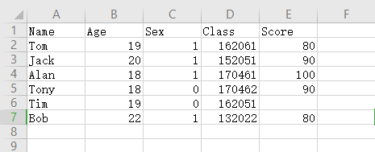
<a name="UQvsC"></a>
## 导库
```python
import pandas as pd
import numpy as np
```
<a name="Cfz41"></a>
## 读取数据
```python
df = pd.read_excel('table1.xlsx') # 相对路径
# df = pd.read_excel(r'E:\Anaconda\hc\dataScience\table1.csv') # 绝对路径
```
<a name="FfT8k"></a>
## 显示数据
<a name="a05a7224"></a>
### 显示数据的行与列数
```python
df.shape
(6, 5)
```
<a name="xqn1P"></a>
### 显示数据格式`dtpyes`
```python
df.dtypes
Name      object
Age        int64
Sex        int64
Class      int64
Score    float64
dtype: object
```
<a name="ww9Qx"></a>
### 显示列名
```python
df.columns
Index(['Name', 'Age', 'Sex', 'Class', 'Score'], dtype='object')
```
<a name="AZkV2"></a>
### 显示前数据前2行
```python
df.head(2)
```
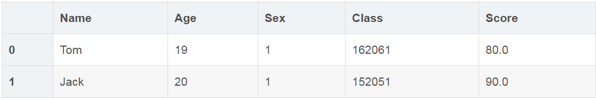
<a name="af5c71c1"></a>
### 显示数据后3行
```python
df.tail(3)
```
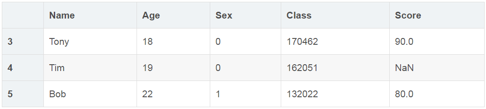
<a name="2d6c5584"></a>
### 显示数据唯一值（`unique`函数）
```python
df['Score'].unique()
array([ 80.,  90., 100.,  nan])
```
<a name="6d2YY"></a>
### 对第几行数据不读取
```python
# 没有读取第2行
df1 = pd.read_excel('table1.csv',skiprows=[2] )
```
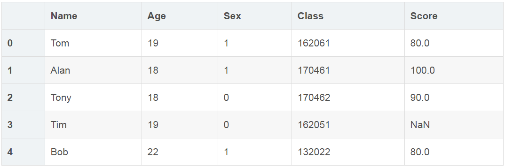
<a name="so2e6"></a>
### 对缺失值进行识别
```python
# 所有缺失值显示为True
df.isnull()
```
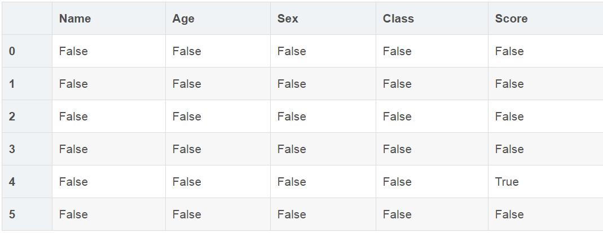
<a name="TGCbn"></a>
## 清洗数据
<a name="ki2wm"></a>
### 删除空值（`dropna`函数）
```python
df2 = df.dropna(how='any')
```
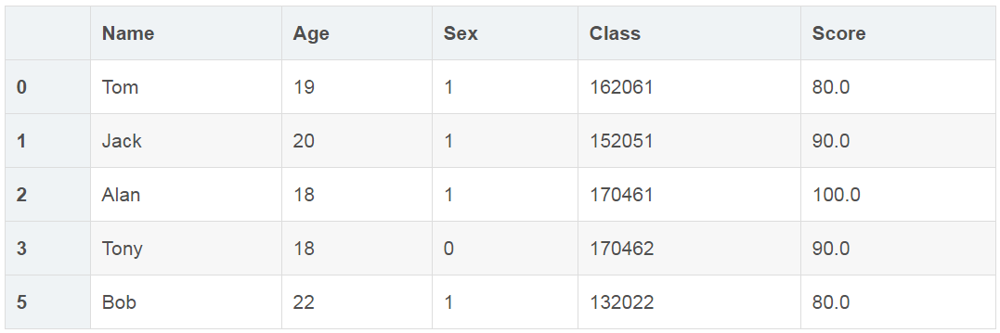
<a name="bfe4cae9"></a>
### 填充空值（`fillna`函数）
```python
df3 = df.fillna(value=0)
```
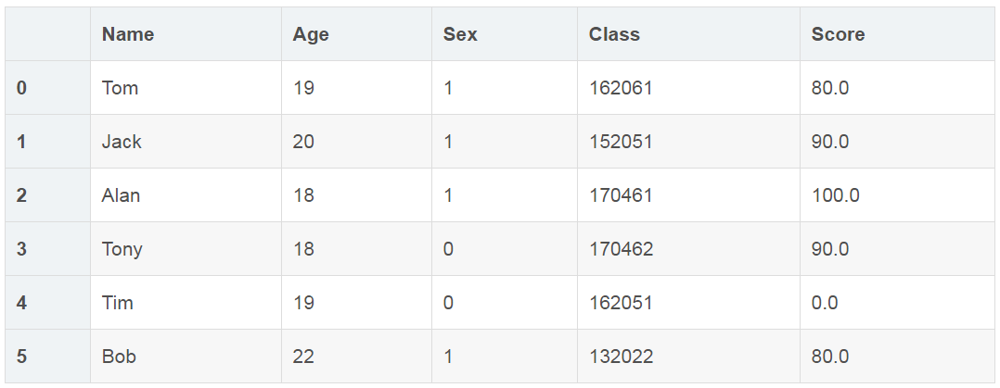
<a name="5a26dd6b"></a>
### 用均值对空值进行填充
```python
df4 = df['Score'].fillna(df['Score'].mean())
0     80.0
1     90.0
2    100.0
3     90.0
4     88.0
5     80.0
Name: Score, dtype: float64
```
<a name="rumY3"></a>
### 更改数据格式
```python
df1['Score'].astype('int64')
0     80
1     90
2    100
3     90
5     80
Name: Score, dtype: int64
```
（注：如果存在空值，更改数据格式会报错！）
<a name="4a3edb5e"></a>
### 更改列名
```python
df5 = df.rename(columns={'Score': 'score'})
```
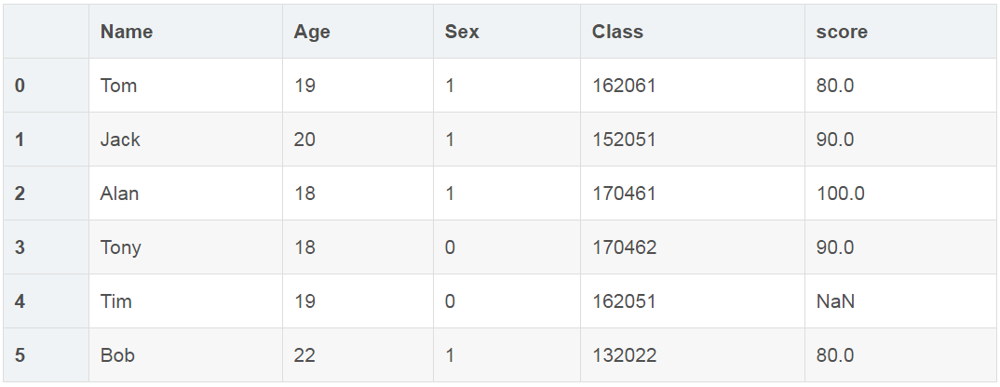
<a name="nIzK5"></a>
### 对列表内的值进行替换（`replace`函数）
```python
df6 = df['Name'].replace('Bob', 'bob')
0     Tom
1    Jack
2    Alan
3    Tony
4     Tim
5     bob
Name: Name, dtype: object
```
<a name="DD1d0"></a>
## 数据预处理
<a name="p0h6v"></a>
### 对数据进行排序
```python
df.sort_values(by=['Score'])
```
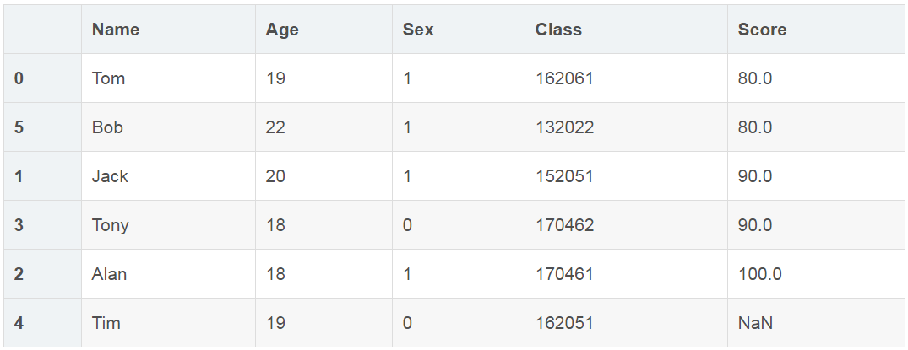<br />（注:默认升序，且空值在后面）
<a name="5FqJT"></a>
### 数据分组
<a name="5ddDB"></a>
#### ①单一条件分组
```python
# 如果Score列的值>=85，Score列显示high，否则显示low
# group列为增加列
df['group'] = np.where(df['Score'] > 85,'high','low')
```
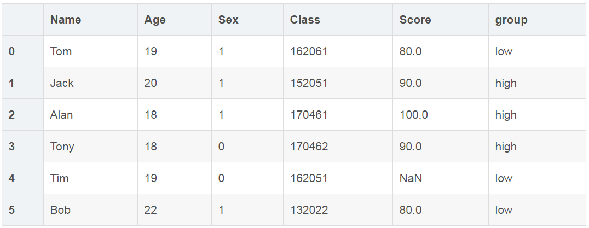
<a name="SUdNo"></a>
#### ②多个条件分组
```python
# 利用loc函数，进行多列查询
# sign为增加列
df.loc[(df['Sex'] == 1) & (df['Age']>= 19), 'sign']=1
```
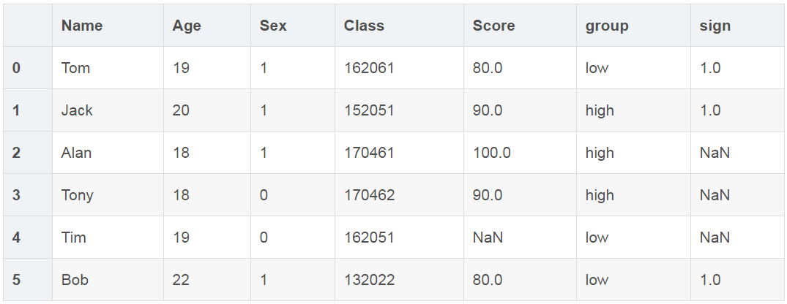
<a name="3fGsK"></a>
## 数据提取
<a name="KVCTZ"></a>
### 按标签提取（`loc`函数）
```python
df.loc[0:3]
```
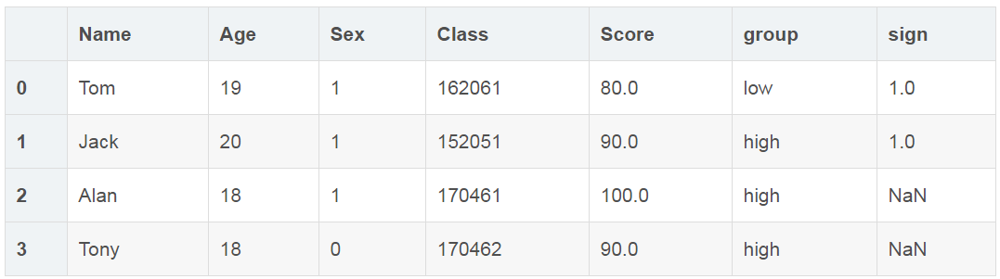
<a name="fEIL8"></a>
### 按位置进行提取（`iloc`函数）
<a name="4dmG5"></a>
#### ①按区域提取
```python
df.iloc[:4, :5]
```
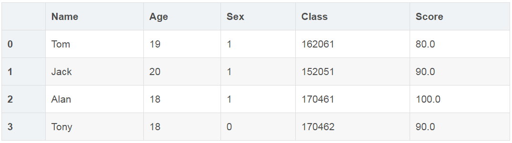
<a name="xs08F"></a>
#### ②按位置提取
```python
#[0, 2, 5] 代表指定的行，[0, 1, 5] 代表指定的列
df.iloc[[0, 2, 5],[0, 1, 5]]
```
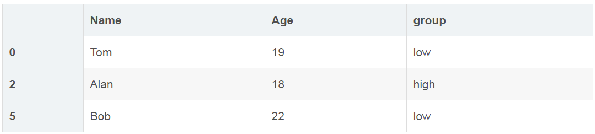
<a name="zAlBn"></a>
### 按条件提取（`isin`与`loc`函数）
<a name="7ricc"></a>
#### ①用`isin`函数进行判断
```python
# 判断Sex是否为1
df['Sex'].isin([1])
0     True
1     True
2     True
3    False
4    False
5     True
Name: Sex, dtype: bool
```
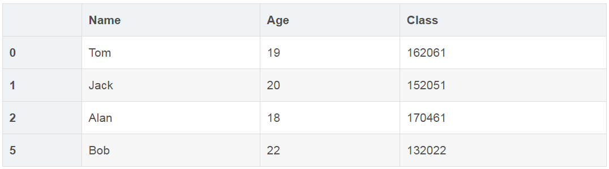
<a name="dz26z"></a>
#### ②用`loc`函数进行判断
```python
# Sex为1，分数大于85
df1.loc[(df1['Sex'] == 1) & (df1['Score'] > '85'), ['Name','Age','Class']]
```
<a name="sLNJV"></a>
#### ③先判断结果，将结果为True的提取
```python
# 先判断Score列里是否包含80和90，然后将符合条件的数据提取出来。
df.loc[df['Score'].isin(['80','90'])]
```
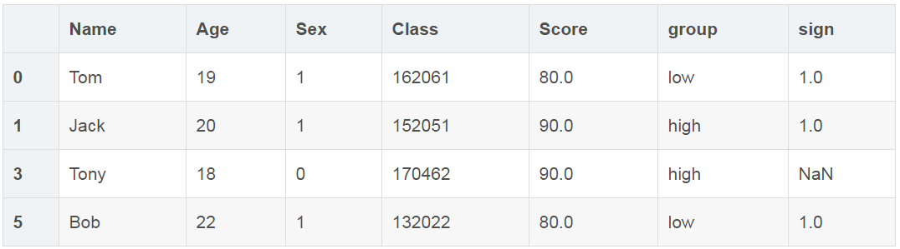
