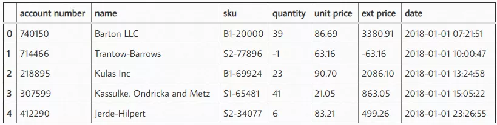
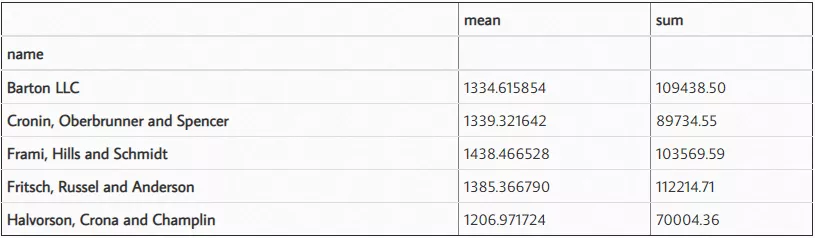
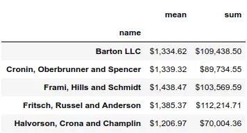
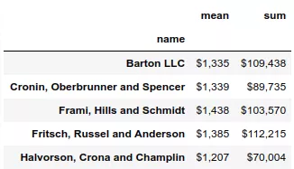
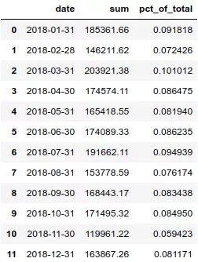
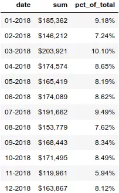
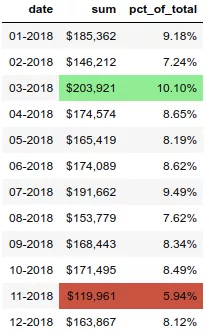
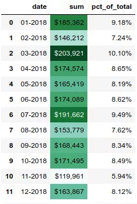
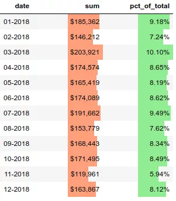
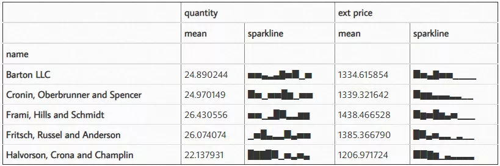

Python Pandas<br />美化 Pandas DataFrame 中的数字，并使用一些更高级的 Pandas 样式可视化选项，来提高使用 Pandas 分析数据的能力。<br />常见的比如说：

- 在处理货币值时使用货币符号。例如，如果您的数据包含值 25.00，您不会立即知道该值是人民币、美元、英镑还是其他某种货币。
- 百分比是另一个有用的示，0.05 或 5%？使用百分比符号可以非常清楚地了解如何解释数据。
- Pandas 样式还包括更高级的工具，用于向输出添加颜色或其他视觉元素。
<a name="PO92w"></a>
## 案例分析
本文将使用一个虚拟数据，为大家进行讲解。该数据是一个虚构组织的2018 年销售数据。<br />数据集链接如下：<br />[https://www.aliyundrive.com/s/Tu9zBN2x81c](https://www.aliyundrive.com/s/Tu9zBN2x81c)<br />[2018_Sales_Total_v2.xlsx](https://www.yuque.com/attachments/yuque/0/2021/xlsx/396745/1635469212558-ea926c76-7ffb-4f98-856f-0d16b550836d.xlsx?_lake_card=%7B%22src%22%3A%22https%3A%2F%2Fwww.yuque.com%2Fattachments%2Fyuque%2F0%2F2021%2Fxlsx%2F396745%2F1635469212558-ea926c76-7ffb-4f98-856f-0d16b550836d.xlsx%22%2C%22name%22%3A%222018_Sales_Total_v2.xlsx%22%2C%22size%22%3A72116%2C%22type%22%3A%22application%2Fvnd.openxmlformats-officedocument.spreadsheetml.sheet%22%2C%22ext%22%3A%22xlsx%22%2C%22status%22%3A%22done%22%2C%22taskId%22%3A%22u4d8ab5f6-489e-4c1d-8a10-5776134ab0a%22%2C%22taskType%22%3A%22upload%22%2C%22id%22%3A%22u5f95e01f%22%2C%22card%22%3A%22file%22%7D)
<a name="Iv43F"></a>
### 1、导入相关库，并读取数据
```python
import numpy as np
import pandas as pd

df = pd.read_excel('2018_Sales_Total.xlsx')
```
效果如下：读取这些数据后，可以做一个快速总结，看看客户从这里购买了多少以及他们的平均购买金额是多少。为了简单起见，这里截取了前 5 项数据。
```python
df.groupby('name')['ext price'].agg(['mean', 'sum'])
```
结果如下：
<a name="gzQY2"></a>
### 2、添加货币符号
当查看这些数据时，理解数字的比例有点困难，因为有 6 个小数点和一些较大的数字。此外，目前还不清楚这是美元还是其他货币。可以使用 DataFrame `style.format` 解决这个问题。
```python
(df.groupby('name')['ext price']
 .agg(['mean', 'sum'])
 .style.format('${0:,.2f}'))
```
结果如下：<br /><br />使用 format 函数，可以在数据上使用 python 的字符串格式化工具的所有功能。在这种情况下，使用 `${0:,.2f}` 放置前导美元符号，添加逗号并将结果四舍五入到小数点后两位。<br />例如，如果想四舍五入到 0 位小数，可以将格式更改为 `${0:,.0f}`。
```python
(df.groupby('name')['ext price']
 .agg(['mean', 'sum'])
 .style.format('${0:,.0f}'))
```
结果如下：<br />
<a name="wGuk2"></a>
### 3、添加百分比
如果想按月查看总销售额，可以使用 grouper 按月汇总，并计算每个月占年总销售额的百分比。
```python
monthly_sales = df.groupby([pd.Grouper(key='date', freq='M')])['ext price'].agg(['sum']).reset_index()
monthly_sales['pct_of_total'] = monthly_sales['sum'] / df['ext price'].sum()
```
结果如下：<br /><br />为了更加清楚明白的展示这个百分比，最好将其转换为百分数。
```python
format_dict = {'sum':'${0:,.0f}', 'date': '{:%m-%Y}', 'pct_of_total': '{:.2%}'}
monthly_sales.style.format(format_dict).hide_index()
```
结果如下：<br />
<a name="qIEhL"></a>
### 4、突出显示数字
除了样式化数字，还可以设置 DataFrame 中的单元格样式。用绿色突出显示最高的数字，用彩色突出显示最高、最低的数字。
```python
(monthly_sales
 .style
 .format(format_dict)
 .hide_index()
 .highlight_max(color='lightgreen')
 .highlight_min(color='#cd4f39'))
```
结果如下：<br />
<a name="lfYyK"></a>
### 5、设置渐变色
另一个有用的函数是 `background_gradient`，它可以突出显示列中的值范围。
```python
(monthly_sales.style
 .format(format_dict)
 .background_gradient(subset=['sum'], cmap='BuGn'))
```
结果如下：<br />
<a name="TfHDb"></a>
### 6、设置数据条
pandas样式功能还支持在列内绘制条形图。
```python
(monthly_sales
 .style
 .format(format_dict)
 .hide_index()
 .bar(color='#FFA07A', vmin=100_000, subset=['sum'], align='zero')
 .bar(color='lightgreen', vmin=0, subset=['pct_of_total'], align='zero')
 .set_caption('2018 Sales Performance'))
```
结果如下：<br />
<a name="CUuBA"></a>
### 7、绘制迷你图
这是一个很酷的功能。
```python
import sparklines

def sparkline_str(x):
    bins=np.histogram(x)[0]
    sl = ''.join(sparklines(bins))
    return sl
    
sparkline_str.__name__ = "sparkline"
df.groupby('name')['quantity', 'ext price'].agg(['mean', sparkline_str])
```
结果如下：
