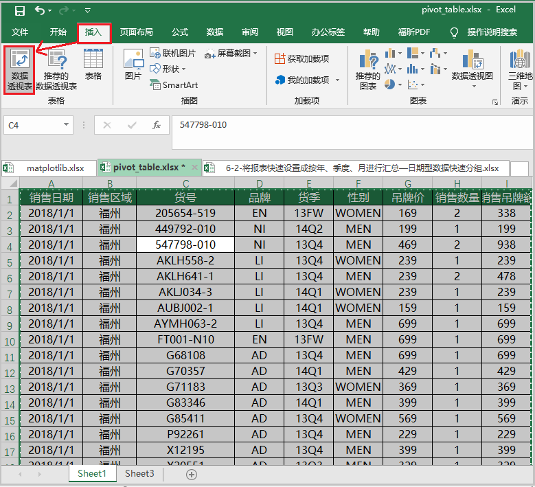

Pandas
<a name="Bq3lo"></a>
## Excel中做数据透视表
<a name="btOrO"></a>
### ① 选中整个数据源；

<a name="afvFZ"></a>
### ② 依次点击“插入”—“数据透视表”

<a name="YiYeF"></a>
### ③ 选择在Excel中的哪个位置，插入数据透视表

<a name="Ahgfm"></a>
### ④ 然后根据实际需求，从不同维度展示结果

<a name="Iwu0u"></a>
### ⑤ 结果如下

<a name="saV9g"></a>
## Pandas用`pivot_table()`做数据透视表
<a name="Lz5yT"></a>
### 1）语法格式
```python
pd.pivot_table(data,index=None,columns=None,
               values=None,aggfunc='mean',
               margins=False,margins_name='All',
               dropna=True,fill_value=None)
```
<a name="eYCW6"></a>
### 2）对比excel，说明上述参数的具体含义
<br />参数说明：

- `data` 相当于Excel中的"选中数据源"；
- `index` 相当于上述"数据透视表字段"中的行；
- `columns` 相当于上述"数据透视表字段"中的列；
- `values` 相当于上述"数据透视表字段"中的值；
- `aggfunc` 相当于上述"结果"中的计算类型；
- `margins` 相当于上述"结果"中的总计；
- `margins_name` 相当于修改"总计"名，为其它名称；

下面几个参数，用的较少，记住干嘛的，等以后需要就百度。

- `dropna` 表示是否删除缺失值，如果为True时，则把一整行全作为缺失值删除；
- `fill_value` 表示将缺失值，用某个指定值填充。
<a name="Z3y75"></a>
## 案例说明
<a name="KsoHo"></a>
### 1）求出不同品牌下，每个月份的销售数量之和
<a name="l9vqa"></a>
#### ① 在Excel中的操作结果如下

<a name="WJZaL"></a>
#### ② 在pandas中的操作如下
```python
df = pd.read_excel(r".\pivot_table.xlsx")
display(df.sample(5))

df.insert(1,"月份",df["销售日期"].apply(lambda x:x.month))
display(df.sample(5))

df1 = pd.pivot_table(df,index="品牌",columns="月份",
                     values="销售数量",aggfunc=np.sum)
display(df1)
```
结果如下：<br />
<a name="U2J0d"></a>
### 2）求出不同品牌下，每个地区、每个月份的销售数量之和
<a name="WWO1i"></a>
#### ① 在Excel中的操作结果如下

<a name="Z61Hu"></a>
#### ② 在pandas中的操作如下
```python
df = pd.read_excel(r".\pivot_table.xlsx")
display(df.sample(5))

df.insert(1,"月份",df["销售日期"].apply(lambda x:x.month))
display(df.sample(5))

df1 = pd.pivot_table(df,index="品牌",columns=["销售区域","月份"],
                     values="销售数量",aggfunc=np.sum)
display(df1)
```
结果如下：<br />
<a name="aVApn"></a>
### 3）求出不同品牌不同地区下，每个月份的销售数量之和
<a name="PodpD"></a>
#### ① 在Excel中的操作结果如下

<a name="jYDt3"></a>
#### ② 在pandas中的操作如下
```python
df = pd.read_excel(r"pivot_table.xlsx")
display(df.sample(5))

df.insert(1,"月份",df["销售日期"].apply(lambda x:x.month))
display(df.sample(5))

df1 = pd.pivot_table(df,index=["品牌","销售区域"],columns="月份",
                     values="销售数量",aggfunc=np.sum)
display(df1)
```
结果如下：<br />
<a name="TkfaX"></a>
### 4）求出不同品牌下的“销售数量之和”与“货号计数”
<a name="bKTLo"></a>
#### ① 在Excel中的操作结果如下

<a name="B79ym"></a>
#### ② 在pandas中的操作如下
```python
df = pd.read_excel(r"pivot_table.xlsx")
display(df.sample(5))

df.insert(1,"月份",df["销售日期"].apply(lambda x:x.month))
display(df.sample(5))

df1 = pd.pivot_table(df,index="品牌",columns="月份",
                     values=["销售数量","货号"],
                     aggfunc={"销售数量":"sum","货号":"count"},
                     margins=True,margins_name="总计")
display(df1)
```
结果如下：<br />
