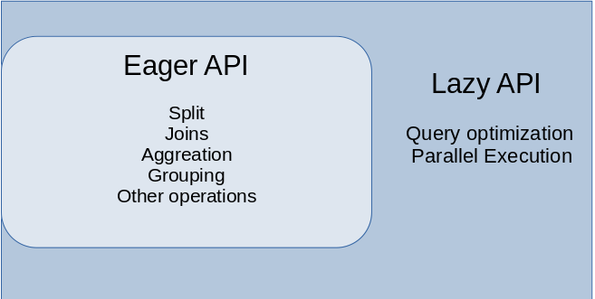

很多人在学习数据分析的时候，肯定都会用到Pandas这个库，非常的实用！<br />从创建数据到读取各种格式的文件(text、csv、json)，或者对数据进行切片和分割组合多个数据源，Pandas都能够很好的满足。<br />Pandas最初发布于2008年，使用Python、Cython和C编写的。是一个超级强大、快速和易于使用的Python库，用于数据分析和处理。<br />当然Pandas也是有不足之处的，比如不具备多处理器，处理较大的数据集速度很慢。<br />介绍一个新兴的Python库——Polars。<br />使用语法和Pandas差不多，处理数据的速度却比Pandas快了不少。<br />一个是大熊猫，一个是北极熊～<br />GitHub地址：[_https://github.com/ritchie46/polars_](https://github.com/ritchie46/polars)<br />使用文档：[_https://ritchie46.github.io/polars-book/_](https://ritchie46.github.io/polars-book/)<br />Polars是通过Rust编写的一个库，Polars的内存模型是基于Apache Arrow。<br />Polars存在两种API，一种是Eager API，另一种则是Lazy API。<br />其中Eager API和Pandas的使用类似，语法差不太多，立即执行就能产生结果。<br /><br />而Lazy API就像Spark，首先将查询转换为逻辑计划，然后对计划进行重组优化，以减少执行时间和内存使用。<br />安装Polars，使用百度pip源。
```bash
# 安装polars
pip install polars -i https://mirror.baidu.com/pypi/simple/
```
安装成功后，开始测试，比较Pandas和Polars处理数据的情况。<br />使用某网站注册用户的用户名数据进行分析，包含约2600万个用户名的CSV文件。
```python
import pandas as pd

df = pd.read_csv('users.csv')
print(df)
```
数据情况如下。<br /><br />此外还使用了一个自己创建的CSV文件，用以数据整合测试。
```python
import pandas as pd

df = pd.read_csv('fake_user.csv')
print(df)
```
得到结果如下。<br /><br />首先比较一下两个库的排序算法耗时。
```python
import timeit
import pandas as pd

start = timeit.default_timer()

df = pd.read_csv('users.csv')
df.sort_values('n', ascending=False)
stop = timeit.default_timer()

print('Time: ', stop - start)

-------------------------
Time:  27.555776743218303
```
可以看到使用Pandas对数据进行排序，花费了大约28s。
```python
import timeit
import polars as pl

start = timeit.default_timer()

df = pl.read_csv('users.csv')
df.sort(by_column='n', reverse=True)
stop = timeit.default_timer()

print('Time: ', stop - start)

-----------------------
Time:  9.924110282212496
```
Polars只花费了约10s，这意味着Polars比Pandas快了2.7倍。<br />下面，来试试数据整合的效果，纵向连接。
```python
import timeit
import pandas as pd

start = timeit.default_timer()

df_users = pd.read_csv('users.csv')
df_fake = pd.read_csv('fake_user.csv')
df_users.append(df_fake, ignore_index=True)
stop = timeit.default_timer()

print('Time: ', stop - start)

------------------------
Time:  15.556222308427095
```
使用Pandas耗时15s。
```python
import timeit
import polars as pl

start = timeit.default_timer()

df_users = pl.read_csv('users.csv')
df_fake = pl.read_csv('fake_user.csv')
df_users.vstack(df_fake)
stop = timeit.default_timer()

print('Time: ', stop - start)

-----------------------
Time:  3.475433263927698
```
Polars居然最使用了约3.5s，这里Polars比Pandas快了4.5倍。<br />通过上面的比较，Polars在处理速度上表现得相当不错。<br />可以是大家在未来处理数据时，另一种选择～<br />当然，Pandas目前历时12年，已经形成了很成熟的生态，支持很多其它的数据分析库。<br />Polars则是一个较新的库，不足的地方还有很多。<br />如果你的数据集对于Pandas来说太大，对于Spark来说太小，那么Polars便是你可以考虑的一个选择。
